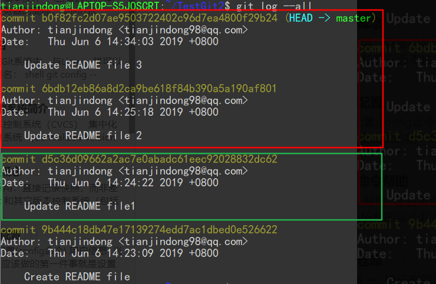
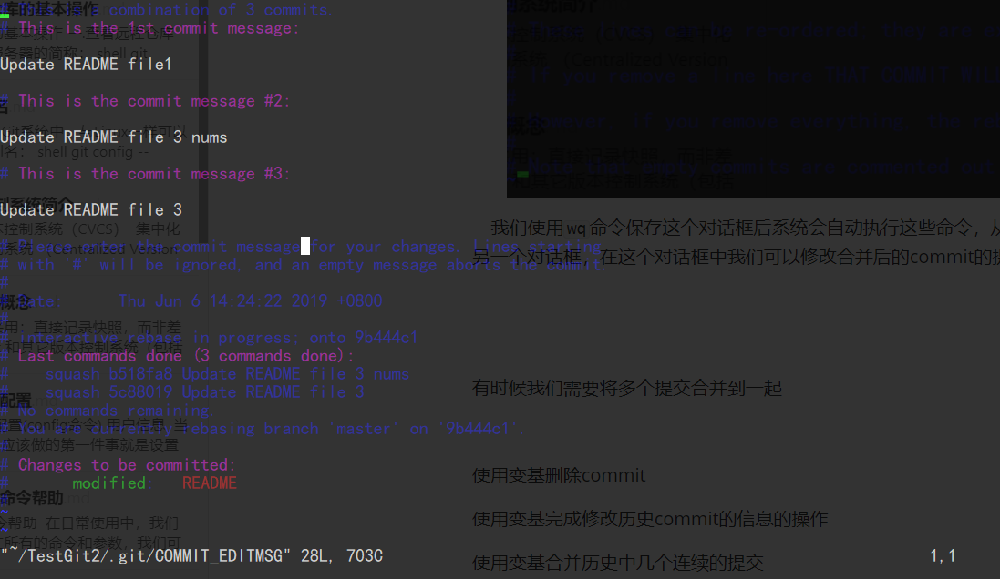
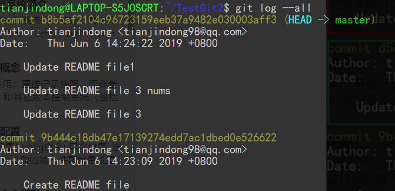
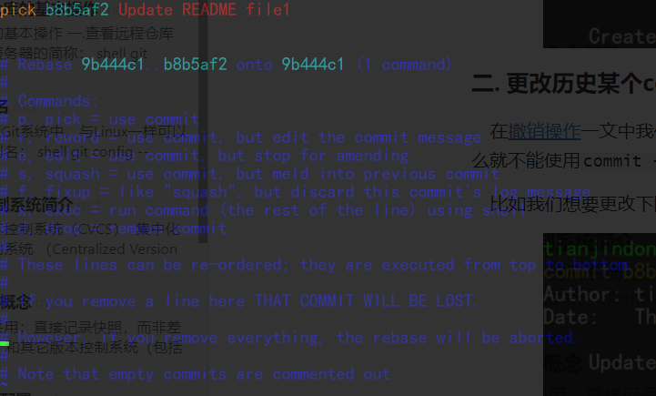

## 变基

#### 一.合并连续多个commit的合并



​	我们需要将上面两个提交对象合并到`d5c36d`这个commit对象中，所以`d5c36d`的父节点为基准进行变基操作：

```shell
git rebase -i 9b444c  #-i选项表示以交互模式进行
```

执行上述命令后，弹出命令交互框：我们需要在命令框中输入不同的命令从而达到不同的变基操作，但是第一个命令一定是像`pick`和`reword`这类有 `use commit`作用的命令:


​	由于我们需要将`6bdb12e`和`b0f82fc`合并到`d5c36d0`，所以我们后面两个命令要选用 `squash`命令（可以用简写 s），该命令用于压缩commit对象：


​	我们使用`wq`命令保存这个对话框后系统会自动执行这些命令，从而达到变基操作，执行完毕后系统会自动跳到另一个对话框，在这个对话框中我们可以修改合并后的commit的提交信息，通过`wq`保存后就完成了变基操作。



我们通过`log`命令查看合并后的效果：



#### 二. 更改历史某个commit对象的提交信息

​	在[撤销操作](_16撤销操作.md)一文中我们提到了修改上一次的提交信息的操作，但是如果我们需要更改历史版本的提交信息，那么就不能使用`commit --amend`命令来实现这个功能了，我们就需要变基来实现这个功能了：

​	比如我们想要更改下图中`b8b5af`这个commit对象的提交信息：


```shell
git rebase -i 9b444c 
```

执行该命令后进入命令交互框：



​	**根据 reword的命令的提示信息可知，该命令会在变基操作时继续使用该对象，只改变该对象的提示信息。**

​	我们需要将`pick b8b5af2`改为`reword b8b5af2`:


​	保存后，系统执行这些命令，然后自动进入提交信息修改的框，我们修改完成后保存即可。

#### 三.使用变基操作合并分支

