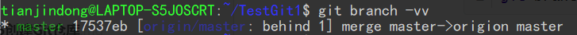
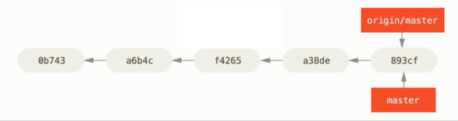

## 远程分支

#### 一. 什么是远程跟踪分支

​	`远程跟踪分支`是远程分支状态的引用。 **它们是你不能移动的本地引用**，当你做任何网络通信操作时，它们会自动移动。 远程跟踪分支像是你上次连接到远程仓库时，那些分支所处状态的书签。

​	它们以 `(remote)/(branch)` 形式命名。 例如，如果你想要看你最后一次与远程仓库 `origin` 通信时 `master`分支的状态，你可以查看 `origin/master` 分支。

​	**远程跟踪分支实质上是用于表示当前远端服务器中分支的状态**，但是由于远程跟踪分支不会自动同步远程服务器的内容，也就会导致远程跟踪分支落后于远端服务器对应分支的实际进度。此时我们需要通过**fetch**命令，抓取远程的最新内容，从而更新远程跟踪分支的状态。

​	远程跟踪分支会在用户执行`git fetch`时全部拉取下来，如果远端服务器没有我们需要分支，换言之，当我们需要在远端创建一个分支时，我们直接在本地分支中通过`git push <remote名> <远程分支名>`，直接在远端创建一个新的分支。

#### 二. 本地跟踪分支

​	从一个远程跟踪分支检出一个本地分支会自动创建所谓的 “跟踪分支”（**它跟踪的分支叫做 “上游分支”**）。 跟踪分支是与远程分支有直接关系的本地分支。 如果在一个跟踪分支上输入 `git pull`，Git 能自动地识别去哪个服务器上抓取、合并到哪个分支。

**创建本地跟踪分支：**

```shell
git branch <跟踪分支名> <远程跟踪分支名>
#或者
git checkout -b <本地跟踪分支名> <远程跟踪分支>
```

**如何查看我们的本地分支跟踪哪一个“远程跟踪分支”呢？**

```shell
git branch --vv
```

​	

​	在上图中，本地分支master跟踪的就是远程跟踪分支origin/master，可以看到`behind 1`关键字，你相对于服务器落后一个提交，也就是服务器有一次提交没有合并到本地；如果是`ahead 1`则表示本地领先远端一次提交，也就是说本地有一次提交未push到远端。`ahead`和`behind`的关键词同时出现，表示远端跟踪分支与本地跟踪分支出现了分叉，需要合并两个分支才能提交。


​	例如：在上图中的状态远程跟踪分支`origin/master`和本地跟踪分支`master`，此时执行`git branch -vv`就会显示为`ahead 2  bhind 2`

​	**需要重点注意的一点是这些数字的值来自于你从每个服务器上最后一次抓取的数据**。 这个命令并没有连接服务器，它只会告诉你关于本地缓存的服务器数据。 如果想要统计最新的领先与落后数字，需要在运行此命令前抓取所有的远程仓库。 可以像这样做：`$ git fetch --all; git branch -vv`


**设置已有的本地分支跟踪一个刚刚拉取下来的远程分支：**

```shell
git branch --set-upstream-to=<远程跟踪分支名>
```


#### 三. 拉取操作（fetch,pull）

​	 `git fetch` 命令从服务器上抓取本地没有的数据时，它并不会修改工作目录中的内容。 它只会获取数据然后让你自己合并。 然而，有一个命令叫作 `git pull` 在大多数情况下它的含义是一个 `git fetch` 紧接着一个 `git merge` 命令。 如果有一个像之前章节中演示的设置好的跟踪分支，不管它是显式地设置还是通过 `clone` 或 `checkout` 命令为你创建的，`git pull` 都会查找当前分支所跟踪的服务器与分支，从服务器上抓取数据然后尝试合并入那个远程分支。

​	pull = fetch + merge.


#### 四. 推送操作（push）

当我们需要将自己本地跟踪分支，推送到远端时，我们直接使用：

```shell
git push
```

由于我们在创建本地跟踪分支时，绑定了远端跟踪分支，所以系统就知道将当前分支的最新内容与远端的那个分支进行合并。

例：


在上图中，我们在master分支中执行`git push`后分支树就变成：




#### 五. 新建远端分支

如果是我们新创建的一个本地分支，在远端服务器没有对应的分支，此时我们需要在远端创建一个分支，然后把提交推送到这个新分支上去：

```shell
git push <remote-name> <branch-name> #执行该命令，系统会自动查看remote远程服务器是否存在名为<branch-name>的分支，如果不存在则自动创建一个，然后将本地分支的内容push到远端。
```

需要注意的是：branch-name通常要与本地分支名相同。


#### 六. 删除远程分支

​	如果我们想要删除远端的某个分支，可以运行带有 `--delete` 选项的 `git push` 命令来删除一个远程分支。 如果想要从服务器上删除 `serverfix` 分支，运行下面的命令：

```shell
git push origin --delete serverfix
```

删除远程分支后，本机会直接显示远程分支的删除，但是在别的主机上，是无法通过fetch操作发现这个远程分支被删除的，我们必须使用：

```shell
git remote prune <remote-name>
```


#### 七. 远端服务器的具体操作演示

**第一步：抓取远程跟踪分支**

```shell
git fetch 
```

**第二步：查看远程跟踪分支**

```shell
git branch -av

remotes/origin/master 341eeb7 Update README.md file #以remotes开头的分支就是远程跟踪分支
remotes/origin/test2  cc73e38 Create a.txt file
```


**第三步：使本地分支跟踪远程跟踪分**

​	需要明确的是，只有本地跟踪分支才能提交到远端，如果要将本地分支变成本地跟踪分支有多种方式：

```shell
#方式一：直接设置远程跟踪分支
git branch --set-upstream-to=origin/xxx
#方式二：push本地分支时，指定远程服务器名和远程分支名，这样系统会自动使当前本地分支跟踪这个远程分支
git push <remote-name> <branch-name>
```

**第四步：push到远端**

在下图中，origin/master是“远程跟踪分支”，而master是“本地跟踪分支”，本地跟踪分支进行两步操作后指向`893cf`。


但是此时另一个用户提交了自己本地跟踪分支的内容，使得实际提交历史成了这样：


如果我们现在去`git push`服务器会拒绝我们的请求，因为此时远端分支不是“快进”操作了。

此时我们需要将master分支与origin/master分支进行合并，然后重新push到远端。