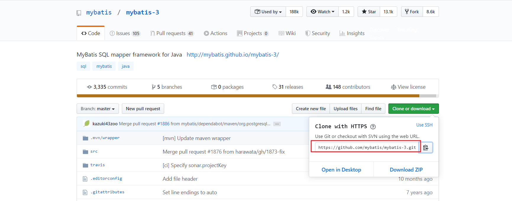
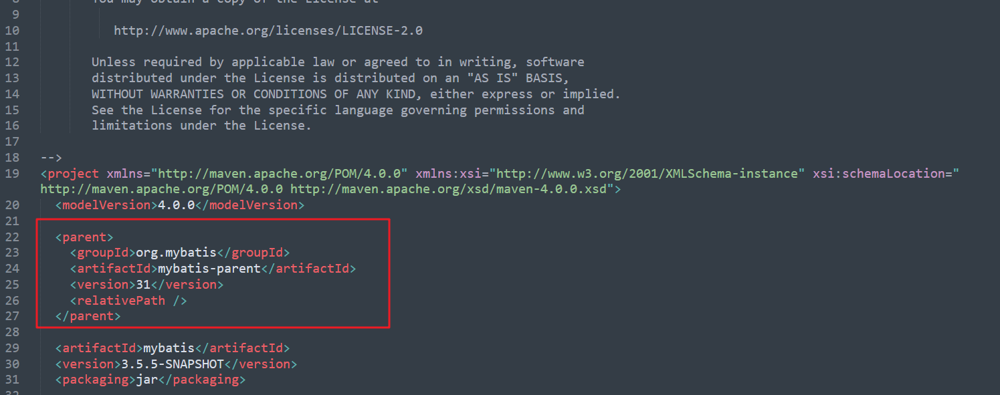
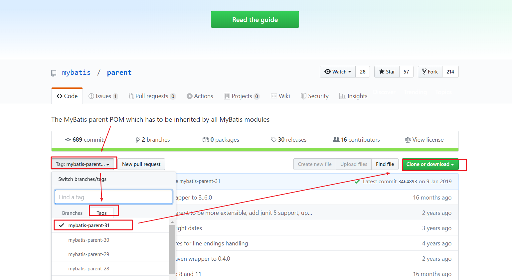
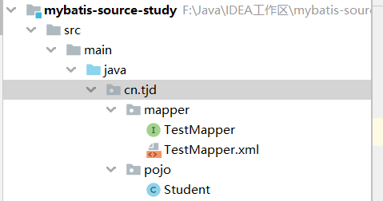
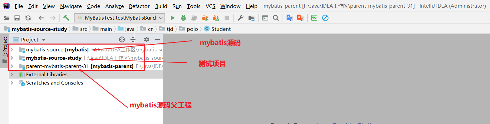
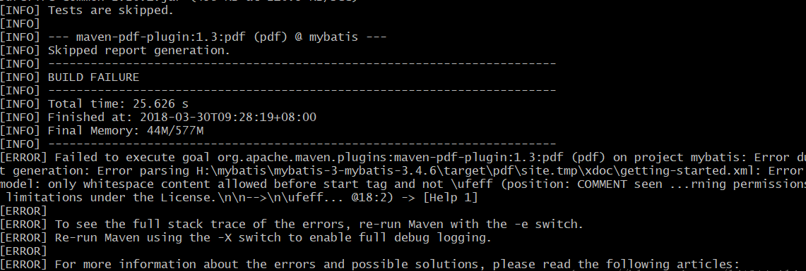
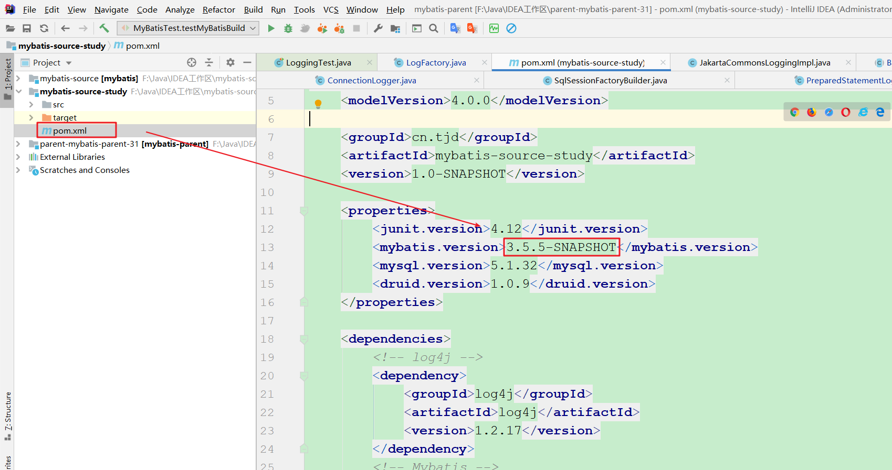
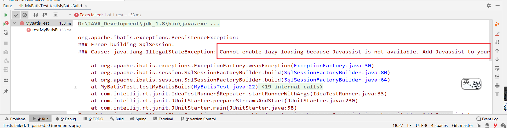
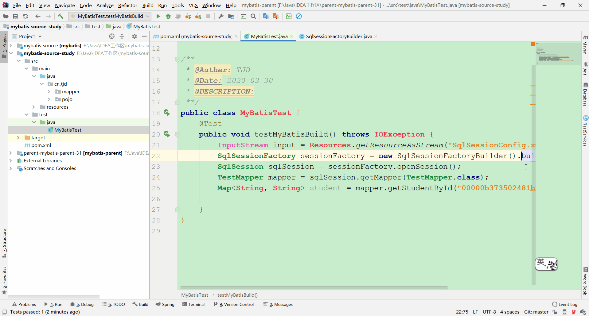

# 使用IDEA工具导入MyBatis源码进行调试

## 一. 下载源码

GitHub地址：<https://github.com/mybatis/mybatis-3>



复制上面的地址执行下列命令：

```shell
git clone https://github.com/mybatis/mybatis-3.git mybatis-source
```

注：GitHub可能会很慢，但是可以借助国内的Gitee进行“下载加速” [参考链接](https://blog.csdn.net/xiuyangzhe/article/details/104834373)

打开mybatis-source下pom.xml文件，会发现Mybatis源码还依赖于一个父工程：



去Github上下载对应的父工程，**下载的mybatis-parent版本要和mybatis源码中pom文件指定的父工程版本一致**。



## 二. 搭建MyBatis测试环境

注意：这里我们只分析MyBatis源码，所以并没有与Spring集成。

#### 第一步：新建Maven，加入MyBatis相应依赖

```xml
<?xml version="1.0" encoding="UTF-8"?>
<project xmlns="http://maven.apache.org/POM/4.0.0"
         xmlns:xsi="http://www.w3.org/2001/XMLSchema-instance"
         xsi:schemaLocation="http://maven.apache.org/POM/4.0.0 http://maven.apache.org/xsd/maven-4.0.0.xsd">
    <modelVersion>4.0.0</modelVersion>

    <groupId>cn.tjd</groupId>
    <artifactId>mybatis-source-study</artifactId>
    <version>1.0-SNAPSHOT</version>

    <properties>
        <junit.version>4.12</junit.version>
        <mybatis.version>3.2.8</mybatis.version>
        <mysql.version>5.1.32</mysql.version>
        <druid.version>1.0.9</druid.version>
    </properties>

    <dependencies>
        <!-- log4j -->
        <dependency>
            <groupId>log4j</groupId>
            <artifactId>log4j</artifactId>
            <version>1.2.17</version>
        </dependency>                                  
        <!-- Mybatis -->
        <dependency>
            <groupId>org.mybatis</groupId>
            <artifactId>mybatis</artifactId>
            <version>${mybatis.version}</version>
        </dependency>
        <!-- MySql -->
        <dependency>
            <groupId>mysql</groupId>
            <artifactId>mysql-connector-java</artifactId>
            <version>${mysql.version}</version>
        </dependency>                                 
        <!-- 连接池 -->
        <dependency>
            <groupId>com.alibaba</groupId>
            <artifactId>druid</artifactId>
            <version>${druid.version}</version>
        </dependency>
        <!-- Junit -->
		<dependency>
		    <groupId>junit</groupId>
		    <artifactId>junit</artifactId>
		    <version>${junit.version}</version>
		    <scope>test</scope>
		</dependency>
                                            
    </dependencies>

    <build>
        <!-- 加载配置文件 -->
        <resources>
            <resource>
                <directory>src/main/java</directory>
                <includes>
                    <include>**/*.xml</include>
                </includes>
            </resource>
        </resources>
    </build>

</project>
```

注意，此时这里引入的MyBatis依赖都是中央仓库中的，并不是我们下载的源码。

#### 第二步：新建Mapper接口和对应的映射文件



#### 第三步：新建MyBatis配置文件

在resource目录下创建`SqlSessionConfig.xml`文件：

```xml
<?xml version="1.0" encoding="UTF-8"?>
<!DOCTYPE configuration
        PUBLIC "-//mybatis.org//DTD Config 3.0//EN"
        "http://mybatis.org/dtd/mybatis-3-config.dtd">
<configuration>
    <!--开启日志输出-->
    <settings>
        <setting name="logImpl" value="STDOUT_LOGGING" />
    </settings>
    <!--配置类别名，配置后在Mapper配置文件（通常我们将编写SQL语句的配置文件成为Mapper配置文件）中需要使用pojo包中的类时，使用简单类名即可-->
    <typeAliases>
        <package name="cn.tjd.pojo"/>
    </typeAliases>
    <environments default="development">
        <environment id="development">
            <transactionManager type="JDBC"></transactionManager>
            <dataSource type="POOLED">
                <property name="driver" value="com.mysql.jdbc.Driver"/>
                <property name="username" value="root"/>
                <property name="password" value="123456"/>
                <property name="url" value="jdbc:mysql://localhost:3306/test?characterEncoding=UTF-8"/>
            </dataSource>
        </environment>
    </environments>
    <mappers>
        <package name="cn.tjd.mapper"/>
    </mappers>

</configuration>
```

#### 第四步：编写测试类测试

```java
public class MyBatisTest {
    @Test
    public void testMyBatisBuild() throws IOException {
        InputStream input = Resources.getResourceAsStream("SqlSessionConfig.xml");
        SqlSessionFactory sessionFactory = new SqlSessionFactoryBuilder().build(input);
        SqlSession sqlSession = sessionFactory.openSession();
        TestMapper mapper = sqlSession.getMapper(TestMapper.class);
        Map<String, String> student = mapper.getStudentById("00000b373502481baa1a5f5229507cf8");
    }
}
```

测试成功即可进行下一步。


注：之所以要在源码整合之前搭建好测试环境，是为了保证测试环境的可靠，因为后序的源码整合可能会发生一些问题，这样可以排除是因为测试环境错误所导致的。

## 三. 源码整合

#### 第一步：将源码项目（两个）导入当前测试项目所在的界面中

导入后的效果如图：



至于IDEA如何在一个界面中导入多个项目请参考：[一个IDEA界面如何同时打开多个项目](../../../../工具使用/IDEA/subfile/_16一个IDEA界面如何同时打开多个项目.md)

#### 第二步：将源码安装至本地仓库中（参考至：[mybatis 源码导入IDEA](https://blog.csdn.net/lj1314ailj/article/details/79753157)）

切换到你下载的mybatis-parent目录：

```shell
mvn clean install -Dmaven.test.skip=true
```

切换到你下载的mybatis源码目录：

```shell
mvn clean install -Dmaven.test.skip=true
```

如果出现如下错误：



打开pom.xml 文件注释掉 maven-pdf-plugin 插件:

```java
  <!--
      <plugin>
        <groupId>org.apache.maven.plugins</groupId>
        <artifactId>maven-pdf-plugin</artifactId>
      </plugin>
      -->
```

#### 第三步：修改测试项目中pom文件依赖的MyBatis版本

我们需要将测试项目中pom依赖的MyBatis的版本修改为刚刚安装至本地仓库的版本：



#### 第四步：运行测试类，看是否能够执行成功

第一次执行肯定会遇到很多问题，例如博主就遇到了缺少包的问题：



我们在pom文件中加入：

```xml
<!-- https://mvnrepository.com/artifact/org.javassist/javassist -->
<dependency>
    <groupId>org.javassist</groupId>
    <artifactId>javassist</artifactId>
    <version>3.26.0-GA</version>
</dependency>
```

具体加坐标需要去[中央仓库](https://mvnrepository.com)搜索 。

再次执行，会发现依然缺少依赖，按照相同步骤解决即可。

把所有的问题解决后，我们通过debug可以发现能够进入到mybatis源码项目中去，大功告成！

