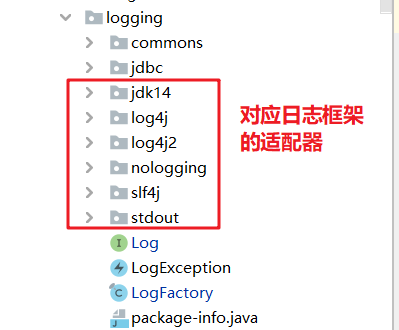
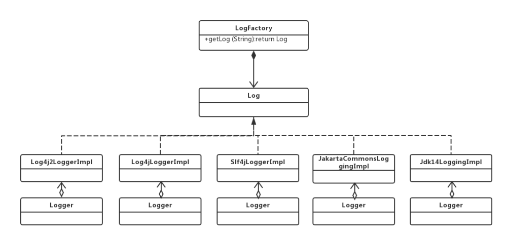

# MyBatis日志模块源码分析

MyBatis源码的logging包下是日志模块的相关实现，Mybatis日志模块通过适配器模式和代理模式优雅的实现了SQL日志的输出功能。

## 一. 适配器模式实现了MyBatis对第三方日志框架的适配

Mybatis内部没有提供日志实现类，需要接入第三方的日志组件，但第三方组件都有自己的log级别，并且各不相同，Mybatis 在内部定义了`Log`接口统一提供了trace debug warn error四个日志级别。

```java
/**
 * 由于不同的日志框架，拥有不同的日志级别，所以MyBatis在内部定义了Log接口，
 * 用于让其他日志框架适配MyBatis内部规定的日志级别
 */
public interface Log {

  boolean isDebugEnabled();

  boolean isTraceEnabled();

  /**
   * -----------规定的日志级别-----------
   */

  void error(String s, Throwable e);

  void error(String s);

  void debug(String s);

  void trace(String s);

  void warn(String s);

}

```

Mybatis 使用适配器模式，在每个第三方日志厂商和自己的log之间都存在一个适配器，将第三方的日志级别适配为自己的log级别。



其中日志适配器的继承体系如下：



我们以`Jdk14LoggingImpl`类（JDK日志框架的适配器）源码为例，分析适配器所做的事情。可以看到在JDK自带的日志框架中包含`SEVERE`、`WARNING`、`INFO`、`CONFIG`、`FINE`等8个日志级别，而Mybatis只提供了`error`、`debug`、`trace`、`warn`四种日志日志级别，这就需要认为将两者的日志级别对应起来。

```java
/**
 * JDK内置日志框架的适配器，用于适配MyBatis内部约定的Log接口
 * @author Clinton Begin
 */
public class Jdk14LoggingImpl implements Log {

  private final Logger log;

  public Jdk14LoggingImpl(String clazz) {
    log = Logger.getLogger(clazz);
  }

  @Override
  public boolean isDebugEnabled() {
    return log.isLoggable(Level.FINE);
  }

  @Override
  public boolean isTraceEnabled() {
    return log.isLoggable(Level.FINER);
  }

  @Override
  public void error(String s, Throwable e) {
    log.log(Level.SEVERE, s, e);//JDK中SEVERE级别日志对应MyBatis中error
  }

  @Override
  public void error(String s) {
    log.log(Level.SEVERE, s);
  }

  @Override
  public void debug(String s) {
    log.log(Level.FINE, s);
  }

  @Override
  public void trace(String s) {
    log.log(Level.FINER, s);
  }

  @Override
  public void warn(String s) {
    log.log(Level.WARNING, s);
  }
}
```

可以看到使用适配器模式，我们解决第三方日志框架内部实现不一致的问题，但是这些日志适配器的使用就需要借助Mybatis提供的日志工厂类了（`org.apache.ibatis.logging.LogFactory`）。在该类拥有一个静态代码块，用于动态加载项目中依赖的日志框架：

```java
static {
  //按照顺序扫描当前项目中配置的日志框架。注：双冒号是JDK8的语法，代表方法引用（语法糖）
  tryImplementation(LogFactory::useSlf4jLogging);
  tryImplementation(LogFactory::useCommonsLogging);
  tryImplementation(LogFactory::useLog4J2Logging);
  tryImplementation(LogFactory::useLog4JLogging);
  tryImplementation(LogFactory::useJdkLogging);
  tryImplementation(LogFactory::useNoLogging);
}
```


该类会按照slf4J → commonsLoging → Log4J2 → Log4J → JdkLog顺序加载日志框架，如果加载成功一个，就不会加载后面的日志框架了。

```java
private static void tryImplementation(Runnable runnable) {
    //如果前面的适配器都没有创建成功，则试图创建当前类型的适配器
    if (logConstructor == null) {
      try {
        runnable.run();
      } catch (Throwable t) {
        // ignore
      }
    }
  }
```

```java
public static synchronized void useSlf4jLogging() {
    setImplementation(org.apache.ibatis.logging.slf4j.Slf4jImpl.class);
}
```


```java
/**
   * 设置具体的日志实现类构造器
   *
   * @param implClass
   */
  private static void setImplementation(Class<? extends Log> implClass) {
    try {
      Constructor<? extends Log> candidate = implClass.getConstructor(String.class);
      //这里调用目标日志框架的适配器中的构造器，试图创建适配器对象，如果没有该框架的依赖则会抛出异常
      Log log = candidate.newInstance(LogFactory.class.getName());
      if (log.isDebugEnabled()) {
        log.debug("Logging initialized using '" + implClass + "' adapter.");
      }
      logConstructor = candidate;
    } catch (Throwable t) {
      throw new LogException("Error setting Log implementation.  Cause: " + t, t);
    }
  }
```


## 二. 代理模式实现了SQL日志输出

Mybatis 日志的使用优雅的嵌入到主体功能中（动态代理增强），接下来我们看一下是如何进行日志增强的。

### 2.1日志输出的体系结构

`org.apache.ibatis.logging.jdbc`包中存放就是JDBC相关对象的增强类，它们就是MyBatis实现日志打印的核心：


其中`BaseJdbcLogger`类保存着日志打印所需要的信息：

```java
/**
 * MyBatis用于输出执行器SQL日志记录的基类。
 *
 * @author Clinton Begin
 * @author Eduardo Macarron
 */
public abstract class BaseJdbcLogger {
  //保存PreparedStatement中常用的set方法（用于占位符设值的方法）
  protected static final Set<String> SET_METHODS;
  //保存PreparedStatement中常用的执行SQL语句的方法
  protected static final Set<String> EXECUTE_METHODS = new HashSet<>();

  //保存PreparedStatement中set方法的键值对
  private final Map<Object, Object> columnMap = new HashMap<>();

  //保存PreparedStatement中set方法的key值
  private final List<Object> columnNames = new ArrayList<>();
  //保存PreparedStatement中set方法的value值
  private final List<Object> columnValues = new ArrayList<>();

  //用于打印日志的对象
  protected final Log statementLog;
```

而`ConnectionLogger`、`PreparedStatementLogger`、`ResultSetLogger`、`StatementLogger`这几个类都实现了`InvocationHandler`接口，这也证明了它们分别是对`Conneciton`、`PreparedStatement`、`ResultSet`、`Statemtent`类的加强。

### 2.2 探寻入口

`org.apache.ibatis.executor.BaseExecutor`是MyBatis中的执行器，是Mybatis实际操作数据库的类，该类中的`getConnection()`方法返回的就是经过加强的连接对象，也就是：`ConnectionLogger`：

```java
protected Connection getConnection(Log statementLog) throws SQLException {
  Connection connection = transaction.getConnection();
  if (statementLog.isDebugEnabled()) {
    return ConnectionLogger.newInstance(connection, statementLog, queryStack);
  } else {
    return connection;
  }
}
```

#### 2.2.1 ConnectionLogger

其中`ConnectionLogger`负责在调用`prepareStatement()`方法时打印SQL语句日志，并返回经过加强后的`PreparedStatement`，也就是`PreparedStatementLogger`。

```java
/**
 * 负责打印数据库连接相关信息和SQL语句，并创建PreparedStatementLogger
 *
 * @author Clinton Begin
 * @author Eduardo Macarron
 */
public final class ConnectionLogger extends BaseJdbcLogger implements InvocationHandler {

  //真正的连接对象
  private final Connection connection;

  private ConnectionLogger(Connection conn, Log statementLog, int queryStack) {
    super(statementLog, queryStack);
    this.connection = conn;
  }

  @Override
  public Object invoke(Object proxy, Method method, Object[] params)
    throws Throwable {
    try {
      //如果调用的是Object的方法则跳过代理
      if (Object.class.equals(method.getDeclaringClass())) {
        return method.invoke(this, params);
      }
      //如果是调用prepareStatement或者prepareCall，则打印SQL语句
      if ("prepareStatement".equals(method.getName()) || "prepareCall".equals(method.getName())) {
        if (isDebugEnabled()) {
          debug(" Preparing: " + removeBreakingWhitespace((String) params[0]), true);
        }
        PreparedStatement stmt = (PreparedStatement) method.invoke(connection, params);
        /**
         * 创建PreparedStatement的代理类PreparedStatementLogger对象，并返回这个对象
         */
        stmt = PreparedStatementLogger.newInstance(stmt, statementLog, queryStack);
        return stmt;
      } else if ("createStatement".equals(method.getName())) {
        Statement stmt = (Statement) method.invoke(connection, params);
        stmt = StatementLogger.newInstance(stmt, statementLog, queryStack);
        return stmt;
      } else {
        return method.invoke(connection, params);
      }
    } catch (Throwable t) {
      throw ExceptionUtil.unwrapThrowable(t);
    }
  }
  .....
                                        
}
```

#### 2.2.2 PreparedStatementLogger

`PreparedStatementLogger`增强类是为了在调用目标对象的`executeQuery`方时输出将要执行的SQL语句，并将返回的`ResultSet`加强为`ResultSetLogger`：

```java
public final class PreparedStatementLogger extends BaseJdbcLogger implements InvocationHandler {

  private final PreparedStatement statement;

  private PreparedStatementLogger(PreparedStatement stmt, Log statementLog, int queryStack) {
    super(statementLog, queryStack);
    this.statement = stmt;
  }

  @Override
  public Object invoke(Object proxy, Method method, Object[] params) throws Throwable {
    try {
      //判断调用的是不是Object的方法
      if (Object.class.equals(method.getDeclaringClass())) {
        return method.invoke(this, params);
      }
      //如果执行的是SQL执行相关的方法，则打印参数
      if (EXECUTE_METHODS.contains(method.getName())) {
        if (isDebugEnabled()) {
          debug("Parameters: " + getParameterValueString(), true);
        }
        //清除父类中保存的SQL参数
        clearColumnInfo();
        if ("executeQuery".equals(method.getName())) {
          //执行executeQuery方法，获取查询结果集
          ResultSet rs = (ResultSet) method.invoke(statement, params);
          //将查询结果集封装成ResultSetLogger代理对象
          return rs == null ? null : ResultSetLogger.newInstance(rs, statementLog, queryStack);
        } else {
          //如果不是查询语句，则不生成代理对象，也就不会打印日志
          return method.invoke(statement, params);
        }
      } else if (SET_METHODS.contains(method.getName())) {
        /**
         * 如果执行的是PreparedStatement中的Set方法，则将对应的参数值放入父类专门保存SQL参数值的容器中
         */
        if ("setNull".equals(method.getName())) {
          setColumn(params[0], null);
        } else {
          setColumn(params[0], params[1]);
        }
        return method.invoke(statement, params);
      } else if ("getResultSet".equals(method.getName())) {
        ResultSet rs = (ResultSet) method.invoke(statement, params);
        return rs == null ? null : ResultSetLogger.newInstance(rs, statementLog, queryStack);
      } else if ("getUpdateCount".equals(method.getName())) {
        int updateCount = (Integer) method.invoke(statement, params);
        if (updateCount != -1) {
          debug("   Updates: " + updateCount, false);
        }
        return updateCount;
      } else {
        return method.invoke(statement, params);
      }
    } catch (Throwable t) {
      throw ExceptionUtil.unwrapThrowable(t);
    }
  }

```

#### 2.2.3 ResultSetLogger

`ResultSetLogger`增强类是为了在获取结果集时打印结果集信息。

```java
public final class ResultSetLogger extends BaseJdbcLogger implements InvocationHandler {

  private static final Set<Integer> BLOB_TYPES = new HashSet<>();
  private boolean first = true;
  private int rows;
  private final ResultSet rs;
  private final Set<Integer> blobColumns = new HashSet<>();

  static {
    BLOB_TYPES.add(Types.BINARY);
    BLOB_TYPES.add(Types.BLOB);
    BLOB_TYPES.add(Types.CLOB);
    BLOB_TYPES.add(Types.LONGNVARCHAR);
    BLOB_TYPES.add(Types.LONGVARBINARY);
    BLOB_TYPES.add(Types.LONGVARCHAR);
    BLOB_TYPES.add(Types.NCLOB);
    BLOB_TYPES.add(Types.VARBINARY);
  }

  private ResultSetLogger(ResultSet rs, Log statementLog, int queryStack) {
    super(statementLog, queryStack);
    this.rs = rs;
  }

  @Override
  public Object invoke(Object proxy, Method method, Object[] params) throws Throwable {
    try {
      if (Object.class.equals(method.getDeclaringClass())) {
        return method.invoke(this, params);
      }
      Object o = method.invoke(rs, params);
      if ("next".equals(method.getName())) {
        if ((Boolean) o) {
          rows++;
          if (isTraceEnabled()) {
            ResultSetMetaData rsmd = rs.getMetaData();
            final int columnCount = rsmd.getColumnCount();
            if (first) {
              first = false;
              printColumnHeaders(rsmd, columnCount);
            }
            printColumnValues(columnCount);
          }
        } else {
          debug("     Total: " + rows, false);
        }
      }
      clearColumnInfo();
      return o;
    } catch (Throwable t) {
      throw ExceptionUtil.unwrapThrowable(t);
    }
  }
}
```

注：上文中并没有分析`StatementLogger`类，具体的分析方式与上文一致。

详细的代码注释请移步至：[http://github.com/tianjindong/mybatis-source-annotation](https://github.com/tianjindong/mybatis-source-annotation)

## 三. 总结

MyBatis中使用适配器模式对第三方日志框架输出级别进行统一，使用JDK动态代理技术分别加强`Connection`、`PreparedStatement`、`ResultSet`类使之能在自己的声明周期中打印SQL执行的相关信息。


