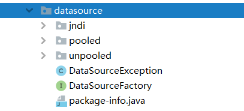
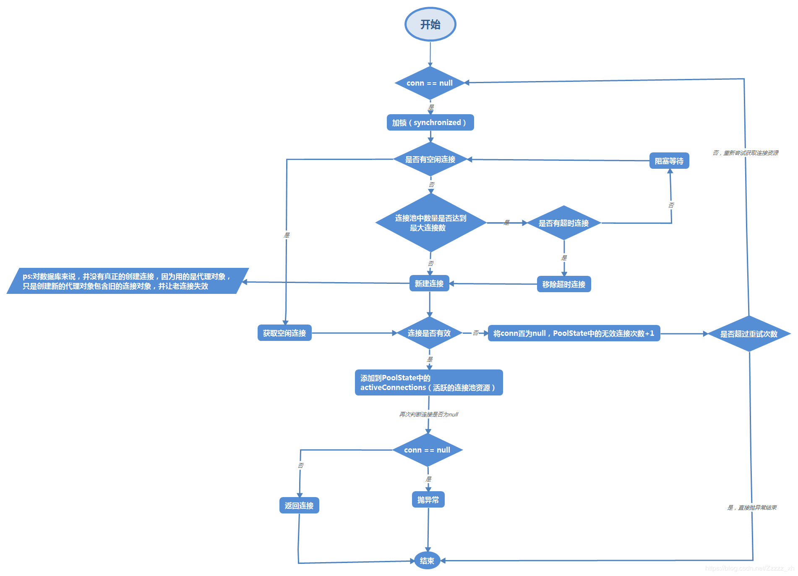
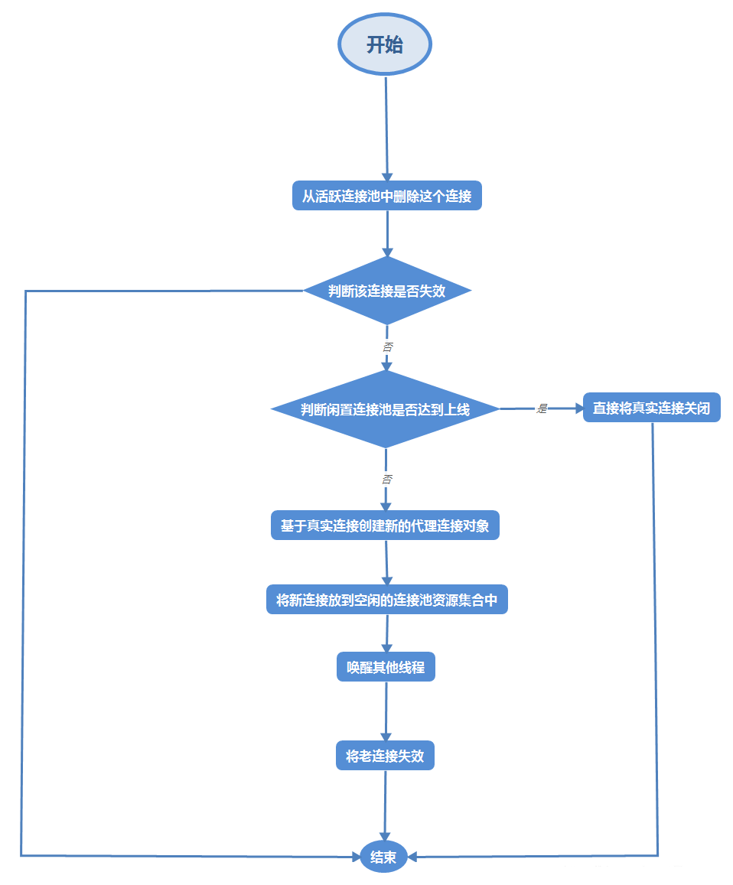

# MyBatis数据源模块源码分析

数据源对象是比较复杂的对象，其创建过程相对比较复杂，对于 MyBatis 创建数据源，具体来讲有如下难点：

- MyBatis 不但要能集成第三方的数据源组件，自身也提供了数据源的实现；
- 数据源的初始化参数较多，比较复杂；

在MyBatis中使用了工厂模式来实现数据源的创建，使用代理模式来帮助实现自己的数据源。

## 一 . MyBatis数据源模块类结构

MyBatis数据源模块的代码全部位于`org.apache.ibatis.datasource`包下:



数据源模块类主要结构如下（图片来自于：<https://blog.csdn.net/Zzzzz_xh/article/details/100531968>）：


`DataSourceFactory`是工厂的抽象接口：

```java
/**
 * 数据源工厂类的抽象接口，它有两个实现类：UnpooledDataSourceFactory、PooledDataSourceFactory
 * @author Clinton Begin
 */
public interface DataSourceFactory {

  /**
   * 设置数据源属性
   * @param props
   */
  void setProperties(Properties props);

  /**
   * 获取数据源
   * @return
   */
  DataSource getDataSource();

}
```

`DataSourceFactory`接口拥有`UnpooledDataSourceFactory`和`PooledDataSourceFactory`两个实现类，`UnpooledDataSourceFactory`是未使用池化技术的数据源工厂类，`PooledDataSourceFactory`是使用了池化技术的数据源工厂类。它们两分别用于创建`UnpooledDataSource`和`PooledDataSource`，它们都实现了`javax.sql.DataSource` JDBC提供的数据源标准，其中`PooledDataSource`就是MyBatis自己实现的数据库连接池。

## 二. UnpooledDataSource源码分析

在JDK中官方定义了一个数据源接口，市面上所有第三方连接池（数据源）都应该实现这个接口：

```java
public interface DataSource  extends CommonDataSource, Wrapper {

  Connection getConnection() throws SQLException;

  Connection getConnection(String username, String password)
    throws SQLException;
}

```

`UnpooledDataSource`实际上是一个未使用池化技术的数据源，它实现了`javax.sql.DataSource`数据源标准（JDBC规定），但是在内部调用`getConnection()`方法时是通过创建`Connection`对象来实现的，由于每一次获取都创建新的连接对象，连接对象并没有进行复用，效率较低。其中`UnpooledDataSource`源码如下（只保留关键代码）：

```java
public class UnpooledDataSource implements DataSource {

  private ClassLoader driverClassLoader;//驱动类的类加载器
  private Properties driverProperties;//数据库连接的相关信息
  private static Map<String, Driver> registeredDrivers = new ConcurrentHashMap<>();//缓存已注册的数据库驱动类

  private String driver;
  private String url;
  private String username;
  private String password;

  private Boolean autoCommit;
  private Integer defaultTransactionIsolationLevel;
  private Integer defaultNetworkTimeout;

  @Override
  public Connection getConnection() throws SQLException {
    return doGetConnection(username, password);
  }

  @Override
  public Connection getConnection(String username, String password) throws SQLException {
    return doGetConnection(username, password);
  }

  private Connection doGetConnection(Properties properties) throws SQLException {
    //初始化驱动
    initializeDriver();
    //重点在这里，连接对象使用过 DriverManager.getConnection创建的新的连接对象
    Connection connection = DriverManager.getConnection(url, properties);
    //配置连接
    configureConnection(connection);
    return connection;
  }
   ...
}

```

## 三. PooledDataSource源码分析

`PooledDataSource`是Mybatis自己实现的数据库连接池，在分析它的源码之前我们首先要清楚作为一个连接池需要实现哪些功能。

作为一个数据库连接池，其最核心的功能是要做到`Connection`的复用，当用户调用连接池的`getConnection`获取连接时会在池中去拿，当用户调用`Connection`的`close()`方法时就会将该连接归还至连接池。而`PooledDataSource`实现上述功能需要借助另外两个类来实现：

- `PoolState`：用于保存线程池的相关状态。
- `PooledConnection`：`Connection`的加强类，用于加强原生`close`等方法，从而实现数据库连接的复用。

### 3.1 PoolState

在PoolState最核心的的是`idleConnections`和`activeConnections`，他们分别是存储空闲连接和非空闲连接的集合（在后文中出于习惯考虑，将其描述为空闲队列和活动队列）。

```java
public class PoolState {

  protected PooledDataSource dataSource;

  //空闲连接队列
  protected final List<PooledConnection> idleConnections = new ArrayList<>();
  //活动队列
  protected final List<PooledConnection> activeConnections = new ArrayList<>();
  //请求的次数
  protected long requestCount = 0;
  //累计获得连接的时长
  protected long accumulatedRequestTime = 0;
  //累计使用连接的时间。从连接取出到归还，算一次使用时间
  protected long accumulatedCheckoutTime = 0;
  //使用连接超时的次数
  protected long claimedOverdueConnectionCount = 0;
  //累计超时时间
  protected long accumulatedCheckoutTimeOfOverdueConnections = 0;
  //累计等待时间
  protected long accumulatedWaitTime = 0;
  //等待次数
  protected long hadToWaitCount = 0;
  //无效的连接次数
  protected long badConnectionCount = 0;

  public PoolState(PooledDataSource dataSource) {
    this.dataSource = dataSource;
  }

 ...

}

```

### 3.2 PooledDataSource

`PooledDataSource`最主要是要理解`getConnection`方法获取连接对象的逻辑，这里给出该方法的执行流程图：



`PooledDataSource`类获取连接时的核心源码如下：

```java
public class PooledDataSource implements DataSource {
  //Log是是适配器模式的抽象接口
  private static final Log log = LogFactory.getLog(PooledDataSource.class);

  //线程池的相关状态
  private final PoolState state = new PoolState(this);

  //没有池化的数据源
  private final UnpooledDataSource dataSource;

  // OPTIONAL CONFIGURATION FIELDS
  //在任意时间可存在的活动（正在使用）连接数量，默认值：10
  protected int poolMaximumActiveConnections = 10;
  //任意时间可能存在的空闲连接数，默认是5
  protected int poolMaximumIdleConnections = 5;
  //在被强制返回之前，池中连接被检出（checked out）时间，默认值：20000 毫秒（即 20 秒）
  protected int poolMaximumCheckoutTime = 20000;
  //这是一个底层设置，如果获取连接花费了相当长的时间，连接池会打印状态日志并重新尝试获取一个连接（避免在误配置的情况下一直失败且不打印日志），默认值：20000 毫秒（即 20 秒）。
  protected int poolTimeToWait = 20000;
  //这是一个关于坏连接容忍度的底层设置， 作用于每一个尝试从缓存池获取连接的线程。 如果这个线程获取到的是一个坏的连接，那么这个数据源允许这个线程尝试重新获取一个新的连接，但是这个重新尝试的次数不应该超过
  // poolMaximumIdleConnections 与 poolMaximumLocalBadConnectionTolerance 之和。 默认值：3（新增于 3.4.5）
  protected int poolMaximumLocalBadConnectionTolerance = 3;
  // 发送到数据库的侦测查询，用来检验连接是否正常工作并准备接受请求。默认是“NO PING QUERY SET”，这会导致多数数据库驱动出错时返回恰当的错误消息。
  protected String poolPingQuery = "NO PING QUERY SET";
  //是否启用侦测查询。若开启，需要设置 poolPingQuery 属性为一个可执行的 SQL 语句（最好是一个速度非常快的 SQL 语句），默认值：false。
  protected boolean poolPingEnabled;
  // 配置 poolPingQuery 的频率。可以被设置为和数据库连接超时时间一样，来避免不必要的侦测，默认值：0（即所有连接每一时刻都被侦测 — 当然仅当 poolPingEnabled 为 true 时适用）。
  protected int poolPingConnectionsNotUsedFor;

  //根据数据库URL、用户名、密码生成一个Hash值，唯一标识一个连接池，由这个连接池产生的连接对象都会带上这个值
  private int expectedConnectionTypeCode;

  @Override
  public Connection getConnection() throws SQLException {
    return popConnection(dataSource.getUsername(), dataSource.getPassword()).getProxyConnection();
  }

  @Override
  public Connection getConnection(String username, String password) throws SQLException {
    return popConnection(username, password).getProxyConnection();
  }

  private PooledConnection popConnection(String username, String password) throws SQLException {
    boolean countedWait = false;
    PooledConnection conn = null;
    long t = System.currentTimeMillis();
    //此次获取任务中，获取到失效连接的次数
    int localBadConnectionCount = 0;

    //最外面是while死循环，如果一直拿不到connection，则不断尝试
    while (conn == null) {
      //使用state加锁，也就是说下面代码对state的操作都是线程安全的
      synchronized (state) {
        if (!state.idleConnections.isEmpty()) {
          //连接池中拥有空闲连接
          //拿出空闲队列中的第一个连接
          conn = state.idleConnections.remove(0);
          //如果是Debu级别，则输出日志
          if (log.isDebugEnabled()) {
            log.debug("Checked out connection " + conn.getRealHashCode() + " from pool.");
          }
        } else {
          /**
           * 连接池中没有空闲连接
           */
          if (state.activeConnections.size() < poolMaximumActiveConnections) {
            //如果当前活动的线程小于所约定的最大活动线程数，则创建一个连接
            //创建代理对象
            conn = new PooledConnection(dataSource.getConnection(), this);
            if (log.isDebugEnabled()) {
              log.debug("Created connection " + conn.getRealHashCode() + ".");
            }
          } else {
            // 如果连接池中活动连接数到达极限，则不能创建连接
            // 拿去activeConnections队列中最老的连接对象
            PooledConnection oldestActiveConnection = state.activeConnections.get(0);
            // 获取此连接已取出的时间
            long longestCheckoutTime = oldestActiveConnection.getCheckoutTime();
            if (longestCheckoutTime > poolMaximumCheckoutTime) {
              // 如果此连接从连接池中获取出来的时间超过限制的最大时间
              //将过期的连接数+1
              state.claimedOverdueConnectionCount++;
              state.accumulatedCheckoutTimeOfOverdueConnections += longestCheckoutTime;
              state.accumulatedCheckoutTime += longestCheckoutTime;
              state.activeConnections.remove(oldestActiveConnection);
              if (!oldestActiveConnection.getRealConnection().getAutoCommit()) {
                //如果超时的连接事务不是自动提交的
                try {
                  //回滚事务
                  oldestActiveConnection.getRealConnection().rollback();
                } catch (SQLException e) {
                  /*
                     Just log a message for debug and continue to execute the following
                     statement like nothing happened.
                     Wrap the bad connection with a new PooledConnection, this will help
                     to not interrupt current executing thread and give current thread a
                     chance to join the next competition for another valid/good database
                     connection. At the end of this loop, bad {@link @conn} will be set as null.
                   */
                  log.debug("Bad connection. Could not roll back");
                }
              }
              //重新封装一个新的代理连接对象（这里有点疑问？新代理对象与老代理对象（PooledConnection）共用目标对象（Connection）不会带来线程安全问题吗？）
              conn = new PooledConnection(oldestActiveConnection.getRealConnection(), this);
              //设置创建时间
              conn.setCreatedTimestamp(oldestActiveConnection.getCreatedTimestamp());
              //设置最后使用的时间
              conn.setLastUsedTimestamp(oldestActiveConnection.getLastUsedTimestamp());
              //将超时的代理连接对象（PooledConnection）作废
              oldestActiveConnection.invalidate();
              if (log.isDebugEnabled()) {
                log.debug("Claimed overdue connection " + conn.getRealHashCode() + ".");
              }
            } else {
              // 如果此连接从连接池中获取出来的时间没有超过限制的最大时间，则必须等待
              try {
                if (!countedWait) {
                  //等待数量+1
                  state.hadToWaitCount++;
                  countedWait = true;
                }
                if (log.isDebugEnabled()) {
                  log.debug("Waiting as long as " + poolTimeToWait + " milliseconds for connection.");
                }
                long wt = System.currentTimeMillis();
                //当前线程释放掉state锁，等待poolTimeToWait
                state.wait(poolTimeToWait);
                //计算累计等待时间
                state.accumulatedWaitTime += System.currentTimeMillis() - wt;
              } catch (InterruptedException e) {
                //如果捕获到中断异常则跳出循环
                break;
              }
            }
          }
        }
        if (conn != null) {
          //如果已经拿到连接对象了
          if (conn.isValid()) {
            //connection是有效的
            if (!conn.getRealConnection().getAutoCommit()) {
              conn.getRealConnection().rollback();
            }
            //设置当前connection对象的TypeCode，TypeCode是URL+用户名+密码的HashCode，目的是在归还的时候判断，当前连接的参数是否与数据源相同
            conn.setConnectionTypeCode(assembleConnectionTypeCode(dataSource.getUrl(), username, password));
            conn.setCheckoutTimestamp(System.currentTimeMillis());
            conn.setLastUsedTimestamp(System.currentTimeMillis());
            state.activeConnections.add(conn);
            state.requestCount++;
            state.accumulatedRequestTime += System.currentTimeMillis() - t;
          } else {
            //connection是无效的
            if (log.isDebugEnabled()) {
              log.debug("A bad connection (" + conn.getRealHashCode() + ") was returned from the pool, getting another connection.");
            }
            //整个数据源累计获取到无效连接的次数+1
            state.badConnectionCount++;
            //此次获取任务中 获取失效连接的次数+1
            localBadConnectionCount++;
            conn = null;
            if (localBadConnectionCount > (poolMaximumIdleConnections + poolMaximumLocalBadConnectionTolerance)) {
              //此次连接获取任务中 获取失效连接的次数 大于 poolMaximumIdleConnections + poolMaximumLocalBadConnectionTolerance 则抛出异常，停止尝试
              if (log.isDebugEnabled()) {
                log.debug("PooledDataSource: Could not get a good connection to the database.");
              }
              throw new SQLException("PooledDataSource: Could not get a good connection to the database.");
            }
          }
        }
      }

    }

    if (conn == null) {
      //如果经过上面一系列的操作还没有获取到对象，则抛出SQLException
      if (log.isDebugEnabled()) {
        log.debug("PooledDataSource: Unknown severe error condition.  The connection pool returned a null connection.");
      }
      throw new SQLException("PooledDataSource: Unknown severe error condition.  The connection pool returned a null connection.");
    }

    return conn;
  }


}

```

### 3.3 PooledConnection

在`PooledDataSource`中我们理解了`Connection`获取流程，当用户调用`close`方法时需要将该对象归还至数据库，而这一功能需要通过`PooledConnection`类来实现:

```java
class PooledConnection implements InvocationHandler {

  private static final String CLOSE = "close";
  private static final Class<?>[] IFACES = new Class<?>[] { Connection.class };

  private final int hashCode;
  //当前连接所属的数据源，最后会归还至该数据源
  private final PooledDataSource dataSource;
  //真正的连接对象
  private final Connection realConnection;
  //代理的连接对象
  private final Connection proxyConnection;
  //从数据源中取出来的时间戳
  private long checkoutTimestamp;
  //连接创建的时间戳
  private long createdTimestamp;
  //连接最后一次使用的时间戳
  private long lastUsedTimestamp;
  //根据数据库URL、用户名、密码生成一个Hash值，唯一标识一个连接池
  private int connectionTypeCode;
  //连接是否有效
  private boolean valid;

  ...
  @Override
  public Object invoke(Object proxy, Method method, Object[] args) throws Throwable {
    String methodName = method.getName();
    if (CLOSE.equals(methodName)) {
      //如果用户调用的是close方法，则将调用PooledDataSource中的pushConnection方法
      dataSource.pushConnection(this);
      return null;
    }
    try {
      if (!Object.class.equals(method.getDeclaringClass())) {
        /**
         * 如果调用的不是Object的方法，则检查该连接是否有效，如果无效则抛出异常，
         * 这也是PooledDataSource.getConnection当没有空闲连接，将超时连接作废机制的关键
         */
        // issue #579 toString() should never fail
        // throw an SQLException instead of a Runtime
        checkConnection();
      }
      //调用被代理的Connection中的方法
      return method.invoke(realConnection, args);
    } catch (Throwable t) {
      throw ExceptionUtil.unwrapThrowable(t);
    }

  }

  private void checkConnection() throws SQLException {
    if (!valid) {
      throw new SQLException("Error accessing PooledConnection. Connection is invalid.");
    }
  }

}

```

可以看到通过`invoke`方法的加强，当用户调用`close()`方法时会通过`PooledDataSource`中的`pushConnection()`方法归还连接，连接归还的流程图如下：



`pushConnection`方法源码如下：

```java
/**
   * 将连接对象归还给连接池（实际上是将连接从active队列中移到idle队列中）
   *
   * @param conn
   * @throws SQLException
   */
  protected void pushConnection(PooledConnection conn) throws SQLException {

    synchronized (state) {
      //将当前连接从active队列中移除
      state.activeConnections.remove(conn);
      if (conn.isValid()) {
        //连接是有效的
        if (state.idleConnections.size() < poolMaximumIdleConnections && conn.getConnectionTypeCode() == expectedConnectionTypeCode) {
          //空闲的数量小于最大空闲值 且 连接对象的typeCode与数据源期望的TypeCode相同
          //记录当前连接使用的时间
          state.accumulatedCheckoutTime += conn.getCheckoutTime();
          if (!conn.getRealConnection().getAutoCommit()) {
            //如果连接对象的事务是非自动提交的，则回滚事务
            conn.getRealConnection().rollback();
          }
          //重新封装一个新的代理连接对象
          PooledConnection newConn = new PooledConnection(conn.getRealConnection(), this);
          //将新建的代理连接对象放入空闲队列
          state.idleConnections.add(newConn);
          //设置创建的时间戳
          newConn.setCreatedTimestamp(conn.getCreatedTimestamp());
          //设置最后使用的时间戳
          newConn.setLastUsedTimestamp(conn.getLastUsedTimestamp());
          //老的代理对象作废
          conn.invalidate();
          if (log.isDebugEnabled()) {
            log.debug("Returned connection " + newConn.getRealHashCode() + " to pool.");
          }
          //换新在state锁上的等待的线程
          state.notifyAll();
        } else {
          //空闲的数量大于等于最大空闲值 或者 连接对象的typeCode与数据源期望的TypeCode不相同
          state.accumulatedCheckoutTime += conn.getCheckoutTime();
          if (!conn.getRealConnection().getAutoCommit()) {
            conn.getRealConnection().rollback();
          }
          //关闭这个连接
          conn.getRealConnection().close();
          if (log.isDebugEnabled()) {
            log.debug("Closed connection " + conn.getRealHashCode() + ".");
          }
          //将代理连接作废
          conn.invalidate();
        }
      } else {
        if (log.isDebugEnabled()) {
          log.debug("A bad connection (" + conn.getRealHashCode() + ") attempted to return to the pool, discarding connection.");
        }
        state.badConnectionCount++;
      }
    }
  }
```

详细代码注释请移步至：[https://github.com/tianjindong/mybatis-source-annotation](https://github.com/tianjindong/mybatis-source-annotation)

