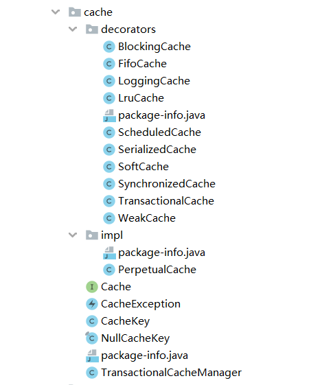

# MyBatis缓存模块源码分析

优秀的ORM框架都应该提供缓存机制，MyBatis也不例外，在`org.apache.ibatis.cache`包下面定义了MyBatis缓存的核心模块，需要注意的是这个包中只是MyBatis缓存的核心实现，并不涉及一级缓存和二级缓存的实现，本文同样没有涉及到一二级缓存的具体实现方式的讲解。

在阅读缓存模块源码之前，读者们应该首先弄懂装饰器模式的含义，因为缓存模块的实现是装饰器模式的一种最佳实践，只有弄懂了装饰器模式才能更好的理解缓存模块的原理。

## 一. 初探缓存模块源码结构

缓存模块源码结构如下：



- decorators包：该包存放的是装饰器，通过这些装饰器可以为缓存添加一下核心功能，例如：防止缓存击穿，添加缓存清空策略，日志功能、序列化功能、定时清空功能。
  - `BlockingCache`：防止缓存击穿的装饰器。
  - `FifoCache`：缓存淘汰策略装饰器（先进先出）。
  - `LoggingCache`：缓存的日志装饰器，用于输出缓存命中率。
  - `LruCache`：缓存淘汰策略装饰器（最近最少使用）
  - `ScheduledCache`：缓存清空计划装饰器，该装饰器目的是实现每小时清空一次缓存。
  - `SerializedCache`：缓存值序列化装饰器。将对象存存入缓存之前将对象序列化为字节数组存入缓存，在get时反序列化为对象。
  - `SoftCache`：软引用缓存装饰器。
  - `SynchronizedCache`：同步装饰器，用于保证缓存的更新操作是线程安全的。
  - `TransactionalCache`：二级缓存事务缓冲区。
  - `WeakCache`：弱引用缓存装饰器。
- impl包：该包下只有一个PerpetualCache类，它就是缓存模块的核心类。

## 一. 缓存模块的核心接口（Cache）

```java
/**
 * MyBatis缓存模块采用装饰器模式
 */
public interface Cache {

  /**
   * @return 获取这个缓存的ID
   */
  String getId();

  void putObject(Object key, Object value);

  Object getObject(Object key);

  Object removeObject(Object key);

  void clear();

  int getSize();

  //获取读写锁。从3.2.6开始，这个方法不再被核心调用
  default ReadWriteLock getReadWriteLock() {
    return null;
  }

}

```

可以看到`putObject`方法的key不是使用的String而是Object，这是因为MyBatis涉及动态SQL的原因，缓存项的key不能仅仅通过一个String来表示，所以通过`CacheKey`来封装缓存的Key。在`CacheKey`中封装类多个影响缓存项 的因素。

构成`CacheKey`的对象：

- mappedStatement的id
- 指定查询结果集的范围（分页信息）
- 查询所使用的SQL语句
- 用户传递给SQL语句的实际参数值

```java
/**
 * 缓存key
 * MyBatis 对于其 Key 的生成采取规则为：[mappedStementId + offset + limit + SQL + queryParams + environment]生成一个哈希码
 */
public class CacheKey implements Cloneable, Serializable {

  private static final long serialVersionUID = 1146682552656046210L;

  public static final CacheKey NULL_CACHE_KEY = new CacheKey() {

    @Override
    public void update(Object object) {
      throw new CacheException("Not allowed to update a null cache key instance.");
    }

    @Override
    public void updateAll(Object[] objects) {
      throw new CacheException("Not allowed to update a null cache key instance.");
    }
  };

  private static final int DEFAULT_MULTIPLIER = 37;
  private static final int DEFAULT_HASHCODE = 17;

  private final int multiplier;//参与hash计算的乘数
  private int hashcode; //当前CacheKey的HashCode
  private long checksum; //校验和
  private int count; //updateList的元素个数
  // 8/21/2017 - Sonarlint flags this as needing to be marked transient. While true if content is not serializable, this
  // is not always true and thus should not be marked transient.
  private List<Object> updateList;

  public CacheKey() {
    this.hashcode = DEFAULT_HASHCODE;
    this.multiplier = DEFAULT_MULTIPLIER;
    this.count = 0;
    this.updateList = new ArrayList<>();
  }

  public CacheKey(Object[] objects) {
    this();
    updateAll(objects);
  }

  public int getUpdateCount() {
    return updateList.size();
  }

  public void update(Object object) {
    int baseHashCode = object == null ? 1 : ArrayUtil.hashCode(object);

    count++; //updateList中的size +1
    checksum += baseHashCode;//计算校验和
    baseHashCode *= count;

    hashcode = multiplier * hashcode + baseHashCode; //更新Hash值

    updateList.add(object);
  }

  public void updateAll(Object[] objects) {
    for (Object o : objects) {
      update(o);
    }
  }

  @Override
  public boolean equals(Object object) {
    if (this == object) {
      return true;
    }
    if (!(object instanceof CacheKey)) {
      return false;
    }

    final CacheKey cacheKey = (CacheKey) object;

    /**
     * 这三个值都相同equals才有可能相同，目的是快速剔除大部分不相同的对象
     */
    if (hashcode != cacheKey.hashcode) {
      return false;
    }
    if (checksum != cacheKey.checksum) {
      return false;
    }
    if (count != cacheKey.count) {
      return false;
    }

    //经过上面三个元素的筛选，说明这两个对象极大可能相等，这里进行最后的判断
    for (int i = 0; i < updateList.size(); i++) {
      Object thisObject = updateList.get(i);
      Object thatObject = cacheKey.updateList.get(i);
      if (!ArrayUtil.equals(thisObject, thatObject)) {
        return false;
      }
    }
    return true;
  }

  @Override
  public int hashCode() {
    return hashcode;
  }
}
```

## 二. 缓存的核心实现（PerpetualCache）

Mybatis 缓存实现是基于HashMap实现的，所以PerpetualCache实现了实际上是线程不安全的。如果想要实现线程安全的缓存，就需要使用`SynchronizedCache`装饰器装饰`PerpetualCache`。

```java
/**
 * MyBatis缓存的核心实现类。类似于IO中的FileInputStream（JDK中的IO同样采用装饰器模式）
 * @author Clinton Begin
 */
public class PerpetualCache implements Cache {
  //每一个缓存都有一个唯一ID
  private final String id;

  //缓存底层使用HashMap保存数据，所以单独的PerpetualCache实例是不支持多线程的，而decorators包中提供的装饰器可以将其包装为Blocking
  private final Map<Object, Object> cache = new HashMap<>();

  ...

  @Override
  public void putObject(Object key, Object value) {
    cache.put(key, value);
  }

  @Override
  public Object getObject(Object key) {
    return cache.get(key);
  }

  ...
}

```

## 三. 装饰器

由于缓存模块的装饰器比较多，下面抽出几个有代表性的装饰器讲解，其他的装饰器原理可以参考博主的中文注释项目：

### 3.1 BlockingCache

`BlockingCache`装饰器是为了防止缓存击穿，保证只有一个线程根据指定的key到数据库中查找对应的数据，使用`ConcurrentHashMap`（安全，不重复）去存放锁的key（按照key加锁的细粒度锁）。

```java
/**
 * 装饰器，让缓存拥有阻塞的功能，目的是为了防止缓存击穿。（当在缓存中找不到元素时，它设置对缓存键的锁定，这样，其他线程将一直等待，直到该缓存键放入了缓存值）
 *
 * 需要注意的是，这个装饰器并不能保证缓存操作的线程安全
 *
 * Simple and inefficient version of EhCache's BlockingCache decorator.
 * It sets a lock over a cache key when the element is not found in cache.
 * This way, other threads will wait until this element is filled instead of hitting the database.
 *
 * @author Eduardo Macarron
 *
 */
public class BlockingCache implements Cache {

  //超时时间
  private long timeout;
  //被装饰的对象
  private final Cache delegate;
  /**
   * 这里采用分段锁，每一个Key对应一个锁，当在缓存中找不到元素时，它设置对缓存键的锁定。
   * 这样，其他线程将一直等待，直到该缓存键放入了缓存值，这也是防止缓存击穿的典型方案。
   *
   * 需要注意的是，这里每一个Key都对应一个锁，就并不能保证对底层Map的更新操作（主要是put操作），
   * 只由一个线程执行，那这样多线程状态下对底层HashMap的更新操作也是线程不安全的！
   *
   * 也就是说，BlockingCache只是为了解决缓存击穿的问题，而不是解决缓存操作的线程安全问题，
   * 线程安全问题交由SynchronizedCache装饰器来完成
   *
   */
  private final ConcurrentHashMap<Object, ReentrantLock> locks;

  public BlockingCache(Cache delegate) {
    this.delegate = delegate;
    this.locks = new ConcurrentHashMap<>();
  }

  @Override
  public String getId() {
    return delegate.getId();
  }

  @Override
  public int getSize() {
    return delegate.getSize();
  }

  @Override
  public void putObject(Object key, Object value) {
    try {
      delegate.putObject(key, value);
    } finally {
      //释放锁
      releaseLock(key);
    }
  }

  @Override
  public Object getObject(Object key) {
    //尝试获取锁，获取到锁之前一直阻塞，如果超时则抛出异常
    acquireLock(key);
    //调用被装饰对象的getObject方法获取缓存
    Object value = delegate.getObject(key);
    if (value != null) {
      /**
       * 如果value不为空，则释放锁。
       * 这里很多人肯定会有疑问，如果没有获取到值难道就不释放锁了吗？其实不然，当
       * MyBatis获取缓存时没有获取到数据，则会真正执行SQL语句去查询数据库，查询到结果后
       * 会紧接着调用缓存的putObject方法，在这个方法中会进行释放锁的操作
       */
      releaseLock(key);
    }
    return value;
  }

  @Override
  public Object removeObject(Object key) {
    // despite of its name, this method is called only to release locks
    releaseLock(key);
    return null;
  }

  @Override
  public void clear() {
    delegate.clear();
  }

  private ReentrantLock getLockForKey(Object key) {
    //如果存在key对应的锁则返回已经存在的锁，如果不存在则创建一个并返回
    return locks.computeIfAbsent(key, k -> new ReentrantLock());
  }

  /**
   * 尝试获取锁
   * @param key 缓存的key，
   */
  private void acquireLock(Object key) {
    //获取锁对象
    Lock lock = getLockForKey(key);
    if (timeout > 0) {
      //如果锁的获取拥有超时时间
      try {
        //则尝试在指定时间内获取锁，如果获取到了则返回true，超时仍未获取到则返回false
        boolean acquired = lock.tryLock(timeout, TimeUnit.MILLISECONDS);
        if (!acquired) {
          throw new CacheException("Couldn't get a lock in " + timeout + " for the key " +  key + " at the cache " + delegate.getId());
        }
      } catch (InterruptedException e) {
        throw new CacheException("Got interrupted while trying to acquire lock for key " + key, e);
      }
    } else {
      //没有设置超时时间，则直接无限期等待锁
      lock.lock();
    }
  }

  private void releaseLock(Object key) {
    ReentrantLock lock = locks.get(key);
    if (lock.isHeldByCurrentThread()) {
      //如果当前线程拥有此锁，则释放锁
      lock.unlock();
    }
  }

  public long getTimeout() {
    return timeout;
  }

  public void setTimeout(long timeout) {
    this.timeout = timeout;
  }
}

```

### 3.2 SynchronizedCache

```java
/**
 * 同步装饰器，用于保证缓存的更新操作是线程安全的
 */
public class SynchronizedCache implements Cache {

  private final Cache delegate;

  public SynchronizedCache(Cache delegate) {
    this.delegate = delegate;
  }

  @Override
  public String getId() {
    return delegate.getId();
  }

  @Override
  public synchronized int getSize() {
    return delegate.getSize();
  }

  @Override
  public synchronized void putObject(Object key, Object object) {
    delegate.putObject(key, object);
  }

  @Override
  public synchronized Object getObject(Object key) {
    return delegate.getObject(key);
  }

  @Override
  public synchronized Object removeObject(Object key) {
    return delegate.removeObject(key);
  }

  @Override
  public synchronized void clear() {
    delegate.clear();
  }

  @Override
  public int hashCode() {
    return delegate.hashCode();
  }

  @Override
  public boolean equals(Object obj) {
    return delegate.equals(obj);
  }

}
```

同步装饰器，用于保证缓存的更新操作是线程安全的。它对所有涉及所有对缓存的操作（读/写）都使用`synchronized`关键字进行同步。需要注意的是`SynchronizedCache`装饰器是将整个方法进行了加锁，这在使用的时候就应该在保证线程安全的情况下，尽量的将这个装饰器写在内层，这样可以减小锁的范围，增加系统吞吐量。例如在`LoggingCache`和`SynchronizedCache`装饰器同时使用的情况下,`LogingCache`装饰器最好放在`SynchronizedCache`装饰器外层。

```java
new LoggingCache( new SynchronizedCache( new PerpetualCache() ) )
```

### 3.3 FifoCache

该装饰器用于使缓存具有先进先出淘汰机制，当缓存中缓存的数量到达阈值时，就会触发缓存淘汰，而淘汰的目标就是最先进入缓存的对象。

```java
/**
 * 缓存淘汰策略装饰器（先进先出）
 *
 * @author Clinton Begin
 */
public class FifoCache implements Cache {

  /**
   * 被装饰对象
   */
  private final Cache delegate;
  /**
   * 双端队列
   */
  private final Deque<Object> keyList;
  /**
   * 缓存的上限个数，触发这个值就会激活缓存淘汰策略
   */
  private int size;

  public FifoCache(Cache delegate) {
    this.delegate = delegate;
    this.keyList = new LinkedList<>();
    this.size = 1024;
  }

  ...

  @Override
  public void putObject(Object key, Object value) {
    //将缓存键放入队列中，如果队列超长，则删除队首的键，以及其对应的缓存
    cycleKeyList(key);
    delegate.putObject(key, value);
  }

  ...

  /**
   * 将缓存键放入队列中，如果队列超长，则删除队首的键，以及其对应的缓存
   * @param key
   */
  private void cycleKeyList(Object key) {
    //在双端队列队尾放入缓存键
    keyList.addLast(key);
    //如果缓存个数大于了极限值
    if (keyList.size() > size) {
      //移除双端队列对数的保存的Key
      Object oldestKey = keyList.removeFirst();
      //通过这个Key删除队首元素
      delegate.removeObject(oldestKey);
    }
  }

}
```

### 3.4 LruCache

该装饰器用于使缓存具有LRU（最近最少使用）淘汰机制，当缓存中缓存的数量到达阈值时，就会触发缓存淘汰，而淘汰的目标就是最近最少使用的对象。LruCache中是借助LinkedHashMap来实现LRU淘汰算法的，想要看到LruCache的源码，就需要读者们先去研究一下LinkedHashMap的源码才能理解，这里面的淘汰策略是如何实现的.

```java
/**
 * 缓存淘汰策略装饰器（最近最少使用）
 *
 * @author Clinton Begin
 */
public class LruCache implements Cache {

  private final Cache delegate;
  //使用LinkedHashMap维护key的使用顺序，个人认为这种实现方式虽然巧妙，但并不算特别优雅
  private Map<Object, Object> keyMap;
  private Object eldestKey;//最近最久没有使用的Key

  public LruCache(Cache delegate) {
    this.delegate = delegate;
    setSize(1024);
  }

  ...
                        
  public void setSize(final int size) {
    //匿名内部类
    keyMap = new LinkedHashMap<Object, Object>(size, .75F, true) {
      private static final long serialVersionUID = 4267176411845948333L;

      /**
       * 重写LinkedHashMap中的removeEldestEntry方法是实现LRU的核心，
       * 这里LRU的实现机制不清楚的话可以研究一下LinkedHashMap源码。
       *
       * 大致思路：LinkedHashMap继承于HashMap并在HashMap的基础上为每一个Map.Entry添加了一个before和after指针，从而
       * 实现链表的功能，并全局维护了一个全局的head 和tail指针，分别指向链表的头和尾。当LinkedHashMap put元素时，会将
       * 这个Entry加入链表的末尾。这样链表头始终指向的是最近最久没有使用的元素，在put方法中会调用removeEldestEntry方法
       * 判断是否删除最久没有使用的元素，如果返回true则会删除最久没有会用过的元素的元素。
       * @param eldest
       * @return
       */
      @Override
      protected boolean removeEldestEntry(Map.Entry<Object, Object> eldest) {
        boolean tooBig = size() > size;
        if (tooBig) {
          //保存最近最久没有使用的key
          eldestKey = eldest.getKey();
        }
        return tooBig;
      }
    };
  }

  @Override
  public void putObject(Object key, Object value) {
    delegate.putObject(key, value);
    //增加元素后，进行key的后处理。判断是否触发缓存数极限，如果触发了则清除最老的key对应的缓存
    cycleKeyList(key);
  }

  @Override
  public Object getObject(Object key) {
    //调用LinkedHashMap.get()方法是为了让这次使用的key移动到链表末尾
    keyMap.get(key); // touch
    return delegate.getObject(key);
  }

  private void cycleKeyList(Object key) {
    //将key放入keyMap，如果缓存数大于了极限值，则会删除最老Key，并将这个key赋给eldestKey变量
    keyMap.put(key, key);
    if (eldestKey != null) {
      //eldestKey不为空，说明在调用keyMap.put()中触发了删除最老元素的机制，此时需要将真实缓存中对应的key-value删除
      delegate.removeObject(eldestKey);
      eldestKey = null;
    }
  }
}

```


```java
/**
   * 将连接对象归还给连接池（实际上是将连接从active队列中移到idle队列中）
   *
   * @param conn
   * @throws SQLException
   */
  protected void pushConnection(PooledConnection conn) throws SQLException {

    synchronized (state) {
      //将当前连接从active队列中移除
      state.activeConnections.remove(conn);
      if (conn.isValid()) {
        //连接是有效的
        if (state.idleConnections.size() < poolMaximumIdleConnections && conn.getConnectionTypeCode() == expectedConnectionTypeCode) {
          //空闲的数量小于最大空闲值 且 连接对象的typeCode与数据源期望的TypeCode相同
          //记录当前连接使用的时间
          state.accumulatedCheckoutTime += conn.getCheckoutTime();
          if (!conn.getRealConnection().getAutoCommit()) {
            //如果连接对象的事务是非自动提交的，则回滚事务
            conn.getRealConnection().rollback();
          }
          //重新封装一个新的代理连接对象
          PooledConnection newConn = new PooledConnection(conn.getRealConnection(), this);
          //将新建的代理连接对象放入空闲队列
          state.idleConnections.add(newConn);
          //设置创建的时间戳
          newConn.setCreatedTimestamp(conn.getCreatedTimestamp());
          //设置最后使用的时间戳
          newConn.setLastUsedTimestamp(conn.getLastUsedTimestamp());
          //老的代理对象作废
          conn.invalidate();
          if (log.isDebugEnabled()) {
            log.debug("Returned connection " + newConn.getRealHashCode() + " to pool.");
          }
          //换新在state锁上的等待的线程
          state.notifyAll();
        } else {
          //空闲的数量大于等于最大空闲值 或者 连接对象的typeCode与数据源期望的TypeCode不相同
          state.accumulatedCheckoutTime += conn.getCheckoutTime();
          if (!conn.getRealConnection().getAutoCommit()) {
            conn.getRealConnection().rollback();
          }
          //关闭这个连接
          conn.getRealConnection().close();
          if (log.isDebugEnabled()) {
            log.debug("Closed connection " + conn.getRealHashCode() + ".");
          }
          //将代理连接作废
          conn.invalidate();
        }
      } else {
        if (log.isDebugEnabled()) {
          log.debug("A bad connection (" + conn.getRealHashCode() + ") attempted to return to the pool, discarding connection.");
        }
        state.badConnectionCount++;
      }
    }
  }
```

### 3.5 其他装饰器

**其他装饰器代码注释请移步至**：[GitHub](https://github.com/tianjindong/mybatis-source-annotation)或[Gitee](https://gitee.com/tianjindong/mybatis-source-annotation)

