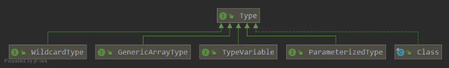
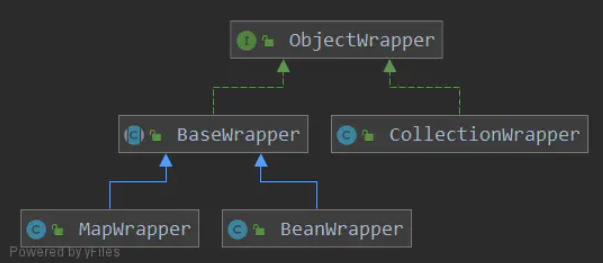
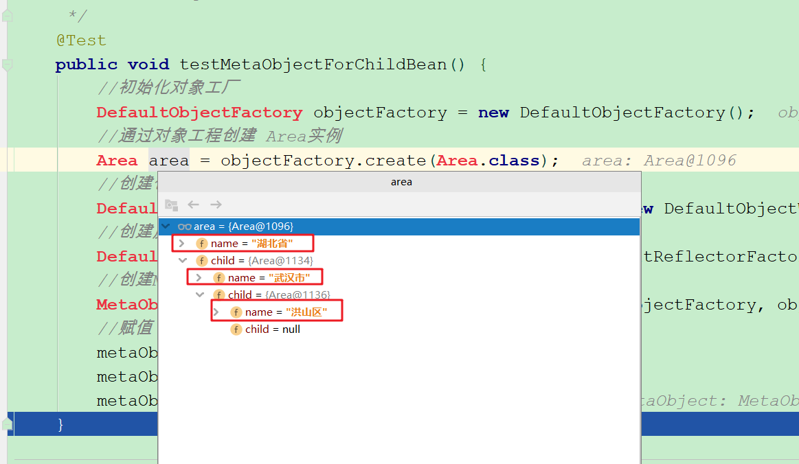

# MyBatis反射模块源码分析

> 说明：本文参考至<https://www.jianshu.com/p/baba62bbc107>

`MyBatis` 在进行参数处理、结果映射时等操作时，会涉及大量的反射操作。为了简化这些反射相关操作，`MyBatis` 在 `org.apache.ibatis.reflection` 包下提供了专门的反射模块，对反射操作做了近一步封装，提供了更为简洁的 `API`。

## 一. Reflector

`MyBatis` 提供 `Reflector` 类来**缓存**类的字段名和 getter/setter 方法的元信息，使得涉及反射的操作时不用再去获取这些元信息，使操作更加便捷。使用方式是将原始类对象传入其构造方法，生成 `Reflector` 对象。

```java
public class Reflector {

  private final Class<?> type;
  //可读的属性名称
  private final String[] readablePropertyNames;
  //可写的属性名称
  private final String[] writablePropertyNames;
  //set方法的属性
  private final Map<String, Invoker> setMethods = new HashMap<>();
  //get方法的属性
  private final Map<String, Invoker> getMethods = new HashMap<>();
  //setter类型的列表
  private final Map<String, Class<?>> setTypes = new HashMap<>();
  //getter类型的列表
  private final Map<String, Class<?>> getTypes = new HashMap<>();
  //默认的构造函数
  private Constructor<?> defaultConstructor;

  //不区分大小写的属性映射
  private Map<String, String> caseInsensitivePropertyMap = new HashMap<>();

  public Reflector(Class<?> clazz) {
    type = clazz;
    //加入无参构造器
    addDefaultConstructor(clazz);
    //加入getter方法
    addGetMethods(clazz);
    //加入setter方法
    addSetMethods(clazz);
    //加入字段
    addFields(clazz);
    readablePropertyNames = getMethods.keySet().toArray(new String[0]);
    writablePropertyNames = setMethods.keySet().toArray(new String[0]);
    for (String propName : readablePropertyNames) {
      caseInsensitivePropertyMap.put(propName.toUpperCase(Locale.ENGLISH), propName);
    }
    for (String propName : writablePropertyNames) {
      caseInsensitivePropertyMap.put(propName.toUpperCase(Locale.ENGLISH), propName);
    }
  }
  
   ...
}
```

`addGetMethods` 和 `addSetMethods` 分别获取类的所有方法，从符合 `getter/setter` 规范的方法中解析出字段名，并记录方法的参数类型、返回值类型等信息：

```java
/**
 * 注意博主这个版本是3.5.5-SNAPSHOT，采用的是Java8提供的流式操作，老版本的MyBatis源码和它不一样，但是功能上是一致的
 * @param clazz
 */
private void addGetMethods(Class<?> clazz) {
  Map<String, List<Method>> conflictingGetters = new HashMap<>();
  Method[] methods = getClassMethods(clazz);
  Arrays.stream(methods).filter(m -> m.getParameterTypes().length == 0 && PropertyNamer.isGetter(m.getName()))
    .forEach(m -> addMethodConflict(conflictingGetters, PropertyNamer.methodToProperty(m.getName()), m));
  resolveGetterConflicts(conflictingGetters);
}
```

对 `getter/setter` 方法进行去重是通过类似 `java.lang.String#getSignature:java.lang.reflect.Method` 的方法签名来实现的，如果子类在实现过程中，参数、返回值使用了不同的类型（使用原类型的子类），则会导致方法签名不一致，同一字段就会对应不同的 `getter/setter` 方法，因此需要进行去重。

```java
private void resolveGetterConflicts(Map<String, List<Method>> conflictingGetters) {
  for (Entry<String, List<Method>> entry : conflictingGetters.entrySet()) {
    Method winner = null;
    // 属性名
    String propName = entry.getKey();
    for (Method candidate : entry.getValue()) {
      if (winner == null) {
        winner = candidate;
        continue;
      }
      // 字段对应了多个get方法
      Class<?> winnerType = winner.getReturnType();
      Class<?> candidateType = candidate.getReturnType();
      if (candidateType.equals(winnerType)) {
        // 返回值类型相同
        if (!boolean.class.equals(candidateType)) {
          throw new ReflectionException(
              "Illegal overloaded getter method with ambiguous type for property "
                  + propName + " in class " + winner.getDeclaringClass()
                  + ". This breaks the JavaBeans specification and can cause unpredictable results.");
        } else if (candidate.getName().startsWith("is")) {
          // 返回值为boolean的get方法可能有多个，如getIsSave和isSave，优先取is开头的
          winner = candidate;
        }
      } else if (candidateType.isAssignableFrom(winnerType)) {
        // OK getter type is descendant
        // 可能会出现接口中的方法返回值是List，子类实现方法返回值是ArrayList，使用子类返回值方法
      } else if (winnerType.isAssignableFrom(candidateType)) {
        winner = candidate;
      } else {
        throw new ReflectionException(
            "Illegal overloaded getter method with ambiguous type for property "
                + propName + " in class " + winner.getDeclaringClass()
                + ". This breaks the JavaBeans specification and can cause unpredictable results.");
      }
    }
    // 记录字段名对应的get方法对象和返回值类型
    addGetMethod(propName, winner);
  }
}
```

去重的方式是使用更规范的方法以及使用子类的方法。在确认字段名对应的唯一 `getter/setter` 方法后，记录方法名对应的方法、参数、返回值等信息。`MethodInvoker` 可用于调用 `Method` 类的 `invoke` 方法来执行 `getter/setter` 方法（`addSetMethods` 记录映射关系的方式与 `addGetMethods` 大致相同）。

```java
private void addFields(Class<?> clazz) {
  Field[] fields = clazz.getDeclaredFields();
  for (Field field : fields) {
    if (!setMethods.containsKey(field.getName())) {
      // issue #379 - removed the check for final because JDK 1.5 allows
      // modification of final fields through reflection (JSR-133). (JGB)
      // pr #16 - final static can only be set by the classloader
      int modifiers = field.getModifiers();
      if (!(Modifier.isFinal(modifiers) && Modifier.isStatic(modifiers))) {
        // 非final的static变量，没有set方法，可以通过File对象做赋值操作
        addSetField(field);
      }
    }
    if (!getMethods.containsKey(field.getName())) {
      addGetField(field);
    }
  }
  if (clazz.getSuperclass() != null) {
    // 递归查找父类
    addFields(clazz.getSuperclass());
  }
}
```

## 二. Invoker

`Invoker` 接口用于抽象设置和读取字段值的操作。对于有 `getter/setter` 方法的字段，通过 `MethodInvoker` 反射执行；对应其它字段，通过 `GetFieldInvoker` 和 `SetFieldInvoker` 操作 `Field` 对象的 `getter/setter` 方法反射执行。

```java
/**
 * 用于抽象设置和读取字段值的操作
 *
 * {@link MethodInvoker} 反射执行getter/setter方法
 * {@link GetFieldInvoker} {@link SetFieldInvoker} 反射执行Field对象的get/set方法
 *
 * @author Clinton Begin
 */
public interface Invoker {

  /**
   * 通过反射设置或读取字段值
   *
   * @param target
   * @param args
   * @return
   * @throws IllegalAccessException
   * @throws InvocationTargetException
   */
  Object invoke(Object target, Object[] args) throws IllegalAccessException, InvocationTargetException;

  /**
   * 字段类型
   *
   * @return
   */
  Class<?> getType();
}
```

## 三. TypeParameterResolver

针对 `Java-Type` 体系的多种实现，`TypeParameterResolver` 提供一系列方法来解析指定类中的字段、方法返回值或方法参数的类型。

`Type` 接口包含 4 个子接口和 1 个实现类：



- `Class`：原始类型

- `ParameterizedType`：泛型类型，如：`List<String>` 

- `TypeVariable`：泛型类型变量，如: `List<T>` 中的 `T` 

- `GenericArrayType`：组成元素是 `ParameterizedType` 或 `TypeVariable` 的数组类型，如：`List<String>[]`、`T[]` 

- `WildcardType`：通配符泛型类型变量，如：`List<?>` 中的 `?`

`TypeParameterResolver` 分别提供 `resolveFieldType`、`resolveReturnType`、`resolveParamTypes` 方法用于解析字段类型、方法返回值类型和方法入参类型，这些方法均调用 `resolveType` 来获取类型信息：

```java
/**
 * 获取类型信息
 *
 * @param type 根据是否有泛型信息签名选择传入泛型类型或简单类型
 * @param srcType 引用字段/方法的类（可能是子类，字段和方法在父类声明）
 * @param declaringClass 字段/方法声明的类
 * @return
 */
private static Type resolveType(Type type, Type srcType, Class<?> declaringClass) {
  if (type instanceof TypeVariable) {
    // 泛型类型变量，如：List<T> 中的 T
    return resolveTypeVar((TypeVariable<?>) type, srcType, declaringClass);
  } else if (type instanceof ParameterizedType) {
    // 泛型类型，如：List<String>
    return resolveParameterizedType((ParameterizedType) type, srcType, declaringClass);
  } else if (type instanceof GenericArrayType) {
    // TypeVariable/ParameterizedType 数组类型
    return resolveGenericArrayType((GenericArrayType) type, srcType, declaringClass);
  } else {
    // 原始类型，直接返回
    return type;
  }
}
```

`resolveTypeVar` 用于解析泛型类型变量参数类型，如果字段或方法在当前类中声明，则返回泛型类型的上界或 `Object` 类型；如果在父类中声明，则递归解析父类；父类也无法解析，则递归解析实现的接口。

```java
private static Type resolveTypeVar(TypeVariable<?> typeVar, Type srcType, Class<?> declaringClass) {
  Type result;
  Class<?> clazz;
  if (srcType instanceof Class) {
    // 原始类型
    clazz = (Class<?>) srcType;
  } else if (srcType instanceof ParameterizedType) {
    // 泛型类型，如 TestObj<String>
    ParameterizedType parameterizedType = (ParameterizedType) srcType;
    // 取原始类型TestObj
    clazz = (Class<?>) parameterizedType.getRawType();
  } else {
    throw new IllegalArgumentException("The 2nd arg must be Class or ParameterizedType, but was: " + srcType.getClass());
  }

  if (clazz == declaringClass) {
    // 字段就是在当前引用类中声明的
    Type[] bounds = typeVar.getBounds();
    if (bounds.length > 0) {
      // 返回泛型类型变量上界，如：T extends String，则返回String
      return bounds[0];
    }
    // 没有上界返回Object
    return Object.class;
  }

  // 字段/方法在父类中声明，递归查找父类泛型
  Type superclass = clazz.getGenericSuperclass();
  result = scanSuperTypes(typeVar, srcType, declaringClass, clazz, superclass);
  if (result != null) {
    return result;
  }

  // 递归泛型接口
  Type[] superInterfaces = clazz.getGenericInterfaces();
  for (Type superInterface : superInterfaces) {
    result = scanSuperTypes(typeVar, srcType, declaringClass, clazz, superInterface);
    if (result != null) {
      return result;
    }
  }
  return Object.class;
}
```

通过调用 `scanSuperTypes` 实现递归解析：

```java
private static Type scanSuperTypes(TypeVariable<?> typeVar, Type srcType, Class<?> declaringClass, Class<?> clazz, Type superclass) {
  if (superclass instanceof ParameterizedType) {
    // 父类是泛型类型
    ParameterizedType parentAsType = (ParameterizedType) superclass;
    Class<?> parentAsClass = (Class<?>) parentAsType.getRawType();
    // 父类中的泛型类型变量集合
    TypeVariable<?>[] parentTypeVars = parentAsClass.getTypeParameters();
    if (srcType instanceof ParameterizedType) {
      // 子类可能对父类泛型变量做过替换，使用替换后的类型
      parentAsType = translateParentTypeVars((ParameterizedType) srcType, clazz, parentAsType);
    }
    if (declaringClass == parentAsClass) {
      // 字段/方法在当前父类中声明
      for (int i = 0; i < parentTypeVars.length; i++) {
        if (typeVar == parentTypeVars[i]) {
          // 使用变量对应位置的真正类型（可能已经被替换），如父类 A<T>，子类 B extends A<String>，则返回String
          return parentAsType.getActualTypeArguments()[i];
        }
      }
    }
    // 字段/方法声明的类是当前父类的父类，继续递归
    if (declaringClass.isAssignableFrom(parentAsClass)) {
      return resolveTypeVar(typeVar, parentAsType, declaringClass);
    }
  } else if (superclass instanceof Class && declaringClass.isAssignableFrom((Class<?>) superclass)) {
    // 父类是原始类型，继续递归父类
    return resolveTypeVar(typeVar, superclass, declaringClass);
  }
  return null;
}
```

解析方法返回值和方法参数的逻辑大致与解析字段类型相同，`MyBatis` 源码的`TypeParameterResolverTest` 类提供了相关的测试用例。

## 四. ReflectorFactory

`MyBatis` 还提供 `ReflectorFactory` 接口用于创建 `Reflector` 容器，其默认实现为 `DefaultReflectorFactory`，其中可以使用 `classCacheEnabled` 属性来配置是否使用缓存。

```java
public class DefaultReflectorFactory implements ReflectorFactory {

  /**
   * 是否缓存Reflector类信息
   */
  private boolean classCacheEnabled = true;

  /**
   * Reflector缓存容器
   */
  private final ConcurrentMap<Class<?>, Reflector> reflectorMap = new ConcurrentHashMap<>();

  public DefaultReflectorFactory() {
  }

  @Override
  public boolean isClassCacheEnabled() {
    return classCacheEnabled;
  }

  @Override
  public void setClassCacheEnabled(boolean classCacheEnabled) {
    this.classCacheEnabled = classCacheEnabled;
  }

  /**
   * 获取类的Reflector信息
   *
   * @param type
   * @return
   */
  @Override
  public Reflector findForClass(Class<?> type) {
    if (classCacheEnabled) {
      //如果开启了缓存机制，则尝试从缓存中拿，如果没有则创建一个
      return reflectorMap.computeIfAbsent(type, Reflector::new);
    } else {
      return new Reflector(type);
    }
  }

}
```

## 五. ObjectFactory

`ObjectFactory` 接口是 `MyBatis` 对象创建工厂，其默认实现 `DefaultObjectFactory` 通过构造器反射创建对象，支持使用无参构造器和有参构造器。

## 六. Property 工具集

`MyBatis` 在映射文件定义 `resultMap` 支持如下形式：

```java
<resultMap id="map" type="Order">
    <result property="orders[0].items[0].name" column="col1"/>
    <result property="orders[0].items[1].name" column="col2"/>
    ...
</resultMap>
```

`orders[0].items[0].name` 这样的表达式是由 `PropertyTokenizer` 解析的，其构造方法能够对表达式进行解析；同时还实现了 `Iterator` 接口，能够迭代解析表达式。

```java
public class PropertyTokenizer implements Iterator<PropertyTokenizer> {
  private String name;//名称
  private final String indexedName;//带索引的名称
  private String index;//索引
  private final String children;//子名称

  public PropertyTokenizer(String fullname) {
    //找出第一个“.”的索引
    int delim = fullname.indexOf('.');
    if (delim > -1) {
      //存在“.”
      name = fullname.substring(0, delim);
      children = fullname.substring(delim + 1);
    } else {
      //不存在“.”
      name = fullname;
      children = null;
    }
    indexedName = name;
    //第一个“[”的索引
    delim = name.indexOf('[');
    if (delim > -1) {
      index = name.substring(delim + 1, name.length() - 1);
      name = name.substring(0, delim);
    }
  }
  ...
}
```

`PropertyNamer` 可以根据 `getter/setter` 规范解析字段名称；`PropertyCopier` 则支持对有相同父类的对象，通过反射拷贝字段值。

## 七. MetaClass

`MetaClass` 类依赖 `PropertyTokenizer` 和 `Reflector` 查找表达式是否可以匹配 `Java` 对象中的字段，以及对应字段是否有 `getter/setter` 方法。


## 八. ObjectWrapper

`ObjectWrapper`是对象的包装器,提供最基本的get和set方法,不支持多级操作。`ObejctWrapper` 体系如下：



`ObjectWrapper` 的默认实现包括了对 `Map`、`Collection` 和普通 `JavaBean` 的包装。`MyBatis` 还支持通过 `ObjectWrapperFactory` 接口对 `ObejctWrapper` 进行扩展，生成自定义的包装类。

例如赋值操作，`BeanWrapper` 的实现如下：

```java
  @Override
  public Object get(PropertyTokenizer prop) {
    if (prop.getIndex() != null) {
      // 当前表达式是集合，如：items[0]，就需要获取items集合对象
      Object collection = resolveCollection(prop, object);
      return getCollectionValue(prop, collection);
    } else {
      return getBeanProperty(prop, object);
    }
  } 
  @Override
  public void set(PropertyTokenizer prop, Object value) {
    if (prop.getIndex() != null) {
      // 当前表达式是集合，如：items[0]，就需要获取items集合对象
      Object collection = resolveCollection(prop, object);
      // 在集合的指定索引上赋值
      setCollectionValue(prop, collection, value);
    } else {
      // 解析完成，通过Invoker接口做赋值操作
      setBeanProperty(prop, object, value);
    }
  }

  protected Object resolveCollection(PropertyTokenizer prop, Object object) {
    if ("".equals(prop.getName())) {
      return object;
    } else {
      // 在对象信息中查到此字段对应的集合对象
      return metaObject.getValue(prop.getName());
    }
  }
```


## 九. MetaObject

相对于 `MetaClass` 关注类信息，`MetalObject` 关注的是对象的信息，它在内部包装了MyBatis中五个核心的反射类。也是**提供给外部使用的反射工具类**，可以利用它可以读取或者修改对象的属性信息：

```java
public class MetaObject {

  //原始对象
  private final Object originalObject;
  //对象的包装类对象
  private final ObjectWrapper objectWrapper;
  //对象的工厂
  private final ObjectFactory objectFactory;
  //对象包装器的工厂
  private final ObjectWrapperFactory objectWrapperFactory;
  //反射器工厂
  private final ReflectorFactory reflectorFactory;
```

`MetaObject` 对对象的具体操作，就委托给真正的 `ObjectWrapper` 处理。

```java
private MetaObject(Object object, ObjectFactory objectFactory, ObjectWrapperFactory objectWrapperFactory, ReflectorFactory reflectorFactory) {
  this.originalObject = object;
  this.objectFactory = objectFactory;
  this.objectWrapperFactory = objectWrapperFactory;
  this.reflectorFactory = reflectorFactory;

  if (object instanceof ObjectWrapper) {
    //如果对象本身已经是ObjectWrapper型，则直接赋给objectWrapper
    this.objectWrapper = (ObjectWrapper) object;
  } else if (objectWrapperFactory.hasWrapperFor(object)) {
    //如果有包装器,调用ObjectWrapperFactory.getWrapperFor
    this.objectWrapper = objectWrapperFactory.getWrapperFor(this, object);
  } else if (object instanceof Map) {
    //如果是Map型，返回MapWrapper
    this.objectWrapper = new MapWrapper(this, (Map) object);
  } else if (object instanceof Collection) {
    //如果是Collection型，返回CollectionWrapper
    this.objectWrapper = new CollectionWrapper(this, (Collection) object);
  } else {
    //除此以外，返回BeanWrapper
    this.objectWrapper = new BeanWrapper(this, object);
  }
}
```

例如赋值操作：

```java
/**
   * 设置具体值，支持多级操作
   * @param name 属性名称，类似于OGNL表达式，如果是多级结构，直接person[0].birthdate.year即可
   * @param value
   */
  public void setValue(String name, Object value) {
    //将name解析为PropertyTokenizer，方便进行对象的赋值
    PropertyTokenizer prop = new PropertyTokenizer(name);
    if (prop.hasNext()) {
      MetaObject metaValue = metaObjectForProperty(prop.getIndexedName());
      if (metaValue == SystemMetaObject.NULL_META_OBJECT) {
        //如果获取出来的设置空的MetaObject
        if (value == null) {
          // 如果值为空，则不会实例化子路径
          return;
        } else {
          //如果value不为空，则委派给ObjectWrapper.instantiatePropertyValue创建子级对象并获取子级对象的MetaObject
          metaValue = objectWrapper.instantiatePropertyValue(name, prop, objectFactory);
        }
      }
      //继续给子节点赋值（伪递归）
      metaValue.setValue(prop.getChildren(), value);
    } else {
      //到了最后一层了，最终还是委派给ObjectWrapper.set
      objectWrapper.set(prop, value);
    }
  }
```

## 十. 测试

由于MetaObject是MyBatis反射模块对外提供的反射工具类，所以我们对其进行测试：

```java
public class Area {
    private String name;
    private Area child;
}
```

```java
/**
 *  使用MetaObject工具进行多级赋值测试
 */
@Test
public void testMetaObjectForChildBean() {
    //初始化对象工厂
    DefaultObjectFactory objectFactory = new DefaultObjectFactory();
    //通过对象工程创建 Area实例
    Area area = objectFactory.create(Area.class);
    //创建包装类工厂
    DefaultObjectWrapperFactory objectWrapperFactory = new DefaultObjectWrapperFactory();
    //创建反射器工厂
    DefaultReflectorFactory reflectorFactory = new DefaultReflectorFactory();
    //创建MetaObject
    MetaObject metaObject = MetaObject.forObject(area, objectFactory, objectWrapperFactory, reflectorFactory);
    //赋值
    metaObject.setValue("name","湖北省");
    metaObject.setValue("child.name","武汉市");
    metaObject.setValue("child.child.name","洪山区");
}
```



 

**其他反射模块代码注释请移步至**：[GitHub](https://github.com/tianjindong/mybatis-source-annotation)或[Gitee](https://gitee.com/tianjindong/mybatis-source-annotation)

