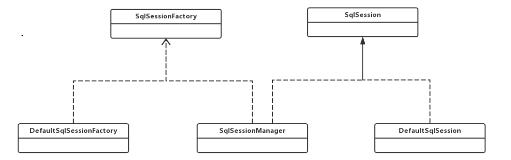
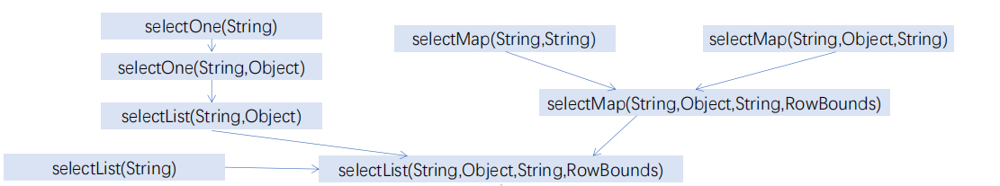
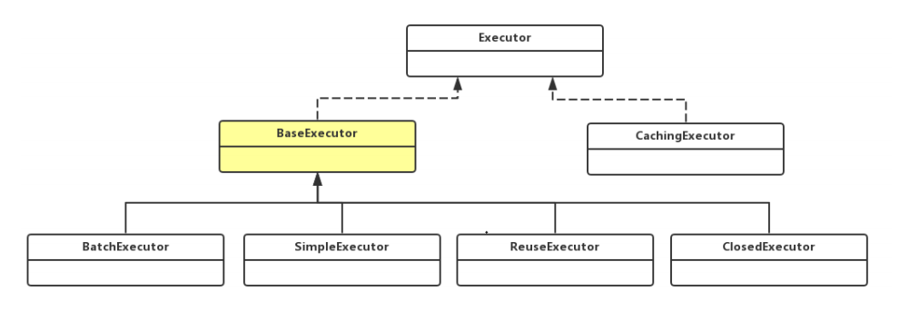
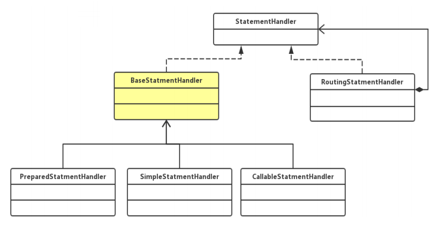
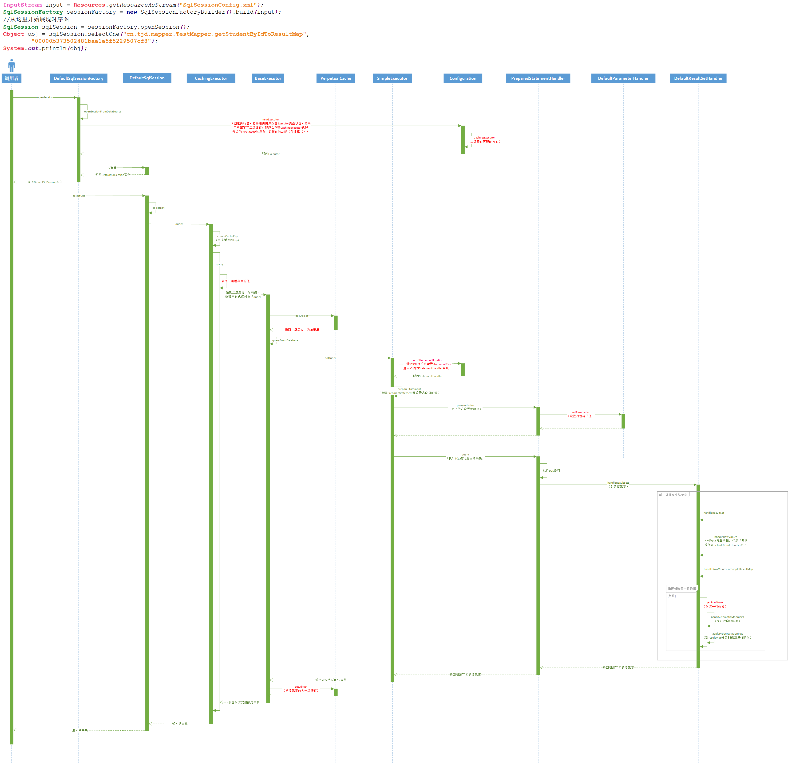

# 源码分析——MyBatis核心接口SqlSession实现原理

在上一篇文章中（[《MyBatis动态代理调用过程源码分析》](./_20MyBatis动态代理调用过程源码分析.md)），我们知道了MyBatis动态代理的核心是`MapperProxy`，在它内部封装了动态代理的调用逻辑，而我们也知道了在使用动态代理进行操作的时候实际上还是调用的`SqlSession`中的API去实现的，那么我们今天就来分析一波`SqlSession`的源码，由于`SqlSession`中方法很多，我们就已查询方法为例进行分析。

## 一. 核心接口SqlSession



- `SqlSession`是MyBatis对外提供的核心接口，通过它可以执行数据库读写命令、获取映射器、管理事务等；
- `DefaultSqlSession`是``SqlSession``接口的实现类，它是真正执行数据库操作的门面类，它内部封装着复杂的数据库操作逻辑；
- `SqlSessionFactory`是`SqlSession`的工厂类，负责创建`DefaultSqlSession`实例（详见`DefaultSqlSessionFactory::openSession`方法）;

- `SqlSessionManager`是对`SqlSession`的一种加强，当用户调用CRUD方法时，会查询`ThreadLocal`中 当前线程是否已经创建`SqlSession`，如果没有创建则调用`SqlSessionFactory`创建`SqlSession`调用 对应的方法，如果当前线程已经创建过`SqlSession`，则使用缓存的`SqlSession`


## 二. 天下归一selectList

`SqlSession`内部有着丰富的查询接口，他们看似实现着不同的功能，但实际上最终执行的都是`DefaultSqlSession::selectList(String, Object, RowBounds)`方法：



我们就以`selectOne`为例子：

```java
@Override
public <T> T selectOne(String statement) {
  return this.selectOne(statement, null);
}

@Override
public <T> T selectOne(String statement, Object parameter) {
  // Popular vote was to return null on 0 results and throw exception on too many.
  List<T> list = this.selectList(statement, parameter);
  if (list.size() == 1) {
    return list.get(0);
  } else if (list.size() > 1) {
    throw new TooManyResultsException("Expected one result (or null) to be returned by selectOne(), but found: " + list.size());
  } else {
    return null;
  }
}
```

可以看到`selectOne`实际上还是调用的`selectList`获取的结果集，然后取出结果集中的第一个返回。


## 三. 项目经理Executor

进入`DefaultSqlSession::selectList(String, Object, RowBounds)`方法我们能够发现，它调用的是`Executor::query`方法：

```java
public <E> List<E> selectList(String statement, Object parameter, RowBounds rowBounds) {
  try {
    //获取Configuration中保存的statementId对应的Sql节点信息
    MappedStatement ms = configuration.getMappedStatement(statement);
    return executor.query(ms, wrapCollection(parameter), rowBounds, Executor.NO_RESULT_HANDLER);
  } catch (Exception e) {
    throw ExceptionFactory.wrapException("Error querying database.  Cause: " + e, e);
  } finally {
    ErrorContext.instance().reset();
  }
}
```

可以看到SqlSession中所有方法最终都交由了Executor去执行了，而Executor就像一个项目经理。老板（SqlSession）只需要将任务交给项目经理（Executor），任务执行的具体过程老板并不关心，它只关心经理对任务的完成情况。

Executor继承体系结构：



### 3.1 一级缓存管理

我们先看`BaseExecutor`分支，它使用了典型的模板方法模式，在`BaseExecutor::query`中实现了基本的算法骨架，而真正执行查询的方法`doQuery`交由子类实现：

```java
@Override
public <E> List<E> query(MappedStatement ms, Object parameter, RowBounds rowBounds, ResultHandler resultHandler) throws SQLException {
  //获取SQL信息
  BoundSql boundSql = ms.getBoundSql(parameter);
  //根据statementId、SQL语句、参数、分页信息等生产缓存的Key
  CacheKey key = createCacheKey(ms, parameter, rowBounds, boundSql);
  //执行重载query方法
  return query(ms, parameter, rowBounds, resultHandler, key, boundSql);
}

@SuppressWarnings("unchecked")
@Override
public <E> List<E> query(MappedStatement ms, Object parameter, RowBounds rowBounds, ResultHandler resultHandler, CacheKey key, BoundSql boundSql) throws SQLException {
  ErrorContext.instance().resource(ms.getResource()).activity("executing a query").object(ms.getId());
  if (closed) {
    throw new ExecutorException("Executor was closed.");
  }
  //没有嵌套查询且flushCache=tre则清空缓存
  if (queryStack == 0 && ms.isFlushCacheRequired()) {
    clearLocalCache();
  }
  List<E> list;
  try {
    //查询层次加一
    queryStack++;
    //查询一级缓存
    list = resultHandler == null ? (List<E>) localCache.getObject(key) : null;
    if (list != null) {
      //缓存命中，处理一级缓存中的输出参数（存储过程）
      handleLocallyCachedOutputParameters(ms, key, parameter, boundSql);
    } else {
      //缓存未命中，从数据库加载数据，并将结果放入以及缓存
      list = queryFromDatabase(ms, parameter, rowBounds, resultHandler, key, boundSql);
    }
  } finally {
    queryStack--;
  }
  if (queryStack == 0) {
    for (DeferredLoad deferredLoad : deferredLoads) {
      //延迟加载处理
      deferredLoad.load();
    }
    // issue #601
    deferredLoads.clear();
    if (configuration.getLocalCacheScope() == LocalCacheScope.STATEMENT) {
      //如果当前SQL的一级缓存配置为STATEMENT，查询完既清空缓存
      // issue #482
      clearLocalCache();
    }
  }
  return list;
}
```

可以看到在`BaseExecutor::query`中实现了一级缓存的基本逻辑。当一级缓存没有命中时会调用虚方法`abstract doQuery`，此时这个方法就等着子类去实现了。而在当前的MyBatis版本中（3.5.5）`BaseExecutor`拥有如下子类：

- `BatchExecutor`：执行批处理操作时使用

- `SimpleExecutor`：默认配置，使用`Statement`执行SQL语句，每一次执行都会创建一个新的`Statement`。（至于使用`PreparedStatement`还是`Statement`执行SQL语句，这取决于SQL标签中配置的`statementType`属性，默认使用`PreparedStatement`。下同）

- `ReuseExecutor`：使用`Statement`执行SQL语句，会重用缓存中的Statement对象。

  - ```java
    public <E> List<E> doQuery(MappedStatement ms, Object parameter, RowBounds rowBounds, ResultHandler resultHandler, BoundSql boundSql) throws SQLException {
      Configuration configuration = ms.getConfiguration();
      StatementHandler handler = configuration.newStatementHandler(wrapper, ms, parameter, rowBounds, resultHandler, boundSql);
      //获取Statment，与SimpleExecutor中不同的是，ReuseExecutor在这里会先去缓存中寻找Statement，如果没有再创建
      Statement stmt = prepareStatement(handler, ms.getStatementLog());
      return handler.query(stmt, resultHandler);
    }
    ```

- `ClosedExecutor`：关闭后的执行器，内部的所有方法都是未实现的

  - ```java
    protected <E> List<E> doQuery(MappedStatement ms, Object parameter, RowBounds rowBounds, ResultHandler resultHandler, BoundSql boundSql) throws SQLException {
      throw new UnsupportedOperationException("Not supported.");
    }
    ```

### 3.2 二级缓存管理

可以看到在`BaseExecutor`主要实现了一级缓存的功能，它只有在一级缓存未命中的情况下才会去真正执行数据库查询。但是熟悉MyBatis的小伙伴应该知道，MyBatis还提供了二级缓存的实现，此时我们就需要将目光转向`CachingExecutor`分支了。

`CachingExcutor`实际上是一个装饰器，它封装了二级缓存的实现逻辑

```java
/**
 * Executor的二级缓存装饰器，它是实现MyBatis二级缓存的关键
 * @author Clinton Begin
 * @author Eduardo Macarron
 */
public class CachingExecutor implements Executor {

  private final Executor delegate;
  private final TransactionalCacheManager tcm = new TransactionalCacheManager();

  public CachingExecutor(Executor delegate) {
    this.delegate = delegate;
    delegate.setExecutorWrapper(this);
  }

  //........
                                        
  @Override
  public <E> List<E> query(MappedStatement ms, Object parameterObject, RowBounds rowBounds, ResultHandler resultHandler, CacheKey key, BoundSql boundSql)
      throws SQLException {
    //获取二级缓存
    Cache cache = ms.getCache();
    if (cache != null) {
      flushCacheIfRequired(ms);
      if (ms.isUseCache() && resultHandler == null) {
        ensureNoOutParams(ms, boundSql);
        //从二级缓存中获取数据
        @SuppressWarnings("unchecked")
        List<E> list = (List<E>) tcm.getObject(cache, key);
        if (list == null) {
          //二级缓存为空，才调用被装饰的Executor的query获取数据，由于CachingExecutor大多数时候是用来装饰SimpleExecutor对象，所以CachingExecutor
          // 中的二级缓存逻辑会先执行，如果二级缓存中没有数据，才会执行SimpleExecutor中一级缓存的逻辑
          list = delegate.query(ms, parameterObject, rowBounds, resultHandler, key, boundSql);
          tcm.putObject(cache, key, list); // issue #578 and #116
        }
        return list;
      }
    }
    return delegate.query(ms, parameterObject, rowBounds, resultHandler, key, boundSql);
  }
//......

}

```

可以看到只要被`CachingExecutor`装饰过的Executor，都具备了二级缓存的功能。

走到这里，可能有很多小伙伴对二级缓存的实现原理仍然不太清楚，那这个故事还得从`Executor`的创建说起，我们先定位到Executor创建的地方`DefaultSqlSessionFactory::openSession`：

```java
public SqlSession openSession() {
  //从数据源中获取连接，然后创建SqlSessionFactory
  return openSessionFromDataSource(configuration.getDefaultExecutorType(), null, false);
}
```

`openSession`方法直接调用了`openSessionFromDataSource`方法：

```java
private SqlSession openSessionFromDataSource(ExecutorType execType, TransactionIsolationLevel level, boolean autoCommit) {
  Transaction tx = null;
  try {
    //获取mybatis-config.xml中的enviroment对象
    final Environment environment = configuration.getEnvironment();
    //从Enviroment获取TranslationFactory
    final TransactionFactory transactionFactory = getTransactionFactoryFromEnvironment(environment);
    //从数据源中获取数据库连接，然后创建Transaction对象
    tx = transactionFactory.newTransaction(environment.getDataSource(), level, autoCommit);
    //重点：根据配置创建Executor，该方法内部会根据用户是否配置二级缓存去决定是否创建二级缓存的装饰器去装饰Executor，这也是二级缓存是否生效的关键
    final Executor executor = configuration.newExecutor(tx, execType);
    //创建DefaultSqlSession
    return new DefaultSqlSession(configuration, executor, autoCommit);
  } catch (Exception e) {
    closeTransaction(tx); // may have fetched a connection so lets call close()
    throw ExceptionFactory.wrapException("Error opening session.  Cause: " + e, e);
  } finally {
    ErrorContext.instance().reset();
  }
}
```

可以看到在`openSessionFromDataSource`方法中调用了`Configuration::newExecutor`方法，它就是`Executor`的核心逻辑。

```java
public Executor newExecutor(Transaction transaction, ExecutorType executorType) {
  executorType = executorType == null ? defaultExecutorType : executorType;
  executorType = executorType == null ? ExecutorType.SIMPLE : executorType;
  Executor executor;
  if (ExecutorType.BATCH == executorType) {
    //创建Batch类型的Executor
    executor = new BatchExecutor(this, transaction);
  } else if (ExecutorType.REUSE == executorType) {
    //创建Reuse类型的Executor
    executor = new ReuseExecutor(this, transaction);
  } else {
    //创建simple类型的Executor
    executor = new SimpleExecutor(this, transaction);
  }
  if (cacheEnabled) {
    //如果配置了二级缓存，则用CachingExecutor装饰前面创建的Executor，从而实现二级缓存
    executor = new CachingExecutor(executor);
  }
  executor = (Executor) interceptorChain.pluginAll(executor);
  return executor;
}
```

当用户配置二级缓存后，就会创建`CachingExecutor`装饰器去包装`SimpleExecutor`，**这也是MyBatis二级缓存始终会优先于一级缓存的原因**。

### 3.3 项目经理不干活

前面说了这么多，咱还是小小的总结一下吧。`SqlSession`的所有查询方法最后都会交给`selectList`来执行，而`selectList`将任务下发给了项目经理（`Executor`）去执行，项目经理会先去查二级缓存有没有已经缓存的结果，如果没有则会去查一级缓存，如果还是没有命中则会去执行`doQuery`方法操作数据库。

好的，那我们把视角转回到`SimpleExecutor:doQuery`方法中：

```java
@Override
public <E> List<E> doQuery(MappedStatement ms, Object parameter, RowBounds rowBounds, ResultHandler resultHandler, BoundSql boundSql) throws SQLException {
  Statement stmt = null;
  try {
    Configuration configuration = ms.getConfiguration();
    //根据SQL标签中配置statementType来创建不同的StatementHandler实现
    StatementHandler handler = configuration.newStatementHandler(wrapper, ms, parameter, rowBounds, resultHandler, boundSql);
    //创建Statement，并使用parameterHandler对占位符进行赋值
    stmt = prepareStatement(handler, ms.getStatementLog());
    //通过statementHandler对象调用ResultSetHandler将结果集转化为指定对象返回
    return handler.query(stmt, resultHandler);
  } finally {
    closeStatement(stmt);
  }
}
```

`doQuery`方法实际上也没有真正执行数据库操作，而是将这个艰巨任务交给了`StatementHandler`去执行了，而这样看上去确实符合项目经理的调性，自己负责分配任务，苦逼程序员负责完成需求，哈哈。

跳回到计算机的世界，这种设计思想也完美符合设计模式中的单一职责原则，`Executor`只负责一二级缓存的实现，而数据库的操作交由`*Handler`实现。

## 四. 苦逼程序员

领导将任务下发后，就需要底下的项目组成员去完成了。而在MyBatis中一次操作任务会下发给三个“程序员”，它们分别负责不同的任务：

- **ParameterHandler**：对预编译的SQL语句进行参数设置，`DefualtParameterHandler`是其实现类
- **StatementHandler**： 执行SQL语句，获取JDBC返回的`ResultSet`，
- **ResultSetHandler**：对数据库返回的结果集进行封装，`DefaultResultSetHandler`是其实现类

### 4.1 ParameterHandler

在3.3节中，我们分析了`SimpleExecutor:doQuery`方法，其内部调用了`SimpleExecutor::prepareStatement`方法用于获取`PreparedStatement`实例并设置占位符的参数值：

```java
private Statement prepareStatement(StatementHandler handler, Log statementLog) throws SQLException {
  Statement stmt;
  //试图创建带有日志功能的Connection，也就是ConnectionLogger
  Connection connection = getConnection(statementLog);
  //试图创建带有日志功能PreparedStatement，也就是PreparedStatementLogger
  stmt = handler.prepare(connection, transaction.getTimeout());
  //设置参数值
  handler.parameterize(stmt);
  return stmt;
}
```

可以看到`SimpleExecutor::prepareStatement`方法调用了`Statement:parameterize`方法，我们进入`PreparedStatementHandler`一探究竟：

```java
public void parameterize(Statement statement) throws SQLException {
  //设置参数值
  parameterHandler.setParameters((PreparedStatement) statement);
}
```

可以看到，设置参数值的操作最终是交给了`ParameterHandler`去实现：

```java
/**
 * 对预编译的SQL语句进行参数设置
 * @author Clinton Begin
 * @author Eduardo Macarron
 */
public class DefaultParameterHandler implements ParameterHandler {

  //TypeHandler注册中心
  private final TypeHandlerRegistry typeHandlerRegistry;

  //对应的SQL节点信息
  private final MappedStatement mappedStatement;
  //用户传入的参数
  private final Object parameterObject;
  //SQL语句信息
  private final BoundSql boundSql;
  private final Configuration configuration;

 //...

  @Override
  public void setParameters(PreparedStatement ps) {
    ErrorContext.instance().activity("setting parameters").object(mappedStatement.getParameterMap().getId());
    //从boundSql中获取sql语句的占位符对应的参数信息
    List<ParameterMapping> parameterMappings = boundSql.getParameterMappings();
    if (parameterMappings != null) {
      for (int i = 0; i < parameterMappings.size(); i++) {
        ParameterMapping parameterMapping = parameterMappings.get(i);
        if (parameterMapping.getMode() != ParameterMode.OUT) {//当参数为存储过程输出参数则不处理
          //绑定的实参
          Object value;
          //参数的名称
          String propertyName = parameterMapping.getProperty();
          if (boundSql.hasAdditionalParameter(propertyName)) { // issue #448 ask first for additional params
            //如果SQL中的参数列表中包含这个参数，则获取值
            value = boundSql.getAdditionalParameter(propertyName);
          } else if (parameterObject == null) {
            value = null;
          } else if (typeHandlerRegistry.hasTypeHandler(parameterObject.getClass())) {
            value = parameterObject;
          } else {
            MetaObject metaObject = configuration.newMetaObject(parameterObject);
            value = metaObject.getValue(propertyName);
          }
          //获取TypeHandler
          TypeHandler typeHandler = parameterMapping.getTypeHandler();
          //获取参数对应的jdbcType
          JdbcType jdbcType = parameterMapping.getJdbcType();
          if (value == null && jdbcType == null) {
            jdbcType = configuration.getJdbcTypeForNull();
          }
          try {
            //由typeHandler设置参数值
            typeHandler.setParameter(ps, i + 1, value, jdbcType);
          } catch (TypeException | SQLException e) {
            throw new TypeException("Could not set parameters for mapping: " + parameterMapping + ". Cause: " + e, e);
          }
        }
      }
    }
  }

}
```

### 4.2 StatementHandler

MyBatis进行数据库操作的核心是由`StatementHandler`完成的，而`StatementHandler`只是一个接口，它拥有如下几个实现类：

- **BaseStatementHandler**：所有子类的父类，模板方法模式，内部定义了数据库操作的操作步骤，核心功能交由子类实现。
- **SimpleStatmentHandler** ：使用Statement对象访问数据库，无须参数化；

- **PreparedStatmentHandler**：使用预编译PrepareStatement对象访问数据库；
- **CallableStatmentHandler** ：调用存储过程；



我们再次回到`SimpleExecutor:doQuery`方法中:

```java
@Override
public <E> List<E> doQuery(MappedStatement ms, Object parameter, RowBounds rowBounds, ResultHandler resultHandler, BoundSql boundSql) throws SQLException {
  Statement stmt = null;
  try {
    Configuration configuration = ms.getConfiguration();
    //根据SQL标签中配置statementType来创建不同的StatementHandler实现
    StatementHandler handler = configuration.newStatementHandler(wrapper, ms, parameter, rowBounds, resultHandler, boundSql);
    //创建Statement，并使用parameterHandler对占位符进行赋值
    stmt = prepareStatement(handler, ms.getStatementLog());
    //通过statementHandler对象调用ResultSetHandler将结果集转化为指定对象返回
    return handler.query(stmt, resultHandler);
  } finally {
    closeStatement(stmt);
  }
}
```

`doQuery`最后调用的是`StamentHandler::query`方法，我们进入其实现类中（`PreparedStatementHandler::query`）可以看到最终还是调用的JDBC中`PreparedStatement::execute`方法：

```java
public <E> List<E> query(Statement statement, ResultHandler resultHandler) throws SQLException {
  PreparedStatement ps = (PreparedStatement) statement;
  //执行SQL语句
  ps.execute();
  //封装结果集并返回对象
  return resultSetHandler.handleResultSets(ps);
}
```

### 4.3 ResultSetHandler

`ResultSetHandler`的唯一实现类`DefaultResultSetHandler`用于对返回结果集进行包装。

`DefaultResultSetHandler::handleResultSets`源码：

```java
 public List<Object> handleResultSets(Statement stmt) throws SQLException {
    ErrorContext.instance().activity("handling results").object(mappedStatement.getId());

    //用于保存结果集对象
    final List<Object> multipleResults = new ArrayList<>();

    int resultSetCount = 0;
    //statement可能返回多个结果集对象，这里先取出第一个结果集
    ResultSetWrapper rsw = getFirstResultSet(stmt);

    //获取映射规则，对应映射配置文件中resultMap标签。有时候sql标签的resultMap属性会指定多个结果集。
    List<ResultMap> resultMaps = mappedStatement.getResultMaps();
    int resultMapCount = resultMaps.size();
    //结果集和resultMap不能为空，为空抛出异常
    validateResultMapsCount(rsw, resultMapCount);
    while (rsw != null && resultMapCount > resultSetCount) {
      //循环处理多个结果集
      //获取当前结果集对应的resultMap
      ResultMap resultMap = resultMaps.get(resultSetCount);
      //根据映射规则对结果进行转化，转换成目标对象以后放入multipleResults
      handleResultSet(rsw, resultMap, multipleResults, null);
      //获取下一个结果集
      rsw = getNextResultSet(stmt);
      //清空nestedResultObjects对象
      cleanUpAfterHandlingResultSet();
      resultSetCount++;
    }

    String[] resultSets = mappedStatement.getResultSets();
    if (resultSets != null) {
      while (rsw != null && resultSetCount < resultSets.length) {
        ResultMapping parentMapping = nextResultMaps.get(resultSets[resultSetCount]);
        if (parentMapping != null) {
          String nestedResultMapId = parentMapping.getNestedResultMapId();
          ResultMap resultMap = configuration.getResultMap(nestedResultMapId);
          handleResultSet(rsw, resultMap, null, parentMapping);
        }
        rsw = getNextResultSet(stmt);
        cleanUpAfterHandlingResultSet();
        resultSetCount++;
      }
    }

    return collapseSingleResultList(multipleResults);
  }
```

封装单个结果集：

```java
 /**
   * 封装单个结果集数据，将结果保存至multipleResults中
   * @param rsw
   * @param resultMap
   * @param multipleResults
   * @param parentMapping
   * @throws SQLException
   */
  private void handleResultSet(ResultSetWrapper rsw, ResultMap resultMap, List<Object> multipleResults, ResultMapping parentMapping) throws SQLException {
    try {
      if (parentMapping != null) {
        //处理嵌套映射
        handleRowValues(rsw, resultMap, null, RowBounds.DEFAULT, parentMapping);
      } else {
        if (resultHandler == null) {
          //如果resultHandler为空则，实例化一个默认的resultHandler
          DefaultResultHandler defaultResultHandler = new DefaultResultHandler(objectFactory);
          //封装结果集数据，然后将数据暂存在defaultResultHandler中
          handleRowValues(rsw, resultMap, defaultResultHandler, rowBounds, null);
          //将暂存在defaultResultHandler中的数据放入multipleResults中
          multipleResults.add(defaultResultHandler.getResultList());
        } else {
          handleRowValues(rsw, resultMap, resultHandler, rowBounds, null);
        }
      }
    } finally {
      // issue #228 (close resultsets)
      closeResultSet(rsw.getResultSet());
    }
  }
```

```java
public void handleRowValues(ResultSetWrapper rsw, ResultMap resultMap, ResultHandler<?> resultHandler, RowBounds rowBounds, ResultMapping parentMapping) throws SQLException {
    if (resultMap.hasNestedResultMaps()) {
      //处理嵌套结果集的情况
      ensureNoRowBounds();
      checkResultHandler();
      handleRowValuesForNestedResultMap(rsw, resultMap, resultHandler, rowBounds, parentMapping);
    } else {
      //处理没有嵌套结果集的情况
      handleRowValuesForSimpleResultMap(rsw, resultMap, resultHandler, rowBounds, parentMapping);
    }
  }
```

```java
/**
   * 根据一个简单ResultMap规则，封装结果集数据，然后将数据暂存至resultHandler
   * @param rsw
   * @param resultMap
   * @param resultHandler 封装结果的暂存区
   * @param rowBounds
   * @param parentMapping
   * @throws SQLException
   */
  private void handleRowValuesForSimpleResultMap(ResultSetWrapper rsw, ResultMap resultMap, ResultHandler<?> resultHandler, RowBounds rowBounds, ResultMapping parentMapping)
      throws SQLException {
    //创建结果上下文，所谓的上下文就是专门在循环中缓存结果对象的
    DefaultResultContext<Object> resultContext = new DefaultResultContext<>();
    ResultSet resultSet = rsw.getResultSet();
    //根据分页信息，定位到指定记录
    skipRows(resultSet, rowBounds);
    //循环处理每一行数据
    while (shouldProcessMoreRows(resultContext, rowBounds) && !resultSet.isClosed() && resultSet.next()) {
      //进一步完善resultMap信息，主要处理鉴别器信息
      ResultMap discriminatedResultMap = resolveDiscriminatedResultMap(resultSet, resultMap, null);
      //重点解读：读取ResultSet中的一行数据进行映射，转化并返回目标对象
      Object rowValue = getRowValue(rsw, discriminatedResultMap, null);
      //保存映射结果对象
      storeObject(resultHandler, resultContext, rowValue, parentMapping, resultSet);
    }
  }
```

封装单行数据：

```java
/**
   * 读取一行数据，并封装成指定类型对象中，实例封装的核心
   * @param rsw
   * @param resultMap
   * @param columnPrefix
   * @return
   * @throws SQLException
   */
  private Object getRowValue(ResultSetWrapper rsw, ResultMap resultMap, String columnPrefix) throws SQLException {
    final ResultLoaderMap lazyLoader = new ResultLoaderMap();
    //创建封装对象，空的
    Object rowValue = createResultObject(rsw, resultMap, lazyLoader, columnPrefix);
    if (rowValue != null && !hasTypeHandlerForResultObject(rsw, resultMap.getType())) {
      //结果集不为空，且存在结果对象的类型处理程序
      //封装MetaObject对象，方便赋值
      final MetaObject metaObject = configuration.newMetaObject(rowValue);
      boolean foundValues = this.useConstructorMappings;
      if (shouldApplyAutomaticMappings(resultMap, false)) {
        //进行自动映射。一般情况下autoMappingBehavior的默认值为PARTIAL，对未明确指定映射规则的字段进行自动映射
        //是否自动映射由resultMap标签中的autoMapping属性决定，默认值为true
        foundValues = applyAutomaticMappings(rsw, resultMap, metaObject, columnPrefix) || foundValues;
      }
      //进行属性映射
      foundValues = applyPropertyMappings(rsw, resultMap, metaObject, lazyLoader, columnPrefix) || foundValues;
      //如果发现数据或者懒加载机制中还有没有加载出来的数据
      foundValues = lazyLoader.size() > 0 || foundValues;
      //如果没有数据且不允许空行返回实例，则将rowValue置为空
      rowValue = foundValues || configuration.isReturnInstanceForEmptyRow() ? rowValue : null;
    }
    return rowValue;
  }

```

## 五. 时序图



由于图片版幅较大，网页显示字体会看不清，这里给出下载链接：[MyBatis核心调用流程时序图-GitHub](https://github.com/tianjindong/StudyNotes/tree/master/%E5%9F%BA%E7%A1%80%E7%AC%94%E8%AE%B0/JavaWeb/MyBatis/subfile/MyBatis%E6%BA%90%E7%A0%81%E6%97%B6%E5%BA%8F%E5%9B%BE)；[MyBatis核心调用流程时序图-Gitee](https://gitee.com/tianjindong/StudyNotes/tree/master/%E5%9F%BA%E7%A1%80%E7%AC%94%E8%AE%B0/JavaWeb/MyBatis/subfile/MyBatis%E6%BA%90%E7%A0%81%E6%97%B6%E5%BA%8F%E5%9B%BE)


## 六. 总结

`SqlSession`作为MyBatis框架的核心接口隐藏了底层`Executor`接口以及`xxxHandler`接口复杂的实现逻辑。用户对`SqlSession`的操作实际上都交由`Executor`去执行，在`Executor`处理完一二级缓存逻辑后，就将数据库操作以及结果集封装的工作全部交由`ParameterHandler`、`StatementHandler`、`ResultSetHandler`去完成。

本文只是展现了SqlSession查询数据库框架的基本实现流程，更加细节的信息需要小伙伴们自己去挖掘。博主自己对MyBatis源码进行了详细注释，如有需要，请移步至：[GitHub](https://github.com/tianjindong/mybatis-source-annotation)或[Gitee](https://gitee.com/tianjindong/mybatis-source-annotation)

**本文阐述了自己对MyBatis源码的一些理解，如有不足，欢迎大佬指点，感谢感谢！！**