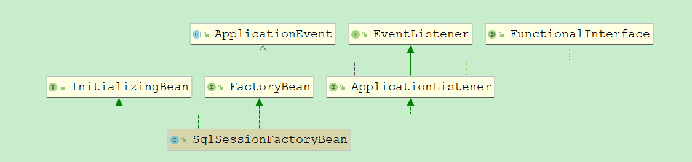
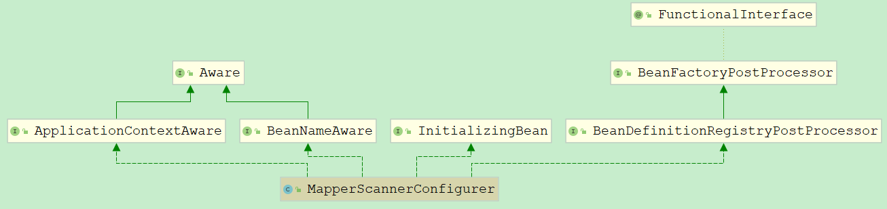
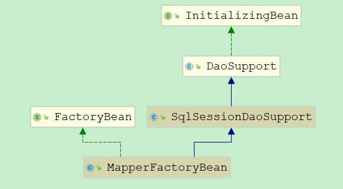
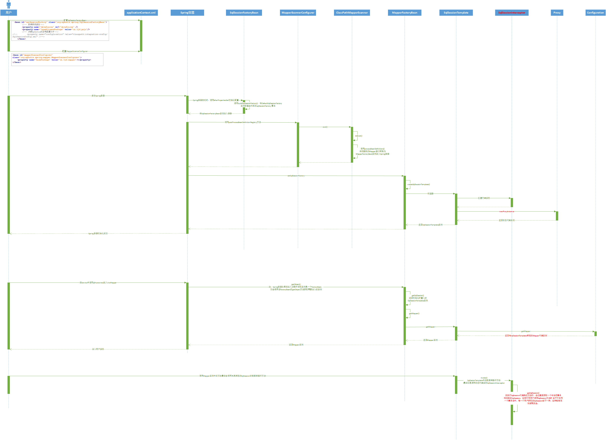

# MyBatis与Spring整合后如何保证SqlSession线程安全

在MyBatis架构中SqlSession是提供给外层调用的顶层接口，它是MyBatis对外暴露的最重要的接口，用户通过该接口即可完成数据库的全部操作。在上文中我们明白了我们常用的Mybatis动态代理开发实际上底层还是依赖于SqlSession。在单独使用MyBatis框架时，我们每一次都会获取一个全新的SqlSession，然后通过它获取Mapper代理对象。因为MyBatis中SqlSession的实现类（DefaultSqlSession）是一个线程不安全的类，所以Mapper代理对象和其依赖的SqlSession实例需要始终保证只有一个线程运行。

但是当MyBatis与Spring整合以后，每一个Mapper接口都只有唯一个实例（单例），这样线程安全问题就是mybatis-spring包需要首要解决的问题。

## 一. SqlSessionFactoryBean

我们在进行MyBatis-Spring整合时需要配置下面代码：

```xml
<bean id="sqlSessionFactory" class="org.mybatis.spring.SqlSessionFactoryBean">
    <!-- 数据库连接池 -->
    <property name="dataSource" ref="dataSource" />
    <!-- 加载mybatis的全局配置文件 -->
    <property name="configLocation" value="classpath:integration-config/SqlSessionConfig.xml" />
</bean>
```

我们配置了数据源、MyBatis核心配置文件的路径。因此不难想象，`SqlSessionFactoryBean`内部实现了配置文件解析以及`SqlSessionFactory`对象的创建。

> 由于MyBatis核心配置文件的中的配置，绝大部分都能够配置给`SqlSessionFactoryBean`对象，Mybatis与Spring整合的大部分情况下，MyBatis核心配置文件是可以取消的。



在继承关系图中，我们发现了 **InitializingBean、FactoryBean** 的身影，可能清楚这个的同学，大概已经猜到了肯定有 `afterPropertiesSet() `来创建` SqlSessionFactory `对象 和` getObject() `来获取 `SqlSessionFactory` 对象（Spring 在Bean加载的过程中如果发现当前Bean对象是 ``FactoryBean``会去调用`getObject()` 获取真正的Bean对象） 。 话不多说，先看下`getObject()`实现：

```java
/**
 * 实现FactoryBean接口，用于返回SqlSessionFactory实例
 * {@inheritDoc}
 */
@Override
public SqlSessionFactory getObject() throws Exception {
  if (this.sqlSessionFactory == null) {
  	//创建SqlSessionFactory对象
    afterPropertiesSet();
  }
  return this.sqlSessionFactory;
}
```

`getObject()`相对简单，我们都知道FactoryBean子类都是通过`getObject()`来获取到实际的Bean对象，这里也就是`SqlSessionFactory`。从源码中我们看到当` sqlSessionFactory`为null会去调用 `afterPropertiesSet()`，所以 `SqlSessionFactory `肯定是由` afterPropertiesSet()` 来实现创建的。继续看`afterPropertiesSet()`实现：

```java
  /**
   * 实现至InitializingBean接口，用于初始化配置并获取SqlSessionFactory实例
   * {@inheritDoc}
   */
  @Override
  public void afterPropertiesSet() throws Exception {
  	//dataSource不能为空
    notNull(dataSource, "Property 'dataSource' is required");
    notNull(sqlSessionFactoryBuilder, "Property 'sqlSessionFactoryBuilder' is required");
    state((configuration == null && configLocation == null) || !(configuration != null && configLocation != null),
        "Property 'configuration' and 'configLocation' can not specified with together");

    //构建SqlSessionFactory实例
    this.sqlSessionFactory = buildSqlSessionFactory();
  }
```

`afterPropertiesSet() `内部首先 验证了 `dataSource` 和` sqlSessionFactoryBuilder` 不为null，最后调用 `buildSqlSessionFactory()`方法获取到` SqlSessionFactory `对象，并赋值到类字段属性 `sqlSessionFactory` 。 继续查看`buildSqlSessionFactory()`源码：

```java
protected SqlSessionFactory buildSqlSessionFactory() throws Exception {

  final Configuration targetConfiguration;

  XMLConfigBuilder xmlConfigBuilder = null;
  if (this.configuration != null) {//对应Spring与MyBatis整合配置中的SqlSessionFactoryBean中的configuration属性
    //如果configuration不为空，则使用该对象，并配置该对象
    targetConfiguration = this.configuration;
    if (targetConfiguration.getVariables() == null) {
      targetConfiguration.setVariables(this.configurationProperties);
    } else if (this.configurationProperties != null) {
      targetConfiguration.getVariables().putAll(this.configurationProperties);
    }
  } else if (this.configLocation != null) {//如果配置了configLocation属性
    //创建XMLConfigBuilder，读取Mybatis核心配置文件
    xmlConfigBuilder = new XMLConfigBuilder(this.configLocation.getInputStream(), null, this.configurationProperties);
    targetConfiguration = xmlConfigBuilder.getConfiguration();
  } else {//如果既没配configuration也没配configLocation属性，则加载当前SqlSeessionFactoryBean对象中配置的信息
    LOGGER.debug(
        () -> "Property 'configuration' or 'configLocation' not specified, using default MyBatis Configuration");
    targetConfiguration = new Configuration();
    Optional.ofNullable(this.configurationProperties).ifPresent(targetConfiguration::setVariables);
  }

  Optional.ofNullable(this.objectFactory).ifPresent(targetConfiguration::setObjectFactory);
  Optional.ofNullable(this.objectWrapperFactory).ifPresent(targetConfiguration::setObjectWrapperFactory);
  Optional.ofNullable(this.vfs).ifPresent(targetConfiguration::setVfsImpl);

  if (hasLength(this.typeAliasesPackage)) {//注册包别名
    scanClasses(this.typeAliasesPackage, this.typeAliasesSuperType).stream()
        .filter(clazz -> !clazz.isAnonymousClass()).filter(clazz -> !clazz.isInterface())
        .filter(clazz -> !clazz.isMemberClass()).forEach(targetConfiguration.getTypeAliasRegistry()::registerAlias);
  }

  if (!isEmpty(this.typeAliases)) {
    Stream.of(this.typeAliases).forEach(typeAlias -> {
      targetConfiguration.getTypeAliasRegistry().registerAlias(typeAlias);
      LOGGER.debug(() -> "Registered type alias: '" + typeAlias + "'");
    });
  }

  if (!isEmpty(this.plugins)) {//判断是否配置插件
    //注册这些插件
    Stream.of(this.plugins).forEach(plugin -> {
      targetConfiguration.addInterceptor(plugin);
      LOGGER.debug(() -> "Registered plugin: '" + plugin + "'");
    });
  }

  if (hasLength(this.typeHandlersPackage)) {
    //剔除配置中的匿名类、接口、抽象类，然后注册符合要求的typeHandlersPackage
    scanClasses(this.typeHandlersPackage, TypeHandler.class).stream().filter(clazz -> !clazz.isAnonymousClass())
        .filter(clazz -> !clazz.isInterface()).filter(clazz -> !Modifier.isAbstract(clazz.getModifiers()))
        .forEach(targetConfiguration.getTypeHandlerRegistry()::register);
  }

  if (!isEmpty(this.typeHandlers)) {
    //注册所有的TypeHandler
    Stream.of(this.typeHandlers).forEach(typeHandler -> {
      targetConfiguration.getTypeHandlerRegistry().register(typeHandler);
      LOGGER.debug(() -> "Registered type handler: '" + typeHandler + "'");
    });
  }

  targetConfiguration.setDefaultEnumTypeHandler(defaultEnumTypeHandler);

  if (!isEmpty(this.scriptingLanguageDrivers)) {
    Stream.of(this.scriptingLanguageDrivers).forEach(languageDriver -> {
      targetConfiguration.getLanguageRegistry().register(languageDriver);
      LOGGER.debug(() -> "Registered scripting language driver: '" + languageDriver + "'");
    });
  }
  Optional.ofNullable(this.defaultScriptingLanguageDriver)
      .ifPresent(targetConfiguration::setDefaultScriptingLanguage);

  if (this.databaseIdProvider != null) {// fix #64 set databaseId before parse mapper xmls
    try {
      targetConfiguration.setDatabaseId(this.databaseIdProvider.getDatabaseId(this.dataSource));
    } catch (SQLException e) {
      throw new NestedIOException("Failed getting a databaseId", e);
    }
  }

  Optional.ofNullable(this.cache).ifPresent(targetConfiguration::addCache);

  if (xmlConfigBuilder != null) {
    try {
      xmlConfigBuilder.parse();
      LOGGER.debug(() -> "Parsed configuration file: '" + this.configLocation + "'");
    } catch (Exception ex) {
      throw new NestedIOException("Failed to parse config resource: " + this.configLocation, ex);
    } finally {
      ErrorContext.instance().reset();
    }
  }

  targetConfiguration.setEnvironment(new Environment(this.environment,
      this.transactionFactory == null ? new SpringManagedTransactionFactory() : this.transactionFactory,
      this.dataSource));

  if (this.mapperLocations != null) {
    if (this.mapperLocations.length == 0) {
      LOGGER.warn(() -> "Property 'mapperLocations' was specified but matching resources are not found.");
    } else {
      for (Resource mapperLocation : this.mapperLocations) {
        if (mapperLocation == null) {
          continue;
        }
        try {
          //创建XMLMappperBuilder解析映射配置文件
          XMLMapperBuilder xmlMapperBuilder = new XMLMapperBuilder(mapperLocation.getInputStream(),
              targetConfiguration, mapperLocation.toString(), targetConfiguration.getSqlFragments());
          xmlMapperBuilder.parse();
        } catch (Exception e) {
          throw new NestedIOException("Failed to parse mapping resource: '" + mapperLocation + "'", e);
        } finally {
          ErrorContext.instance().reset();
        }
        LOGGER.debug(() -> "Parsed mapper file: '" + mapperLocation + "'");
      }
    }
  } else {
    LOGGER.debug(() -> "Property 'mapperLocations' was not specified.");
  }

  return this.sqlSessionFactoryBuilder.build(targetConfiguration);
}
```


## 二. MapperScannerConfigure

`MapperScannerConfigurer `是 mybatis-spring 项目中为了实现方便加载Mapper接口，以及将 Mapper 偷梁换柱成 `MapperFactoryBean`。在整合过程中通常会配置如下代码：

```xml
<bean id="mapperScannerConfigurer" class="org.mybatis.spring.mapper.MapperScannerConfigurer">
    <property name="basePackage" value="cn.tjd.mapper"></property>
</bean>
```

`MapperScannerConfigurer`继承关系如下图：



从中我们其继承了 `BeanDefinitionRegistryPostProcessor `接口，熟悉Spring 的同学应该 已经大致想到了 其如何将 Mapper 偷梁换柱成 `MapperFactoryBean `了。话不多说，我们来看看 `MapperScannerConfigurer `是如何实现 `BeanDefinitionRegistryPostProcessor `的 `postProcessBeanDefinitionRegistry() `方法：

```java
public void postProcessBeanDefinitionRegistry(BeanDefinitionRegistry registry) {
  if (this.processPropertyPlaceHolders) {
    processPropertyPlaceHolders();
  }

  //创建类路径Mapper扫描器
  ClassPathMapperScanner scanner = new ClassPathMapperScanner(registry);
  /**
   * 设置扫描器属性
   */
  scanner.setAddToConfig(this.addToConfig);
  scanner.setAnnotationClass(this.annotationClass);
  scanner.setMarkerInterface(this.markerInterface);
  scanner.setSqlSessionFactory(this.sqlSessionFactory);
  scanner.setSqlSessionTemplate(this.sqlSessionTemplate);
  scanner.setSqlSessionFactoryBeanName(this.sqlSessionFactoryBeanName);
  scanner.setSqlSessionTemplateBeanName(this.sqlSessionTemplateBeanName);
  scanner.setResourceLoader(this.applicationContext);
  scanner.setBeanNameGenerator(this.nameGenerator);
  scanner.setMapperFactoryBeanClass(this.mapperFactoryBeanClass);
  if (StringUtils.hasText(lazyInitialization)) {
    scanner.setLazyInitialization(Boolean.valueOf(lazyInitialization));
  }
  //生成过滤器，只扫描指定类
  scanner.registerFilters();
  //扫描指定包及其子包
  scanner.scan(
      StringUtils.tokenizeToStringArray(this.basePackage, ConfigurableApplicationContext.CONFIG_LOCATION_DELIMITERS));
}
```

我们可以发现整个方法内部其实就是通过` ClassPathMapperScanner` 的 `scan()` 方法，查看 `scan()` 实现，发现其内部调用了关键方法` doScan()`,那么我们来看下 `doScan()` 方法实现：

```java
public Set<BeanDefinitionHolder> doScan(String... basePackages) {
  //调用父类的扫描，获取所有符合条件的BeanDefinitionHolder对象
  Set<BeanDefinitionHolder> beanDefinitions = super.doScan(basePackages);

  if (beanDefinitions.isEmpty()) {
    LOGGER.warn(() -> "No MyBatis mapper was found in '" + Arrays.toString(basePackages)
        + "' package. Please check your configuration.");
  } else {
    //处理扫描后的BeanDefinitionHolder集合，将集合中的每一个Mapper接口转换为MapperFactoryBean
    processBeanDefinitions(beanDefinitions);
  }

  return beanDefinitions;
}
```

可以看到在`doScan()`方法中`processBeanDefinitions()`方法将集合中的每一个Mapper接口转化为`MapperFactoryBean`，源码如下：

```java
/**
 * 遍历处理BeanDefinitionHolder将其转换为MapperFactoryBean对象，并注入Spring容器
 * @param beanDefinitions
 */
private void processBeanDefinitions(Set<BeanDefinitionHolder> beanDefinitions) {
  GenericBeanDefinition definition;
  for (BeanDefinitionHolder holder : beanDefinitions) {
    definition = (GenericBeanDefinition) holder.getBeanDefinition();
    //获取被代理Mapper接口的名称
    String beanClassName = definition.getBeanClassName();
    LOGGER.debug(() -> "Creating MapperFactoryBean with name '" + holder.getBeanName() + "' and '" + beanClassName
        + "' mapperInterface");

    // the mapper interface is the original class of the bean
    // but, the actual class of the bean is MapperFactoryBean
    //Mapper接口是原始的Bean，但实际上的实例是MapperFactoryBean
    definition.getConstructorArgumentValues().addGenericArgumentValue(beanClassName); // issue #59
    //设置真实的实例类型MapperFactoryBean
    definition.setBeanClass(this.mapperFactoryBeanClass);
    //增加addToConfig属性
    definition.getPropertyValues().add("addToConfig", this.addToConfig);

    boolean explicitFactoryUsed = false;
    if (StringUtils.hasText(this.sqlSessionFactoryBeanName)) {
      definition.getPropertyValues().add("sqlSessionFactory",
          new RuntimeBeanReference(this.sqlSessionFactoryBeanName));
      explicitFactoryUsed = true;
    } else if (this.sqlSessionFactory != null) {
      definition.getPropertyValues().add("sqlSessionFactory", this.sqlSessionFactory);
      explicitFactoryUsed = true;
    }
    //增加SqlSessionTemplate属性
    if (StringUtils.hasText(this.sqlSessionTemplateBeanName)) {
      if (explicitFactoryUsed) {
        LOGGER.warn(
            () -> "Cannot use both: sqlSessionTemplate and sqlSessionFactory together. sqlSessionFactory is ignored.");
      }
      definition.getPropertyValues().add("sqlSessionTemplate",
          new RuntimeBeanReference(this.sqlSessionTemplateBeanName));
      explicitFactoryUsed = true;
    //设置SqlSessionTemplate  
    } else if (this.sqlSessionTemplate != null) {
      if (explicitFactoryUsed) {
        LOGGER.warn(
            () -> "Cannot use both: sqlSessionTemplate and sqlSessionFactory together. sqlSessionFactory is ignored.");
      }
      definition.getPropertyValues().add("sqlSessionTemplate", this.sqlSessionTemplate);
      explicitFactoryUsed = true;
    }

    //将自动注入的方式修改为AUTOWIRE_BY_TYPE
    if (!explicitFactoryUsed) {
      LOGGER.debug(() -> "Enabling autowire by type for MapperFactoryBean with name '" + holder.getBeanName() + "'.");
      definition.setAutowireMode(AbstractBeanDefinition.AUTOWIRE_BY_TYPE);
    }
    definition.setLazyInit(lazyInitialization);
  }
}
```

## 三. MapperFactoryBean

MapperScannerConfigure配置后会扫描指定包下面的Mapper接口，并将其替换为`MapperFactoryBean`对象，



从名字就可以看出来它又是一个`FactoryBean`，当用户注入指定类型的Mapper实例时，容器发现与该类型绑定的实际上是一个`FactoryBean`则会调用`FactoryBean`的`getObject()`方法获取要注入的对象。源码如下：

```java
public T getObject() throws Exception {
  //getSqlSession为每一次注入提供不同的SqlSession实例
  return getSqlSession().getMapper(this.mapperInterface);
}
```

`getSession()`返回的是`SqlSessionTemplate` 实例：

```java
public SqlSession getSqlSession() {
  return this.sqlSessionTemplate;
}
```

`SqlSessionTemplate`实现了`SqlSession`接口，然后调用`getMapper()`方法获取`Mapper`实例：

```java
public <T> T getMapper(Class<T> type) {
  return getConfiguration().getMapper(type, this);
}
```

## 四. SqlSessionTemplate、SqlSessionInterceptor

通过[《MyBatis动态代理调用过程源码分析》](./_20MyBatis动态代理调用过程源码分析.md)我们知道了Mapper实例对数据库的操作最终都依赖于`SqlSession`实例。

在分析`MapperFactoryBean::getObject()`源码时，我们知道了Mapper实例是通过一个``SqlSessionTemplate`对象创建的，也就是说在Spring项目中注入的Mapper对象实际上最终都执行的是`SqlSessionTemplate`方法。

我们查看`SqlSessionTemplate`中数据库操作方法可以发现，所有的操作都委托给了一个名为`sqlSessionProxy`的实例去处理：

```java
public void select(String statement, Object parameter, ResultHandler handler) {
  this.sqlSessionProxy.select(statement, parameter, handler);
}
```

想要了解`SqlSessionTempalte::sqlSessionProxy`属性来源，我们还得从`SqlSessionTemplate`实例被注入到`SqlSessionFactoryBean`的地方说起，进入到`SqlSessionFactoryBean::setSqlSessionFactory()`方法：

```java
public void setSqlSessionFactory(SqlSessionFactory sqlSessionFactory) {
  //当我们配置<property name="sqlSessionFactory" ref="sqlSessionFactory"></property>时
  //会调用这个方法，并创建SqlSessionTemplate封装SqlSessionFactory
  if (this.sqlSessionTemplate == null || sqlSessionFactory != this.sqlSessionTemplate.getSqlSessionFactory()) {
    this.sqlSessionTemplate = createSqlSessionTemplate(sqlSessionFactory);
  }
}
```

可以发现最终调用`createSqlSessionTemplate`方法创建`SqlSessionTemplate`，我们继续深入，可以发现最终的创建逻辑：

```java
public SqlSessionTemplate(SqlSessionFactory sqlSessionFactory, ExecutorType executorType,
    PersistenceExceptionTranslator exceptionTranslator) {

  notNull(sqlSessionFactory, "Property 'sqlSessionFactory' is required");
  notNull(executorType, "Property 'executorType' is required");

  this.sqlSessionFactory = sqlSessionFactory;
  this.executorType = executorType;
  this.exceptionTranslator = exceptionTranslator;
  //在这里创建了SqlSessionProxy代理对象，也是实现线程安全的
  this.sqlSessionProxy = (SqlSession) newProxyInstance(SqlSessionFactory.class.getClassLoader(),
      new Class[] { SqlSession.class }, new SqlSessionInterceptor());
}
```

可以看到在创建`SqlSessionTemplate`实例时，会初始化一个`SqlSessionInterceptor`代理实例给`SqlSessionTemplate::sqlSessionProxy`属性。根据前面看到`SqlSessionTemplate`类中的数据库操作最终都委托给`SqlSessionTemplate::sqlSessionProxy`趋势线，也就是说`SqlSessionInterceptor`是MyBatis与Mybatis整合保证线程安全性的关键。`SqlSessionInterceptor`源码：

```java
//SqlSessionInterceptor是SqlSessionTemplate的内部类
private class SqlSessionInterceptor implements InvocationHandler {
  @Override
  public Object invoke(Object proxy, Method method, Object[] args) throws Throwable {
    //从Spring事务管理器获取SqlSession，或者在需要时创建一个新的SqlSession。试图从当前事务获取SqlSession。如果没有，则创建一个新的。然后， 如果Spring TX是活动的，并且SpringManagedTransactionFactory被配置为事务管理器，那么它会将SqlSession与事务进行同步。
    //TODO 这里应该结合Spring的事务管理源码才能明白Spring与MyBatis结合时事务如何管理并且如何保证SqlSession线程安全
    SqlSession sqlSession = getSqlSession(SqlSessionTemplate.this.sqlSessionFactory,
        SqlSessionTemplate.this.executorType, SqlSessionTemplate.this.exceptionTranslator);
    try {
      Object result = method.invoke(sqlSession, args);
      //如果SqlSession事务没有交由Spring管理，则提交SqlSession事务
      if (!isSqlSessionTransactional(sqlSession, SqlSessionTemplate.this.sqlSessionFactory)) {
        // force commit even on non-dirty sessions because some databases require
        // a commit/rollback before calling close()
        sqlSession.commit(true);
      }
      return result;
    } catch (Throwable t) {
      Throwable unwrapped = unwrapThrowable(t);
      if (SqlSessionTemplate.this.exceptionTranslator != null && unwrapped instanceof PersistenceException) {
        // release the connection to avoid a deadlock if the translator is no loaded. See issue #22
        // 如果未加载翻译器，则释放连接以避免死锁
        closeSqlSession(sqlSession, SqlSessionTemplate.this.sqlSessionFactory);
        sqlSession = null;
        //将MyBatisPersistenceException翻译成DataAccessException
        Throwable translated = SqlSessionTemplate.this.exceptionTranslator
            .translateExceptionIfPossible((PersistenceException) unwrapped);
        if (translated != null) {
          unwrapped = translated;
        }
      }
      throw unwrapped;
    } finally {
      if (sqlSession != null) {
        //尝试关闭SqlSession
        closeSqlSession(sqlSession, SqlSessionTemplate.this.sqlSessionFactory);
      }
    }
  }
}
```

可以看到在动态代理类中，是先从Spring事务管理器获取SqlSession，或者在需要时创建一个新的SqlSession。试图从当前事务获取SqlSession。如果没有，则创建一个新的；如果Spring TX是活动的，并且SpringManagedTransactionFactory被配置为事务管理器，那么它会将SqlSession与事务进行同步。

也就是说，**在MyBatis在被Spring整合后，Mapper底层绑定的`SqlSession`实际上是一个`SqlSessionInterceptor`实例，每一次执行`SqlSession`的方法时，`SqlSessionInterceptor`代理类中会创建或获取一个与当前事务相关联的SqlSession，然后调用该sqlSession的方法实现数据库操作。**

**由于不同用户调用SqlSession方法时不在同一个事务当中，每一个用户获取的SqlSession会不一样，这样能够保证线程安全**。

## 五. 总结

MyBatis与Spring整合后核心类的状态：

| 类型                  | 是否单例 | 说明                                                         |
| --------------------- | -------- | ------------------------------------------------------------ |
| MapperFactoryBean     | 多例     | 用户的每一个Mapper接口都唯一与一个MapperFactoryBean绑定，从Mapper接口的角度看可以理解为单例的 |
| Mapper                | 多例     | 通过SqlSessionTemplate创建，每一次注入都会创建一个新的Mapper实例，但内部绑定的SqlSessionTemplate实际上是一个 |
| SqlSessionTemplate    | 单例     | 虽然Mapper内部绑定的SqlSessionTemplate是单例的，但是它并不处理具体业务，更向一个分发器，将任务交给与当前事务绑定的SqlSession去执行。这样每一个事务实际上是由一个独立的SqlSession完成的，并不存在线程安全问题。 |
| SqlSessionInterceptor | 单例     | 具体的分发逻辑                                               |

MyBatis与Spring整合的时序图：



本文只是展现了MyBatis与Spring整合的基本实现流程，更加细节的信息需要小伙伴们自己去挖掘。博主自己对MyBatis源码进行了详细注释，如有需要，请移步至：[GitHub](https://github.com/tianjindong/mybatis-spring-source-annotation)或[Gitee](https://gitee.com/tianjindong/mybatis-spring-source-annotation)

**本文阐述了自己对MyBatis源码的一些理解，如有错误或不足，欢迎大佬指点，给大佬鞠个躬**