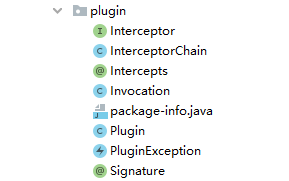
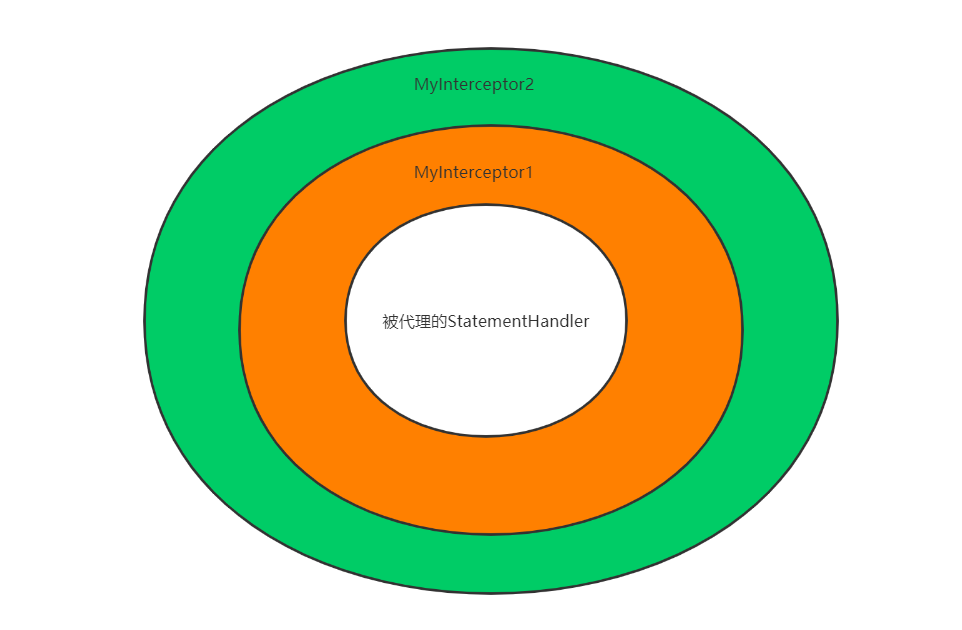
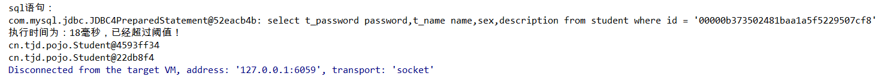

# MyBatis插件原理

插件开发需要大家对MyBatis执行逻辑由较为深入的理解，因为插件实际上是对MyBatis执行过程中`Executor`、`StatementHandler`、`ParameterHandler`、`ResultSetHandler`对象进行动态代理加强。只有明白了这四个类在MyBatis执行流程中所起到的作用，才能使得插件开发有的放矢。

如果有小伙伴对MyBatis操作数据库的底层逻辑不是很清楚，可以参考博主的另一篇文章：[《MyBatis核心接口SqlSession实现原理》](./_21MyBatis核心接口SqlSession实现原理.md)

## 一. 插件原理

在MyBatis源码的`org.apache.ibatis.plugin`包中定义了MyBatis插件模块的源码，现在我们通过分析这个模块的源码了解MyBatis插件的底层原理。



### 1.1 Interceptor接口

MyBatis在设计时充分考虑到了框架的扩展性，对外提供了`org.apache.ibatis.plugin.Interceptor`接口，用于对`Executor`、`StatementHandler`、`ParameterHandler`、`ResultSetHandler`对象进行拦截增强。用户只需要实现该接口的intercept方法即可对四大核心对象进行加强。

```java
public interface Interceptor {

  /**
   * 拦截器的核心方法，内部实现插件的核心逻辑
   * @param invocation 对当前正在代理的方法的一个封装，内部封装正在调用目标对象方法的Method实例
   * @return
   * @throws Throwable
   */
  Object intercept(Invocation invocation) throws Throwable;

  /**
   * 用于返回目标对象的代理类，内部封装的是JDK动态代理实例的创建操作
   * 在3.5.5版本中使用了JDK8新提供的default关键字，提供了该方法的默认实现。在大多数情况下，用户自定义拦截器实现该接口是
   * 不需要实现实现该方法
   * @param target
   * @return
   */
  default Object plugin(Object target) {
    return Plugin.wrap(target, this);
  }

  /**
   * 为插件设置自定义参数值，在MyBatis核心配置文件中配置插件时是可以使用<properties>标签指定插件的属性，当用户配置
   * <properties>属性后，插件在初始化时会调用该方法设置插件属性。由于是默认方法，如果该插件没有参数设置，则该方法不用
   * 在实现类中实现。
   * @param properties
   */
  default void setProperties(Properties properties) {
    // NOP
  }
}
```

用户实现了一个`Interceptor`后，只是实现了插件的处理逻辑，还需要在实现类上使用`@Intercepts`注解标注这个拦截器的拦截点，也就是需要确定拦截的具体方法，这样就需要指明三个参数：类型、方法名、参数列表

```java
@Intercepts({
	@Signature(type=StatementHandler.class,method="query",args={Statement.class, ResultHandler.class})
})
public class ThresholdInterceptor implements Interceptor {
                                        
}
```

**实现`Interceptor`接口是为了完成插件内部逻辑，使用`@Intercepts`注解是为了指明插件的插入的地方**。但是MyBatis框架是如何将逻辑注入到MyBatis内部的执行流程中的还需要我们继续探究。

### 1.2 Plugin代理类

`org.apache.ibatis.plugin.Plugin`是Mybatis提供的一个动态代理类，熟悉动态代理的小伙伴应该看到这个类就能恍然大悟，它实现了`InvocationHandler`接口，也就说明这个类是对上文提到的四大对象动态加强的核心类。

在`Plugin`中封装了一个`target`属性，它是被代理对象的实例，可能是`Executor`、`StatementHandler`、`ParameterHandler`、`ResultSetHandler`四种类型的任意一个。

内部还封装了一个`Interceptor`实例，它是用户自己实现的拦截器，`invoke`方法最终还是调用`Interceptor::intercept`方法，从而进入用户自定义的代码逻辑中。

在`Plugin::invoke`方法中会判断当前执行的方法是不是需要插件加强的方法（由`@Intercepts`注解配置），如果当前方法需要使用插件加强，则会调用`Interceptor::intercept`进入用户自定义的拦截逻辑中，如果当前方法不是插件加强的目标方法，则会直接调用`Method::invoke`调用真实的方法，从而不走用户拦截的逻辑。

```java

/**
 * 插件实现的代理类，是插件进行区别拦截的核心逻辑实现。用于代理用户自定义实现的Interceptor实例
 * @author Clinton Begin
 */
public class Plugin implements InvocationHandler {

  //封装的真正提供服务的对象
  private final Object target;
  //自定义拦截器
  private final Interceptor interceptor;
  //解析@Intercepts注解得到的signature信息
  private final Map<Class<?>, Set<Method>> signatureMap;

  private Plugin(Object target, Interceptor interceptor, Map<Class<?>, Set<Method>> signatureMap) {
    this.target = target;
    this.interceptor = interceptor;
    this.signatureMap = signatureMap;
  }

...

  @Override
  public Object invoke(Object proxy, Method method, Object[] args) throws Throwable {
    try {
      Set<Method> methods = signatureMap.get(method.getDeclaringClass());
      if (methods != null && methods.contains(method)) {
        //当前被调用的method如果包含在用户指定拦截的methods中，则进行拦截
        return interceptor.intercept(new Invocation(target, method, args));
      }
      return method.invoke(target, args);
    } catch (Exception e) {
      throw ExceptionUtil.unwrapThrowable(e);
    }
  }
}
```

通过分析`Plugin`类，我们知道了MyBatis是通过创建`Plugin`动态代理类代理对象对MyBatis执行流程中的`Executor`、`StatementHandler`、`ParameterHandler`、`ResultSetHandler`实例进行加强。这里我们需要进一步分析Plugin代理对象的创建时机才会真正了解MyBatis插件的实现原理。

### 1.3 InterceptorChain插件链

MyBatis框架中由于可以配置多个插件，所以在设计时使用了责任链模式。而`InterceptorChain`就是用于保存MyBatis初始化过程中解析出来的插件集合。

```java
public class InterceptorChain {

  //插件集合
  private final List<Interceptor> interceptors = new ArrayList<>();

  //遍历集合中保存的插件实例，然后生成动态代理对象
  public Object pluginAll(Object target) {
    for (Interceptor interceptor : interceptors) {
      target = interceptor.plugin(target);
    }
    return target;
  }

  public void addInterceptor(Interceptor interceptor) {
    interceptors.add(interceptor);
  }

  public List<Interceptor> getInterceptors() {
    return Collections.unmodifiableList(interceptors);
  }

}
```

而在初始化过程中生成的`InterceptorChain`实例会保存在`Configuration`（Mybatis生命周期中保存全部配信息的对象，全局单例）。

### 1.4 Plugin动态代理类的创建

前面我们说到了，插件只能对`Executor`、`StatementHandler`、`ParameterHandler`、`ResultSetHandler`四个类中的方法进行拦截，所以我们需要寻找这四个类实例创建的源头，看看MyBatis是如何将插件代理织入原先的执行流程中的。

进入`Configuration`类我们可以发现`newExecutor`、`newStatementHandler`、`newParameterHandler`、`newResultSetHandler`等方法，在这些方法的最后一行都执行了`InterceptorChain::pluginAll`方法创建代理类，然后最终返回代理实例。

```java
  public Executor newExecutor(Transaction transaction, ExecutorType executorType) {
    executorType = executorType == null ? defaultExecutorType : executorType;
    executorType = executorType == null ? ExecutorType.SIMPLE : executorType;
    Executor executor;
    if (ExecutorType.BATCH == executorType) {
      //创建Batch类型的Executor
      executor = new BatchExecutor(this, transaction);
    } else if (ExecutorType.REUSE == executorType) {
      //创建Reuse类型的Executor
      executor = new ReuseExecutor(this, transaction);
    } else {
      //创建simple类型的Executor
      executor = new SimpleExecutor(this, transaction);
    }
    if (cacheEnabled) {
      //如果配置了二级缓存，则用CachingExecutor装饰前面创建的Executor，从而实现二级缓存
      executor = new CachingExecutor(executor);
    }
    //通过interceptorChain遍历所有注册的插件，然后对Executor进行加强
    executor = (Executor) interceptorChain.pluginAll(executor);
    return executor;
  }
```

```java
  public StatementHandler newStatementHandler(Executor executor, MappedStatement mappedStatement, Object parameterObject, RowBounds rowBounds, ResultHandler resultHandler, BoundSql boundSql) {
    //创建Statement，RoutingStatementHandler使用静态代理模式，由statementType来指定真实的StatementHandler实现
    StatementHandler statementHandler = new RoutingStatementHandler(executor, mappedStatement, parameterObject, rowBounds, resultHandler, boundSql);
    statementHandler = (StatementHandler) interceptorChain.pluginAll(statementHandler);
    return statementHandler;
  }
```

```java
  public ParameterHandler newParameterHandler(MappedStatement mappedStatement, Object parameterObject, BoundSql boundSql) {
    ParameterHandler parameterHandler = mappedStatement.getLang().createParameterHandler(mappedStatement, parameterObject, boundSql);
    //注册插件，从而加强ParameterHandler对象
    parameterHandler = (ParameterHandler) interceptorChain.pluginAll(parameterHandler);
    return parameterHandler;
  }
```

```java
  public ResultSetHandler newResultSetHandler(Executor executor, MappedStatement mappedStatement, RowBounds rowBounds, ParameterHandler parameterHandler,
      ResultHandler resultHandler, BoundSql boundSql) {
    ResultSetHandler resultSetHandler = new DefaultResultSetHandler(executor, mappedStatement, parameterHandler, resultHandler, boundSql, rowBounds);
    //注册插件，从而加强ResultSetHandler对象
    resultSetHandler = (ResultSetHandler) interceptorChain.pluginAll(resultSetHandler);
    return resultSetHandler;
  }
```

在`InterceptorChain::pluginAll`方法中遍历用户配置的所有插件，然后依次调用`Interceptor::plugin`生成动态代理类。通过这段源码的分析，我们可以发现在创建四大对象时会将配置的Interceptor都进行加强，不管这个Interceptor是否作用于当前类型的对象。

```java
//遍历集合中保存的插件实例，然后生成动态代理对象
public Object pluginAll(Object target) {
  for (Interceptor interceptor : interceptors) {
    target = interceptor.plugin(target);
  }
  return target;
}
```

仔细分析还可以得出结论，用户先配置的插件在代理链的内层，用户后配置的插件在代理链的外层。

例如用户配置了两个插件：

```xml
<plugins>
    <plugin interceptor="cn.tjd.interceptors.MyInterceptor1">
        <property name="threshold" value="10"/>
    </plugin>
    <plugin interceptor="cn.tjd.interceptors.MyInterceptor2">
        <property name="threshold" value="10"/>
    </plugin>
</plugins>
```

则它的代理链是这样的：



也就是说，**作用于同一个方法的插件，先配置会后执行，后配置的会先执行**。

想要更进一步的了解MyBatis插件开发，推荐大家研究一下`PageHelper`分页插件的源码。`PageHelper`插件作者的一篇博文也可以帮助大家理解插件原理：<https://github.com/pagehelper/Mybatis-PageHelper/blob/master/wikis/zh/Interceptor.md>

## 二. 自定义拦截器示例

### 3.1 定义拦截器

```java
/**
 * 获取SQL执行时间，当执行时间达到阈值后输出日志
 */
@Intercepts({
	@Signature(type=StatementHandler.class,method="query",args={Statement.class, ResultHandler.class})
})
public class ThresholdInterceptor implements Interceptor {
	
	private long threshold;

	public long getThreshold() {
		return threshold;
	}

	public void setThreshold(long threshold) {
		this.threshold = threshold;
	}

	public Object intercept(Invocation invocation) throws Throwable {
		long begin = System.currentTimeMillis();
		Object ret = invocation.proceed();
		long end=System.currentTimeMillis();
		long runTime = end - begin;
		if(runTime>=threshold){
			Object[] args = invocation.getArgs();
			Statement stat = (Statement) args[0];
			MetaObject metaObjectStat = SystemMetaObject.forObject(stat);
			PreparedStatementLogger statementLogger = (PreparedStatementLogger)metaObjectStat.getValue("h");
			Statement statement = statementLogger.getPreparedStatement();
			System.out.println("sql语句：“"+statement.toString()+"”执行时间为："+runTime+"毫秒，已经超过阈值！");
		}
		return ret;
	}

	public void setProperties(Properties properties) {
		this.threshold = Long.valueOf(properties.getProperty("threshold"));
	}
}
```

### 3.2 配置拦截器

```xml
<plugins>
    <plugin interceptor="cn.tjd.interceptors.ThresholdInterceptor">
        <property name="threshold" value="10"/>
    </plugin>
</plugins>
```

### 3.3 测试

