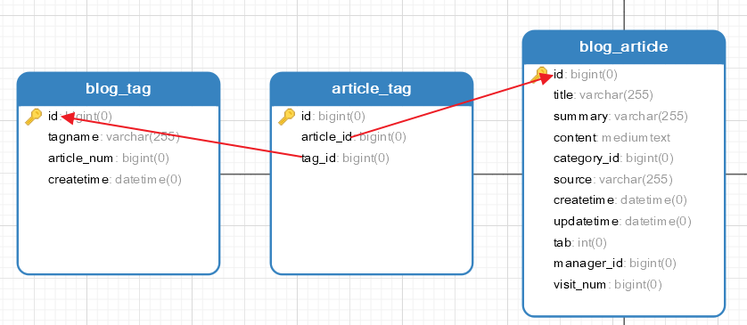

## MyBatis一对多或多对多分页查询问题

#### 问题描述

​	通常我们我们在单表查询中我们可以采用limit进行分页查询，这样可以减少页面的显示量，加快页面想应速度。**但是在MyBatis框架中，如果我们在一对多或多对多查询中直接使用limit关键字的话会产生查询结果数量不够的情况**。

**我们先给出一个关系模型：**



​	blog_tag（标签表）和blog_article（文章表）是多对多关系，article_tag是多对多关系中的联系表。

#### 传统的分页查询

​	我们需要分页查询blog_article表，然后关联查询“文章的标签”表，执行SQL如下：

```sql
-- 只查询表中一小部分字段是为了演示方便，我们分页article表的8条数据
SELECT
	a.id,
	a.title,
	t.tagname,
	t.article_num
FROM
	blog_article a
	LEFT JOIN article_tag a_t ON a.id = a_t.article_id
	LEFT JOIN blog_tag t ON a_t.tag_id = t.id 
	LIMIT 0,8
```

​	**查询结果：**


​	我们可以看到查询的结果中虽然有8条数据，但是不是我们想要的8条`article`数据，如果上述结果被MyBatis封装只会得到4个`BlogArticle`对象。这就开头提出的问题的产生原因。

#### 解决方案

​	我们可以采用`子查询分页`的方式来解决这个问题。

```sql
SELECT
	a.id,
	a.title,
	t.tagname,
	t.article_num
FROM
	(select id,title from blog_article limit 0,8) a
	LEFT JOIN article_tag a_t ON a.id = a_t.article_id
	LEFT JOIN blog_tag t ON a_t.tag_id = t.id 
```

**执行结果：**


​	通过上述方案，我们才能得到8条BlogArticle对象。