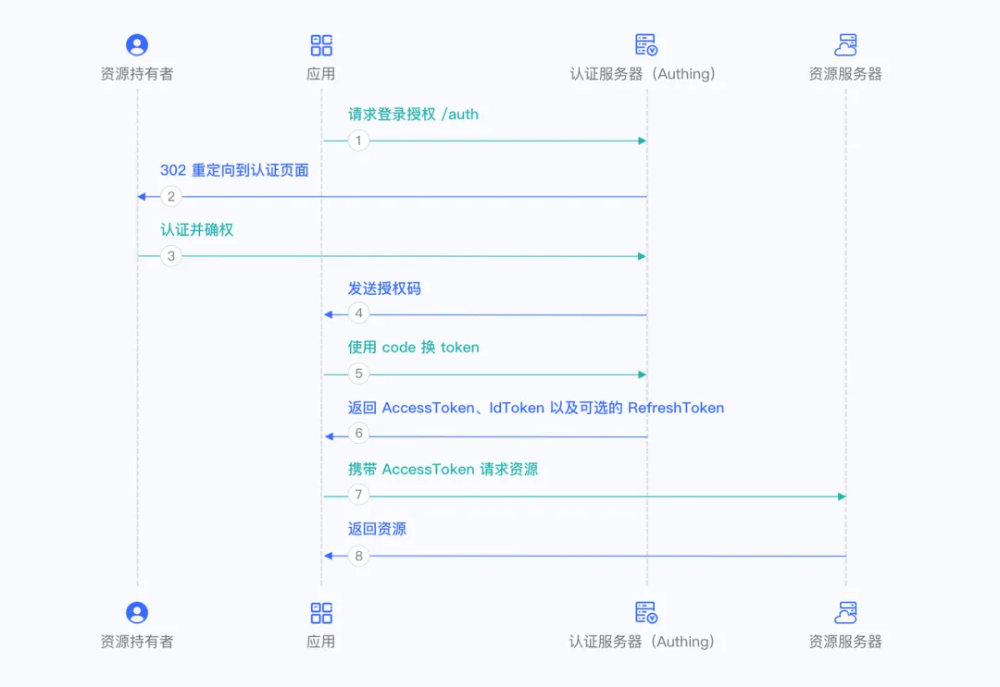

# OIDC与OAuth2的区别

## 一. 认证和授权

在理解 OIDC 之前我们需要先理解两个名词：认证和授权

认证（Authentication）和 授权（Authorization）是两个不同的概念。

- 在用户访问一个应用程序的上下文环境中**认证**会告诉应用程序**当前用户是谁**以及其是否存在。一个完整的认证协议可能还会告诉你一些关于此用户的相关属性，比如唯一标识符、电子邮件地址等内容。

- 授权是指确定用户访问系统资源的权限。授权通常在认证成功之后进行，系统会根据用户的身份和权限确定用户能够访问哪些资源，以及访问这些资源的方式和权限等。

简而言之，认证是确定用户的身份，授权是确定用户能够访问哪些资源以及以什么方式和权限进行访问。这两个概念密切相关，通常在系统安全和访问控制中一起使用，以确保系统和数据的安全性。

## 二. OAuth2.0存在的小问题

> **OAuth2.0 不是认证协议，而是一个授权协议。**
> **OAuth2.0 不是认证协议，而是一个授权协议。**
> **OAuth2.0 不是认证协议，而是一个授权协议。**

在用户访问一个应用程序的上下文环境中**认证**会告诉应用程序**当前用户是谁**以及其是否存在。一个完整的认证协议可能还会告诉你一些关于此用户的相关属性，比如唯一标识符、电子邮件地址等内容。

OAuth 2.0协议在设计时**主要考虑了授权的问题**，例如如何授权第三方应用程序访问用户的资源等，例如我们前文提到的“小兔打单”软件访问用户京东的订单信息进行打单，实际上就只是获取到了用户京东的授权，通过OAuth2.0授权，小兔打单软件可以拿到访问用户京东订单数据的`access_token`，但是这个时候小兔打单软件并不知道此时授权的是哪一个“京东用户”，换句话说无法拿到资源拥有者（小明）的京东UID。除非京东提供额外的用户信息查询服务，才能知道小明授权的是哪个“京东用户”。

从上面的例子也能看出来 OAuth2.0只提供了标准的授权协议，但是没有提供标准的认证协议（让小兔打单软件知道当前授权的京东用户是谁），需要第三方提供个性化的用户信息查询服务，才能确认授权用户是谁。

## 三. OIDC解决了哪些问题

OIDC（OpenID Connect）是在OAuth 2.0协议的基础上进行扩展，主要是为了解决OAuth 2.0在身份认证方面的不足之处。

OIDC的主要目的是为了提供一个标准化的身份认证机制，使得应用程序可以使用标准的方式来验证用户的身份。与OAuth 2.0类似，OIDC也使用了access token来访问受保护的资源，但是OIDC还引入了id token，用于传递关于用户身份的信息。

id token和access token的作用是不同的。access token用于访问资源服务器，而id token用于传递用户身份信息，包括用户的唯一标识符、姓名、电子邮件地址等。这些信息对于应用程序来说是非常有用的，可以用于个性化用户体验、提供更好的服务等。

**相比于使用access token来获取用户身份信息，使用id token可以减少服务器的负担，并且使得认证流程标准化**。在传统的OAuth 2.0中，应用程序需要使用access token来向认证服务器请求用户信息，这会给认证服务器带来一定的负担。而在OIDC中，id token是在用户认证之后直接返回给应用程序的，不需要额外的请求，这可以减轻认证服务器的压力。

## 四. OIDC流程



OIDC在授权码模式中，除了流程6以外，其它所有流程都与OAuth2.0保证一致。

相比与OAuth2.0，在流程6中，认证服务器只返回`access_token`、`refresh_token`，OIDC还会在这一步新增一个 `id_token`，`id_token`通常是JWT形式的，里面包含了一些基础的用户信息（包含用户ID），可以证明是哪个用户进行了登录。

```json
{
    "access_token": "DE48982618D04130BD543341B0D8165....",
    "refresh_token": "DE48982618D04130BD543341B0D8165....",
    "scope": "openid",
    "id_token": "eqweqhwjkd71lk12jh3ljjdas...",
    "token_type": "Bearer"
}
```

## 五. OIDC使用场景

有很多应用都支持第三方登录，例如微信登录、QQ登录等。

在我们使用第三方登录时，OIDC在授权码换`access_token`的步骤中返回的`id_token`中包含的微信用户唯一标识，这样就能将微信用户和我们内部系统的用户ID进行绑定，这样下次再使用微信进行登录时，就能够知道这个微信用户对应我们哪个内部系统的账户，从而完成三方登录。


> 参考文章：
>
> [认证 & 授权\] 3. 基于OAuth2的认证（译） - Timetombs - 博客园 (cnblogs.com)](https://www.cnblogs.com/linianhui/p/authentication-based-on-oauth2.html)
>
> [OAuth 2.0 和 OpenID Connect 的基本原理和区别（干货）_qq_24550639的博客-CSDN博客](https://blog.csdn.net/qq_24550639/article/details/111089296)
>
> [网页授权 | 微信开放文档 (qq.com)](https://developers.weixin.qq.com/doc/offiaccount/OA_Web_Apps/Wechat_webpage_authorization.html#3)