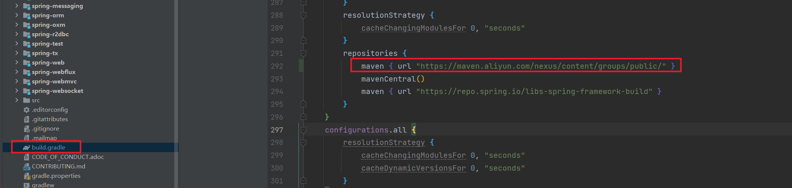
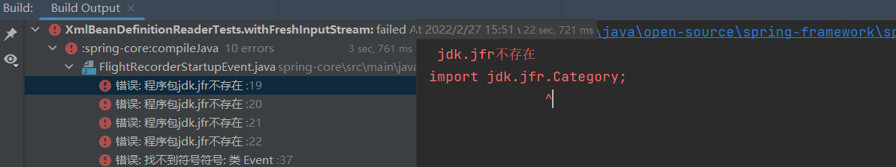
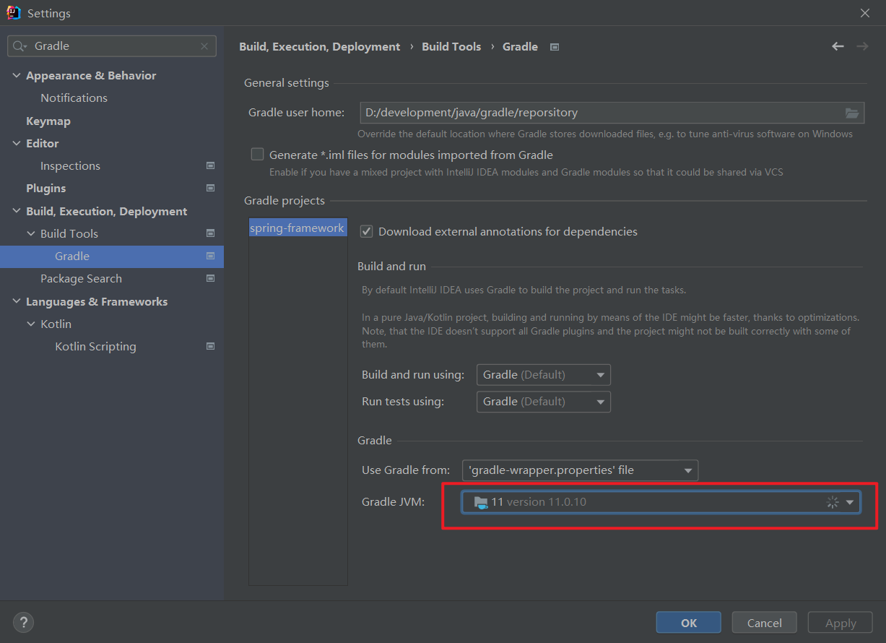
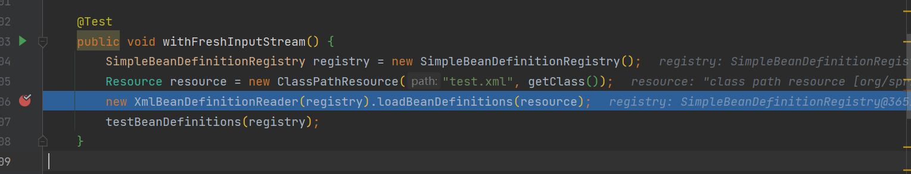
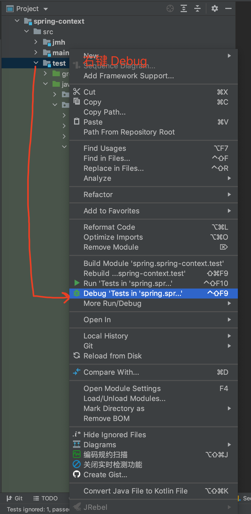

# Spring源码调试环境搭建

## 一. 依赖工具

- Jetbrains IDEA
- JDK11：Spring各版本对JDK版本依赖关系 [Spring Framework Versions · spring-projects/spring-framework Wiki (github.com)](https://github.com/spring-projects/spring-framework/wiki/Spring-Framework-Versions)

## 二. 源码拉取

后文源码分析都基于 Spring 5.3.10 版本的代码：[bigcoder84/spring-framework at v5.3.10 (github.com)](https://github.com/bigcoder84/spring-framework/tree/v5.3.10)

拉取分支后，在5.3.10tag基础上，新建 `5.3.10-annotation` 分支：

```shell
 git checkout -b 5.3.10-annotation v5.3.10
```

## 三. 导入IDEA

1. 由于 IDEA 对 Gradle支持非常好，我们只需要引入 Spring 的源码，IDEA会自动下载 Gradle
2. 下载完 Gradle 工具之后，IDEA 就会使用它自动下载相关的依赖库。因为 Gradle 支持使用 Maven 依赖，所以我们可以使用阿里云的 Maven 镜像



```shell
https://maven.aliyun.com/nexus/content/groups/public/
```

如果中间下载失败，点击【绿色刷新】按钮，继续下载依赖即可。

## 四. 调试 Spring 示例

依赖下载完，我们就可以调试 Spring 的源码。虽然说 Spring 并没有直接提供 example 使用示例项目，但是我们通过调试 Spring 提供的**单元测试**类，了解 Spring 的执行流程。

例如说：

1. 通过 Debug 运行 XmlBeanDefinitionReaderTests 类的 `#withFreshInputStream()` 的方法，调试 Spring 解析 XML 配合，获得 Bean 的**定义**。运行时可能会报如下错误：



原因：[Gradle](https://so.csdn.net/so/search?q=Gradle&spm=1001.2101.3001.7020)的编译环境为jdk8，但是jdk8中并没有jdk.jfr相关包的内容的存在，导致编译时找不到对应的类，报错。

解决方法：在IDEA中设置：`settings -> Build,Execution,Deployment -> Build Tools -> Gradle`中，设置Gradle JVM为jdk11。如下图所示：



最终运行成功后会进入断点：



## 五. 源码调试技巧

如果在阅读 Spring 源码的时候，发现一个逻辑的分支走不到，我们在该处打上断点，然后执行整个目录的单元测试。如下图所示：

