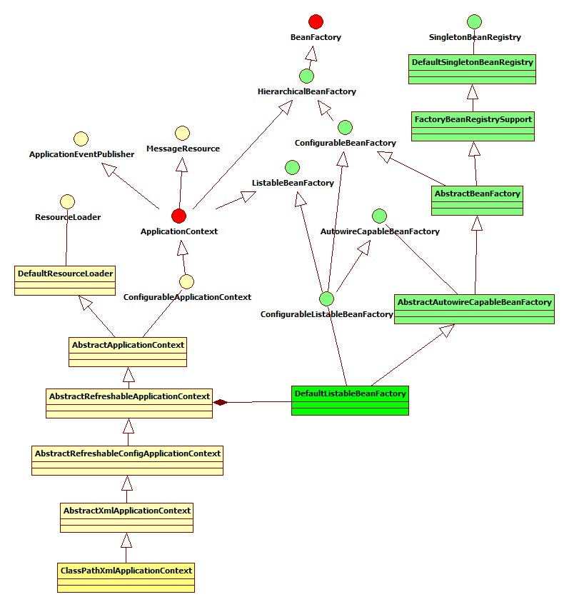
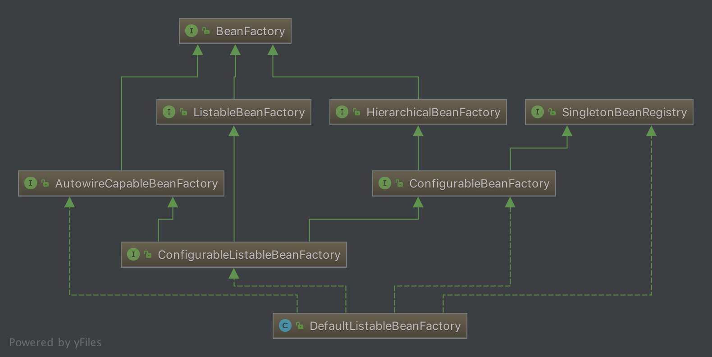
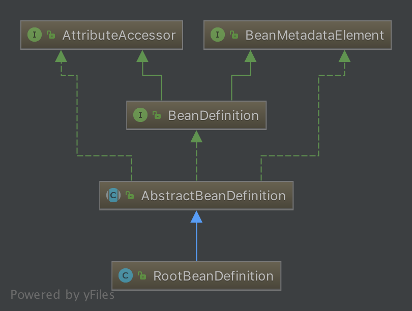
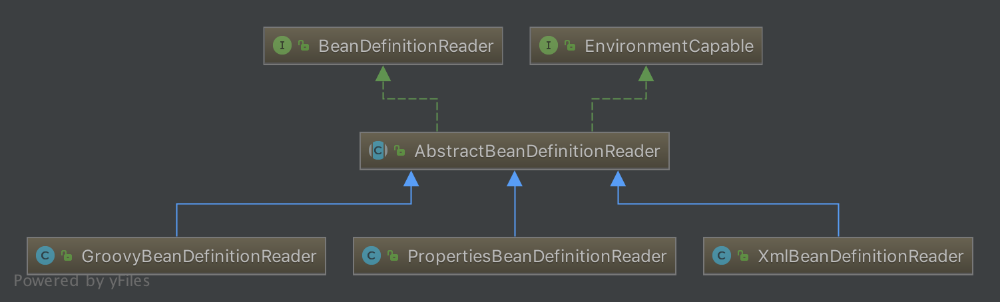
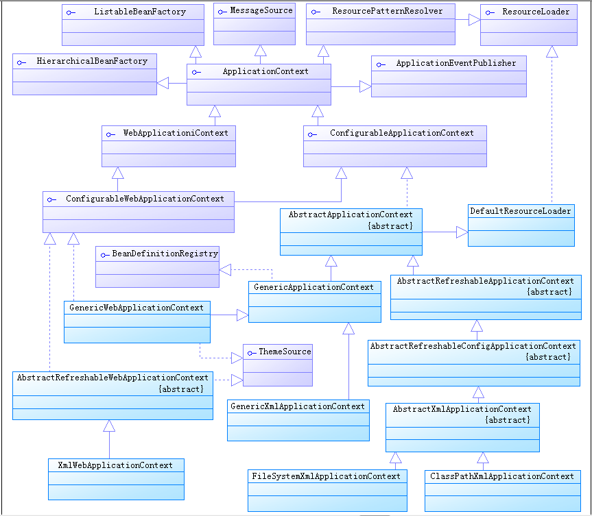

# 深入理解 Spring IoC

## 一. IOC理论

IoC 全称为 `Inversion of Control`，翻译为 “控制反转”，它还有一个别名为 DI（`Dependency Injection`）,即依赖注入。

如何理解“控制反转”呢？理解好它的关键在于我们需要回答如下四个问题：

1. 谁控制谁
2. 控制什么
3. 为何是反转
4. 哪些方面反转了

在回答这四个问题之前，我们先看 IoC 的定义：

> **所谓 IoC ，就是由 Spring IoC 容器来负责对象的生命周期和对象之间的关系**

在没有引入 IoC 的时候，被注入的对象直接依赖于被依赖的对象，有了 IoC 后，两者及其他们的关系都是通过 IoC Service Provider 来统一管理维护的。被注入的对象需要什么，直接跟 IoC Service Provider 打声招呼，后者就会把相应的被依赖对象注入到被注入的对象中，从而达到 IoC Service Provider 为被注入对象服务的目的。**所以 IoC 就是这么简单！原来是需要什么东西自己去拿，现在是需要什么东西让别人（IoC Service Provider）送过来**

现在在看上面那四个问题，答案就显得非常明显了:

1. **谁控制谁**：在传统的开发模式下，我们都是采用直接 new 一个对象的方式来创建对象，也就是说你依赖的对象直接由你自己控制，但是有了 IoC 容器后，则直接由 IoC 容器来控制。所以“谁控制谁”，当然是 IoC 容器控制对象
2. **控制什么**：控制对象创建到销毁的整个生命周期。
3. **为何是反转**：没有 IoC 的时候我们都是在自己对象中主动去创建被依赖的对象，这是正转。但是有了 IoC 后，所依赖的对象直接由 IoC 容器创建后注入到被注入的对象中，依赖的对象由原来的主动获取变成被动接受，所以是反转。
4. **哪些方面反转了**：所依赖对象的获取被反转了。

### 1.1 注入形式

所以，IoC Service Provider 为被注入对象提供被依赖对象也有如下几种方式：构造方法注入、setter方法注入、接口注入。

#### 1.1.1 setter方法注入

对于 Java Bean 对象而言，我们一般都是通过 getter 和 setter 方法来访问和设置对象的属性。所以，当前对象只需要为其所依赖的对象提供相对应的 setter 方法，就可以通过该方法将相应的依赖对象设置到被注入对象中。如下：

```java
public class YoungMan {

    private BeautifulGirl beautifulGirl;

    public void setBeautifulGirl(BeautifulGirl beautifulGirl) {
        this.beautifulGirl = beautifulGirl;
    }

}
```

#### 1.1.2 构造方法注入

构造器注入，顾名思义就是被注入的对象通过在其构造方法中声明依赖对象的参数列表，让外部知道它需要哪些依赖对象。

```java
YoungMan(BeautifulGirl beautifulGirl) {
    this.beautifulGirl = beautifulGirl;
}
```

#### 1.1.3 接口注入

接口方式注入显得比较霸道，因为它需要被依赖的对象实现不必要的接口，带有侵入性。一般都不推荐这种方式。

感兴趣的胖友，可以看看 [《依赖注入的三种实现形式 —— 接口注入（Interface Injection）》](http://wiki.jikexueyuan.com/project/spring-ioc/iocordi-1.html#6e5dfcd838f3a79e9129641785cf736f)

## 二. 各个组件



该图为 ClassPathXmlApplicationContext 的类继承体系结构，虽然只有一部分，但是它基本上包含了 IoC 体系中大部分的核心类和接口。

下面我们就针对这个图进行简单的拆分和补充说明。

### 2.1 Resource 体系

`org.springframework.core.io.Resource`，对资源的抽象。它的每一个实现类都代表了一种资源的访问策略，如 ClassPathResource、RLResource、FileSystemResource 等。

### 2.2 ResourceLoader 体系

有了资源，就应该有资源加载，Spring 利用 `org.springframework.core.io.ResourceLoader` 来进行统一资源加载，类图如下：


### 2.3 BeanFactory 体系

`org.springframework.beans.factory.BeanFactory`，是一个非常纯粹的 bean 容器，它是 IoC 必备的数据结构，其中 BeanDefinition 是它的基本结构。BeanFactory 内部维护着一个BeanDefinition map ，并可根据 BeanDefinition 的描述进行 bean 的创建和管理。



### 2.4 BeanDefinition 体系

`org.springframework.beans.factory.config.BeanDefinition` ，用来描述 Spring 中的 Bean 对象。



### 2.5 BeanDefinitionReader 体系

`org.springframework.beans.factory.support.BeanDefinitionReader` 的作用是读取 Spring 的配置文件的内容，并将其转换成 IoC 容器内部的数据结构：`BeanDefinition`



### 2.5 ApplicationContext 体系

`org.springframework.context.ApplicationContext` ，这个就是大名鼎鼎的 Spring 容器，它叫做应用上下文，与我们应用息息相关。它继承 BeanFactory ，所以它是 BeanFactory 的扩展升级版，如果BeanFactory 是屌丝的话，那么 ApplicationContext 则是名副其实的高富帅。由于 ApplicationContext 的结构就决定了它与 BeanFactory 的不同，其主要区别有：

1. 继承 `org.springframework.context.MessageSource` 接口，提供国际化的标准访问策略。
2. 继承 `org.springframework.context.ApplicationEventPublisher` 接口，提供强大的**事件**机制。
3. 扩展 ResourceLoader ，可以用来加载多种 Resource ，可以灵活访问不同的资源。
4. 对 Web 应用的支持。

