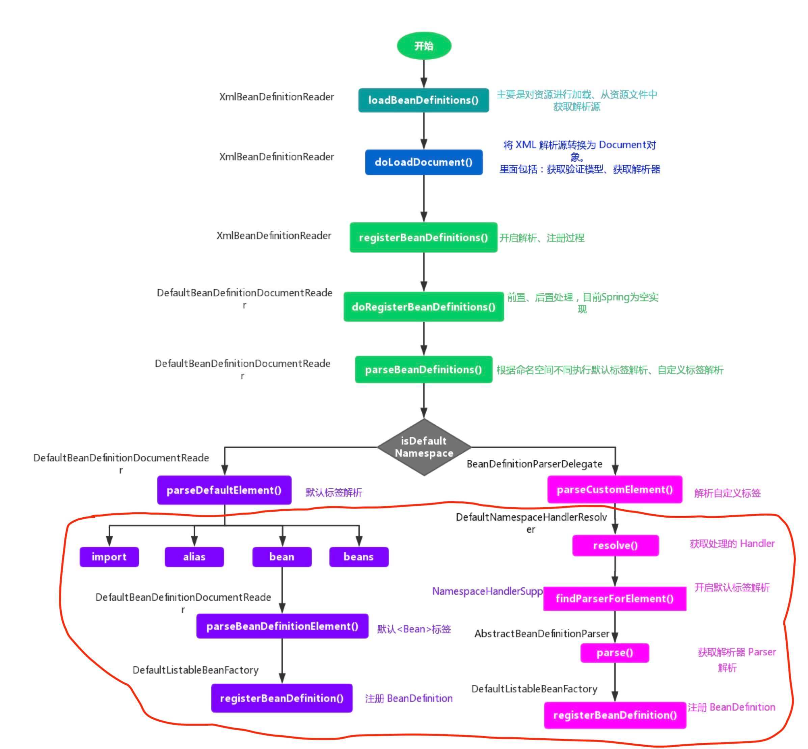

# IoC 之注册 BeanDefinitions

获取 XML Document 对象后，会根据该对象和 Resource 资源对象调用 `XmlBeanDefinitionReader#registerBeanDefinitions(Document doc, Resource resource)` 方法，开始注册 BeanDefinitions 之旅。代码如下：

```java
// AbstractBeanDefinitionReader.java
private final BeanDefinitionRegistry registry;

// XmlBeanDefinitionReader.java
public int registerBeanDefinitions(Document doc, Resource resource) throws BeanDefinitionStoreException {
	// <1> 创建 BeanDefinitionDocumentReader 对象
	BeanDefinitionDocumentReader documentReader = createBeanDefinitionDocumentReader();
	// <2> 获取已注册的 BeanDefinition 数量
	int countBefore = getRegistry().getBeanDefinitionCount();
	// <3> 创建 XmlReaderContext 对象
	// <4> 注册 BeanDefinition
	documentReader.registerBeanDefinitions(doc, createReaderContext(resource));
	// 计算新注册的 BeanDefinition 数量
	return getRegistry().getBeanDefinitionCount() - countBefore;
}
```

- `<1>` 处，调用 `#createBeanDefinitionDocumentReader()` 方法，实例化 BeanDefinitionDocumentReader 对象。
- `<2>` 处，调用 `BeanDefinitionRegistry#getBeanDefinitionCount()` 方法，获取**已注册**的 BeanDefinition 数量。
- `<3>` 处，调用 `#createReaderContext(Resource resource)` 方法，创建 XmlReaderContext 对象。
- `<4>` 处，调用 `BeanDefinitionDocumentReader#registerBeanDefinitions(Document doc, XmlReaderContext readerContext)` 方法，读取 XML 元素，注册 BeanDefinition 们。
- `<5>` 处，计**算新注册**的 BeanDefinition 数量。

## 一. createBeanDefinitionDocumentReader

`#createBeanDefinitionDocumentReader()`，实例化 BeanDefinitionDocumentReader 对象。代码如下：

```java
/**
 * documentReader 的类
 *
 * @see #createBeanDefinitionDocumentReader() 
 */
private Class<? extends BeanDefinitionDocumentReader> documentReaderClass = DefaultBeanDefinitionDocumentReader.class;

protected BeanDefinitionDocumentReader createBeanDefinitionDocumentReader() {
	return BeanUtils.instantiateClass(this.documentReaderClass);
}
```

- `documentReaderClass` 的默认值为 `DefaultBeanDefinitionDocumentReader.class` 。关于它，我们在后续的文章，详细解析。

## 二. registerBeanDefinitions

`BeanDefinitionDocumentReader#registerBeanDefinitions(Document doc, XmlReaderContext readerContext)` 方法，注册 BeanDefinition ，在接口 BeanDefinitionDocumentReader 中定义。代码如下：

```java
public interface BeanDefinitionDocumentReader {

	/**
	 * Read bean definitions from the given DOM document and
	 * register them with the registry in the given reader context.
	 * @param doc the DOM document
	 * @param readerContext the current context of the reader
	 * (includes the target registry and the resource being parsed)
	 * @throws BeanDefinitionStoreException in case of parsing errors
	 */
	void registerBeanDefinitions(Document doc, XmlReaderContext readerContext)
			throws BeanDefinitionStoreException;

}
```

**从给定的 Document 对象中解析定义的 BeanDefinition 并将他们注册到注册表中**。方法接收两个参数：

- `doc` 方法参数：待解析的 Document 对象。
- `readerContext` 方法，解析器的当前上下文，包括目标注册表和被解析的资源。它是根据 Resource 来创建的。

### 2.1 DefaultBeanDefinitionDocumentReader

BeanDefinitionDocumentReader 有且只有一个默认实现类 DefaultBeanDefinitionDocumentReader 。它对 `#registerBeanDefinitions(...)` 方法的实现代码如下：

```java
@Nullable
private XmlReaderContext readerContext;

@Nullable
private BeanDefinitionParserDelegate delegate;
    
/**
 * This implementation parses bean definitions according to the "spring-beans" XSD
 * (or DTD, historically).
 * <p>Opens a DOM Document; then initializes the default settings
 * specified at the {@code <beans/>} level; then parses the contained bean definitions.
 */
@Override
public void registerBeanDefinitions(Document doc, XmlReaderContext readerContext) {
    this.readerContext = readerContext;
    // 获得 XML Document Root Element
    // 执行注册 BeanDefinition
    doRegisterBeanDefinitions(doc.getDocumentElement());
}

/**
 * Register each bean definition within the given root {@code <beans/>} element.
 */
@SuppressWarnings("deprecation")  // for Environment.acceptsProfiles(String...)
protected void doRegisterBeanDefinitions(Element root) {
    // Any nested <beans> elements will cause recursion in this method. In
    // order to propagate and preserve <beans> default-* attributes correctly,
    // keep track of the current (parent) delegate, which may be null. Create
    // the new (child) delegate with a reference to the parent for fallback purposes,
    // then ultimately reset this.delegate back to its original (parent) reference.
    // this behavior emulates a stack of delegates without actually necessitating one.
    // 记录老的 BeanDefinitionParserDelegate 对象
    BeanDefinitionParserDelegate parent = this.delegate;
    // <1> 创建 BeanDefinitionParserDelegate 对象，并进行设置到 delegate
    this.delegate = createDelegate(getReaderContext(), root, parent);
    // <2> 检查 <beans /> 根标签的命名空间是否为空，或者是 http://www.springframework.org/schema/beans
    if (this.delegate.isDefaultNamespace(root)) {
        // <2.1> 处理 profile 属性。可参见《Spring3自定义环境配置 <beans profile="">》http://nassir.iteye.com/blog/1535799
        String profileSpec = root.getAttribute(PROFILE_ATTRIBUTE);
        if (StringUtils.hasText(profileSpec)) {
            // <2.2> 使用分隔符切分，可能有多个 profile 。
            String[] specifiedProfiles = StringUtils.tokenizeToStringArray(
                    profileSpec, BeanDefinitionParserDelegate.MULTI_VALUE_ATTRIBUTE_DELIMITERS);
            // <2.3> 如果所有 profile 都无效，则不进行注册
            // We cannot use Profiles.of(...) since profile expressions are not supported
            // in XML config. See SPR-12458 for details.
            if (!getReaderContext().getEnvironment().acceptsProfiles(specifiedProfiles)) {
                if (logger.isDebugEnabled()) {
                    logger.debug("Skipped XML bean definition file due to specified profiles [" + profileSpec +
                            "] not matching: " + getReaderContext().getResource());
                }
                return;
            }
        }
    }

    // <3> 解析前处理
    preProcessXml(root);
    // <4> 解析
    parseBeanDefinitions(root, this.delegate);
    // <5> 解析后处理
    postProcessXml(root);

    // 设置 delegate 回老的 BeanDefinitionParserDelegate 对象
    this.delegate = parent;
}
```

- `<1>` 处，创建 BeanDefinitionParserDelegate 对象，并进行设置到 `delegate` 。BeanDefinitionParserDelegate 是一个重要的类，它负责**解析 BeanDefinition**。代码如下：
- `<2>` 处，检查 `<beans />` **根**标签的命名空间是否为空，或者是 http://www.springframework.org/schema/beans
  - `<2.1>` 处，判断是否 `<beans />` 上配置了 `profile` 属性。不了解这块的胖友，可以看下 [《《Spring3自定义环境配置 》》](http://nassir.iteye.com/blog/1535799) 。
  - `<2.2>` 处，使用分隔符切分，可能有**多个** profile 。
  - `<2.3>` 处，判断，如果所有 profile 都无效，则 `return` 不进行注册。
- `<4>` 处，调用 `#parseBeanDefinitions(Element root, BeanDefinitionParserDelegate delegate)` 方法，进行解析逻辑。详细解析，见 [「3.1 parseBeanDefinitions」](http://svip.iocoder.cn/Spring/IoC-register-BeanDefinitions/#) 。
- `<3>` / `<5>` 处，解析**前后**的处理，目前这两个方法都是空实现，交由子类来实现。代码如下：

```java
protected void preProcessXml(Element root) {}

protected void postProcessXml(Element root) {}
```

#### 2.1.1 parseBeanDefinitions

`#parseBeanDefinitions(Element root, BeanDefinitionParserDelegate delegate)` 方法，进行解析逻辑。代码如下：

```java
/**
 * Parse the elements at the root level in the document:
 * "import", "alias", "bean".
 * @param root the DOM root element of the document
 */
protected void parseBeanDefinitions(Element root, BeanDefinitionParserDelegate delegate) {
    // <1> 如果根节点使用默认命名空间，执行默认解析
    if (delegate.isDefaultNamespace(root)) {
        // 遍历子节点
        NodeList nl = root.getChildNodes();
        for (int i = 0; i < nl.getLength(); i++) {
            Node node = nl.item(i);
            if (node instanceof Element) {
                Element ele = (Element) node;
                // <1> 如果该节点使用默认命名空间，执行默认解析
                if (delegate.isDefaultNamespace(ele)) {
                    parseDefaultElement(ele, delegate);
                // 如果该节点非默认命名空间，执行自定义解析
                } else {
                    delegate.parseCustomElement(ele);
                }
            }
        }
    // <2> 如果根节点非默认命名空间，执行自定义解析
    } else {
        delegate.parseCustomElement(root);
    }
}
```

- Spring 有两种Bean 声明方式：
  - 配置文件式声明：`<bean id="studentService" class="org.springframework.core.StudentService" />` 。对应 `<1>` 处。
  - 自定义注解方式：`<tx:annotation-driven>` 。对应 `<2>` 处。
- `<1>` 处，如果**根**节点或**子**节点**使用**默认命名空间，调用 `#parseDefaultElement(Element ele, BeanDefinitionParserDelegate delegate)` 方法，执行默认解析。代码如下：

```java
private void parseDefaultElement(Element ele, BeanDefinitionParserDelegate delegate) {
	if (delegate.nodeNameEquals(ele, IMPORT_ELEMENT)) { // import
		importBeanDefinitionResource(ele);
	} else if (delegate.nodeNameEquals(ele, ALIAS_ELEMENT)) { // alias
		processAliasRegistration(ele);
	} else if (delegate.nodeNameEquals(ele, BEAN_ELEMENT)) { // bean
		processBeanDefinition(ele, delegate);
	} else if (delegate.nodeNameEquals(ele, NESTED_BEANS_ELEMENT)) { // beans
		// recurse
		doRegisterBeanDefinitions(ele);
	}
}
```

- `<2>` 处，如果**根**节点或**子**节点**不使用**默认命名空间，调用 `BeanDefinitionParserDelegate#parseCustomElement(Element ele)` 方法，执行**自定义**解析。详细的解析，见后续文章。

## 三. createReaderContext

`#createReaderContext(Resource resource)` 方法，创建 XmlReaderContext 对象。代码如下：

```java
private ProblemReporter problemReporter = new FailFastProblemReporter();

private ReaderEventListener eventListener = new EmptyReaderEventListener();

private SourceExtractor sourceExtractor = new NullSourceExtractor();

@Nullable
private NamespaceHandlerResolver namespaceHandlerResolver;

/**
 * Create the {@link XmlReaderContext} to pass over to the document reader.
 */
public XmlReaderContext createReaderContext(Resource resource) {
	return new XmlReaderContext(resource, this.problemReporter, this.eventListener,
			this.sourceExtractor, this, getNamespaceHandlerResolver());
}
```

关于 XmlReaderContext 的详细解析，见后续文章。

## 四. 小结

至此，`XmlBeanDefinitionReader#doLoadBeanDefinitions(InputSource inputSource, Resource resource)` 方法中，做的三件事情已经全部分析完毕，下面将对 **BeanDefinition 的解析过程**做详细分析说明。

另外，`XmlBeanDefinitionReader#doLoadBeanDefinitions(InputSource inputSource, Resource resource)` 方法，整体时序图如下：



