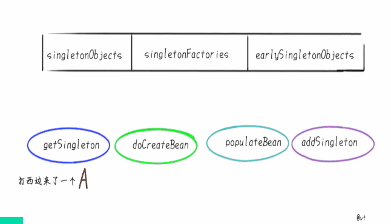

# Spring循环依赖

> 本文转载至：https://juejin.cn/post/6844904122160775176

## 前言

**Spring**如何解决的循环依赖，是近两年流行起来的一道Java面试题。

其实笔者本人对这类**框架源码题**还是持一定的怀疑态度的。

如果笔者作为面试官，可能会问一些诸如“如果注入的属性为**null**，你会从哪几个方向去排查”这些**场景题**。

那么既然写了这篇文章，闲话少说，发车看看**Spring是如何解决的循环依赖**，以及带大家看清循环依赖的本质是什么。

## 正文

通常来说，如果问Spring内部如何解决循环依赖，一定是单默认的**单例**Bean中，属性互相引用的场景。

比如几个Bean之间的互相引用：


甚至自己“循环”依赖自己：


先说明前提：**原型**(Prototype)的场景是**不支持**循环依赖的，通常会走到`AbstractBeanFactory`类中下面的判断，抛出异常。

```java
if (isPrototypeCurrentlyInCreation(beanName)) {
  throw new BeanCurrentlyInCreationException(beanName);
}
```

原因很好理解，创建**新的A**时，发现要注入**原型字段B**，又创建**新的B**发现要注入**原型字段A**...

这就套娃了, 你猜是先**StackOverflow**还是**OutOfMemory**？

Spring怕你不好猜，就先抛出了**BeanCurrentlyInCreationException**


基于构造器的循环依赖，就更不用说了，[官方文档](https://docs.spring.io/spring/docs/current/spring-framework-reference/core.html#beans-dependency-resolution)都摊牌了，你想让构造器注入支持循环依赖，是不存在的，不如把代码改了。

那么默认单例的属性注入场景，**Spring**是如何支持循环依赖的？

## Spring解决循环依赖

首先，Spring内部维护了三个**Map**，也就是我们通常说的**三级缓存**。

笔者翻阅Spring文档倒是没有找到三级缓存的概念，可能也是本土为了方便理解的词汇。

在Spring的`DefaultSingletonBeanRegistry`类中，你会赫然发现类上方挂着这三个Map：

- *singletonObjects* 它是我们最熟悉的朋友，俗称“**单例池**”“**容器**”，缓存创建完成单例Bean的地方。
- *singletonFactories* 映射创建Bean的原始工厂
- *earlySingletonObjects* 映射Bean的**早期**引用，也就是说在这个Map里的Bean不是完整的，甚至还不能称之为“**Bean**”，只是一个**Instance**.

后两个Map其实是“**垫脚石**”级别的，只是创建Bean的时候，用来借助了一下，创建完成就清掉了。

所以笔者前文对“三级缓存”这个词有些迷惑，可能是因为注释都是以Cache of开头吧。

为什么成为后两个Map为**垫脚石**，假设最终放在**singletonObjects**的Bean是你想要的一杯“*凉白开*”。

那么Spring准备了两个杯子，即*singletonFactories*和*earlySingletonObjects*来回“倒腾”几番，把热水晾成“*凉白开*”放到**singletonObjects**中。

闲话不说，都浓缩在图里：



上面的是一张GIF，如果你没看到可能还没加载出来。*三秒一帧，不是你电脑卡*。

笔者画了17张图**简化表述**了Spring的主要步骤，GIF上方即是刚才提到的三级缓存，下方展示是**主要**的几个方法。

当然了，这个地步你肯定要结合[Spring源码](https://github.com/spring-projects/spring-framework)来看，要不肯定看不懂。

如果你只是想大概了解，或者面试，可以先记住笔者上文提到的“**三级缓存**”，以及下文即将要说的本质。

## 循环依赖的本质

上文了解完Spring如何处理循环依赖之后，让我们跳出“**阅读源码**”的思维，假设让你实现一个有以下特点的功能，你会怎么做？

- 将指定的一些类实例为单例
- 类中的字段也都实例为单例
- 支持循环依赖

举个例子，假设有类A：

```java
public class A {
    private B b;
}
```

类B：

```java
public class B {    
    private A a;
}
```

说白了让你**模仿Spring**：**假装A**和**B**是被@Component修饰，并且类中的字段**假装**是@Autowired修饰的，处理完放到Map中。

其实非常简单，笔者写了一份粗糙的代码，可供参考：

```java
/**
 * 放置创建好的bean  Map
 */
private static Map<String, Object> cacheMap = new HashMap<>(2);

public static void main(String[] args) {  //  假装扫描出来的对象
    Class[] classes = {A.class, B.class};
    //  假装项目初始化实例化所有bean
    for (Class aClass : classes) {
        getBean(aClass);
    }
    //  check
    System.out.println(getBean(B.class).getA() == getBean(A.class));
    System.out.println(getBean(A.class).getB() == getBean(B.class));
}

@SneakyThrows
private static <T> T getBean(Class<T> beanClass) {
    //  本文用类名小写  简单代替bean的命名规则
    String beanName = beanClass.getSimpleName().toLowerCase();
    //  如果已经是一个bean，则直接返回
    if (cacheMap.containsKey(beanName)) {
        return (T) cacheMap.get(beanName);
    }
    //  将对象本身实例化
    Object object = beanClass.getDeclaredConstructor().newInstance();
    //  放入缓存
    cacheMap.put(beanName, object);
    //  把所有字段当成需要注入的bean，创建并注入到当前bean中
    Field[] fields = object.getClass().getDeclaredFields();
    for (Field field : fields) {
        field.setAccessible(true);
        //  获取需要注入字段的class
        Class<?> fieldClass = field.getType();
        String fieldBeanName = fieldClass.getSimpleName().toLowerCase();
        //  如果需要注入的bean，已经在缓存Map中，那么把缓存Map中的值注入到该field即可
        //  如果缓存没有  继续创建
        field.set(object, cacheMap.containsKey(fieldBeanName) ? cacheMap.get(fieldBeanName) : getBean(fieldClass));
    }
    //  属性填充完成，返回
    return (T) object;
}
```

这段代码的效果，其实就是处理了循环依赖，并且处理完成后，cacheMap中放的就是完整的“**Bean**”了


这就是“**循环依赖**”的本质，而不是“Spring如何解决循环依赖”。

之所以要举这个例子，是发现一小部分盆友陷入了“**阅读源码的泥潭**”，而忘记了问题的本质。

为了看源码而看源码，结果一直看不懂，却忘了本质是什么。

如果真看不懂，不如先写出基础版本，逆推Spring为什么要这么实现，可能效果会更好。

### what？问题的本质居然是two sum！

看完笔者刚才的代码有没有似曾相识？没错，和**two sum**的解题是类似的。

不知道**two sum**是什么梗的，笔者和你介绍一下：

**two sum**是刷题网站[leetcode](https://leetcode-cn.com/problems/two-sum/)序号为1的题，也就是大多人的算法入门的第一题。

常常被人调侃，有**算法面**的公司，被面试官钦定了，合的来。那就来一道**two sum**走走过场。

问题内容是：给定**一个数组**，给定**一个数字**。返回数组中可以**相加得到指定数字**的两个**索引**。

比如：给定`nums = [2, 7, 11, 15], target = 9`

那么要返回 `[0, 1]`，因为`2 + 7 = 9`

这道题的优解是，一次遍历+HashMap：

```java
class Solution {
    public int[] twoSum(int[] nums, int target) {
        Map<Integer, Integer> map = new HashMap<>();
        for (int i = 0; i < nums.length; i++) {
            int complement = target - nums[i];
            if (map.containsKey(complement)) {
                return new int[]{map.get(complement), i};
            }
            map.put(nums[i], i);
        }
        throw new IllegalArgumentException("No    two    sum    solution");
    }

```

先去Map中找**需要的数字**，没有就将**当前的数字**保存在Map中，如果找到**需要的数字**，则一起返回。

和笔者上面的代码是不是一样？

先去缓存里找**Bean**，没有则**实例化当前的Bean**放到Map，如果有需要**依赖**当前Bean的，就能从Map取到。

## 结尾

如果你是上文笔者提到的“**陷入阅读源码的泥潭**”的读者，上文应该可以帮助到你。

可能还有盆友有疑问，为什么一道“**two-sum**”，Spring处理的如此复杂？这个想想Spring支持多少功能就知道了，各种实例方式..各种注入方式..各种Bean的加载，校验..各种**callback**，aop处理等等..

Spring可不只有**依赖注入**，同样Java也不仅是**Spring**。如果我们陷入了某个“牛角尖”，不妨跳出来看看，可能会更佳清晰哦。