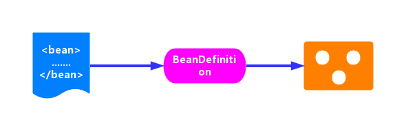

# IoC 之装载 BeanDefinitions 总结

前面文章从源码层次，分析了 IoC BeanDefinition 装载的整个过程，这篇就这些内容做一个总结将其连贯起来。

在前文提过，IoC 容器的初始化过程分为三步骤：Resource 定位、BeanDefinition 的载入和解析，BeanDefinition 注册。



- **Resource 定位**。我们一般用外部资源来描述 Bean 对象，所以在初始化 IoC 容器的第一步就是需要定位这个外部资源。
- BeanDefinition 的装载和解析。装载就是 BeanDefinition 的载入。BeanDefinitionReader 读取、解析 Resource 资源，也就是将用户定义的 Bean 表示成 IoC 容器的内部数据结构：BeanDefinition 。
  - 在 IoC 容器内部维护着一个 BeanDefinition Map 的数据结构
  - 在配置文件中每一个 `<bean>` 都对应着一个 BeanDefinition 对象。
- BeanDefinition 注册。向 IoC 容器注册在第二步解析好的 BeanDefinition，这个过程是通过 BeanDefinitionRegistry 接口来实现的。在 IoC 容器内部其实是将第二个过程解析得到的 BeanDefinition 注入到一个 HashMap 容器中，IoC 容器就是通过这个 HashMap 来维护这些 BeanDefinition 的。
  - 在这里需要注意的一点是这个过程并没有完成依赖注入（Bean 创建），Bean 创建是发生在应用第一次调用 `#getBean(...)` 方法，向容器索要 Bean 时。
  - 当然我们可以通过设置预处理，即对某个 Bean 设置 `lazyinit = false` 属性，那么这个 Bean 的依赖注入就会在容器初始化的时候完成。

还记得在博客 [《IoC之加载BeanDefinition》](./_14IoC之加载BeanDefinition.md) 中提供的一段代码吗？这里我们同样也以这段代码作为我们研究 IoC 初始化过程的开端，如下：

```java
ClassPathResource resource = new ClassPathResource("bean.xml");
DefaultListableBeanFactory factory = new DefaultListableBeanFactory();
XmlBeanDefinitionReader reader = new XmlBeanDefinitionReader(factory);
reader.loadBeanDefinitions(resource);
```

刚刚开始的时候可能对上面这几行代码不知道什么意思，现在应该就一目了然了：

- `ClassPathResource resource = new ClassPathResource("bean.xml");` ： 根据 Xml 配置文件创建 Resource 资源对象。ClassPathResource 是 Resource 接口的子类，`bean.xml` 文件中的内容是我们定义的 Bean 信息。
- `DefaultListableBeanFactory factory = new DefaultListableBeanFactory();` ：创建一个 BeanFactory 。DefaultListableBeanFactory 是 BeanFactory 的一个子类，BeanFactory 作为一个接口，其实它本身是不具有独立使用的功能的，而 DefaultListableBeanFactory 则是真正可以独立使用的 IoC 容器，它是整个 Spring IoC 的始祖，在后续会有专门的文章来分析它。
- `XmlBeanDefinitionReader reader = new XmlBeanDefinitionReader(factory);` ：创建 XmlBeanDefinitionReader 读取器，用于载入 BeanDefinition 。
- `reader.loadBeanDefinitions(resource);`：开始 BeanDefinition 的载入和注册进程，完成后的 BeanDefinition 放置在 IoC 容器中。

## 一. Resource定位

Spring 为了解决资源定位的问题，提供了两个接口：Resource、ResourceLoader，其中：

- Resource 接口是 Spring 统一资源的抽象接口
- ResourceLoader 则是 Spring 资源加载的统一抽象。
- 关于Resource、ResourceLoader 的更多知识请关注 [《IoC 之 Spring 统一资源加载策略》](./_13IoC之Spring统一资源加载策略.md)

Resource 资源的定位需要 Resource 和 ResourceLoader 两个接口互相配合，在上面那段代码中 `new ClassPathResource("bean.xml")` 为我们定义了资源，那么 ResourceLoader 则是在什么时候初始化的呢？看 XmlBeanDefinitionReader 构造方法：

```java
// XmlBeanDefinitionReader.java
public XmlBeanDefinitionReader(BeanDefinitionRegistry registry) {
	super(registry);
}
```

直接调用父类 AbstractBeanDefinitionReader 构造方法，代码如下：

```java
// AbstractBeanDefinitionReader.java

protected AbstractBeanDefinitionReader(BeanDefinitionRegistry registry) {
	Assert.notNull(registry, "BeanDefinitionRegistry must not be null");
	this.registry = registry;
	// Determine ResourceLoader to use.
	if (this.registry instanceof ResourceLoader) {
		this.resourceLoader = (ResourceLoader) this.registry;
	}	else {
		this.resourceLoader = new PathMatchingResourcePatternResolver();
	}

	// Inherit Environment if possible
	if (this.registry instanceof EnvironmentCapable) {
		this.environment = ((EnvironmentCapable) this.registry).getEnvironment();
	} else {
		this.environment = new StandardEnvironment();
	}
}
```

- 核心在于设置 resourceLoader 这段，如果设置了 ResourceLoader 则用设置的，否则使用 PathMatchingResourcePatternResolver ，该类是一个集大成者的 ResourceLoader。

## 二. BeanDefinition 的载入和解析

`reader.loadBeanDefinitions(resource);` 代码段，开启 BeanDefinition 的解析过程。如下：

```java
// XmlBeanDefinitionReader.java
@Override
public int loadBeanDefinitions(Resource resource) throws BeanDefinitionStoreException {
	return loadBeanDefinitions(new EncodedResource(resource));
}
```

在这个方法会将资源 resource 包装成一个 EncodedResource 实例对象，然后调用 `#loadBeanDefinitions(EncodedResource encodedResource)` 方法。而将 Resource 封装成 EncodedResource 主要是为了对 Resource 进行编码，保证内容读取的正确性。代码如下：

```java
// XmlBeanDefinitionReader.java

public int loadBeanDefinitions(EncodedResource encodedResource) throws BeanDefinitionStoreException {
	// ... 省略一些代码
	try {
		// 将资源文件转为 InputStream 的 IO 流
		InputStream inputStream = encodedResource.getResource().getInputStream();
		try {
			// 从 InputStream 中得到 XML 的解析源
			InputSource inputSource = new InputSource(inputStream);
			if (encodedResource.getEncoding() != null) {
				inputSource.setEncoding(encodedResource.getEncoding());
			}
			// ... 具体的读取过程
			return doLoadBeanDefinitions(inputSource, encodedResource.getResource());
		}
		finally {
			inputStream.close();
		}
	}
	// 省略一些代码
}
```

从 `encodedResource` 源中获取 xml 的解析源，然后调用 `#doLoadBeanDefinitions(InputSource inputSource, Resource resource)` 方法，执行具体的解析过程。

```java
// XmlBeanDefinitionReader.java

protected int doLoadBeanDefinitions(InputSource inputSource, Resource resource)
			throws BeanDefinitionStoreException {
	try {
		// 获取 XML Document 实例
		Document doc = doLoadDocument(inputSource, resource);
		// 根据 Document 实例，注册 Bean 信息
		int count = registerBeanDefinitions(doc, resource);
		return count;
	}
	// ... 省略一堆配置
}
```

在该方法中主要做两件事：

1. 根据 xml 解析源获取相应的 Document 对象。
2. 调用 `#registerBeanDefinitions(Document doc, Resource resource)` 方法，开启 BeanDefinition 的解析注册过程 。

### 2.1 转换为 Document 对象

调用 `#doLoadDocument(InputSource inputSource, Resource resource)` 方法，会将 Bean 定义的资源转换为 Document 对象。代码如下：

```java
// XmlBeanDefinitionReader.java

protected Document doLoadDocument(InputSource inputSource, Resource resource) throws Exception {
	return this.documentLoader.loadDocument(inputSource, getEntityResolver(), this.errorHandler,
			getValidationModeForResource(resource), isNamespaceAware());
}
```

该方法接受五个参数：

- `inputSource` ：加载 Document 的 Resource 源。
- `entityResolver` ：解析文件的解析器。详见：[IoC 之获取 Document 对象](./_16IoC之获取Document对象.md)
- `errorHandler` ：处理加载 Document 对象的过程的错误。
- `validationMode` ：验证模式。详见：[IoC 之获取 Document 对象](./_16IoC之获取Document对象.md)
- `namespaceAware` ：命名空间支持。如果要提供对 XML 名称空间的支持，则为 `true` 。

`#loadDocument(InputSource inputSource, EntityResolver entityResolver, ErrorHandler errorHandler, int validationMode, boolean namespaceAware)` 方法，在类 DefaultDocumentLoader 中提供了实现。代码如下：

```java
// DefaultDocumentLoader.java

@Override
public Document loadDocument(InputSource inputSource, EntityResolver entityResolver,
		ErrorHandler errorHandler, int validationMode, boolean namespaceAware) throws Exception {
	// 创建 DocumentBuilderFactory
	DocumentBuilderFactory factory = createDocumentBuilderFactory(validationMode, namespaceAware);
	// 创建 DocumentBuilder
	DocumentBuilder builder = createDocumentBuilder(factory, entityResolver, errorHandler);
	// 解析 XML InputSource 返回 Document 对象
	return builder.parse(inputSource);
}
```

### 2.2 注册BeanDefinition过程

这到这里，就已经将定义的 Bean 资源文件，载入并转换为 Document 对象了。那么，下一步就是如何将其解析为 SpringIoC 管理的 BeanDefinition 对象，并将其注册到容器中。这个过程由方法 `#registerBeanDefinitions(Document doc, Resource resource)` 方法来实现。代码如下：

```java
// XmlBeanDefinitionReader.java

public int registerBeanDefinitions(Document doc, Resource resource) throws BeanDefinitionStoreException {
	// 创建 BeanDefinitionDocumentReader 对象
	BeanDefinitionDocumentReader documentReader = createBeanDefinitionDocumentReader();
	// 获取已注册的 BeanDefinition 数量
	int countBefore = getRegistry().getBeanDefinitionCount();
	// 创建 XmlReaderContext 对象
	// 注册 BeanDefinition
	documentReader.registerBeanDefinitions(doc, createReaderContext(resource));
	// 计算新注册的 BeanDefinition 数量
	return getRegistry().getBeanDefinitionCount() - countBefore;
}
```

- 首先，创建 BeanDefinition 的解析器 BeanDefinitionDocumentReader 。
- 然后，调用该 BeanDefinitionDocumentReader 的 `#registerBeanDefinitions(Document doc, XmlReaderContext readerContext)` 方法，开启解析过程，这里使用的是委派模式，具体的实现由子类 DefaultBeanDefinitionDocumentReader 完成。代码如下：

```java
// DefaultBeanDefinitionDocumentReader.java

@Override
public void registerBeanDefinitions(Document doc, XmlReaderContext readerContext) {
    this.readerContext = readerContext;
    // 获得 XML Document Root Element
    // 执行注册 BeanDefinition
    doRegisterBeanDefinitions(doc.getDocumentElement());
}
```

#### 2.2.1 对 Document 对象的解析

从 Document 对象中获取根元素 root，然后调用 ``#doRegisterBeanDefinitions(Element root)` 方法，开启真正的解析过程。代码如下：

```java
// DefaultBeanDefinitionDocumentReader.java

protected void doRegisterBeanDefinitions(Element root) {
    // ... 省略部分代码（非核心）
    this.delegate = createDelegate(getReaderContext(), root, parent);

    // 解析前处理
    preProcessXml(root);
    // 解析
    parseBeanDefinitions(root, this.delegate);
    // 解析后处理
    postProcessXml(root);

}
```

- `#preProcessXml(Element root)`、`#postProcessXml(Element root)` 为前置、后置增强处理，目前 Spring 中都是空实现。
- `#parseBeanDefinitions(Element root, BeanDefinitionParserDelegate delegate)` 是对根元素 root 的解析注册过程。代码如下：

```java
// DefaultBeanDefinitionDocumentReader.java

protected void parseBeanDefinitions(Element root, BeanDefinitionParserDelegate delegate) {
    // 如果根节点使用默认命名空间，执行默认解析
    if (delegate.isDefaultNamespace(root)) {
        // 遍历子节点
        NodeList nl = root.getChildNodes();
        for (int i = 0; i < nl.getLength(); i++) {
            Node node = nl.item(i);
            if (node instanceof Element) {
                Element ele = (Element) node;
                // 如果该节点使用默认命名空间，执行默认解析
                if (delegate.isDefaultNamespace(ele)) {
                    parseDefaultElement(ele, delegate);
                // 如果该节点非默认命名空间，执行自定义解析
                } else {
                    delegate.parseCustomElement(ele);
                }
            }
        }
    // 如果根节点非默认命名空间，执行自定义解析
    } else {
        delegate.parseCustomElement(root);
    }
}
```

`parseDefaultElement`方法解析默认命名空间标签：

```java
private void parseDefaultElement(Element ele, BeanDefinitionParserDelegate delegate) {
	// 解析import标签
	if (delegate.nodeNameEquals(ele, IMPORT_ELEMENT)) {
		importBeanDefinitionResource(ele);
	}
	else if (delegate.nodeNameEquals(ele, ALIAS_ELEMENT)) {
		processAliasRegistration(ele);
	}
	// 解析bean标签，生成BeanDefinition，并注册进IoC
	else if (delegate.nodeNameEquals(ele, BEAN_ELEMENT)) {
		processBeanDefinition(ele, delegate);
	}
	else if (delegate.nodeNameEquals(ele, NESTED_BEANS_ELEMENT)) {
		// recurse
		doRegisterBeanDefinitions(ele);
	}
}
```

#### 2.2.2 注册 BeanDefinition

经过上面的解析，则将 Document 对象里面的 Bean 标签解析成了一个个的 BeanDefinition ，下一步则是将这些 BeanDefinition 注册到 IoC 容器中。动作的触发是在解析 Bean 标签完成后，代码如下：

```java
// DefaultBeanDefinitionDocumentReader.java

protected void processBeanDefinition(Element ele, BeanDefinitionParserDelegate delegate) {
    // 进行 bean 元素解析。
    // 如果解析成功，则返回 BeanDefinitionHolder 对象。而 BeanDefinitionHolder 为 name 和 alias 的 BeanDefinition 对象
    // 如果解析失败，则返回 null 。
    BeanDefinitionHolder bdHolder = delegate.parseBeanDefinitionElement(ele);
    if (bdHolder != null) {
        // 进行自定义标签处理
        bdHolder = delegate.decorateBeanDefinitionIfRequired(ele, bdHolder);
        try {
            // 进行 BeanDefinition 的注册
            // Register the final decorated instance.
            BeanDefinitionReaderUtils.registerBeanDefinition(bdHolder, getReaderContext().getRegistry());
        } catch (BeanDefinitionStoreException ex) {
            getReaderContext().error("Failed to register bean definition with name '" +
                    bdHolder.getBeanName() + "'", ele, ex);
        }
        // 发出响应事件，通知相关的监听器，已完成该 Bean 标签的解析。
        // Send registration event.
        getReaderContext().fireComponentRegistered(new BeanComponentDefinition(bdHolder));
    }
}
```

调用 `BeanDefinitionReaderUtils.registerBeanDefinition()` 方法，来注册。其实，这里面也是调用 BeanDefinitionRegistry 的 `#registerBeanDefinition(String beanName, BeanDefinition beanDefinition)` 方法，来注册 BeanDefinition 。不过，最终的实现是在 DefaultListableBeanFactory 中实现，代码如下：

```java
// DefaultListableBeanFactory.java
@Override
public void registerBeanDefinition(String beanName, BeanDefinition beanDefinition)
        throws BeanDefinitionStoreException {
    // ...省略校验相关的代码
    // 从缓存中获取指定 beanName 的 BeanDefinition
    BeanDefinition existingDefinition = this.beanDefinitionMap.get(beanName);
    // 如果已经存在
    if (existingDefinition != null) {
        // 如果存在但是不允许覆盖，抛出异常
        if (!isAllowBeanDefinitionOverriding()) {
             throw new BeanDefinitionOverrideException(beanName, beanDefinition, existingDefinition);
        } else {
           // ...省略 logger 打印日志相关的代码
        }
        // 【重点】允许覆盖，直接覆盖原有的 BeanDefinition 到 beanDefinitionMap 中。
        this.beanDefinitionMap.put(beanName, beanDefinition);
    // 如果未存在
    } else {
        // ... 省略非核心的代码
        // 【重点】添加到 BeanDefinition 到 beanDefinitionMap 中。
        this.beanDefinitionMap.put(beanName, beanDefinition);
    }
    // 重新设置 beanName 对应的缓存
    if (existingDefinition != null || containsSingleton(beanName)) {
        resetBeanDefinition(beanName);
    }
}
```

- 这段代码最核心的部分是这句 `this.beanDefinitionMap.put(beanName, beanDefinition)` 代码段。所以，注册过程也不是那么的高大上，就是利用一个 Map 的集合对象来存放：`key` 是 `beanName` ，`value` 是 BeanDefinition 对象。

## 三. 小结

至此，整个 IoC 的初始化过程就已经完成了，从 Bean 资源的定位，转换为 Document 对象，接着对其进行解析，最后注册到 IoC 容器中，都已经完美地完成了。现在 IoC 容器中已经建立了整个 Bean 的配置信息，这些 Bean 可以被检索、使用、维护，他们是控制反转的基础，是后面注入 Bean 的依赖。最后用一张流程图来结束这篇总结之文。

