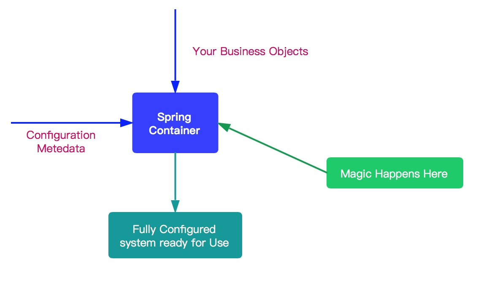

# IoC 之开启 Bean 的加载



Spring IoC 容器所起的作用如上图所示，它会以某种方式加载 Configuration Metadata，将其解析注册到容器内部，然后会根据这些信息绑定整个系统的对象，最终组装成一个可用的基于轻量级容器的应用系统。

Spring 在实现上述功能中，将整个流程分为两个阶段：容器初始化阶段和加载bean 阶段。分别如下：

1. 容器初始化阶段：
   - 首先，通过某种方式加载 Configuration Metadata (主要是依据 Resource、ResourceLoader 两个体系) 。
   - 然后，容器会对加载的 Configuration MetaData 进行解析和分析，并将分析的信息组装成 BeanDefinition 。
   - 最后，将 BeanDefinition 保存注册到相应的 BeanDefinitionRegistry 中。
   - 至此，Spring IoC 的初始化工作完成。
2. 加载 Bean 阶段：
   - 经过容器初始化阶段后，应用程序中定义的 bean 信息已经全部加载到系统中了，当我们显示或者隐式地调用 `BeanFactory#getBean(...)` 方法时，则会触发加载 Bean 阶段。
   - 在这阶段，容器会首先检查所请求的对象是否已经初始化完成了，如果没有，则会根据注册的 Bean 信息实例化请求的对象，并为其注册依赖，然后将其返回给请求方。
   - 至此第二个阶段也已经完成。

第一阶段，我们已经在前面的文章中详细分析了。所以从这篇文章开始分析第二个阶段：加载 Bean 阶段。

## 一. getBean

当我们显示或者隐式地调用 `BeanFactory#getBean(String name)` 方法时，则会触发加载 Bean 阶段。代码如下：

```java
// AbstractBeanFactory.java

@Override
public Object getBean(String name) throws BeansException {
	return doGetBean(name, null, null, false);
}
```

内部调用 `doGetBean(String name, final Class<T> requiredType, Object[] args, boolean typeCheckOnly)` 方法，其接受四个方法参数：

- `name` ：要获取 Bean 的名字
- `requiredType` ：要获取 bean 的类型
- `args` ：创建 Bean 时传递的参数。这个参数仅限于创建 Bean 时使用。
- `typeCheckOnly` ：是否为类型检查。

## 二. doGetBean

`#doGetBean(String name, final Class<T> requiredType, Object[] args, boolean typeCheckOnly)` 方法，代码比较长，各位耐心看下。代码如下：

```java
protected <T> T doGetBean(final String name, @Nullable final Class<T> requiredType,
        @Nullable final Object[] args, boolean typeCheckOnly) throws BeansException {
    // <1> 返回 bean 名称，剥离工厂引用前缀。
    // 如果 name 是 alias ，则获取对应映射的 beanName 。
    final String beanName = transformedBeanName(name);
    Object bean;

    // 从缓存中或者实例工厂中获取 Bean 对象
    // Eagerly check singleton cache for manually registered singletons.
    Object sharedInstance = getSingleton(beanName);
    if (sharedInstance != null && args == null) {
        if (logger.isTraceEnabled()) {
            if (isSingletonCurrentlyInCreation(beanName)) {
                logger.trace("Returning eagerly cached instance of singleton bean '" + beanName +
                        "' that is not fully initialized yet - a consequence of a circular reference");
            } else {
                logger.trace("Returning cached instance of singleton bean '" + beanName + "'");
            }
        }
        // <2> 完成 FactoryBean 的相关处理，并用来获取 FactoryBean 的处理结果
        bean = getObjectForBeanInstance(sharedInstance, name, beanName, null);
    } else {
        // Fail if we're already creating this bean instance:
        // We're assumably within a circular reference.
        // <3> 因为 Spring 只解决单例模式下得循环依赖，在原型模式下如果存在循环依赖则会抛出异常。
        if (isPrototypeCurrentlyInCreation(beanName)) {
            throw new BeanCurrentlyInCreationException(beanName);
        }

        // <4> 如果容器中没有找到，则从父类容器中加载
        // Check if bean definition exists in this factory.
        BeanFactory parentBeanFactory = getParentBeanFactory();
        if (parentBeanFactory != null && !containsBeanDefinition(beanName)) {
            // Not found -> check parent.
            String nameToLookup = originalBeanName(name);
            if (parentBeanFactory instanceof AbstractBeanFactory) {
                return ((AbstractBeanFactory) parentBeanFactory).doGetBean(
                        nameToLookup, requiredType, args, typeCheckOnly);
            } else if (args != null) {
                // Delegation to parent with explicit args.
                return (T) parentBeanFactory.getBean(nameToLookup, args);
            } else if (requiredType != null) {
                // No args -> delegate to standard getBean method.
                return parentBeanFactory.getBean(nameToLookup, requiredType);
            } else {
                return (T) parentBeanFactory.getBean(nameToLookup);
            }
        }

        // <5> 如果不是仅仅做类型检查则是创建bean，这里需要记录
        if (!typeCheckOnly) {
            markBeanAsCreated(beanName);
        }

        try {
            // <6> 从容器中获取 beanName 相应的 GenericBeanDefinition 对象，并将其转换为 RootBeanDefinition 对象
            final RootBeanDefinition mbd = getMergedLocalBeanDefinition(beanName);
            // 检查给定的合并的 BeanDefinition
            checkMergedBeanDefinition(mbd, beanName, args);

            // Guarantee initialization of beans that the current bean depends on.
            // <7> 处理所依赖的 bean
            String[] dependsOn = mbd.getDependsOn();
            if (dependsOn != null) {
                for (String dep : dependsOn) {
                    // 若给定的依赖 bean 已经注册为依赖给定的 bean
                    // 循环依赖的情况
                    if (isDependent(beanName, dep)) {
                        throw new BeanCreationException(mbd.getResourceDescription(), beanName,
                                "Circular depends-on relationship between '" + beanName + "' and '" + dep + "'");
                    }
                    // 缓存依赖调用 TODO 芋艿
                    registerDependentBean(dep, beanName);
                    try {
                        getBean(dep);
                    } catch (NoSuchBeanDefinitionException ex) {
                        throw new BeanCreationException(mbd.getResourceDescription(), beanName,
                                "'" + beanName + "' depends on missing bean '" + dep + "'", ex);
                    }
                }
            }

            // <8> bean 实例化
            // Create bean instance.
            if (mbd.isSingleton()) { // 单例模式
                sharedInstance = getSingleton(beanName, () -> {
                    try {
                        return createBean(beanName, mbd, args);
                    }
                    catch (BeansException ex) {
                        // Explicitly remove instance from singleton cache: It might have been put there
                        // eagerly by the creation process, to allow for circular reference resolution.
                        // Also remove any beans that received a temporary reference to the bean.
                        // 显式从单例缓存中删除 Bean 实例
                        // 因为单例模式下为了解决循环依赖，可能他已经存在了，所以销毁它。 TODO 芋艿
                        destroySingleton(beanName);
                        throw ex;
                    }
                });
                bean = getObjectForBeanInstance(sharedInstance, name, beanName, mbd);
            } else if (mbd.isPrototype()) { // 原型模式
                // It's a prototype -> create a new instance.
                Object prototypeInstance;
                try {
                    beforePrototypeCreation(beanName);
                    prototypeInstance = createBean(beanName, mbd, args);
                } finally {
                    afterPrototypeCreation(beanName);
                }
                bean = getObjectForBeanInstance(prototypeInstance, name, beanName, mbd);
            } else {
                // 从指定的 scope 下创建 bean
                String scopeName = mbd.getScope();
                final Scope scope = this.scopes.get(scopeName);
                if (scope == null) {
                    throw new IllegalStateException("No Scope registered for scope name '" + scopeName + "'");
                }try {
                    Object scopedInstance = scope.get(beanName, () -> {
                        beforePrototypeCreation(beanName);
                        try {
                            return createBean(beanName, mbd, args);
                        } finally {
                            afterPrototypeCreation(beanName);
                        }
                    });
                    bean = getObjectForBeanInstance(scopedInstance, name, beanName, mbd);
                } catch (IllegalStateException ex) {
                    throw new BeanCreationException(beanName,
                            "Scope '" + scopeName + "' is not active for the current thread; consider " +
                            "defining a scoped proxy for this bean if you intend to refer to it from a singleton",
                            ex);
                }
            }
        } catch (BeansException ex) {
            cleanupAfterBeanCreationFailure(beanName);
            throw ex;
        }
    }

    // <9> 检查需要的类型是否符合 bean 的实际类型
    // Check if required type matches the type of the actual bean instance.
    if (requiredType != null && !requiredType.isInstance(bean)) {
        try {
            T convertedBean = getTypeConverter().convertIfNecessary(bean, requiredType);
            if (convertedBean == null) {
                throw new BeanNotOfRequiredTypeException(name, requiredType, bean.getClass());
            }
            return convertedBean;
        } catch (TypeMismatchException ex) {
            if (logger.isTraceEnabled()) {
                logger.trace("Failed to convert bean '" + name + "' to required type '" +
                        ClassUtils.getQualifiedName(requiredType) + "'", ex);
            }
            throw new BeanNotOfRequiredTypeException(name, requiredType, bean.getClass());
        }
    }
    return (T) bean;
}
```

代码是相当长，处理逻辑也是相当复杂，下面将其进行拆分阐述。

### 2.1 获取 beanName

对应代码段如下：

```java
// AbstractBeanFactory.java

final String beanName = transformedBeanName(name);
```

这里传递的是 `name` 方法，不一定就是 beanName，可能是 aliasName ，也有可能是 FactoryBean ，所以这里需要调用 `#transformedBeanName(String name)` 方法，对 `name` 进行一番转换。代码如下：

```java
// AbstractBeanFactory.java

protected String transformedBeanName(String name) {
	return canonicalName(BeanFactoryUtils.transformedBeanName(name));
}
```

调用 `BeanFactoryUtils#transformedBeanName(String name)` 方法，去除 FactoryBean 的修饰符。代码如下：

```java
// BeanFactoryUtils.java

/**
 * Cache from name with factory bean prefix to stripped name without dereference.
 *
 * 缓存 {@link #transformedBeanName(String)} 已经转换好的结果。
 *
 * @since 5.1
 * @see BeanFactory#FACTORY_BEAN_PREFIX
 */
private static final Map<String, String> transformedBeanNameCache = new ConcurrentHashMap<>();
/**
 * 去除 FactoryBean 的修饰符 &
 *
 * 如果 name 以 “&” 为前缀，那么会去掉该 "&" 。
 * 例如，name = "&studentService" ，则会是 name = "studentService"。
 *
 * Return the actual bean name, stripping out the factory dereference
 * prefix (if any, also stripping repeated factory prefixes if found).
 * @param name the name of the bean
 * @return the transformed name
 * @see BeanFactory#FACTORY_BEAN_PREFIX
 */
public static String transformedBeanName(String name) {
    Assert.notNull(name, "'name' must not be null");
    if (!name.startsWith(BeanFactory.FACTORY_BEAN_PREFIX)) { // BeanFactory.FACTORY_BEAN_PREFIX = $
        return name;
    }
    // computeIfAbsent 方法，分成两种情况：
    //      1. 未存在，则进行计算执行，并将结果添加到缓存、
    //      2. 已存在，则直接返回，无需计算。
    return transformedBeanNameCache.computeIfAbsent(name, beanName -> {
        do {
            beanName = beanName.substring(BeanFactory.FACTORY_BEAN_PREFIX.length());
        } while (beanName.startsWith(BeanFactory.FACTORY_BEAN_PREFIX));
        return beanName;
    });
}
```

实际上，逻辑比较简单，就是去除传入 `name` 参数的 `"&"` 的前缀。

> 小知识补充。假设配置了一个 FactoryBean 的名字为 `"abc"` ，那么获取 FactoryBean 创建的 Bean 时，使用 `"abc"` ，如果获取 FactoryBean 本身，使用 `"&abc"` 。另外，`&`定义在 `BeanFactory.FACTORY_BEAN_PREFIX = "&"` 上。
>
> FactoryBean接口详细使用参考：[《FactoryBean详解》](./_25FactoryBean详解.md)

- `transformedBeanNameCache` 集合的存在，是为了缓存转换后的结果。下次再获取相同的 `name` 时，直接返回缓存中的结果即可。

调用 `#canonicalName(String name)` 方法，取指定的 `alias` 所表示的最终 beanName 。

```java
// SimpleAliasRegistry.java

/** Map from alias to canonical name. */
// key: alias
// value: beanName
private final Map<String, String> aliasMap = new ConcurrentHashMap<>(16);

public String canonicalName(String name) {
	String canonicalName = name;
	// Handle aliasing...
	String resolvedName;
	// 循环，从 aliasMap 中，获取到最终的 beanName
	do {
		resolvedName = this.aliasMap.get(canonicalName);
		if (resolvedName != null) {
			canonicalName = resolvedName;
		}
	} while (resolvedName != null);
	return canonicalName;
}
```

- 主要是一个循环获取 beanName 的过程，例如，别名 A 指向名称为 B 的 bean 则返回 B，若 别名 A 指向别名 B，别名 B 指向名称为 C 的 bean，则返回 C。

### 2.2 从单例 Bean 缓存中获取 Bean

对应代码段如下：

```java
// AbstractBeanFactory.java

// 从缓存中或者实例工厂中获取 Bean 对象
// Eagerly check singleton cache for manually registered singletons.
Object sharedInstance = getSingleton(beanName);
if (sharedInstance != null && args == null) {
	if (logger.isTraceEnabled()) {
		if (isSingletonCurrentlyInCreation(beanName)) {
			logger.trace("Returning eagerly cached instance of singleton bean '" + beanName +
					"' that is not fully initialized yet - a consequence of a circular reference");
		} else {
			logger.trace("Returning cached instance of singleton bean '" + beanName + "'");
		}
	}
	// <x> 完成 FactoryBean 的相关处理，并用来获取 FactoryBean 的处理结果
	bean = getObjectForBeanInstance(sharedInstance, name, beanName, null);
}
```

- 我们知道单例模式的 Bean 在整个过程中只会被创建一次。第一次创建后会将该 Bean 加载到缓存中。后面，在获取 Bean 就会直接从单例缓存中获取。
- `<x>` 处，如果从缓存中得到了 Bean 对象，则需要调用 `#getObjectForBeanInstance(Object beanInstance, String name, String beanName, RootBeanDefinition mbd)` 方法，对 Bean 进行实例化处理。因为，缓存中记录的是最原始的 Bean 状态，我们得到的不一定是我们**最终**想要的 Bean 。另外，FactoryBean 的用途如下：

> 一般情况下，Spring 通过反射机制利用 bean 的 class 属性指定实现类来实例化 bean 。某些情况下，实例化 bean 过程比较复杂，如果按照传统的方式，则需要在配置文件中提供大量的配置信息，配置方式的灵活性是受限的，这时采用编码的方式可能会得到一个简单的方案。Spring 为此提供了一个 FactoryBean 的工厂类接口，用户可以通过实现该接口定制实例化 bean 的逻辑。
>
> FactoryBean 接口对于 Spring 框架来说战友重要的地址，Spring 自身就提供了 70 多个 FactoryBean 的实现。它们隐藏了实例化一些复杂 bean 的细节，给上层应用带来了便利。

### 2.3 原型模式依赖检查

对应代码段如下：

```java
// AbstractBeanFactory.java

// Fail if we're already creating this bean instance:
// We're assumably within a circular reference.
// 因为 Spring 只解决单例模式下得循环依赖，在原型模式下如果存在循环依赖则会抛出异常。
if (isPrototypeCurrentlyInCreation(beanName)) {
	throw new BeanCurrentlyInCreationException(beanName);
}
```

Spring 只处理单例模式下得循环依赖，对于原型模式的循环依赖直接抛出异常。主要原因还是在于，**和 Spring 解决循环依赖的策略有关**。

- 对于**单例( Singleton )模式**， Spring 在创建 Bean 的时候并不是等 Bean 完全创建完成后才会将 Bean 添加至缓存中，而是不等 Bean 创建完成就会将创建 Bean 的 ObjectFactory 提早加入到缓存中，这样一旦下一个 Bean 创建的时候需要依赖 bean 时则直接使用 ObjectFactroy 。
- 但是**原型( Prototype )模式**，我们知道是没法使用缓存的，所以 Spring 对原型模式的循环依赖处理策略则是不处理。

### 2.4 从 parentBeanFactory 获取 Bean

对应代码段如下：

```java
// AbstractBeanFactory.java

// 如果当前容器中没有找到，则从父类容器中加载
// Check if bean definition exists in this factory.
BeanFactory parentBeanFactory = getParentBeanFactory();
if (parentBeanFactory != null && !containsBeanDefinition(beanName)) {
    // Not found -> check parent.
    String nameToLookup = originalBeanName(name);
    // 如果，父类容器为 AbstractBeanFactory ，直接递归查找
    if (parentBeanFactory instanceof AbstractBeanFactory) {
        return ((AbstractBeanFactory) parentBeanFactory).doGetBean(
                nameToLookup, requiredType, args, typeCheckOnly);
    // 用明确的 args 从 parentBeanFactory 中，获取 Bean 对象
    } else if (args != null) {
        // Delegation to parent with explicit args.
        return (T) parentBeanFactory.getBean(nameToLookup, args);
    // 用明确的 requiredType 从 parentBeanFactory 中，获取 Bean 对象
    } else if (requiredType != null) {
        // No args -> delegate to standard getBean method.
        return parentBeanFactory.getBean(nameToLookup, requiredType);
    // 直接使用 nameToLookup 从 parentBeanFactory 获取 Bean 对象
    } else {
        return (T) parentBeanFactory.getBean(nameToLookup);
    }
}
```

- 如果**当前**容器缓存中没有相对应的 BeanDefinition 对象，则会尝试从父类工厂（`parentBeanFactory`）中加载，然后再去递归调用 `#getBean(...)` 方法。

### 2.5 指定的 Bean 标记为已经创建或即将创建

对应代码段如下：

```java
// AbstractBeanFactory.java

// 如果不是仅仅做类型检查则是创建bean，这里需要记录
if (!typeCheckOnly) {
	markBeanAsCreated(beanName);
}
```

### 2.6 获取 BeanDefinition

对应代码段如下：

```java
// AbstractBeanFactory.java

// 从容器中获取 beanName 相应的 GenericBeanDefinition 对象，并将其转换为 RootBeanDefinition 对象
final RootBeanDefinition mbd = getMergedLocalBeanDefinition(beanName);
// 检查给定的合并的 BeanDefinition
checkMergedBeanDefinition(mbd, beanName, args);
```

> 因为从 XML 配置文件中读取到的 Bean 信息是存储在GenericBeanDefinition 中的。但是，所有的 Bean 后续处理都是针对于 RootBeanDefinition 的，所以这里需要进行一个转换。
>
> 转换的同时，如果父类 bean 不为空的话，则会一并合并父类的属性。

### 2.7 依赖 Bean 处理

对应代码段如下：

```java
// AbstractBeanFactory.java

// Guarantee initialization of beans that the current bean depends on.
// 处理所依赖的 bean
String[] dependsOn = mbd.getDependsOn();
if (dependsOn != null) {
    for (String dep : dependsOn) {
        // 若给定的依赖 bean 已经注册为依赖给定的 bean
        // 即循环依赖的情况，抛出 BeanCreationException 异常
        if (isDependent(beanName, dep)) {
            throw new BeanCreationException(mbd.getResourceDescription(), beanName,
                    "Circular depends-on relationship between '" + beanName + "' and '" + dep + "'");
        }
        // 缓存依赖调用 TODO 芋艿
        registerDependentBean(dep, beanName);
        try {
            // 递归处理依赖 Bean
            getBean(dep);
        } catch (NoSuchBeanDefinitionException ex) {
            throw new BeanCreationException(mbd.getResourceDescription(), beanName,
                    "'" + beanName + "' depends on missing bean '" + dep + "'", ex);
        }
    }
}
```

- 每个 Bean 都不是单独工作的，它会依赖其他 Bean，其他 Bean 也会依赖它。
- 对于依赖的 Bean ，它会优先加载，所以，在 Spring 的加载顺序中，在初始化某一个 Bean 的时候，首先会初始化这个 Bean 的依赖。

### 2.8 不同作用域的 Bean 实例化

对应代码段如下：

```java
// AbstractBeanFactory.java

// bean 实例化
// Create bean instance.
if (mbd.isSingleton()) { // 单例模式
    sharedInstance = getSingleton(beanName, () -> {
        try {
            return createBean(beanName, mbd, args);
        }
        catch (BeansException ex) {
            // Explicitly remove instance from singleton cache: It might have been put there
            // eagerly by the creation process, to allow for circular reference resolution.
            // Also remove any beans that received a temporary reference to the bean.
            // 显式从单例缓存中删除 Bean 实例
            // 因为单例模式下为了解决循环依赖，可能他已经存在了，所以销毁它。 TODO 芋艿
            destroySingleton(beanName);
            throw ex;
        }
    });
    bean = getObjectForBeanInstance(sharedInstance, name, beanName, mbd);
} else if (mbd.isPrototype()) { // 原型模式
    // It's a prototype -> create a new instance.
    Object prototypeInstance;
    try {
        beforePrototypeCreation(beanName);
        prototypeInstance = createBean(beanName, mbd, args);
    } finally {
        afterPrototypeCreation(beanName);
    }
    bean = getObjectForBeanInstance(prototypeInstance, name, beanName, mbd);
} else {
    // 从指定的 scope 下创建 bean
    String scopeName = mbd.getScope();
    final Scope scope = this.scopes.get(scopeName);
    if (scope == null) {
        throw new IllegalStateException("No Scope registered for scope name '" + scopeName + "'");
    }try {
        Object scopedInstance = scope.get(beanName, () -> {
            beforePrototypeCreation(beanName);
            try {
                return createBean(beanName, mbd, args);
            } finally {
                afterPrototypeCreation(beanName);
            }
        });
        bean = getObjectForBeanInstance(scopedInstance, name, beanName, mbd);
    } catch (IllegalStateException ex) {
        throw new BeanCreationException(beanName,
                "Scope '" + scopeName + "' is not active for the current thread; consider " +
                "defining a scoped proxy for this bean if you intend to refer to it from a singleton",
                ex);
    }
}
```

- Spring Bean 的作用域默认为 singleton 。当然，还有其他作用域，如 prototype、request、session 等。
- 不同的作用域会有不同的初始化策略。

### 2.9 类型转换

```java
// AbstractBeanFactory.java

// 检查需要的类型是否符合 bean 的实际类型
// Check if required type matches the type of the actual bean instance.
if (requiredType != null && !requiredType.isInstance(bean)) {
    try {
        // 执行转换
        T convertedBean = getTypeConverter().convertIfNecessary(bean, requiredType);
        // 转换失败，抛出 BeanNotOfRequiredTypeException 异常
        if (convertedBean == null) {
            throw new BeanNotOfRequiredTypeException(name, requiredType, bean.getClass());
        }
        return convertedBean;
    } catch (TypeMismatchException ex) {
        if (logger.isTraceEnabled()) {
            logger.trace("Failed to convert bean '" + name + "' to required type '" +
                    ClassUtils.getQualifiedName(requiredType) + "'", ex);
        }
        throw new BeanNotOfRequiredTypeException(name, requiredType, bean.getClass());
    }
}
```

- 在调用 `#doGetBean(...)` 方法时，`有一个 requiredTyp`e 参数。该参数的功能就是将返回的 Bean 转换为 `requiredType` 类型。
- 当然就一般而言，我们是不需要进行类型转换的，也就是 `requiredType` 为空（比如 `#getBean(String name)` 方法）。但有，可能会存在这种情况，比如我们返回的 Bean 类型为 String ，我们在使用的时候需要将其转换为 Integer，那么这个时候 `requiredType` 就有用武之地了。**当然我们一般是不需要这样做的**。

## 三. 小结

至此 `BeanFactory#getBean(...)` 方法的过程讲解完了。后续将会对该过程进行拆分，更加详细的说明，弄清楚其中的来龙去脉，所以这篇博客只能算是 Spring Bean 加载过程的一个概览。拆分主要是分为三个部分：

1. 分析从缓存中获取单例 Bean ，以及对 Bean 的实例中获取对象。
2. 如果从单例缓存中获取 Bean ，Spring 是怎么加载的呢？所以第二部分是分析 Bean 加载，以及 Bean 的依赖处理。
3. Bean 已经加载了，依赖也处理完毕了，第三部分则分析各个作用域的 Bean 初始化过程。