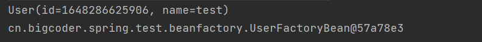

# FactoryBean详解

## 一. 什么是FactoryBean

在Spring容器中有两类的Bean，一类是普通的Bean，一类是工厂Bean。这两种Bean都是被Spring的容器进行管理的。而Spring也提供了一个接口用于扩展工厂Bean，我们只要实现`org.springframework.beans.factory.FactoryBean`即可。

一般情况下，Spring 通过反射机制实现类来实例化 bean 。某些情况下，实例化 bean 过程比较复杂，如果按照传统的方式，则需要在配置文件中提供大量的配置信息，配置方式的灵活性是受限的，这时采用编码的方式可能会得到一个简单的方案。Spring 为此提供了一个 FactoryBean 的工厂类接口，用户可以通过实现该接口定制实例化 bean 的逻辑。

## 二. FactoryBean基本使用

在讲原理之前，我们还是简单的讲一下`FactoryBean`接口的作用。我们首先看一下`FactoryBean`的定义：

```java
public interface FactoryBean<T> {
    String OBJECT_TYPE_ATTRIBUTE = "factoryBeanObjectType";

    @Nullable
    T getObject() throws Exception;

    @Nullable
    Class<?> getObjectType();

    default boolean isSingleton() {
        return true;
    }
}
```

我们只需要创建一个类实现该接口即可：

```java
@Component
public class UserFactoryBean implements FactoryBean<User> {
    @Override
    public User getObject() throws Exception {
        User user = new User();
        user.setId(System.currentTimeMillis());
        user.setName("test");
        return user;
    }

    @Override
    public Class<?> getObjectType() {
        return User.class;
    }
}

@Data
public class User {
    private Long id;
    private String name;
}
```

我们通过FactoryBean获取`User`实例：

```java
public class FactoryBeanTest {
    public static void main(String[] args) {
        ApplicationContext applicationContext = new ClassPathXmlApplicationContext("classpath:application-context.xml");
        // <1> 获取FactoryBean创建的实例
        Object user = applicationContext.getBean("userFactoryBean");
        System.out.println(user);

        // <2> 获取FactoryBean本身
        Object userFactoryBean = applicationContext.getBean("&userFactoryBean");
        System.out.println(userFactoryBean);
    }
}

```

返回结果：



可以看到，我们通过 `getBean("userFactoryBean")` 拿到的居然是`User`的实例，而不是我们@Component注解标记的`UserFactoryBean`的实例。

这就是`FactoryBean`接口的用途啦，当我们向Spring注册一个`FactoryBean`时，通过`beanName`获取到的将是 `FactoryBean#getObject` 方法返回的实例，而`FactoryBean#isSingleton`方法，用于指定`getObject`方法获取的实例是单例的还是多例的。

如果在`beanName`前面加上`&`符号，使用`&beanName`从`Spring`容器中获取，就能获取到`FactoryBean`实例本身。

## 三. 加载顺序

有时候我们需要在工厂Bean创建之后，但是`getObject`方法执行之前执行一些动作，例如资源配置检查之类的动作的话，我们可以使用`@PostConstruct`注解在方法上，那么此方法就会在执行`getObject()`方法执行之前先执行。

此时我们在`UserFactory`工厂类中修改如下，增加`@PostConstruct`注解的方法，并且增加打印日志。

```java
@Component
public class UserFactoryBean implements FactoryBean<User> {
    @Override
    public User getObject() throws Exception {
        User user = new User();
        user.setId(System.currentTimeMillis());
        user.setName("test");
        return user;
    }

    @Override
    public Class<?> getObjectType() {
        return User.class;
    }

    @PostConstruct
    public void initialize(){
        System.out.println("Initialize Begin");
    }
}
```

