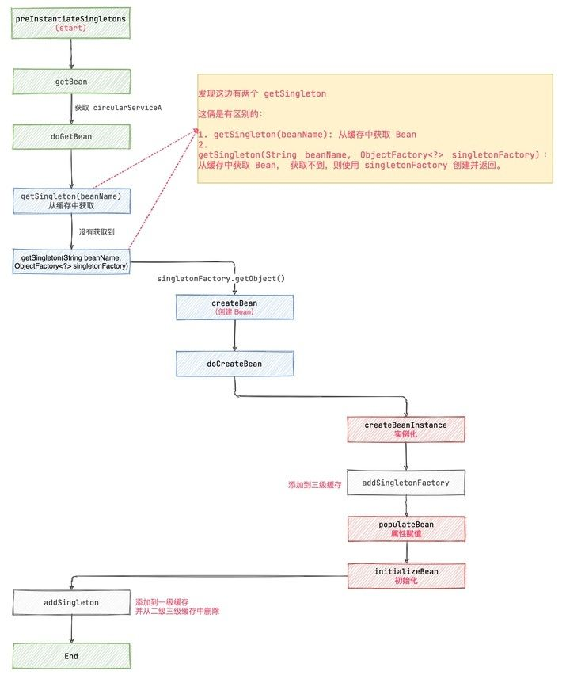
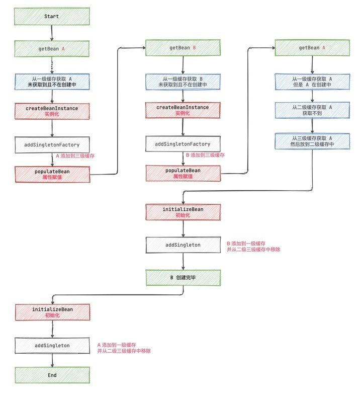

# 循环依赖处理

## 一. 什么是循环依赖

`循环依赖`，就是两个或则两个以上的`bean`互相依赖对方，最终形成`闭环`。比如“A对象依赖B对象，而B对象也依赖A对象”，或者“A对象依赖B对象，B对象依赖C对象，C对象依赖A对象”；类似以下代码：

```java
public class A {
    private B b;
}

public class B {
    private A a;
}
```

常规情况下，会出现以下情况：

1. 通过构建函数创建A对象（A对象是半成品，还没注入属性和调用init方法）。
2. A对象需要注入B对象，发现对象池（缓存）里还没有B对象（对象在创建并且注入属性和初始化完成之后，会放入对象缓存里）。
3. 通过构建函数创建B对象（B对象是半成品，还没注入属性和调用init方法）。
4. B对象需要注入A对象，发现对象池里还没有A对象。
5. 创建A对象，循环以上步骤。

Spring 循环依赖的**场景**有两种：

1. 构造器的循环依赖。
2. field 属性的循环依赖。

对于构造器的循环依赖，Spring 是无法解决的，只能抛出 `BeanCurrentlyInCreationException` 异常表示循环依赖，**所以下面我们分析的都是基于 field 属性的循环依赖**。

Spring 只解决 scope 为 singleton 的循环依赖。对于scope 为 prototype 的 bean ，Spring 无法解决，直接抛出 `BeanCurrentlyInCreationException` 异常。

## 二. 解决循环依赖

Spring创建Bean的过程中会用到三级缓存：

```java
// DefaultSingletonBeanRegistry.java
        
/**
 * 一级缓存，存放可用的成品Bean。
 * 对应关系为 bean name --> bean instance
 */
private final Map<String, Object> singletonObjects = new ConcurrentHashMap<>(256);
    
/**
 * 二级缓存，存放半成品的Bean，半成品的Bean是已创建对象，但是未注入属性和初始化。用以解决循环依赖。
 * 对应关系也是 bean name --> bean instance。
 */
private final Map<String, Object> earlySingletonObjects = new HashMap<>(16);
    
/**
 * 三级缓存，存的是Bean工厂对象，用来生成半成品的Bean并放入到二级缓存中。用以解决循环依赖。
 * 对应关系是 bean name --> ObjectFactory
 */
private final Map<String, ObjectFactory<?>> singletonFactories = new HashMap<>(16);
```

要了解解决循环依赖的原理，得从Bean的创建过程说起：

```java
// AbstractBeanFactory.java
protected <T> T doGetBean(
			String name, @Nullable Class<T> requiredType, @Nullable Object[] args, boolean typeCheckOnly){
    //<1> 从缓存中或者实例工厂中获取 Bean 对象
	Object sharedInstance = getSingleton(beanName);
	if (sharedInstance != null && args == null) {
		...
	}
	else {
		....
        if (mbd.isSingleton()) {
            // <3> 将创建好的Bean实例放入一级缓存
            sharedInstance = getSingleton(beanName, () -> {
                try {
                    // <2> bean 实例化
                    return createBean(beanName, mbd, args);
                }
                catch (BeansException ex) {
                    // Explicitly remove instance from singleton cache: It might have been put there
                    // eagerly by the creation process, to allow for circular reference resolution.
                    // Also remove any beans that received a temporary reference to the bean.
                    // 显式从单例缓存中删除 Bean 实例
                    // 因为单例模式下为了解决循环依赖，可能他已经存在了，所以销毁它。
                    destroySingleton(beanName);
                    throw ex;
                }
            });
            beanInstance = getObjectForBeanInstance(sharedInstance, name, beanName, mbd);
        }
        ...	
	}
}
```

- `<1>` 首先尝试从三级缓存中获取实例

- `<2>` 如果三级缓存都没有获取到bean实例，则说明需要创建该实例，则进行bean的实例化
- `<3>` 将创建好的实例，放入一级缓存中

### 2.1 从缓存中获取Bean

从三级缓存中读取实例的代码如下：

```java
// org.springframework.beans.factory.support.DefaultSingletonBeanRegistry.java

protected Object getSingleton(String beanName, boolean allowEarlyReference) {
	// Quick check for existing instance without full singleton lock
	// 从单例缓冲中加载 bean（一级缓存）
	Object singletonObject = this.singletonObjects.get(beanName);
	// 缓存中的 bean 为空，且当前 bean 正在创建
	if (singletonObject == null && isSingletonCurrentlyInCreation(beanName)) {
		// 二级缓存
		singletonObject = this.earlySingletonObjects.get(beanName);
		// 如果earlySingletonObjects 中没有，且允许提前创建
		if (singletonObject == null && allowEarlyReference) {
			// 加锁（双重校验锁模式）
			synchronized (this.singletonObjects) {
				// Consistent creation of early reference within full singleton lock
				// 拿到锁后再次获取单例实例
				singletonObject = this.singletonObjects.get(beanName);
				// 如果单例实例仍然为空
				if (singletonObject == null) {
					// 并且 早期单例对象的缓存 中也为空
					singletonObject = this.earlySingletonObjects.get(beanName);
					if (singletonObject == null) {
						// 从 singletonFactories 中获取对应的 ObjectFactory（三级缓存）
						ObjectFactory<?> singletonFactory = this.singletonFactories.get(beanName);
						if (singletonFactory != null) {
                            //<1.1>
							// 获得 bean
							singletonObject = singletonFactory.getObject();
							// 添加 bean 到 早期单例对象的缓存 中
							this.earlySingletonObjects.put(beanName, singletonObject);
							// 从 singletonFactories 中移除对应的 ObjectFactory
							this.singletonFactories.remove(beanName);
						}
					}
				}
			}
		}
	}
	return singletonObject;
}
```

`<1.1>`处，如果从三级缓存中获取到实例后，就会放入二级缓存，并删除三级缓存。

### 2.2 实例化Bean<a name="实例化Bean"></a>

`<2>`处，如果三级缓存都没有获取到bean实例，则说明需要创建该实例，则进行bean的实例化，代码如下：

```java
//org.springframework.beans.factory.support.AbstractAutowireCapableBeanFactory.java
@Override
protected Object createBean(String beanName, RootBeanDefinition mbd, @Nullable Object[] args)
		throws BeanCreationException {
	....
	try {
		// <2.1> 创建 Bean 对象
		Object beanInstance = doCreateBean(beanName, mbdToUse, args);
		if (logger.isTraceEnabled()) {
			logger.trace("Finished creating instance of bean '" + beanName + "'");
		}
		return beanInstance;
	}
	....
}
```

调用`doCreateBean`方法创建实例：

```java
protected Object doCreateBean(String beanName, RootBeanDefinition mbd, @Nullable Object[] args)
		throws BeanCreationException {

	...
	// <2.1.1> 使用合适的实例化策略来创建新的实例：工厂方法、构造函数自动注入、简单初始化
	if (instanceWrapper == null) {
		instanceWrapper = createBeanInstance(beanName, mbd, args);
	}
	...
        
	// <2.1.2> 判断是否有后置处理
	// 如果有后置处理，则允许后置处理修改 BeanDefinition
	synchronized (mbd.postProcessingLock) {
		if (!mbd.postProcessed) {
			try {
				// 后置处理修改 BeanDefinition
				applyMergedBeanDefinitionPostProcessors(mbd, beanType, beanName);
			}
			catch (Throwable ex) {
				throw new BeanCreationException(mbd.getResourceDescription(), beanName,
						"Post-processing of merged bean definition failed", ex);
			}
			mbd.postProcessed = true;
		}
	}

	// <2.1.3> 解决单例模式的循环依赖
	boolean earlySingletonExposure = (mbd.isSingleton() && this.allowCircularReferences &&
			isSingletonCurrentlyInCreation(beanName));
	if (earlySingletonExposure) {
		if (logger.isTraceEnabled()) {
			logger.trace("Eagerly caching bean '" + beanName +
					"' to allow for resolving potential circular references");
		}
		// 提前将创建的 bean 实例加入到 singletonFactories（三级缓存） 中 
		// 这里是为了后期避免循环依赖
		addSingletonFactory(beanName, () -> getEarlyBeanReference(beanName, mbd, bean));
	}

	// 开始初始化 bean 实例对象
	Object exposedObject = bean;
	try {
		// <2.1.4> 对 bean 进行填充，将各个属性值注入，其中，可能存在依赖于其他 bean 的属性
		// 则会递归初始依赖 bean
		populateBean(beanName, mbd, instanceWrapper);
		// <2.1.5> 调用初始化方法
		exposedObject = initializeBean(beanName, exposedObject, mbd);
	}
	...

	return exposedObject;
}
```

该方法整体流程比较复杂，详细逻辑可以参考 [《创建Bean的流程》](./_29创建Bean的流程.md)，但是整体流程如下：

- `<2.1.1>` 使用合适的实例化策略来创建新的实例：工厂方法、构造函数自动注入、简单初始化
- `<2.1.2>` 后置处理
- `<2.1.3>` 判断是否提前曝光，如果提前曝光，则将当前Bean的`ObjectFactory`放入三级缓存中。
- `<2.1.4>` 对 bean 进行填充，其中，如果依赖于其他 bean 的属性，则会递归调用`getBean`创建依赖的实例。
- `<2.1.5>` 调用初始化方法

解决循环依赖非常关键的一步就是`<2.1.3>`，将当前刚创建好的Bean实例（未初始化），封装成`ObjectFactory`，放入三级缓存中：

```java
// org.springframework.beans.factory.support.DefaultSingletonBeanRegistry
protected void addSingletonFactory(String beanName, ObjectFactory<?> singletonFactory) {
	Assert.notNull(singletonFactory, "Singleton factory must not be null");
	synchronized (this.singletonObjects) {
		if (!this.singletonObjects.containsKey(beanName)) {
            // 加入三级缓存
			this.singletonFactories.put(beanName, singletonFactory);
            // 删除二级缓存
			this.earlySingletonObjects.remove(beanName);
			this.registeredSingletons.add(beanName);
		}
	}
}
```

### 2.3 将创建好的Bean实例放入一级缓存

`<3>`处，将创建好的实例，放入一级缓存中，代码如下：

```java
	public Object getSingleton(String beanName, ObjectFactory<?> singletonFactory) {
		Assert.notNull(beanName, "Bean name must not be null");
		// 全局锁
		synchronized (this.singletonObjects) {
			...
			try {
				// <3.1> 初始化 bean
				// 这个过程其实是调用 createBean() 方法（策略模式，具体的创建逻辑由传入的ObjectFactory决定）
				singletonObject = singletonFactory.getObject();
				newSingleton = true;
			}
			...
			// <3.2> 加入一级缓存中
			if (newSingleton) {
				addSingleton(beanName, singletonObject);
			}
			return singletonObject;
		}
	}
```

- `<3.1>`，调用`<2>`处的代码创建实例，详见 [《2.2 实例化Bean》](#实例化Bean)
- `<3.2>`，由于`<2>`处的代码创建的实例已经是初始化完成的，所以在此处将Bean实例加入一级缓存中。

### 2.4 整体流程



### 2.5 循环依赖流程

我们以最简单的循环依赖为例，A、B两个类都互相依赖对方：

```java
public class A {
    private B b;
}

public class B {
    private A a;
}
```

假如Spring容器启动时，先加载A，那么A、B循环依赖初始化流程如下图所示：



> 本文参考至：
>
> [Spring为什么不使用二级缓存？Spring 动态代理时是如何解决循环依赖的？为什么要使用三级缓存？... - 知乎 (zhihu.com)](https://zhuanlan.zhihu.com/p/377878056)
>
> [Spring循环依赖三级缓存是否可以去掉第三级缓存？ - SegmentFault 思否](https://segmentfault.com/a/1190000023647227)
