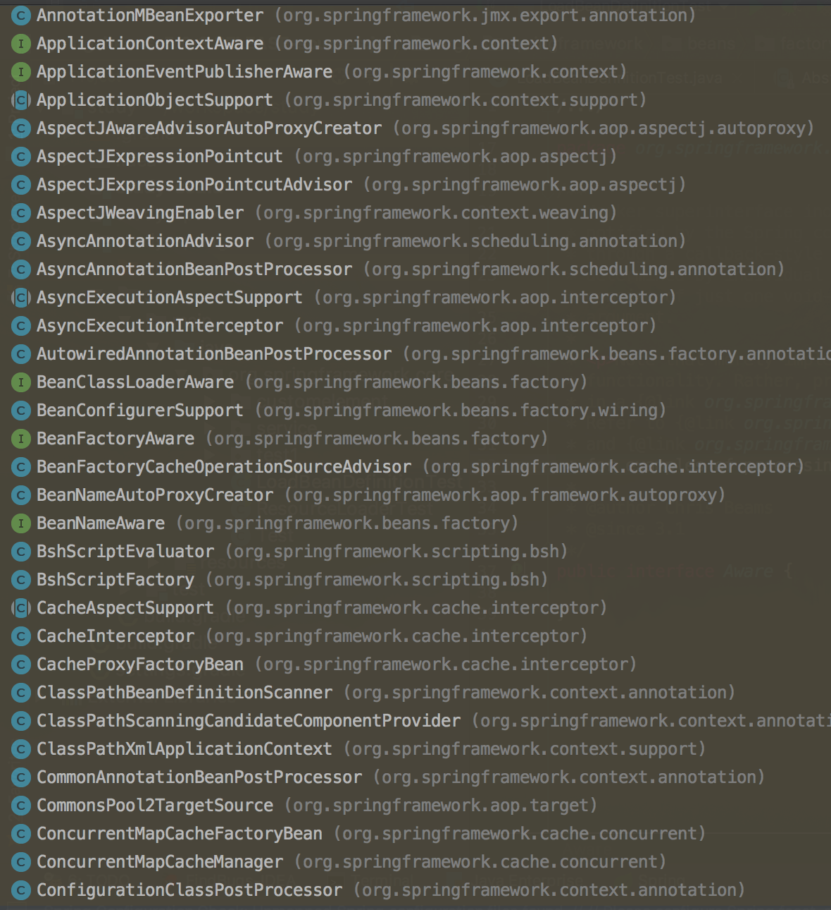
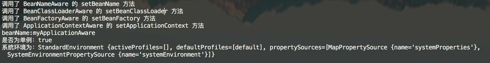

# IoC 之深入分析 Aware 接口

AbstractAutowireCapableBeanFactory 的 `#doCreateBean(final String beanName, final RootBeanDefinition mbd, final Object[] args)` 方法，主要干三件事情：

1. 实例化 bean 对象：`#createBeanInstance(String beanName, RootBeanDefinition mbd, Object[] args)` 方法。
2. 属性注入：`#populateBean(String beanName, RootBeanDefinition mbd, BeanWrapper bw)` 方法。
3. 初始化 bean 对象：`#initializeBean(final String beanName, final Object bean, RootBeanDefinition mbd)` 方法。

而初始化 bean 对象时，也是干了三件事情：

1. 激活 Aware 方法
2. 后置处理器的应用
3. 激活自定义的 init 方法

## 一. Aware接口

`org.springframework.beans.factory.Aware` 接口，定义如下：

```java
/**
 * Marker superinterface indicating that a bean is eligible to be
 * notified by the Spring container of a particular framework object
 * through a callback-style method. Actual method signature is
 * determined by individual subinterfaces, but should typically
 * consist of just one void-returning method that accepts a single
 * argument.
 *
 * <p>Note that merely implementing {@link Aware} provides no default
 * functionality. Rather, processing must be done explicitly, for example
 * in a {@link org.springframework.beans.factory.config.BeanPostProcessor BeanPostProcessor}.
 * Refer to {@link org.springframework.context.support.ApplicationContextAwareProcessor}
 * and {@link org.springframework.beans.factory.support.AbstractAutowireCapableBeanFactory}
 * for examples of processing {@code *Aware} interface callbacks.
 *
 * @author Chris Beams
 * @since 3.1
 */
public interface Aware {

}
```

Aware 接口为 Spring 容器的核心接口，是一个具有标识作用的超级接口，实现了该接口的 bean 是具有被 Spring 容器通知的能力，通知的方式是采用**回调**的方式。

Aware 接口是一个空接口，实际的方法签名由各个子接口来确定，且该接口通常只会有一个接收单参数的 set 方法，该 set 方法的命名方式为 set + 去掉接口名中的 Aware 后缀，即 XxxAware 接口，则方法定义为 setXxx()，例如 BeanNameAware（setBeanName），ApplicationContextAware（setApplicationContext）。

Aware 的子接口需要提供一个 `setXxx` 方法，我们知道 set 是设置属性值的方法，即 Aware 类接口的 `setXxx` 方法其实就是设置 xxx 属性值的。 Aware 的含义是感知的、感应的，那么在 Spring 容器中是如何实现感知并设置属性值得呢？我们可以从初始化 bean 中的激活 Aware 的方法 `#invokeAwareMethods(final String beanName, final Object bean)` 中看到一点点，代码如下：

```java
// AbstractAutowireCapableBeanFactory.java

private void invokeAwareMethods(final String beanName, final Object bean) {
	if (bean instanceof Aware) {
	    // BeanNameAware
		if (bean instanceof BeanNameAware) {
			((BeanNameAware) bean).setBeanName(beanName);
		}
		// BeanClassLoaderAware
		if (bean instanceof BeanClassLoaderAware) {
			ClassLoader bcl = getBeanClassLoader();
			if (bcl != null) {
				((BeanClassLoaderAware) bean).setBeanClassLoader(bcl);
			}
		}
		// BeanFactoryAware
		if (bean instanceof BeanFactoryAware) {
			((BeanFactoryAware) bean).setBeanFactory(AbstractAutowireCapableBeanFactory.this);
		}
	}
}
```

- 首先，判断 bean 实例是否属于 Aware 接口的范畴，如果是的话，则调用实例的 `setXxx()` 方法给实例设置 xxx 属性值，在 `#invokeAwareMethods(...)` 方法，主要是设置 beanName，beanClassLoader、BeanFactory 中三个属性值。

## 二. Aware 子类

Spring 提供了一系列的 Aware 接口，如下图（部分）



上面只是一部分子类，从这里我们可以看到 Spring 提供的 Aware 接口是是何其多。同时从上图我们也看到了几个比较熟悉的接口，如 BeanClassLoaderAware、BeanFactoryAware、BeanNameAware，下面就这三个接口来做一个简单的演示，先看各自的定义：

```java
public interface BeanClassLoaderAware extends Aware {

    /**
    * 将 BeanClassLoader 提供给 bean 实例回调
    * 在 bean 属性填充之后、初始化回调之前回调，
    * 例如InitializingBean的InitializingBean.afterPropertiesSet（）方法或自定义init方法
    */
    void setBeanClassLoader(ClassLoader classLoader);

}


public interface BeanFactoryAware extends Aware {
    /**
    * 将 BeanFactory 提供给 bean 实例回调
    * 调用时机和 setBeanClassLoader 一样
    */
    void setBeanFactory(BeanFactory beanFactory) throws BeansException;

}


public interface BeanNameAware extends Aware {

    /**
    * 在创建此 bean 的 bean工厂中设置 beanName
    */
    void setBeanName(String name);

}


public interface ApplicationContextAware extends Aware {

    /**
     * 设置此 bean 对象的 ApplicationContext，通常，该方法用于初始化对象
     */
    void setApplicationContext(ApplicationContext applicationContext)
        throws BeansException;

}
```

### 2.1 示例

下面简单演示下上面四个接口的使用方法：

```java
public class MyApplicationAware implements BeanNameAware,BeanFactoryAware,BeanClassLoaderAware,ApplicationContextAware{

    private String beanName;

    private BeanFactory beanFactory;

    private ClassLoader classLoader;

    private ApplicationContext applicationContext;

    @Override
    public void setBeanClassLoader(ClassLoader classLoader) {
        System.out.println("调用了 BeanClassLoaderAware 的 setBeanClassLoader 方法");
        this.classLoader = classLoader;
    }

    @Override
    public void setBeanFactory(BeanFactory beanFactory) throws BeansException {
        System.out.println("调用了 BeanFactoryAware 的 setBeanFactory 方法");
        this.beanFactory = beanFactory;
    }

    @Override
    public void setBeanName(String name) {
        System.out.println("调用了 BeanNameAware 的 setBeanName 方法");
        this.beanName = name;
    }

    @Override
    public void setApplicationContext(ApplicationContext applicationContext) throws BeansException {
        System.out.println("调用了 ApplicationContextAware 的 setApplicationContext 方法");
        this.applicationContext = applicationContext;
    }

    public void display(){
        System.out.println("beanName:" + beanName);
        System.out.println("是否为单例：" + beanFactory.isSingleton(beanName));
        System.out.println("系统环境为：" + applicationContext.getEnvironment());
    }
}
```

测试方法如下:

```java
public static void main(String[] args) {
    ClassPathResource resource = new ClassPathResource("spring.xml");
    DefaultListableBeanFactory factory = new DefaultListableBeanFactory();
    XmlBeanDefinitionReader reader = new XmlBeanDefinitionReader(factory);
    reader.loadBeanDefinitions(resource);

    MyApplicationAware applicationAware = (MyApplicationAware) factory.getBean("myApplicationAware");
    applicationAware.display();
}
```

运行结果：



常用的 Aware 子接口，便于日后查询：

- LoadTimeWeaverAware：加载Spring Bean时织入第三方模块，如AspectJ
- BeanClassLoaderAware：加载Spring Bean的类加载器
- BootstrapContextAware：资源适配器BootstrapContext，如JCA,CCI
- ResourceLoaderAware：底层访问资源的加载器
- BeanFactoryAware：声明BeanFactory
- PortletConfigAware：PortletConfig
- PortletContextAware：PortletContext
- ServletConfigAware：ServletConfig
- ServletContextAware：ServletContext
- MessageSourceAware：国际化
- ApplicationEventPublisherAware：应用事件
- NotificationPublisherAware：JMX通知
- BeanNameAware：声明Spring Bean的名字