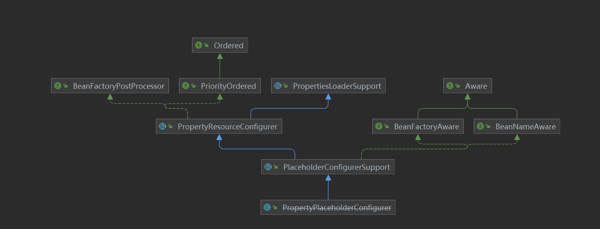

# IoC 之深入分析 PropertyPlaceholderConfigurer

在上文 [BeanFactoryPostProcessor接口](./_35BeanFactoryPostProcessor接口.md) 中，介绍了 BeanFactoryPostProcessor，知道 BeanFactoryPostProcessor 作用域容器启动阶段，可以对解析好的 BeanDefinition 进行定制化处理，而其中 **PropertyPlaceholderConfigurer** 是其一个非常重要的应用，也是其**子类**，介绍如下：

> PropertyPlaceholderConfigurer 允许我们用 Properties 文件中的属性，来定义应用上下文（配置文件或者注解）。

什么意思，就是说我们在 XML 配置文件（或者其他方式，如注解方式）中使用**占位符**的方式来定义一些资源，并将这些占位符所代表的资源配置到 Properties 中，这样只需要对 Properties 文件进行修改即可，这个特性非常，在后面来介绍一种我们在项目中经常用到场景。

## 一. PropertyResourceConfigurer



从 PropertyPlaceholderConfigurer 的结构图可以看出，它间接实现了 Aware 和 BeanFactoryPostProcessor 两大扩展接口，这里只需要关注 BeanFactoryPostProcessor 即可。我们知道 BeanFactoryPostProcessor 提供了 `#postProcessBeanFactory(ConfigurableListableBeanFactory beanFactory)` 接口方法，在这个体系中该方法的是在 **PropertyResourceConfigurer** 中实现，该类为属性资源的配置类，它实现了 BeanFactoryPostProcessor 接口，代码如下：

```java
// PropertyResourceConfigurer.java
// extends PropertiesLoaderSupport
// implements BeanFactoryPostProcessor, PriorityOrdered

@Override
public void postProcessBeanFactory(ConfigurableListableBeanFactory beanFactory) throws BeansException {
    try {
        // <1> 返回合并的 Properties 实例
        Properties mergedProps = mergeProperties();

        // Convert the merged properties, if necessary.
        // <2> 转换合并属性
        convertProperties(mergedProps);

        // Let the subclass process the properties.
        // <3> 子类处理
        processProperties(beanFactory, mergedProps);
    } catch (IOException ex) {
        throw new BeanInitializationException("Could not load properties", ex);
    }
}
```

- `<1>` 处，调用 `#mergeProperties()` 方法，返回合并的 Properties 实例。Properties 实例维护这**一组** `key-value` ，其实就是 Properties 配置文件中的内容。

- `<2>` 处，调用 `#convertProperties(Properties props)` 方法，转换合并的值，其实就是将原始值替换为真正的值。

- `<3>` 处，调用 `#processProperties(ConfigurableListableBeanFactory beanFactory, Properties props)` 方法，前面两个步骤已经将配置文件中的值进行了处理，那么该方法就是真正的替换过程，该方法**由子类实现**。代码如下：

  ```java
  // PropertyResourceConfigurer.java
  
  protected abstract void processProperties(ConfigurableListableBeanFactory beanFactory, Properties props)
  		throws BeansException;
  ```

## 二. PropertyPlaceholderConfigurer

在 PropertyPlaceholderConfigurer 中，重写 `#processProperties(ConfigurableListableBeanFactory beanFactory, Properties props)` 方法，代码如下：

```java
// PropertyPlaceholderConfigurer.java

@Override
protected void processProperties(ConfigurableListableBeanFactory beanFactoryToProcess, Properties props)
        throws BeansException {
    // <1> 创建 StringValueResolver 对象
    StringValueResolver valueResolver = new PlaceholderResolvingStringValueResolver(props);
    // <2> 处理
    doProcessProperties(beanFactoryToProcess, valueResolver);
}
```

### 2.1 PlaceholderResolvingStringValueResolver

> 对应 `#processProperties(ConfigurableListableBeanFactory beanFactoryToProcess, Properties props)` 方法的 `<1>` 处。

首先，构造一个 PlaceholderResolvingStringValueResolver 类型的 StringValueResolver 实例。StringValueResolver 为一个解析 String 类型值的策略接口，该接口提供了 `#resolveStringValue(String strVal)` 方法，用于解析 String 值。PlaceholderResolvingStringValueResolver 为其一个解析策略，构造方法如下：

```java
// PropertyPlaceholderConfigurer.java
    
private class PlaceholderResolvingStringValueResolver implements StringValueResolver {
    
	private final PropertyPlaceholderHelper helper;
    
	private final PlaceholderResolver resolver;
    
	public PlaceholderResolvingStringValueResolver(Properties props) {
		this.helper = new PropertyPlaceholderHelper(
				placeholderPrefix, placeholderSuffix, valueSeparator, ignoreUnresolvablePlaceholders);
		this.resolver = new PropertyPlaceholderConfigurerResolver(props);
	}
	
	// ... 省略 resolveStringValue 方法
}
```

- 在构造 String 值解析器 StringValueResolver 时，将已经解析的 Properties 实例对象封装在 PlaceholderResolver 实例 `resolver` 中。PlaceholderResolver 是一个用于解析字符串中包含占位符的替换值的策略接口，该接口有一个 `#resolvePlaceholder(String strVa)` 方法，用于返回占位符的替换值。
- 还有一个 PropertyPlaceholderHelper 工具 `helper` ，从名字上面看应该是进行替换的工具类。

### 2.2 doProcessProperties

> 对应 `#processProperties(ConfigurableListableBeanFactory beanFactoryToProcess, Properties props)` 方法的 `<2>` 处。

然后，得到 String 解析器的实例 `valueResolver` 后，则会调用 `#doProcessProperties(ConfigurableListableBeanFactory beanFactoryToProcess, StringValueResolver valueResolver)` 方法，来进行真值的替换操作。该方法在父类 PlaceholderConfigurerSupport 中实现，代码如下：

```java
// PlaceholderConfigurerSupport.java
    
protected void doProcessProperties(ConfigurableListableBeanFactory beanFactoryToProcess,
        StringValueResolver valueResolver) {
    // <2.1> 创建 BeanDefinitionVisitor 对象
    BeanDefinitionVisitor visitor = new BeanDefinitionVisitor(valueResolver);
    
    String[] beanNames = beanFactoryToProcess.getBeanDefinitionNames();
    for (String curName : beanNames) {
        // 校验
        // Check that we're not parsing our own bean definition,
        // to avoid failing on unresolvable placeholders in properties file locations.
        if (!(curName.equals(this.beanName) // 1. 当前实例 PlaceholderConfigurerSupport 不在解析范围内
                && beanFactoryToProcess.equals(this.beanFactory))) { // 2. 同一个 Spring 容器
            BeanDefinition bd = beanFactoryToProcess.getBeanDefinition(curName);
            try {
                visitor.visitBeanDefinition(bd);
            } catch (Exception ex) {
                throw new BeanDefinitionStoreException(bd.getResourceDescription(), curName, ex.getMessage(), ex);
            }
        }
    }
    
    // New in Spring 2.5: resolve placeholders in alias target names and aliases as well.
    // <2.3> 别名的占位符
    beanFactoryToProcess.resolveAliases(valueResolver);
    
    // New in Spring 3.0: resolve placeholders in embedded values such as annotation attributes.
    // <2.4> 解析嵌入值的占位符，例如注释属性
    beanFactoryToProcess.addEmbeddedValueResolver(valueResolver);
}
```

- `<2.1`> 处，根据 String 值解析策略 `valueResolver` 得到 BeanDefinitionVisitor 实例。BeanDefinitionVisitor 是 BeanDefinition 的访问者，我们通过它可以实现对 BeanDefinition 内容的进行访问，内容很多，例如 Scope、PropertyValues、FactoryMethodName 等等。
- `<2.2`> 处，得到该容器的所有 BeanName，然后对其进行访问（ `#visitBeanDefinition(BeanDefinition beanDefinition)` 方法）。
- `<2.3`> 处，解析别名的占位符。
- `<2.4`> 处，解析嵌入值的占位符，例如注释属性。

#### 2.2.1 visitBeanDefinition

这个方法的**核心**在于 `#visitBeanDefinition(BeanDefinition beanDefinition)` 方法的调用，代码如下：

```java
// BeanDefinitionVisitor.java

public void visitBeanDefinition(BeanDefinition beanDefinition) {
	visitParentName(beanDefinition);
	visitBeanClassName(beanDefinition);
	visitFactoryBeanName(beanDefinition);
	visitFactoryMethodName(beanDefinition);
	visitScope(beanDefinition);
	if (beanDefinition.hasPropertyValues()) {
		visitPropertyValues(beanDefinition.getPropertyValues());
	}
	if (beanDefinition.hasConstructorArgumentValues()) {
		ConstructorArgumentValues cas = beanDefinition.getConstructorArgumentValues();
		visitIndexedArgumentValues(cas.getIndexedArgumentValues());
		visitGenericArgumentValues(cas.getGenericArgumentValues());
	}
}
```

- 我们可以看到该方法基本访问了 BeanDefinition 中所有值得访问的东西了，包括 parent 、class 、factory-bean 、factory-method 、scope 、property 、constructor-arg 。

#### 2.2.2 visitPropertyValues

本篇文章的主题是 **property** ，所以关注 `#visitPropertyValues(MutablePropertyValues pvs)` 方法即可。代码如下：

```java
// BeanDefinitionVisitor.java

protected void visitPropertyValues(MutablePropertyValues pvs) {
    PropertyValue[] pvArray = pvs.getPropertyValues();
    // 遍历 PropertyValue 数组
    for (PropertyValue pv : pvArray) {
        // 解析真值
        Object newVal = resolveValue(pv.getValue());
        if (!ObjectUtils.nullSafeEquals(newVal, pv.getValue())) {
            // 设置到 PropertyValue 中
            pvs.add(pv.getName(), newVal);
        }
    }
}
```

- 过程就是对属性数组进行遍历，调用 `#resolveValue(Object value)`方法，对属性进行解析获取最新值，如果新值和旧值不等，则用新值替换旧值。

`#resolveValue(Object value)` 方法，代码如下：

```java
// BeanDefinitionVisitor.java

@Nullable
protected Object resolveValue(@Nullable Object value) {
	if (value instanceof BeanDefinition) {
		visitBeanDefinition((BeanDefinition) value);
	} else if (value instanceof BeanDefinitionHolder) {
		visitBeanDefinition(((BeanDefinitionHolder) value).getBeanDefinition());
	} else if (value instanceof RuntimeBeanReference) {
		RuntimeBeanReference ref = (RuntimeBeanReference) value;
		String newBeanName = resolveStringValue(ref.getBeanName());
		if (newBeanName == null) {
			return null;
		}
		if (!newBeanName.equals(ref.getBeanName())) {
			return new RuntimeBeanReference(newBeanName);
		}
	} else if (value instanceof RuntimeBeanNameReference) {
		RuntimeBeanNameReference ref = (RuntimeBeanNameReference) value;
		String newBeanName = resolveStringValue(ref.getBeanName());
		if (newBeanName == null) {
			return null;
		}
		if (!newBeanName.equals(ref.getBeanName())) {
			return new RuntimeBeanNameReference(newBeanName);
		}
	} else if (value instanceof Object[]) {
		visitArray((Object[]) value);
	} else if (value instanceof List) {
		visitList((List) value);
	} else if (value instanceof Set) {
		visitSet((Set) value);
	} else if (value instanceof Map) {
		visitMap((Map) value);
	} else if (value instanceof TypedStringValue) {
		TypedStringValue typedStringValue = (TypedStringValue) value;
		String stringValue = typedStringValue.getValue();
		if (stringValue != null) {
			String visitedString = resolveStringValue(stringValue);
			typedStringValue.setValue(visitedString);
		}
	// 由于 Properties 中的是 String，所以重点在此处
	} else if (value instanceof String) {
		return resolveStringValue((String) value);
	}
	return value;
}
```

- 由于配置的是 String 类型，所以只需要看 String 相关的。

`#resolveStringValue(String strVal)` 方法，代码如下：

```java
// BeanDefinitionVisitor.java

@Nullable
protected String resolveStringValue(String strVal) {
	if (this.valueResolver == null) {
		throw new IllegalStateException("No StringValueResolver specified - pass a resolver " +
				"object into the constructor or override the 'resolveStringValue' method");
	}
	// 解析真值
	String resolvedValue = this.valueResolver.resolveStringValue(strVal);
	// Return original String if not modified.
	return (strVal.equals(resolvedValue) ? strVal : resolvedValue);
}
```

- `valueResolver` 是我们在构造 BeanDefinitionVisitor 实例时传入的 String 类型解析器 PlaceholderResolvingStringValueResolver，调用其 `#resolveStringValue(String strVal)` 方法，代码如下：

```java
// PropertyPlaceholderConfigurer.java
// 内部类 PlaceholderResolvingStringValueResolver.java

@Override
@Nullable
public String resolveStringValue(String strVal) throws BeansException {
    // 解析真值
	String resolved = this.helper.replacePlaceholders(strVal, this.resolver);
	// trim
	if (trimValues) {
		resolved = resolved.trim();
	}
	// 返回真值
	return (resolved.equals(nullValue) ? null : resolved);
}
```

`helper` 为 PropertyPlaceholderHelper 实例对象，而 PropertyPlaceholderHelper 则是处理应用程序中包含占位符的字符串工具类。在构造 `helper` 实例对象时需要传入了几个参数：`placeholderPrefix`、`placeholderSuffix`、`valueSeparator`，这些值在 PlaceholderConfigurerSupport 中定义如下：

```java
// PlaceholderConfigurerSupport.java
	
/** Default placeholder prefix: {@value}. */
public static final String DEFAULT_PLACEHOLDER_PREFIX = "${";
/** Default placeholder suffix: {@value}. */
public static final String DEFAULT_PLACEHOLDER_SUFFIX = "}";
/** Default value separator: {@value}. */
public static final String DEFAULT_VALUE_SEPARATOR = ":";


/** Defaults to {@value #DEFAULT_PLACEHOLDER_PREFIX}. */
protected String placeholderPrefix = DEFAULT_PLACEHOLDER_PREFIX;
/** Defaults to {@value #DEFAULT_PLACEHOLDER_SUFFIX}. */
protected String placeholderSuffix = DEFAULT_PLACEHOLDER_SUFFIX;
/** Defaults to {@value #DEFAULT_VALUE_SEPARATOR}. */
@Nullable
protected String valueSeparator = DEFAULT_VALUE_SEPARATOR;
```

调用 PropertyPlaceholderHelper 的 `#replacePlaceholders(String value, PlaceholderResolver placeholderResolver)` 方法，进行占位符替换，代码如下：

```java
public String replacePlaceholders(String value, PlaceholderResolver placeholderResolver) {
	Assert.notNull(value, "'value' must not be null");
	return parseStringValue(value, placeholderResolver, new HashSet<>());
}
```

调用 `#parseStringValue(String value, PlaceholderResolver placeholderResolver, Set<String> visitedPlaceholders)` 方法，**这个方法是这篇博客最核心的地方**，`${}` 占位符的替换。代码如下：

```java
// PropertyPlaceholderHelper.java

protected String parseStringValue(String value, PlaceholderResolver placeholderResolver, Set<String> visitedPlaceholders) {
    StringBuilder result = new StringBuilder(value);
    // 获取前缀 "${" 的索引位置
    int startIndex = value.indexOf(this.placeholderPrefix);
    while (startIndex != -1) {
        // 获取 后缀 "}" 的索引位置
        int endIndex = findPlaceholderEndIndex(result, startIndex);
        if (endIndex != -1) {
            // 截取 "${" 和 "}" 中间的内容，这也就是我们在配置文件中对应的值
            String placeholder = result.substring(startIndex + this.placeholderPrefix.length(), endIndex);
            String originalPlaceholder = placeholder;
            if (!visitedPlaceholders.add(originalPlaceholder)) {
                throw new IllegalArgumentException(
                        "Circular placeholder reference '" + originalPlaceholder + "' in property definitions");
            }
            // Recursive invocation, parsing placeholders contained in the placeholder key.
            // 解析占位符键中包含的占位符，真正的值
            placeholder = parseStringValue(placeholder, placeholderResolver, visitedPlaceholders);
            // Now obtain the value for the fully resolved key...
            // 从 Properties 中获取 placeHolder 对应的值 propVal
            String propVal = placeholderResolver.resolvePlaceholder(placeholder);
            // 如果不存在
            if (propVal == null && this.valueSeparator != null) {
                // 查询 : 的位置
                int separatorIndex = placeholder.indexOf(this.valueSeparator);
                // 如果存在 :
                if (separatorIndex != -1) {
                    // 获取 : 前面部分 actualPlaceholder
                    String actualPlaceholder = placeholder.substring(0, separatorIndex);
                    // 获取 : 后面部分 defaultValue
                    String defaultValue = placeholder.substring(separatorIndex + this.valueSeparator.length());
                    // 从 Properties 中获取 actualPlaceholder 对应的值
                    propVal = placeholderResolver.resolvePlaceholder(actualPlaceholder);
                    // 如果不存在 则返回 defaultValue
                    if (propVal == null) {
                        propVal = defaultValue;
                    }
                }
            }
            if (propVal != null) {
                // Recursive invocation, parsing placeholders contained in the
                // previously resolved placeholder value.
                propVal = parseStringValue(propVal, placeholderResolver, visitedPlaceholders);
                result.replace(startIndex, endIndex + this.placeholderSuffix.length(), propVal);
                if (logger.isTraceEnabled()) {
                    logger.trace("Resolved placeholder '" + placeholder + "'");
                }
                startIndex = result.indexOf(this.placeholderPrefix, startIndex + propVal.length());
            } else if (this.ignoreUnresolvablePlaceholders) {
                // Proceed with unprocessed value.
                // 忽略值
                startIndex = result.indexOf(this.placeholderPrefix, endIndex + this.placeholderSuffix.length());
            } else {
                throw new IllegalArgumentException("Could not resolve placeholder '" +
                        placeholder + "'" + " in value \"" + value + "\"");
            }
            visitedPlaceholders.remove(originalPlaceholder);
        } else {
            startIndex = -1;
        }
    }
    // 返回propVal，就是替换之后的值
    return result.toString();
}
```

1. 获取占位符前缀 `"${"` 的索引位置 `startIndex` 。
2. 如果前缀 `"${"` 存在，则从 `“{”` 后面开始获取占位符后缀 “}” 的索引位置 `endIndex` 。
3. 如果前缀 `“${”` 和后缀 `"}"` 都存在，则截取中间部分 `placeholder` 。
4. 从 Properties 中获取 `placeHolder` 对应的值 `propVal` 。
5. 如果 `propVal` 为空，则判断占位符中是否存在 `":"`，如果存在则对占位符进行分割处理，全面部分为 `actualPlaceholder`，后面部分 `defaultValue`，尝试从 Properties 中获取 `actualPlaceholder` 对应的值 `propVal`，如果不存在，则将 `defaultValue` 的值赋值给 `propVal`
6. 返回 `propVal`，也就是 Properties 中对应的值。