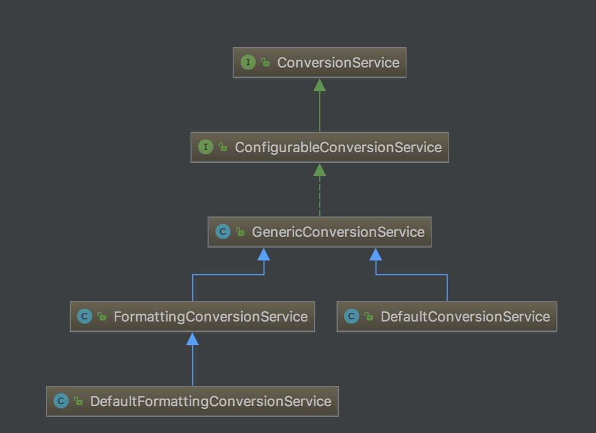
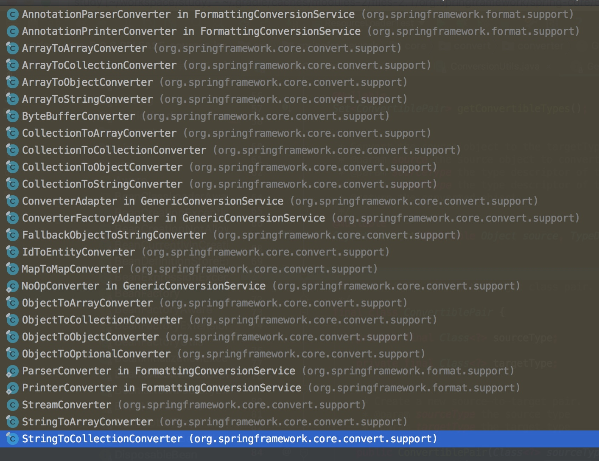
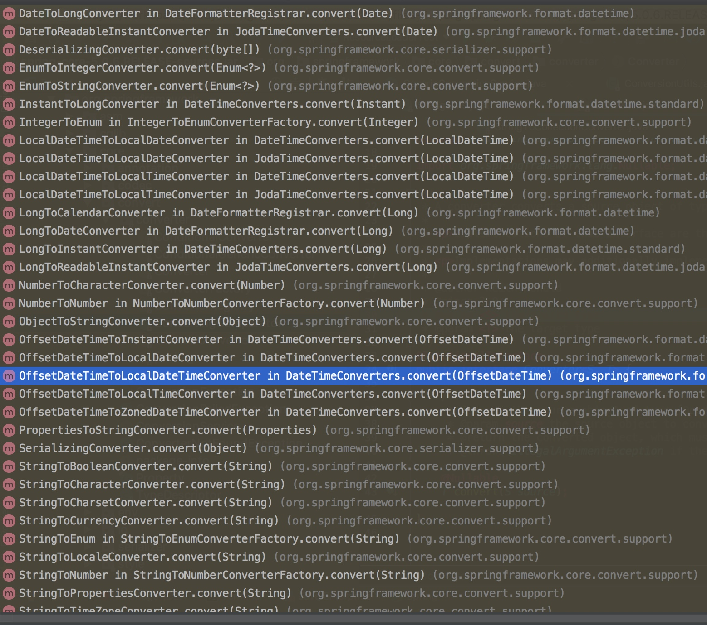
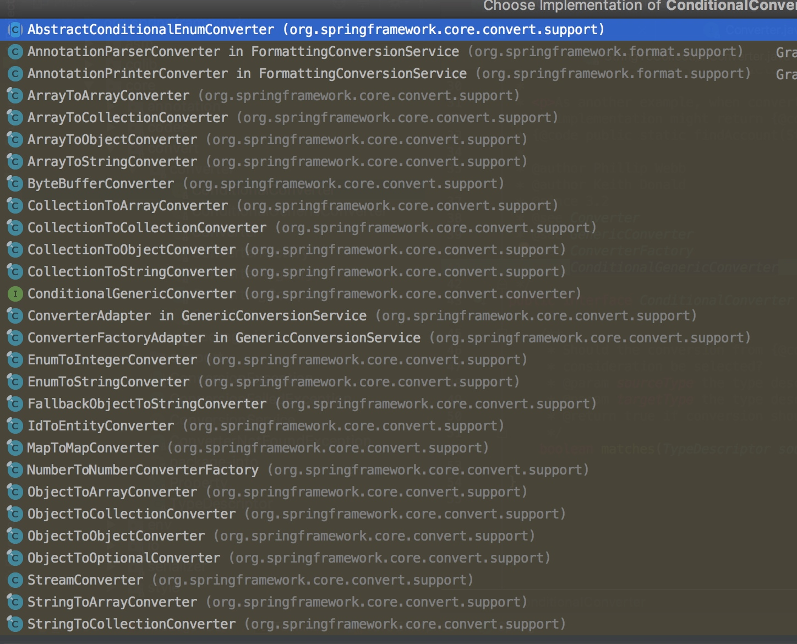
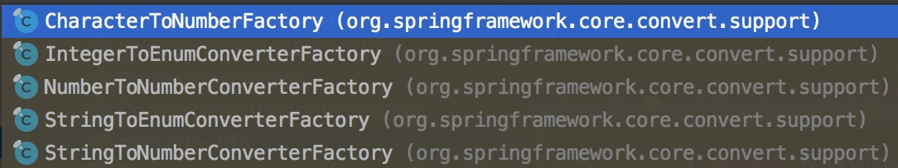

# Bean的类型转换体系

我们知道不管 Bean 对象里面的属性时什么类型，他们都是通过 XML 、Properties 或者其他方式来配置这些**属性**对象类型的。在 Spring 容器加载过程中，这些属性都是以 String 类型加载进容器的，但是最终都需要将这些 String 类型的属性转换 Bean 对象属性所对应真正的类型，要想完成这种由字符串到具体对象的转换，就需要这种转换规则相关的信息，而这些信息以及转换过程由 **Spring 类型转换体系**来完成。

我们依然以 xml 为例，在 Spring 容器加载阶段，容器将 xml 文件中定义的 `<bean>` 解析为 BeanDefinition，BeanDefinition 中存储着我们定义一个 bean 需要的所有信息，包括属性，这些属性是以 String 类型的存储的。当用户触发 Bean 实例化阶段时，Spring 容器会将这些属性转换为这些属性真正对应的类型。我们知道在 Bean 实例化阶段，属性的注入是在实例化 Bean 阶段的属性注入阶段，即 AbstractAutowireCapableBeanFactory 的 `#populateBean(String beanName, RootBeanDefinition mbd, BeanWrapper bw)` 方法。

在 `#populateBean(String beanName, RootBeanDefinition mbd, BeanWrapper bw)` 方法中，会将 BeanDefinition 中定义的属性值翻译为 PropertyValue ，然后调用 `#applyPropertyValues(String beanName, BeanDefinition mbd, BeanWrapper bw, PropertyValues pvs)` 方法，进行属性应用。其中 PropertyValue 用于保存单个 bean 属性的信息和值的对象。

------

在 `#applyPropertyValues(String beanName, BeanDefinition mbd, BeanWrapper bw, PropertyValues pvs)` 方法中，会调用 `#convertForProperty(Object value, String propertyName, BeanWrapper bw, TypeConverter converter)` 进行属性转换，代码如下：

```java
// AbstractAutowireCapableBeanFactory。java

@Nullable
private Object convertForProperty(
        @Nullable Object value, String propertyName, BeanWrapper bw, TypeConverter converter) {
    // 若 TypeConverter 为 BeanWrapperImpl 类型，则使用 BeanWrapperImpl 来进行类型转换
    // 这里主要是因为 BeanWrapperImpl 实现了 PropertyEditorRegistry 接口
    if (converter instanceof BeanWrapperImpl) {
        return ((BeanWrapperImpl) converter).convertForProperty(value, propertyName);
    } else {
        // 获得属性对应的 PropertyDescriptor 对象
        PropertyDescriptor pd = bw.getPropertyDescriptor(propertyName);
        // 获得属性对应的 setting MethodParameter 对象
        MethodParameter methodParam = BeanUtils.getWriteMethodParameter(pd);
        // 执行转换
        return converter.convertIfNecessary(value, pd.getPropertyType(), methodParam);
    }
}
```

- 若 TypeConverter 为 BeanWrapperImpl 类型，则使用 BeanWrapperImpl 来进行类型转换，这里主要是因为 BeanWrapperImpl 实现了 PropertyEditorRegistry 接口。
- 否则，调用 TypeConverter 的 `#convertIfNecessary(Object value, Class<T> requiredType, MethodParameter methodParam)` 方法，进行类型转换。TypeConverter 是定义类型转换方法的接口，通常情况下与 PropertyEditorRegistry 配合使用实现类型转换。
- 关于 BeanWrapperImpl 小编后续专门出文分析它。

`#convertIfNecessary(Object value, Class<T> requiredType, MethodParameter methodParam)` 方法的实现者有两个：DataBinder 和 TypeConverterSupport 类。

- DataBinder 主要用于参数绑定（熟悉 Spring MVC 的都应该知道这个类）
- TypeConverterSupport 则是 TypeConverter 的基本实现，使用的是 `typeConverterDelegate` 委托者。

所以这里我们只需要关注 TypeConverterSupport 的 `#convertIfNecessary(Object value, Class<T> requiredType, MethodParameter methodParam)` 方法，代码如下：

```java
// TypeConverterSupport.java

@Override
@Nullable
public <T> T convertIfNecessary(@Nullable Object value, @Nullable Class<T> requiredType, @Nullable Field field)
        throws TypeMismatchException {
    return doConvert(value, requiredType, null, field);
}

@Nullable
private <T> T doConvert(@Nullable Object value,@Nullable Class<T> requiredType,
        @Nullable MethodParameter methodParam, @Nullable Field field) throws TypeMismatchException {
    Assert.state(this.typeConverterDelegate != null, "No TypeConverterDelegate");
    try {
        if (field != null) { // field
            return this.typeConverterDelegate.convertIfNecessary(value, requiredType, field);
        } else { // methodParam
            return this.typeConverterDelegate.convertIfNecessary(value, requiredType, methodParam);
        }
    } catch (ConverterNotFoundException | IllegalStateException ex) {
        throw new ConversionNotSupportedException(value, requiredType, ex);
    } catch (ConversionException | IllegalArgumentException ex) {
        throw new TypeMismatchException(value, requiredType, ex);
    }
}
```

我们一直往下跟会跟踪到 TypeConverterDelegate 的 `#convertIfNecessary(Object newValue, @Nullable Class<T> requiredType, ...)` 方法，会发现如下代码段：

```java
// TypeConverterDelegate.java

@Nullable
public <T> T convertIfNecessary(@Nullable String propertyName, @Nullable Object oldValue, @Nullable Object newValue,
        @Nullable Class<T> requiredType, @Nullable TypeDescriptor typeDescriptor) throws IllegalArgumentException {

        // ... 省略暂时非关键的代码

        // No custom editor but custom ConversionService specified?
        ConversionService conversionService = this.propertyEditorRegistry.getConversionService();
        if (editor == null && conversionService != null && newValue != null && typeDescriptor != null) {
            TypeDescriptor sourceTypeDesc = TypeDescriptor.forObject(newValue);
            if (conversionService.canConvert(sourceTypeDesc, typeDescriptor)) {
                try {
                    return (T) conversionService.convert(newValue, sourceTypeDesc, typeDescriptor);
                } catch (ConversionFailedException ex) {
                    // fallback to default conversion logic below
                    conversionAttemptEx = ex;
                }
            }
        }

        // ... 省略暂时非关键的代码
}
```

- 如果没有自定义的编辑器则使用 ConversionService 。

------

ConversionService 是字 Spring 3 后推出来用来替代 PropertyEditor 转换模式的转换体系，接口定义如下：

```java
// ConversionService.java

public interface ConversionService {

    boolean canConvert(@Nullable Class<?> sourceType, Class<?> targetType);

    boolean canConvert(@Nullable TypeDescriptor sourceType, TypeDescriptor targetType);

    @Nullable
    <T> T convert(@Nullable Object source, Class<T> targetType);

    @Nullable
    Object convert(@Nullable Object source, @Nullable TypeDescriptor sourceType, TypeDescriptor targetType);

}
```

其 UML 类图如下：



- **ConfigurableConversionService**：ConversionService 的配置接口，继承 ConversionService 和 ConverterRegistry 两个接口，用于合并他们两者的操作，以便于通过 add 和 remove 的方式添加和删除转换器。
- **GenericConversionService**：ConversionService 接口的基础实现，适用于大部分条件下的转换工作，通过 ConfigurableConversionService 接口间接地将 ConverterRegistry 实现为注册 API 。
- **DefaultConversionService**：ConversionService 接口的默认实现，适用于大部分条件下的转换工作。

回归到 TypeConverterDelegate 的 `#convertIfNecessary(String propertyName, Object oldValue, @Nullable Object newValue, Class<T> requiredType, TypeDescriptor typeDescriptor)` 方法，在该方法中，如果没有自定义的属性编辑器，则调用 ConversionService 接口的 `#convert(...)`，方法定义如下：

```java
// ConversionService.java

Object convert(@Nullable Object source, @Nullable TypeDescriptor sourceType, TypeDescriptor targetType);
```

- `source` ：要转换的源对象，可以为 `null` 。
- `sourceType`：`source` 的类型的上下文，如果 `source` 为 `null` ，则可以为 `null` 。
- `targetType` ：`source` 要转换的类型的上下文。

`#convert(...)` 方法，将给定的源对象 `source` 转换为指定的 `targetType` 。TypeDescriptors 提供有关发生转换的源位置和目标位置的附加上下文，通常是对象字段或属性位置。该方法由子类 GenericConversionService 实现：

```java
// GenericConversionService.java

@Override
@Nullable
public Object convert(@Nullable Object source, @Nullable TypeDescriptor sourceType, TypeDescriptor targetType) {
    Assert.notNull(targetType, "Target type to convert to cannot be null");
    // <1> 如果 sourceType 为空，则直接处理结果
    if (sourceType == null) {
        Assert.isTrue(source == null, "Source must be [null] if source type == [null]");
        return handleResult(null, targetType, convertNullSource(null, targetType));
    }
    // <2> 如果类型不对，抛出 IllegalArgumentException 异常
    if (source != null && !sourceType.getObjectType().isInstance(source)) {
        throw new IllegalArgumentException("Source to convert from must be an instance of [" +
                sourceType + "]; instead it was a [" + source.getClass().getName() + "]");
    }
    // <3> 获得对应的 GenericConverter 对象
    GenericConverter converter = getConverter(sourceType, targetType);
    // <4> 如果 converter 非空，则进行转换，然后再处理结果
    if (converter != null) {
        // <4.1> 执行转换
        Object result = ConversionUtils.invokeConverter(converter, source, sourceType, targetType);
        // <4.2> 处理器结果
        return handleResult(sourceType, targetType, result);
    }
    // <5> 处理 converter 为空的情况
    return handleConverterNotFound(source, sourceType, targetType);
}
```

- `<1>` 处，如果 `sourceType` 为空，则直接处理结果。

- `<2>` 处，如果类型不对，抛出 IllegalArgumentException 异常。

- `<3>` 处，调用 `#getConverter(TypeDescriptor sourceType, TypeDescriptor targetType)` 方法，获取 GenericConverter 对象 `converter` 。

- `<4>` 处，如果 `converter` 非空，则进行转换，然后再处理结果。

  - `<4.1>` 处，调用 `ConversionUtils#invokeConverter(GenericConverter converter, Object source, TypeDescriptor sourceType, TypeDescriptor targetType)` 方法，执行转换。代码如下：

    ```java
    // ConversionUtils.java
    
    @Nullable
    public static Object invokeConverter(GenericConverter converter, @Nullable Object source,
            TypeDescriptor sourceType, TypeDescriptor targetType) {
        try {
            // 执行转换
            return converter.convert(source, sourceType, targetType);
        } catch (ConversionFailedException ex) {
            throw ex;
        } catch (Throwable ex) {
            throw new ConversionFailedException(sourceType, targetType, source, ex);
        }
    }
    ```

    - 【重要】在这里，我们看到执行转换。

  - `<4.2>` 处，调用 `#handleResult(TypeDescriptor sourceType, TypeDescriptor targetType, Object result)` 方法，处理结果。代码如下：

    ```java
    / GenericConversionService.java
    
    @Nullable
    private Object handleResult(@Nullable TypeDescriptor sourceType, TypeDescriptor targetType, @Nullable Object result) {
    	if (result == null) {
    		assertNotPrimitiveTargetType(sourceType, targetType);
    	}
    	return result;
    }
    
    private void assertNotPrimitiveTargetType(@Nullable TypeDescriptor sourceType, TypeDescriptor targetType) {
    	if (targetType.isPrimitive()) {
    		throw new ConversionFailedException(sourceType, targetType, null,
    				new IllegalArgumentException("A null value cannot be assigned to a primitive type"));
    	}
    }
    ```

    - 实际上，是**校验**结果。

  - `<5>` 处，调用 `#handleConverterNotFound(Object source, TypeDescriptor sourceType, TypeDescriptor targetType)` 方法，处理 `converter` 为空的情况。代码如下：

    ```java
    // GenericConversionService.java
    
    @Nullable
    private Object handleConverterNotFound(
            @Nullable Object source, @Nullable TypeDescriptor sourceType, TypeDescriptor targetType) {
        // 情况一，如果 source 为空，则返回空
        if (source == null) {
            assertNotPrimitiveTargetType(sourceType, targetType);
            return null;
        }
        // 情况二，如果 sourceType 为空，或者 targetType 是 sourceType 的子类，则返回 source
        if ((sourceType == null || sourceType.isAssignableTo(targetType)) &&
                targetType.getObjectType().isInstance(source)) {
            return source;
        }
        // 抛出 ConverterNotFoundException 异常
        throw new ConverterNotFoundException(sourceType, targetType);
    }
    ```

😈 逻辑有点点长，我们先从 `#getConverter(TypeDescriptor sourceType, TypeDescriptor targetType)` 方法，获取 GenericConverter 对象 `converter` 。代码如下：

```java
// GenericConversionService.java

@Nullable
protected GenericConverter getConverter(TypeDescriptor sourceType, TypeDescriptor targetType) {
    // 创建 ConverterCacheKey 对象
    ConverterCacheKey key = new ConverterCacheKey(sourceType, targetType);
    // 从 converterCache 缓存中，获得 GenericConverter 对象 converter
    GenericConverter converter = this.converterCache.get(key);
    // 如果获得到，则返回 converter
    if (converter != null) {
        return (converter != NO_MATCH ? converter : null);
    }

    // 如果获取不到，则从 converters 中查找
    converter = this.converters.find(sourceType, targetType);
    // 如果查找不到，则获得默认的 Converter 对象
    if (converter == null) {
        converter = getDefaultConverter(sourceType, targetType);
    }

    // 如果找到 converter ，则添加 converter 到 converterCache 中，并返回 converter
    if (converter != null) {
        this.converterCache.put(key, converter);
        return converter;
    }

    // 如果找不到 converter ，则添加 NO_MATCH 占位符到 converterCache 中，并返回 null
    this.converterCache.put(key, NO_MATCH);
    return null;
}
```

- 这段代码意图非常明确，从 `converterCache` 缓存中获取，如果存在返回，否则从 `converters` 中获取，然后加入到 `converterCache` 缓存中。
- `converterCache` 和 `converters` 是 GenericConversionService 维护的两个很重要的对象，代码如下：

```java
// GenericConversionService.java

/**
 * 所有 Converter 集合的封装对象
 */
private final Converters converters = new Converters();

/**
 * GenericConverter 缓存
 */
private final Map<ConverterCacheKey, GenericConverter> converterCache = new ConcurrentReferenceHashMap<>(64);
```

Converters 是 GenericConversionService 内部类，用于管理所有注册的转换器，其内部维护一个 Set 和 Map 的数据结构用于管理转换器，代码如下：

```java
// GenericConversionService.java#Converters

private final Set<GenericConverter> globalConverters = new LinkedHashSet<>();

private final Map<ConvertiblePair, ConvertersForPair> converters = new LinkedHashMap<>(36);
```

- 同时提供了相应的方法（如 add、remove）操作这两个集合。

在 `#getConverter(TypeDescriptor sourceType, TypeDescriptor targetType)` 方法中，如果缓存 `converterCache` 中不存在，则调用 Converters 对象的 `#find(TypeDescriptor sourceType, TypeDescriptor targetType)` 方法，查找相应的 GenericConverter，如下：

```java
// GenericConversionService.java#Converters

@Nullable
public GenericConverter find(TypeDescriptor sourceType, TypeDescriptor targetType) {
    // Search the full type hierarchy
    List<Class<?>> sourceCandidates = getClassHierarchy(sourceType.getType());
    List<Class<?>> targetCandidates = getClassHierarchy(targetType.getType());
    // 遍历 sourceCandidates 数组
    for (Class<?> sourceCandidate : sourceCandidates) {
        // 遍历 targetCandidates 数组
        for (Class<?> targetCandidate : targetCandidates) {
            // 创建 ConvertiblePair 对象
            ConvertiblePair convertiblePair = new ConvertiblePair(sourceCandidate, targetCandidate);
            // 获得 GenericConverter 对象
            GenericConverter converter = getRegisteredConverter(sourceType, targetType, convertiblePair);
            if (converter != null) {
                return converter;
            }
        }
    }
    return null;
}

@Nullable
private GenericConverter getRegisteredConverter(TypeDescriptor sourceType,
        TypeDescriptor targetType, ConvertiblePair convertiblePair) {
    // Check specifically registered converters
    // 从 converters 中，获得 converter
    ConvertersForPair convertersForPair = this.converters.get(convertiblePair);
    if (convertersForPair != null) {
        GenericConverter converter = convertersForPair.getConverter(sourceType, targetType);
        if (converter != null) {
            return converter;
        }
    }
    // Check ConditionalConverters for a dynamic match
    // 从 globalConverters 中，获得 globalConverter
    for (GenericConverter globalConverter : this.globalConverters) {
        if (((ConditionalConverter) globalConverter).matches(sourceType, targetType)) {
            return globalConverter;
        }
    }
    return null;
}
```

- 在 `#find(TypeDescriptor sourceType, TypeDescriptor targetT)` 方法中，会根据 `sourceType` 和 `targetType` 去查询 Converters 中维护的 Map 中是否包括支持的注册类型。如果存在返回 GenericConverter ，如果没有存在返回 `null` 。

当得到 GenericConverter 后，则调用其 `#convert(Object source, TypeDescriptor sourceType, TypeDescriptor targetType)` 方法，进行类型转换。代码如下：

```java
// GenericConverter.java

Object convert(@Nullable Object source, TypeDescriptor sourceType, TypeDescriptor targetType);
```

到这里我们就可以得到 Bean 属性定义的真正类型了。

**GenericConverter 接口**

GenericConverter 是一个转换接口，一个用于在两种或更多种类型之间转换的通用型转换器接口。它是 Converter SPI 体系中最灵活的，也是最复杂的接口，灵活性在于 GenericConverter 可以支持在多个源/目标类型对之间进行转换，同时也可以在类型转换过程中访问源/目标字段上下文。由于该接口足够复杂，所有当更简单的 Converter 或 ConverterFactory 接口足够使用时，通常不应使用此接口。其定义如下：

```java
// GenericConverter.java

public interface GenericConverter {

    @Nullable
    Set<ConvertiblePair> getConvertibleTypes();

    @Nullable
    Object convert(@Nullable Object source, TypeDescriptor sourceType, TypeDescriptor targetType);

}
```

GenericConverter 的子类有这么多（看类名就知道是干嘛的了）：



我们看一个子类的实现 StringToArrayConverter，该子类将逗号分隔的 String 转换为 Array 。代码如下：

```java
// StringToArrayConverter.java

final class StringToArrayConverter implements ConditionalGenericConverter {

	private final ConversionService conversionService;

	public StringToArrayConverter(ConversionService conversionService) {
		this.conversionService = conversionService;
	}

	@Override
	public Set<ConvertiblePair> getConvertibleTypes() {
		return Collections.singleton(new ConvertiblePair(String.class, Object[].class));
	}

	@Override
	public boolean matches(TypeDescriptor sourceType, TypeDescriptor targetType) {
		return ConversionUtils.canConvertElements(sourceType, targetType.getElementTypeDescriptor(),
				this.conversionService);
	}

	@Override
	@Nullable
	public Object convert(@Nullable Object source, TypeDescriptor sourceType, TypeDescriptor targetType) {
		if (source == null) {
			return null;
		}
		// 按照 , 分隔成字符串数组
		String string = (String) source;
		String[] fields = StringUtils.commaDelimitedListToStringArray(string);
		// 获得 TypeDescriptor 对象
		TypeDescriptor targetElementType = targetType.getElementTypeDescriptor();
		Assert.state(targetElementType != null, "No target element type");
		// 创建目标数组
		Object target = Array.newInstance(targetElementType.getType(), fields.length);
		// 遍历 fields 数组，逐个转换
		for (int i = 0; i < fields.length; i++) {
			String sourceElement = fields[i];
			// 执行转换
			Object targetElement = this.conversionService.convert(sourceElement.trim(), sourceType, targetElementType);
			// 设置到 target 中
			Array.set(target, i, targetElement);
		}
		return target;
	}

}
```

在类型转换体系中，Spring 提供了非常多的类型转换器，除了上面的 GenericConverter，还有 Converter、ConditionalConverter、ConverterFactory。

**Converter**

Converter 是一个将 `<S>` 类型的源对象转换为 `<T>` 类型的目标对象的转换器。该接口是线程安全的，所以可以共享。代码如下:

```java
// Converter.java

public interface Converter<S, T> {

    @Nullable
    T convert(S source);

}
```

子类如下：



**ConditionalConverter**

ConditionalConverter 接口用于表示有条件的类型转换，通过转入的`sourceType` 与 `targetType` 判断转换能否匹配，只有可匹配的转换才会调用convert 方法进行转换。代码如下：

```java
// ConditionalConverter.java

public interface ConditionalConverter {

    boolean matches(TypeDescriptor sourceType, TypeDescriptor targetType);

}
```

ConditionalConverter 的子类如下：



**ConverterFactory**

一个用于“远程”转换的转换工厂，可以将对象从 `<S>` 转换为 `<R>` 的子类型。代码如下：

```java
// ConverterFactory.java

public interface ConverterFactory<S, R> {

    <T extends R> Converter<S, T> getConverter(Class<T> targetType);

}
```

子类如下：



------

四种不同的转换器承载着不同的转换过程：

- Converter：用于 `1:1` 的 `source -> target` 类型转换。
- ConverterFactory：用于 `1:N` 的 `source -> target` 类型转换。
- GenericConverter用于 `N:N` 的 `source -> target` 类型转换。
- ConditionalConverter：有条件的 `source -> target` 类型转换。

**GenericConversionService**

转换器介绍完了，我们再次回归到 ConversionService 接口中去，该接口定义了两类方法：

- `canConvert(sourceType, targetType)` 方法，用于判 `sourceType` 能否转成 `targetType` 。
- `convert(source, targetType)` 方法，用于将 `source` 转成转入的 TargetType 类型实例。

这两类方法都是在 GenericConversionService 中实现。
类 GenericConversionService 实现 ConfigurableConversionService 接口，而 ConfigurableConversionService 接口继承 ConversionService 和 ConverterRegistry。
ConverterRegistry 提供了类型转换器的管理功能，他提供了四个 add 和一个 remove 方法，支持注册/删除相应的类型转换器。

GenericConversionService 作为一个基础实现类，它即支持了不同类型之间的转换，也对各类型转换器进行管理，主要是通过一个 Map 类型的 `converterCache` 和一个内部类 Converters 。在上面已经分析了 GenericConversionService 执行类型转换的过程 `#cover(...)` 方法。下面我们就一个 `addConverter(Converter<?, ?> converter)` 方法，来看看它是如何完成转换器的注入的工作的。代码如下：

```java
// GenericConversionService.java

@Override
public void addConverter(Converter<?, ?> converter) {
    // <1> 获取 ResolvableType 对象，基于 converter.getClass() 类
    ResolvableType[] typeInfo = getRequiredTypeInfo(converter.getClass(), Converter.class);
    // <1> 如果获取不到，并且 converter 是 DecoratingProxy 类型，则基于 ((DecoratingProxy) converter).getDecoratedClass() 类
    if (typeInfo == null && converter instanceof DecoratingProxy) {
        typeInfo = getRequiredTypeInfo(((DecoratingProxy) converter).getDecoratedClass(), Converter.class);
    }
    // 如果获取不到，抛出 IllegalArgumentException 异常
    if (typeInfo == null) {
        throw new IllegalArgumentException("Unable to determine source type <S> and target type <T> for your " +
                "Converter [" + converter.getClass().getName() + "]; does the class parameterize those types?");
    }
    // <2> 封装成 ConverterAdapter 对象，添加到 converters 中
    addConverter(new ConverterAdapter(converter, typeInfo[0], typeInfo[1]));
}
```

- `<1>` 首先，根据 `converter` 获取 ResolvableType 数组。
- `<2>` 然后，将其与 `converter` 封装成一个 ConverterAdapter 实例。
- `<2>` 最后，调用 `#addConverter(GenericConverter converter)` 方法，添加到 `converters` 中。
- ResolvableType 用于封装 Java 的 [Type](https://juejin.im/post/5adefaba518825670e5cb44d) 类型。
- ConverterAdapter 则是 Converter 的一个适配器， 它实现了 GenericConverter 和 ConditionalConverter 两个类型转换器。

其中，`#addConverter(GenericConverter converter)` 方法，代码如下：

```java
// GenericConversionService.java

@Override
public void addConverter(GenericConverter converter) {
    // 添加到 converters 中
    this.converters.add(converter);
    // 过期缓存
    invalidateCache();
}
```

直接调用内部类 Converters 的 `#add(GenericConverter converter)` 方法，代码如下：

```java
// GenericConversionService.java

public void add(GenericConverter converter) {
    // 获得 ConvertiblePair 集合
    Set<ConvertiblePair> convertibleTypes = converter.getConvertibleTypes();
    // 如果为空，并且 converter 是 ConditionalConverter 类型，则添加到 【globalConverters】 中
    if (convertibleTypes == null) {
        Assert.state(converter instanceof ConditionalConverter,
                "Only conditional converters may return null convertible types");
        this.globalConverters.add(converter);
    } else {
        // 通过迭代的方式依次添加【converters】中
        for (ConvertiblePair convertiblePair : convertibleTypes) {
            // 从 converters 中，获得 ConvertersForPair 对象
            ConvertersForPair convertersForPair = getMatchableConverters(convertiblePair);
            // 添加 converter 到 ConvertersForPair 中
            convertersForPair.add(converter);
        }
    }
}
```

- 首先调用 GenericConverter 的 `#getConvertibleTypes()` 方法，获取 ConvertiblePair 集合。如果为空，则加入到 `globalConverters` 集合中，否则通过迭代的方式依次添加 `converters` 中。
- ConvertiblePair 为 source-to-target 的持有者，它持有 `source` 和 `target` 的 class 类型，代码如下：

```java
// GenericConverter.java#ConvertiblePair

final class ConvertiblePair {

    private final Class<?> sourceType;
    private final Class<?> targetType;

    // 省略其他代码
}
```

在迭代过程中会根据 ConvertiblePair 获取相应的 ConvertersForPair 对象，然后添加 `converter` 转换器加入其中。ConvertiblePair 用于管理使用特定GenericConverter.ConvertiblePair 注册的转换器。代码如下：

```java
// GenericConversionService.java#ConvertersForPair

private static class ConvertersForPair {

   private final LinkedList<GenericConverter> converters = new LinkedList<>();

    public void add(GenericConverter converter) {
        this.converters.addFirst(converter);
    }

    @Nullable
    public GenericConverter getConverter(TypeDescriptor sourceType, TypeDescriptor targetType) {
        for (GenericConverter converter : this.converters) {
            if (!(converter instanceof ConditionalGenericConverter) ||
                    ((ConditionalGenericConverter) converter).matches(sourceType, targetType)) {
                return converter;
            }
        }
        return null;
    }

}
```

- 其实内部就是维护一个 LinkedList 集合。他内部有两个方法：`#add(GenericConverter converter)` 和 `getConverter(TypeDescriptor sourceType, TypeDescriptor targetType)`，实现较为简单，这里就不多介绍了。

**DefaultConversionService**

DefaultConversionService 是 ConversionService 的默认实现，它继承 GenericConversionService，GenericConversionService 主要用于转换器的注册和调用，DefaultConversionService 则是为 ConversionService 体系提供一些默认的转换器。

在 DefaultConversionService 构造方法中就会添加默认的 Converter ，代码如下：

```java
// DefaultConversionService.java

public DefaultConversionService() {
    addDefaultConverters(this);
}

public static void addDefaultConverters(ConverterRegistry converterRegistry) {
    addScalarConverters(converterRegistry);
    addCollectionConverters(converterRegistry);

    converterRegistry.addConverter(new ByteBufferConverter((ConversionService) converterRegistry));
    converterRegistry.addConverter(new StringToTimeZoneConverter());
    converterRegistry.addConverter(new ZoneIdToTimeZoneConverter());
    converterRegistry.addConverter(new ZonedDateTimeToCalendarConverter());

    converterRegistry.addConverter(new ObjectToObjectConverter());
    converterRegistry.addConverter(new IdToEntityConverter((ConversionService) converterRegistry));
    converterRegistry.addConverter(new FallbackObjectToStringConverter());
    converterRegistry.addConverter(new ObjectToOptionalConverter((ConversionService) converterRegistry));
}
```

当然它还提供了一些其他的方法如 `#addCollectionConverters(ConverterRegistry converterRegistry)`、`addScalarConverters(ConverterRegistry converterRegistry)` 方法，用于注册其他类型的转换器。

------

至此，从 Bean 属性的转换，到 Spring ConversionService 体系的转换器 Converter 以及转换器的管理都介绍完毕了，下篇我们将分析如何利用 ConversionService 实现**自定义类型**转换器。