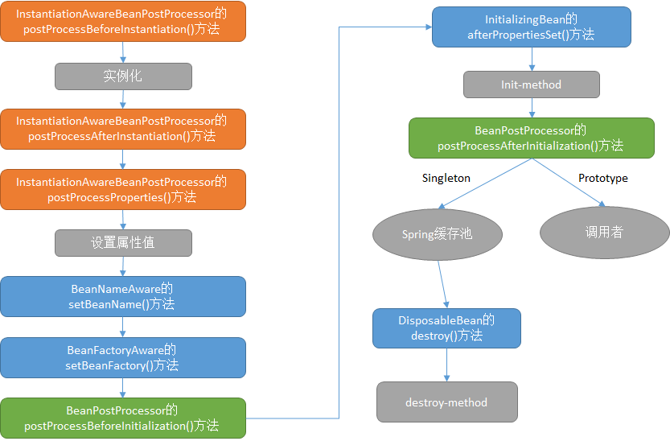
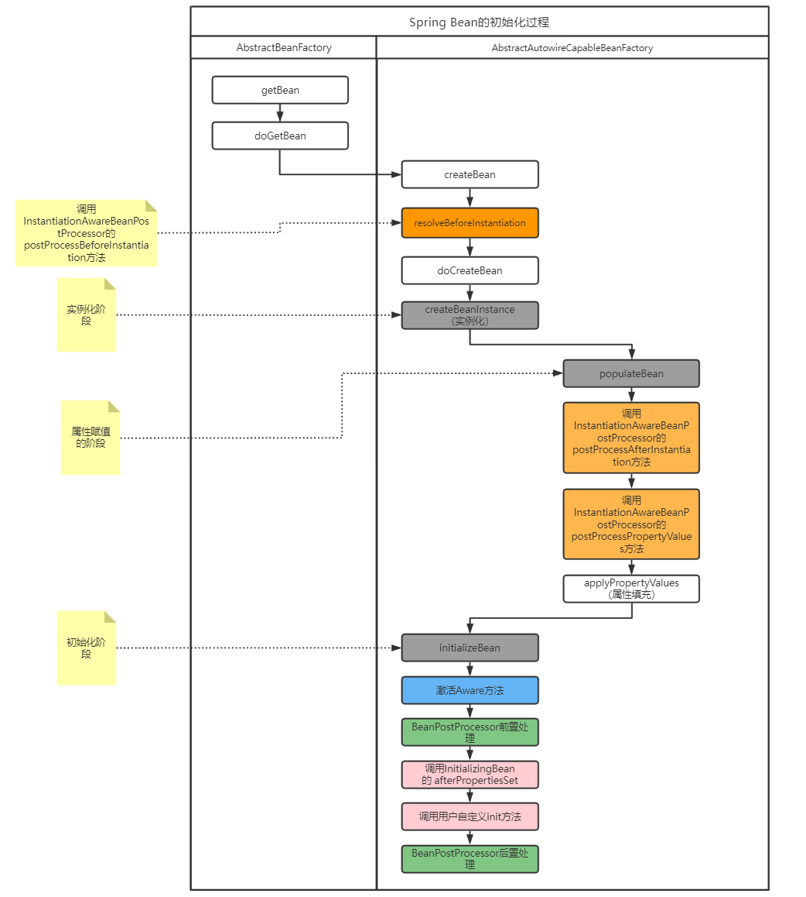

# 一文梳理Bean的生命周期

## 一. 前言

在学习Spring框架的IOC、AOP两大功能之前，首先需要了解这两个技术的基础——Bean。在Spring框架中，Bean无处不在，IOC容器管理的对象就是各种各样的Bean。理解Bean的生命周期有助于我们更好的理解和使用Spring框架的IOC功能，也有助于我们理解框架如何初始化、使用和管理Bean。接下来我们通过代码实现观察 BeanFactory 与 ApplicationContext 中bean的生命周期。

## 二. BeanFactory中Bean的生命周期

Bean 的生命周期概括起来就是 **4 个阶段**：

1. 实例化（Instantiation）
2. 属性赋值（Populate）
3. 初始化（Initialization）
4. 销毁（Destruction）

在四个阶段中，Spring框架会向外暴露多个扩展点，此时业务代码可以根据情况，从不同的扩展点切入影响Bean的默认创建行为。



- 其中橙色和绿色的是容器级别生命周期接口，也就是所有的Bean初始化时都会发生作用。主要包含两个接口InstantiationAwareBeanPostProcessor、BeanPostProcessor，一般被称为类后处理器。也可根据BeanName进行过滤对指定的Bean进行后处理。
- 蓝色的是Bean级生命周期接口方法，只有实现了这些接口的Bean进行初始化时，才会起作用。包含BeanNameAware、BeanFactoryAware、InitializingBean、DisposableBean。
- 灰色的是Bean自身的方法，通过Bean定义构造函数、setter属性赋值函数、init-method 和 destroy-method 所指定的方法。

## 三.扩展点

### 3.1 InstantiationAwareBeanPostProcessor

InstantiationAwareBeanPostProcessor主要是 Bean 实例化前后的扩展点，通常用于修改特定目标 bean 的默认实例化行为，例如创建具有特殊 TargetSources 的代理（池化目标、延迟初始化目标等），或实现额外的注入策略，如字段注入。

该接口是一个特殊用途的接口，主要供框架内部使用，建议尽可能实现普通的 BeanPostProcessor 接口。

```java
public interface InstantiationAwareBeanPostProcessor extends BeanPostProcessor {

    /**
	 * 自身方法，是最先执行的方法，它在目标对象实例化之前调用，该方法的返回值类型是Object，我们可以返回任何类型的值。
	 * 由于这个时候目标对象还未实例化，所以这个返回值可以用来代替原本该生成的目标对象的实例(比如代理对象)。
	 * 如果该方法的返回值代替原本该生成的目标对象，后续只有postProcessAfterInitialization方法会调用，
	 * 其它方法不再调用；否则按照正常的流程走
	 * @param beanClass
	 * @param beanName
	 * @return
	 * @throws BeansException
	 */
	@Nullable
	default Object postProcessBeforeInstantiation(Class<?> beanClass, String beanName) throws BeansException {
		return null;
	}


    /**
	 * 在目标对象实例化之后调用，这个时候对象已经被实例化，但是该实例的属性还未被设置，都是null。
	 * 因为它的返回值是决定要不要调用postProcessPropertyValues方法的其中一个因素
	 * （因为还有一个因素是mbd.getDependencyCheck()）；如果该方法返回false,并且不需要check，
	 * 那么postProcessPropertyValues就会被忽略不执行；如果返回true，postProcessPropertyValues就会被执行
	 */
	default boolean postProcessAfterInstantiation(Object bean, String beanName) throws BeansException {
		return true;
	}

    /**
    *对属性值进行修改，如果postProcessAfterInstantiation方法返回false，
    *该方法可能不会被调用。可以在该方法内对属性值进行修改
    */
	@Nullable
	default PropertyValues postProcessProperties(PropertyValues pvs, Object bean, String beanName)
			throws BeansException {

		return null;
	}

    /**
	 * 对属性值进行修改，如果postProcessAfterInstantiation方法返回false，该方法可能不会被调用。可以在该方法内对属性值进行修改
	 * 从 5.1 开始，支持 {@link postProcessProperties(PropertyValues, Object, String)}
	 */
	@Deprecated
	@Nullable
	default PropertyValues postProcessPropertyValues(
			PropertyValues pvs, PropertyDescriptor[] pds, Object bean, String beanName) throws BeansException {

		return pvs;
	}

```

其中`postProcessProperties`和`postProcessPropertyValues`作用相似，且触发时机相同，只是在 5.1 版本之后，更建议使用`postProcessProperties`。

### 3.2 Aware

Aware 接口为 Spring 容器的核心接口，是一个具有标识作用的超级接口，实现了该接口的 bean 是具有被 Spring 容器通知的能力，通知的方式是采用**回调**的方式。

Aware 接口是一个空接口，实际的方法签名由各个子接口来确定，且该接口通常只会有一个接收单参数的 set 方法，该 set 方法的命名方式为 set + 去掉接口名中的 Aware 后缀，即 XxxAware 接口，则方法定义为 setXxx()，例如 BeanNameAware（setBeanName），ApplicationContextAware（setApplicationContext）。

Aware 的子接口需要提供一个 `setXxx` 方法，我们知道 set 是设置属性值的方法，即 Aware 类接口的 `setXxx` 方法其实就是设置 xxx 属性值的。例如`ApplicationContextAware`：

```java
public interface ApplicationContextAware extends Aware {

	void setApplicationContext(ApplicationContext applicationContext) throws BeansException;

}
```

详细介绍参考：[IoC 之深入分析 Aware 接口](https://github.com/bigcoder84/study-notes/blob/master/%E5%9F%BA%E7%A1%80%E7%AC%94%E8%AE%B0/JavaWeb/Spring/subfile/_32Aware%E6%8E%A5%E5%8F%A3.md)

### 3.3 BeanPostProcessor

`BeanPostProcessor`也称为Bean后置处理器，它是Spring中定义的接口，在Spring容器的创建过程中（具体为Bean初始化前后）会回调`BeanPostProcessor`中定义的两个方法，接口如下：

```java
public interface BeanPostProcessor {

   /**
    * 初始化前执行的钩子
    */
   @Nullable
   default Object postProcessBeforeInitialization(Object bean, String beanName) throws BeansException {
      return bean;
   }

   /**
    * 初始化后，执行的钩子
    */
   @Nullable
   default Object postProcessAfterInitialization(Object bean, String beanName) throws BeansException {
      return bean;
   }

}
```

详细实现原理参考：[IoC 之深入分析 BeanPostProcessor](https://github.com/bigcoder84/study-notes/blob/master/%E5%9F%BA%E7%A1%80%E7%AC%94%E8%AE%B0/JavaWeb/Spring/subfile/_33%EF%BB%BFBeanPostProcessor%E6%8E%A5%E5%8F%A3.md)

### 3.4 InitializingBean 和 init-method

InitializingBean 是一个接口，它为 Spring Bean 的初始化提供了一种方式，它有一个 `#afterPropertiesSet()` 方法，在 bean 的初始化进程中会判断当前 bean 是否实现了 InitializingBean，如果实现了则调用 `#afterPropertiesSet()` 方法，进行初始化工作。然后再检查是否也指定了 `init-method` ，如果指定了则通过反射机制调用指定的 `init-method` 方法。代码如下：

```java
public interface InitializingBean {
	void afterPropertiesSet() throws Exception;
}
```

详细介绍参考：[IoC 之深入分析 InitializingBean 和 init-method](https://github.com/bigcoder84/study-notes/blob/master/%E5%9F%BA%E7%A1%80%E7%AC%94%E8%AE%B0/JavaWeb/Spring/subfile/_33InitializingBean%E6%8E%A5%E5%8F%A3.md)

## 四. 源码分析



### 4.1 bean 实例化

在 `#doCreateBean(...)` 方法中，首先进行 bean 实例化工作，主要由 `#createBeanInstance(...)` 方法实现，该方法返回一个 BeanWrapper 对象。BeanWrapper 对象是 Spring 的一个低级 Bean 基础结构的核心接口，为什么说是**低级**呢？因为这个时候的 Bean 还不能够被我们使用，连最基本的属性都没有设置。而且在我们实际开发过程中，一般都不会直接使用该类，而是通过 BeanFactory 隐式使用。

BeanWrapper 接口有一个默认实现类 BeanWrapperImpl，其主要作用是对 Bean 进行“包裹”，然后对这个包裹的 bean 进行操作，比如后续注入 bean 属性。

在实例化 bean 过程中，Spring 采用“策略模式”来决定采用哪种方式来实例化 bean，一般有反射和 CGLIB 动态字节码两种方式。

InstantiationStrategy 定义了 Bean 实例化策略的抽象接口，其子类 SimpleInstantiationStrategy 提供了基于反射来实例化对象的功能，但是不支持方法注入方式的对象实例化。CglibSubclassingInstantiationStrategy 继承 SimpleInstantiationStrategy，他除了拥有父类以反射实例化对象的功能外，还提供了通过 CGLIB 的动态字节码的功能进而支持方法注入所需的对象实例化需求。默认情况下，Spring 采用 CglibSubclassingInstantiationStrategy。

关于 Bean 实例化的详细过程，请参考这篇文章：[创建Bean的流程](https://github.com/bigcoder84/study-notes/blob/master/基础笔记/JavaWeb/Spring/subfile/_29创建Bean的流程.md)

### 4.2 激活Aware

当 Spring 完成 bean 对象实例化并且设置完相关属性和依赖后，则会开始 bean 的初始化进程（ `#initializeBean(...)` ），初始化第一个阶段是检查当前 bean 对象是否实现了一系列以 Aware 结尾的的接口。

Aware 接口为 Spring 容器的核心接口，是一个具有标识作用的超级接口，实现了该接口的 bean 是具有被 Spring 容器通知的能力，通知的方式是采用回调的方式。

在初始化阶段主要是感知 BeanNameAware、BeanClassLoaderAware、BeanFactoryAware 。代码如下：

```java
// AbstractAutowireCapableBeanFactory.java

private void invokeAwareMethods(final String beanName, final Object bean) {
	if (bean instanceof Aware) {
	    // BeanNameAware
		if (bean instanceof BeanNameAware) {
			((BeanNameAware) bean).setBeanName(beanName);
		}
		// BeanClassLoaderAware
		if (bean instanceof BeanClassLoaderAware) {
			ClassLoader bcl = getBeanClassLoader();
			if (bcl != null) {
				((BeanClassLoaderAware) bean).setBeanClassLoader(bcl);
			}
		}
		// BeanFactoryAware
		if (bean instanceof BeanFactoryAware) {
			((BeanFactoryAware) bean).setBeanFactory(AbstractAutowireCapableBeanFactory.this);
		}
	}
}
```

- BeanNameAware：对该 bean 对象定义的 beanName 设置到当前对象实例中
- BeanClassLoaderAware：将当前 bean 对象相应的 ClassLoader 注入到当前对象实例中
- BeanFactoryAware：BeanFactory 容器会将自身注入到当前对象实例中，这样当前对象就会拥有一个 BeanFactory 容器的引用。

当然，Spring 不仅仅只是提供了上面三个 Aware 接口，而是一系列：

- LoadTimeWeaverAware：加载Spring Bean时织入第三方模块，如AspectJ
- BootstrapContextAware：资源适配器BootstrapContext，如JCA,CCI
- ResourceLoaderAware：底层访问资源的加载器
- PortletConfigAware：PortletConfig
- PortletContextAware：PortletContext
- ServletConfigAware：ServletConfig
- ServletContextAware：ServletContext
- MessageSourceAware：国际化
- ApplicationEventPublisherAware：应用事件
- NotificationPublisherAware：JMX通知

### 4.3 BeanPostProcessor

初始化第二个阶段则是 BeanPostProcessor 增强处理，在该阶段 BeanPostProcessor 会处理当前容器内所有符合条件的实例化后的 bean 对象。它主要是对 Spring 容器提供的 bean 实例对象进行有效的扩展，允许 Spring 在初始化 bean 阶段对其进行定制化修改，如处理标记接口或者为其提供代理实现。

### 4.4 InitializingBean 和 init-method

初始化阶段，会先执行InitializingBean接口的afterPropertiesSet方法，再执行自定义Init方法

```java
// AbstractAutowireCapableBeanFactory.java

protected void invokeInitMethods(String beanName, final Object bean, @Nullable RootBeanDefinition mbd)
		throws Throwable {
    // 首先会检查是否是 InitializingBean ，如果是的话需要调用 afterPropertiesSet()
	boolean isInitializingBean = (bean instanceof InitializingBean);
	if (isInitializingBean && (mbd == null || !mbd.isExternallyManagedInitMethod("afterPropertiesSet"))) {
		if (logger.isTraceEnabled()) {
			logger.trace("Invoking afterPropertiesSet() on bean with name '" + beanName + "'");
		}
		if (System.getSecurityManager() != null) { // 安全模式
			try {
				AccessController.doPrivileged((PrivilegedExceptionAction<Object>) () -> {
                    // 属性初始化的处理
					((InitializingBean) bean).afterPropertiesSet();
					return null;
				}, getAccessControlContext());
			} catch (PrivilegedActionException pae) {
				throw pae.getException();
			}
		} else {
            // 属性初始化的处理
			((InitializingBean) bean).afterPropertiesSet();
		}
	}

	if (mbd != null && bean.getClass() != NullBean.class) {
        // 判断是否指定了 init-method()，
        // 如果指定了 init-method()，则再调用制定的init-method
		String initMethodName = mbd.getInitMethodName();
		if (StringUtils.hasLength(initMethodName) &&
				!(isInitializingBean && "afterPropertiesSet".equals(initMethodName)) &&
				!mbd.isExternallyManagedInitMethod(initMethodName)) {
            // 激活用户自定义的初始化方法
            // 利用反射机制执行
			invokeCustomInitMethod(beanName, bean, mbd);
		}
	}
}
```

### 4.5 DisposableBean 和 destroy-method

与 InitializingBean 和 `init-method` 用于对象的自定义初始化工作相似，DisposableBean和 `destroy-method` 则用于对象的自定义销毁工作。

当一个 bean 对象经历了实例化、设置属性、初始化阶段，那么该 bean 对象就可以供容器使用了（调用的过程）。当完成调用后，如果是 singleton 类型的 bean ，则会看当前 bean 是否应实现了 DisposableBean 接口或者配置了 `destroy-method` 属性，如果是的话，则会为该实例注册一个用于对象销毁的回调方法，便于在这些 singleton 类型的 bean 对象销毁之前执行销毁逻辑。

但是，并不是对象完成调用后就会立刻执行销毁方法，因为这个时候 Spring 容器还处于运行阶段，只有当 Spring 容器关闭的时候才会去调用。但是， Spring 容器不会这么聪明会自动去调用这些销毁方法，而是需要我们主动去告知 Spring 容器。

- 对于 BeanFactory 容器而言，我们需要主动调用 `#destroySingletons()` 方法，通知 BeanFactory 容器去执行相应的销毁方法。
- 对于 ApplicationContext 容器而言，调用 `#registerShutdownHook()` 方法。

> 代码注释参考：[Spring源码注释](https://github.com/bigcoder84/spring-framework/tree/5.3.10-annotation)

## 五. 测试

下面用一个实例来真实看看看上面执行的逻辑，毕竟理论是不能缺少实践的：

```java
public class LifeCycleBean implements BeanNameAware,BeanFactoryAware,BeanClassLoaderAware,BeanPostProcessor,
        InitializingBean,DisposableBean {

    private String test;

    public String getTest() {
        return test;
    }

    public void setTest(String test) {
        System.out.println("属性注入....");
        this.test = test;
    }

    public LifeCycleBean(){ // 构造方法
        System.out.println("构造函数调用...");
    }

    public void display(){
        System.out.println("方法调用...");
    }

    @Override
    public void setBeanFactory(BeanFactory beanFactory) throws BeansException {
        System.out.println("BeanFactoryAware 被调用...");
    }

    @Override
    public void setBeanName(String name) {
        System.out.println("BeanNameAware 被调用...");
    }

    @Override
    public void setBeanClassLoader(ClassLoader classLoader) {
        System.out.println("BeanClassLoaderAware 被调用...");
    }

    @Override
    public Object postProcessBeforeInitialization(Object bean, String beanName) throws BeansException {
        System.out.println("BeanPostProcessor postProcessBeforeInitialization 被调用...");
        return bean;
    }

    @Override
    public Object postProcessAfterInitialization(Object bean, String beanName) throws BeansException {
        System.out.println("BeanPostProcessor postProcessAfterInitialization 被调用...");
        return bean;
    }

    @Override
    public void destroy() throws Exception {
        System.out.println("DisposableBean destroy 被调动...");
    }

    @Override
    public void afterPropertiesSet() throws Exception {
        System.out.println("InitializingBean afterPropertiesSet 被调动...");
    }

    public void initMethod(){
        System.out.println("init-method 被调用...");
    }

    public void destroyMethdo(){
        System.out.println("destroy-method 被调用...");
    }

}
```

- LifeCycleBean 继承了 `BeanNameAware` , `BeanFactoryAware` , `BeanClassLoaderAware` , `BeanPostProcessor` , `InitializingBean` , `DisposableBean` 六个接口，同时定义了一个 `test` 属性用于验证属性注入和提供一个 `#display()` 方法用于模拟调用。

配置如下：

```xml
<bean id="lifeCycle" class="org.springframework.core.test.lifeCycleBean"
        init-method="initMethod" destroy-method="destroyMethdo">
    <property name="test" value="test"/>
</bean>
```

- 配置 `init-method` 和 `destroy-method`。

测试方法如下：

```java
// BeanFactory 容器一定要调用该方法进行 BeanPostProcessor 注册
factory.addBeanPostProcessor(new LifeCycleBean()); // <1>

LifeCycleBean lifeCycleBean = (LifeCycleBean) factory.getBean("lifeCycle");
lifeCycleBean.display();

System.out.println("方法调用完成，容器开始关闭....");
// 关闭容器
factory.destroySingletons();
```

运行结果：

```txt
构造函数调用...
构造函数调用...
属性注入....
BeanNameAware 被调用...
BeanClassLoaderAware 被调用...
BeanFactoryAware 被调用...
BeanPostProcessor postProcessBeforeInitialization 被调用...
InitializingBean afterPropertiesSet 被调动...
init-method 被调用...
BeanPostProcessor postProcessAfterInitialization 被调用...
方法调用...
方法调用完成，容器开始关闭....
DisposableBean destroy 被调动...
destroy-method 被调用...
```


> 本文参考至：
>
> [Bean生命周期 | Home page (tru-xu.github.io)](https://tru-xu.github.io/2019/07/22/bean-life/)
>
> [Spring源码分析](https://github.com/bigcoder84/study-notes/blob/master/%E5%9F%BA%E7%A1%80%E7%AC%94%E8%AE%B0/JavaWeb/Spring/index.md)

