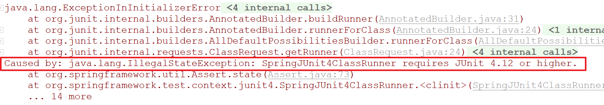

## Spring整合JUnit测试

#### 传统JUnit测试的弊端

​	在传统的JUnit测试Spring项目时，我们只能手动创建Spring容器，然后手动注入依赖才能进行测试：

```java
public class TestSpring2 {
    @Autowired
    private TestService testService;

    @Before
    public void init(){
        ApplicationContext ac=new AnnotationConfigApplicationContext(SpringConfiguration.class);//手动创建容器
        testService=ac.getBean(TestService.class);//手动注入依赖
    }

    @Test
    public void test(){
        testService.sayHello();//进行测试
    }
}
```

​	手动创建容器没有任何问题，但是如果我们想手动创建依赖这就很麻烦了（因为我们测试时可能会用到很多IOC容器中的实例），如果我们能使用`@Autowired`注解进行依赖注入，那测试会方便很多。Spring提供了这个功能。

#### Spring整合JUnit测试

​	**第一步：导入`spring-test`jar包**

​	Spring整合JUnit测试核心就是在JUnit运行之前，创建IOC容器，并且实现依赖注入。那么JUnit自带的`测试运行器`就无法实现这个功能了。所以此时我们需要向项目中导入`spring-test`。

```xml
<dependency>
    <groupId>org.springframework</groupId>
    <artifactId>spring-test</artifactId>
    <version>4.2.4.RELEASE</version>
</dependency>
```

​	

**第二步：配置Spring提供的`运行器`**（SpringJUnit4ClassRunner）

​	JUnit提供了`@RunWith`注解，用配置当前测试类运行时所使用的运行器。

​		**@RunWith官方文档：**

> ​		When a class is annotated with @RunWith or extends a class annotated with @RunWith, **JUnit will invoke the class it references to run the tests in that class instead of the runner built into JUnit.** 
>

```java
@RunWith(SpringJUnit4ClassRunner.class)
public class TestSpring {
   
}
```


**第三步：使用`@ContextConfiguration`注解标识配置文件的位置**

​	ContextConfiguration注解的属性：

- locations：如果采用XML文件配置，则使用locations指明配置文件的位置，路径前面最好加上`classpath`关键字。
- value：value和locations互为别名关系。
- classes：如果使用全注解配置，则使用classes指明“配置类”的字节码对象。

```java
@RunWith(SpringJUnit4ClassRunner.class)
@ContextConfiguration(locations = "classpath:spring/applicationContext.xml")
public class TestSpring {
    @Autowired
    private TestService testService;

    @Test
    public void test(){

        testService.sayHello();
    }
}
```


#### Spring5.x与JUnit整合时注意事项

​	**Spring5.x版本在与JUnit整合时要求JUnit版本不低于4.12版本，否则会报错。**



