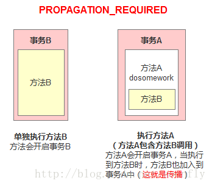
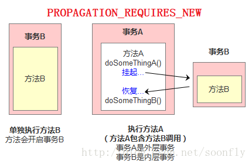
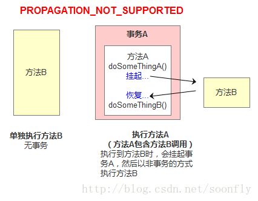

# Spring事务的七种传播行为

什么叫事务传播行为？听起来挺高端的，其实很简单。 
即然是传播，那么至少有两个东西，才可以发生传播。单体不存在传播这个行为。

事务传播行为（propagation behavior）指的就是当一个事务方法被另一个事务方法调用时，这个事务方法应该如何进行。 

例如：methodA事务方法调用methodB事务方法时，methodB是继续在调用者methodA的事务中运行呢，还是为自己开启一个新事务运行，这就是由methodB的事务传播行为决定的。

Spring定义了七种传播行为：


## **PROPAGATION_REQUIRED**

如果存在一个事务，则支持当前事务。如果没有事务则开启一个新的事务。 

可以把事务想像成一个胶囊，在这个场景下方法B用的是方法A产生的胶囊（事务）。 



举例有两个方法：

```java
@Transactional(propagation = Propagation.REQUIRED)
public void methodA() {
	methodB();
    // do something
}

@Transactional(propagation = Propagation.REQUIRED)
public void methodB() {
    // do something
}
```

单独调用methodB方法时，因为当前上下文不存在事务，所以会开启一个新的事务。 

调用methodA方法时，因为当前上下文不存在事务，所以会开启一个新的事务。当执行到methodB时，methodB发现当前上下文有事务，因此就加入到当前事务中来。


## **PROPAGATION_SUPPORTS**

​	如果存在一个事务，支持当前事务。如果没有事务，则非事务的执行。但是对于事务同步的事务管理器，PROPAGATION_SUPPORTS与不使用事务有少许不同。 

举例有两个方法：

```java
@Transactional(propagation = Propagation.REQUIRED)
public void methodA() {
	methodB();
    // do something
}

// 事务属性为SUPPORTS
@Transactional(propagation = Propagation.SUPPORTS)
public void methodB() {
    // do something
}
```

单纯的调用methodB时，methodB方法是非事务的执行的。当调用methdA时,methodB则加入了methodA的事务中,事务地执行。


## PROPAGATION_MANDATORY

如果已经存在一个事务，支持当前事务。如果没有一个活动的事务，则抛出异常。

```java
@Transactional(propagation = Propagation.REQUIRED)
public void methodA() {
	methodB();
    // do something
}

// 事务属性为MANDATORY
@Transactional(propagation = Propagation.MANDATORY)
public void methodB() {
    // do something
}
```

当单独调用methodB时，因为当前没有一个活动的事务，则会抛出异常`throw new IllegalTransactionStateException(“Transaction propagation ‘mandatory’ but no existing transaction found”);`当调用methodA时，methodB则加入到methodA的事务中，事务地执行。


## **PROPAGATION_REQUIRES_NEW**



使用PROPAGATION_REQUIRES_NEW,需要使用 JtaTransactionManager作为事务管理器。 

它会开启一个新的事务。如果一个事务已经存在，则先将这个存在的事务挂起。

```java
@Transactional(propagation = Propagation.REQUIRED)
public void methodA() {
	doSomeThingA();
	methodB();
	doSomeThingB();
	// do something else
}

// 事务属性为REQUIRES_NEW
@Transactional(propagation = Propagation.REQUIRES_NEW)
public void methodB() {
    // do something
}
```

当调用

```java
public static void main(String[] args){  
	methodA();
} 
```

相当于调用：

```java
public static void main(String[] args){
    TransactionManager tm = null;
    try{
        //获得一个JTA事务管理器
        tm = getTransactionManager();
        tm.begin();//开启一个新的事务
        Transaction ts1 = tm.getTransaction();
        doSomeThing();
        tm.suspend();//挂起当前事务
        try{
            tm.begin();//重新开启第二个事务
            Transaction ts2 = tm.getTransaction();
            methodB();
            ts2.commit();//提交第二个事务
        } Catch(RunTimeException ex) {
            ts2.rollback();//回滚第二个事务
        } finally {
            //释放资源
        }
        //methodB执行完后，恢复第一个事务
        tm.resume(ts1);
        doSomeThingB();
        ts1.commit();//提交第一个事务
    } catch(RunTimeException ex) {
        ts1.rollback();//回滚第一个事务
    } finally {
        //释放资源
    }
}
```

​	在这里，我把ts1称为外层事务，ts2称为内层事务。从上面的代码可以看出，`ts2与ts1是两个独立的事务，互不相干。Ts2是否成功并不依赖于 ts1`。如果methodA方法在调用methodB方法后的doSomeThingB方法失败了，而methodB方法所做的结果依然被提交。而除了 methodB之外的其它代码导致的结果却被回滚了。


## **PROPAGATION_NOT_SUPPORTED**

PROPAGATION_NOT_SUPPORTED 总是非事务地执行，并挂起任何存在的事务。使用PROPAGATION_NOT_SUPPORTED,也需要使用JtaTransactionManager作为事务管理器。 



## **PROPAGATION_NEVER**

总是非事务地执行，如果存在一个活动事务，则抛出异常。


## **PROPAGATION_NESTED**


如果一个活动的事务存在，则运行在一个嵌套的事务中。 如果没有活动事务, 则按TransactionDefinition.PROPAGATION_REQUIRED 属性执行。 

这是一个嵌套事务,使用JDBC 3.0驱动时,仅仅支持DataSourceTransactionManager作为事务管理器。 

需要JDBC 驱动的java.sql.Savepoint类。使用PROPAGATION_NESTED，还需要把PlatformTransactionManager的nestedTransactionAllowed属性设为true(属性值默认为false)。

这里关键是嵌套执行。

```java
@Transactional(propagation = Propagation.REQUIRED)
public void methodA(){
	doSomeThingA();
	methodB();
	doSomeThingB();
}

@Transactional(propagation = Propagation.NEWSTED)
public void methodB(){
	……
}
```

如果单独调用methodB方法，则按REQUIRED属性执行。如果调用methodA方法，相当于下面的效果：

```java
public static void main(String[] args){
    Connection con = null;
    Savepoint savepoint = null;
    try{
        con = getConnection();
        con.setAutoCommit(false);
        doSomeThingA();
        savepoint = con.setSavepoint();
        try{
            methodB();
        } catch(RuntimeException ex) {
            con.rollback(savepoint);
        } finally {
            //释放资源
        }
        doSomeThingB();
        con.commit();
    } catch(RuntimeException ex) {
        con.rollback();
    } finally {
        //释放资源
    }
}
```

当methodB方法调用之前，调用setSavepoint方法，保存当前的状态到savepoint。如果methodB方法调用失败，则恢复到之前保存的状态。但是需要注意的是，这时的事务并没有进行提交，如果后续的代码(doSomeThingB()方法)调用失败，则回滚包括methodB方法的所有操作。嵌套事务一个非常重要的概念就是内层事务依赖于外层事务。外层事务失败时，会回滚内层事务所做的动作。而内层事务操作失败并不会引起外层事务的回滚。

## **PROPAGATION_NESTED 与PROPAGATION_REQUIRES_NEW的区别**

它们非常类似,都像一个嵌套事务，如果不存在一个活动的事务，都会开启一个新的事务。 
使用 PROPAGATION_REQUIRES_NEW时，内层事务与外层事务就像两个独立的事务一样，一旦内层事务进行了提交后，外层事务不能对其进行回滚。两个事务互不影响。两个事务不是一个真正的嵌套事务。同时它需要JTA事务管理器的支持。

使用PROPAGATION_NESTED时，外层事务的回滚可以引起内层事务的回滚。而内层事务的异常并不会导致外层事务的回滚，它是一个真正的嵌套事务。DataSourceTransactionManager使用savepoint支持PROPAGATION_NESTED时，需要JDBC 3.0以上驱动及1.4以上的JDK版本支持。其它的JTATrasactionManager实现可能有不同的支持方式。

PROPAGATION_REQUIRES_NEW 启动一个新的, 不依赖于环境的 “内部” 事务. 这个事务将被完全 commited 或 rolled back 而不依赖于外部事务, 它拥有自己的隔离范围, 自己的锁, 等等. 当内部事务开始执行时, 外部事务将被挂起, 内务事务结束时, 外部事务将继续执行。

另一方面, PROPAGATION_NESTED 开始一个 “嵌套的” 事务, 它是已经存在事务的一个真正的子事务. 潜套事务开始执行时, 它将取得一个 savepoint. 如果这个嵌套事务失败, 我们将回滚到此 savepoint. 潜套事务是外部事务的一部分, 只有外部事务结束后它才会被提交。

由此可见, PROPAGATION_REQUIRES_NEW 和 PROPAGATION_NESTED 的最大区别在于, PROPAGATION_REQUIRES_NEW 完全是一个新的事务, 而 PROPAGATION_NESTED 则是外部事务的子事务, 如果外部事务 commit, 嵌套事务也会被 commit, 这个规则同样适用于 roll back。