# 从零搭建分模块SSM项目

## 一. 创建基本项目结构

### 1.1 创建Maven父工程

file->new Project->Maven->next->输入项目名称和Maven坐标：

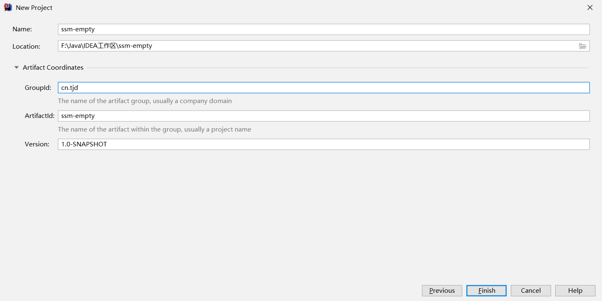

### 1.2 创建Web模块

右击父项目->new Module->Maven->next->：

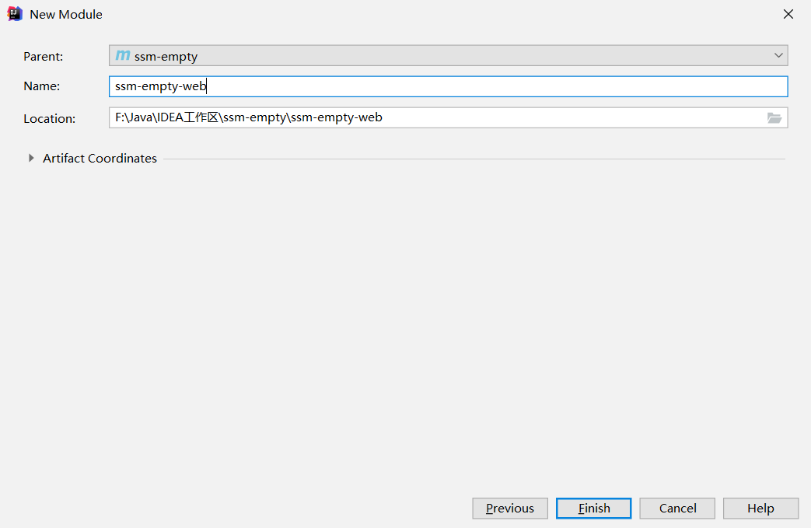

创建好web子模块后，我们会发现这个模块中的文件夹都是灰色的，也就说明IDEA此时还未认识到这个模块是一个Maven项目，我们需要删除该模块然后重新导入：

file->project structure->Modules：

选中新建的模块点击删除：

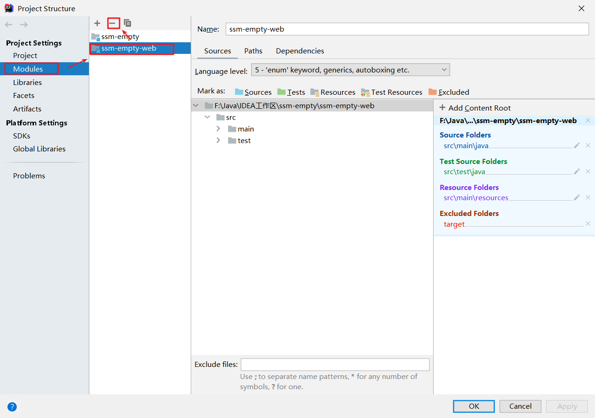

然后点击“+”号重新导入刚刚的模块，然后我们就会发现这个项目的文件夹变成了正常Maven项目的样子：

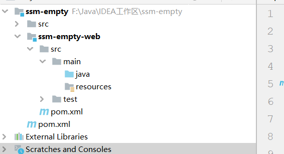

### 1.3 创建service、interface、dao、entity模块

按照Web模块的创建方式，创建service、interface、dao、entity模块：

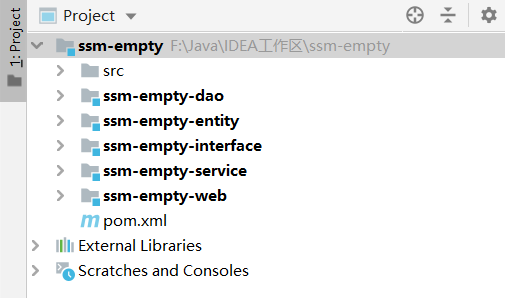

## 二. 添加项目依赖

### 2.1 配置父模块的POM

```xml
<?xml version="1.0" encoding="UTF-8"?>
<project xmlns="http://maven.apache.org/POM/4.0.0"
         xmlns:xsi="http://www.w3.org/2001/XMLSchema-instance"
         xsi:schemaLocation="http://maven.apache.org/POM/4.0.0 http://maven.apache.org/xsd/maven-4.0.0.xsd">
    <modelVersion>4.0.0</modelVersion>

    <groupId>cn.tjd</groupId>
    <artifactId>ssm-empty</artifactId>
    <packaging>pom</packaging>
    <version>1.0-SNAPSHOT</version>
    <modules>
        <module>ssm-empty-web</module>
        <module>ssm-empty-service</module>
        <module>ssm-empty-interface</module>
        <module>ssm-empty-dao</module>
        <module>ssm-empty-entity</module>
    </modules>

    <properties>
        <junit.version>4.12</junit.version>
        <spring.version>4.2.4.RELEASE</spring.version>
        <mybatis.version>3.2.8</mybatis.version>
        <mybatis.spring.version>1.2.2</mybatis.spring.version>
        <mysql.version>5.1.32</mysql.version>
        <druid.version>1.0.9</druid.version>
        <jstl.version>1.2</jstl.version>
        <servlet-api.version>2.5</servlet-api.version>
        <jsp-api.version>2.0</jsp-api.version>
        <commons-fileupload.version>1.3.1</commons-fileupload.version>
        <jackson.version>2.4.2</jackson.version>
    </properties>

    <dependencyManagement>
        <dependencies>
            <!-- Mybatis -->
            <dependency>
                <groupId>org.mybatis</groupId>
                <artifactId>mybatis</artifactId>
                <version>${mybatis.version}</version>
            </dependency>
            <dependency>
                <groupId>org.mybatis</groupId>
                <artifactId>mybatis-spring</artifactId>
                <version>${mybatis.spring.version}</version>
            </dependency>
            <!-- MySql -->
            <dependency>
                <groupId>mysql</groupId>
                <artifactId>mysql-connector-java</artifactId>
                <version>${mysql.version}</version>
            </dependency>
            <!-- 连接池 -->
            <dependency>
                <groupId>com.alibaba</groupId>
                <artifactId>druid</artifactId>
                <version>${druid.version}</version>
            </dependency>
            <!-- Spring -->
            <dependency>
                <groupId>org.springframework</groupId>
                <artifactId>spring-context</artifactId>
                <version>${spring.version}</version>
            </dependency>
            <dependency>
                <groupId>org.springframework</groupId>
                <artifactId>spring-beans</artifactId>
                <version>${spring.version}</version>
            </dependency>
            <dependency>
                <groupId>org.springframework</groupId>
                <artifactId>spring-webmvc</artifactId>
                <version>${spring.version}</version>
            </dependency>
            <dependency>
                <groupId>org.springframework</groupId>
                <artifactId>spring-jdbc</artifactId>
                <version>${spring.version}</version>
            </dependency>
            <dependency>
                <groupId>org.springframework</groupId>
                <artifactId>spring-aspects</artifactId>
                <version>${spring.version}</version>
            </dependency>
            <dependency>
                <groupId>org.springframework</groupId>
                <artifactId>spring-jms</artifactId>
                <version>${spring.version}</version>
            </dependency>
            <dependency>
                <groupId>org.springframework</groupId>
                <artifactId>spring-context-support</artifactId>
                <version>${spring.version}</version>
            </dependency>
            <!-- Jackson-->
            <dependency>
                <groupId>com.fasterxml.jackson.core</groupId>
                <artifactId>jackson-databind</artifactId>
                <version>${jackson.version}</version>
            </dependency>
            <!-- JSP相关 -->
            <dependency>
                <groupId>jstl</groupId>
                <artifactId>jstl</artifactId>
                <version>${jstl.version}</version>
            </dependency>
            <dependency>
                <groupId>javax.servlet</groupId>
                <artifactId>servlet-api</artifactId>
                <version>${servlet-api.version}</version>
                <scope>provided</scope>
            </dependency>
            <dependency>
                <groupId>javax.servlet</groupId>
                <artifactId>jsp-api</artifactId>
                <version>${jsp-api.version}</version>
                <scope>provided</scope>
            </dependency>
            <!-- 文件上传组件 -->
            <dependency>
                <groupId>commons-fileupload</groupId>
                <artifactId>commons-fileupload</artifactId>
                <version>${commons-fileupload.version}</version>
            </dependency>
        </dependencies>
    </dependencyManagement>
</project>
```

### 2.2 配置Web模块的POM

主要有下列工作：

- 将web模块打包方式改为war
- 引入Interface、service模块依赖
- 引入第三方框架依赖

```xml
<?xml version="1.0" encoding="UTF-8"?>
<project xmlns="http://maven.apache.org/POM/4.0.0"
         xmlns:xsi="http://www.w3.org/2001/XMLSchema-instance"
         xsi:schemaLocation="http://maven.apache.org/POM/4.0.0 http://maven.apache.org/xsd/maven-4.0.0.xsd">
    <parent>
        <artifactId>ssm-empty</artifactId>
        <groupId>cn.tjd</groupId>
        <version>1.0-SNAPSHOT</version>
    </parent>
    <modelVersion>4.0.0</modelVersion>
    <artifactId>ssm-empty-web</artifactId>
    <packaging>war</packaging>

    <dependencies>
        <dependency>
            <groupId>cn.tjd</groupId>
            <artifactId>ssm-empty-service</artifactId>
            <version>1.0-SNAPSHOT</version>
        </dependency>
        <!-- Mybatis -->
        <dependency>
            <groupId>org.mybatis</groupId>
            <artifactId>mybatis</artifactId>
        </dependency>
        <dependency>
            <groupId>org.mybatis</groupId>
            <artifactId>mybatis-spring</artifactId>
        </dependency>
        <!-- MySql -->
        <dependency>
            <groupId>mysql</groupId>
            <artifactId>mysql-connector-java</artifactId>
        </dependency>
        <!-- 连接池 -->
        <dependency>
            <groupId>com.alibaba</groupId>
            <artifactId>druid</artifactId>
        </dependency>
        <!-- Spring -->
        <dependency>
            <groupId>org.springframework</groupId>
            <artifactId>spring-context</artifactId>
        </dependency>
        <dependency>
            <groupId>org.springframework</groupId>
            <artifactId>spring-beans</artifactId>
        </dependency>
        <dependency>
            <groupId>org.springframework</groupId>
            <artifactId>spring-webmvc</artifactId>
        </dependency>
        <dependency>
            <groupId>org.springframework</groupId>
            <artifactId>spring-jdbc</artifactId>
        </dependency>
        <dependency>
            <groupId>org.springframework</groupId>
            <artifactId>spring-aspects</artifactId>
        </dependency>
        <dependency>
            <groupId>org.springframework</groupId>
            <artifactId>spring-context-support</artifactId>
        </dependency>
        <!-- JSP相关 -->
        <dependency>
            <groupId>jstl</groupId>
            <artifactId>jstl</artifactId>
        </dependency>
        <dependency>
            <groupId>javax.servlet</groupId>
            <artifactId>servlet-api</artifactId>
            <scope>provided</scope>
        </dependency>
        <dependency>
            <groupId>javax.servlet</groupId>
            <artifactId>jsp-api</artifactId>
            <scope>provided</scope>
        </dependency>
        <!-- 文件上传组件-->
        <dependency>
            <groupId>commons-fileupload</groupId>
            <artifactId>commons-fileupload</artifactId>
        </dependency>
        <!-- Jackson-->
        <dependency>
            <groupId>com.fasterxml.jackson.core</groupId>
            <artifactId>jackson-databind</artifactId>
        </dependency>
    </dependencies>
</project>
```

### 2.3 配置Service模块的POM

在Service模块的POM中加入`Interface`、`Dao`模块的依赖：

```xml
<?xml version="1.0" encoding="UTF-8"?>
<project xmlns="http://maven.apache.org/POM/4.0.0"
         xmlns:xsi="http://www.w3.org/2001/XMLSchema-instance"
         xsi:schemaLocation="http://maven.apache.org/POM/4.0.0 http://maven.apache.org/xsd/maven-4.0.0.xsd">
    <parent>
        <artifactId>ssm-empty</artifactId>
        <groupId>cn.tjd</groupId>
        <version>1.0-SNAPSHOT</version>
    </parent>
    <modelVersion>4.0.0</modelVersion>

    <artifactId>ssm-empty-service</artifactId>

    <dependencies>
        <dependency>
            <groupId>cn.tjd</groupId>
            <artifactId>ssm-empty-interface</artifactId>
            <version>1.0-SNAPSHOT</version>
        </dependency>
        <dependency>
            <groupId>cn.tjd</groupId>
            <artifactId>ssm-empty-dao</artifactId>
            <version>1.0-SNAPSHOT</version>
        </dependency>
    </dependencies>

</project>
```

### 2.4 配置Interface模块的POM

在interface模块中添加`entity`模块的依赖：

```xml
<?xml version="1.0" encoding="UTF-8"?>
<project xmlns="http://maven.apache.org/POM/4.0.0"
         xmlns:xsi="http://www.w3.org/2001/XMLSchema-instance"
         xsi:schemaLocation="http://maven.apache.org/POM/4.0.0 http://maven.apache.org/xsd/maven-4.0.0.xsd">
    <parent>
        <artifactId>ssm-empty</artifactId>
        <groupId>cn.tjd</groupId>
        <version>1.0-SNAPSHOT</version>
    </parent>
    <modelVersion>4.0.0</modelVersion>

    <artifactId>ssm-empty-interface</artifactId>

    <dependencies>
        <dependency>
            <groupId>cn.tjd</groupId>
            <artifactId>ssm-empty-entity</artifactId>
            <version>1.0-SNAPSHOT</version>
        </dependency>
    </dependencies>

</project>
```

### 2.5 配置Dao模块的POM

在Dao模块中添加`entity`模块的依赖：

```xml
<?xml version="1.0" encoding="UTF-8"?>
<project xmlns="http://maven.apache.org/POM/4.0.0"
         xmlns:xsi="http://www.w3.org/2001/XMLSchema-instance"
         xsi:schemaLocation="http://maven.apache.org/POM/4.0.0 http://maven.apache.org/xsd/maven-4.0.0.xsd">
    <parent>
        <artifactId>ssm-empty</artifactId>
        <groupId>cn.tjd</groupId>
        <version>1.0-SNAPSHOT</version>
    </parent>
    <modelVersion>4.0.0</modelVersion>

    <artifactId>ssm-empty-dao</artifactId>

    <dependencies>
        <dependency>
            <groupId>cn.tjd</groupId>
            <artifactId>ssm-empty-entity</artifactId>
            <version>1.0-SNAPSHOT</version>
        </dependency>
    </dependencies>

</project>
```

走到这里，模块之间依赖关系就配置好了，大概结构就是这样：

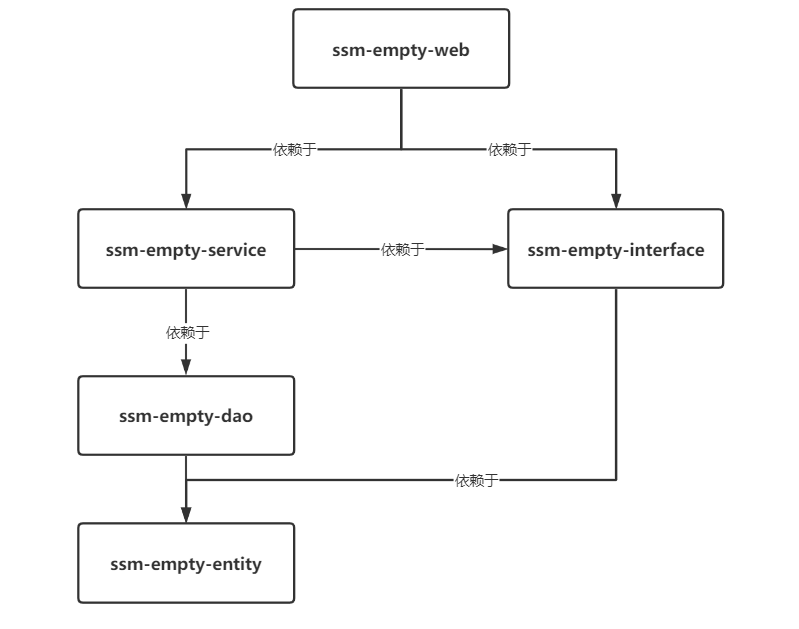

## 三. 配置Spring环境

### 3.1 创建web.xml文件

首先Spring容器是需要依托于Web监听器启动的，但是我们上面创建的`ssm-empty-web`项目并不是一个正确的web项目:

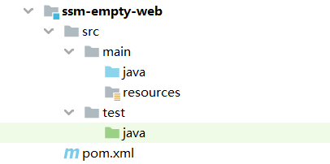

我们需要在`src/main`下创建一个`webapp/WEB-INF`文件夹:

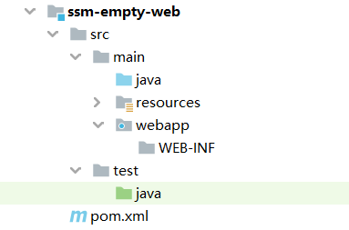

点击file->Project Structure，选中Facets，点击加号，选中Web：

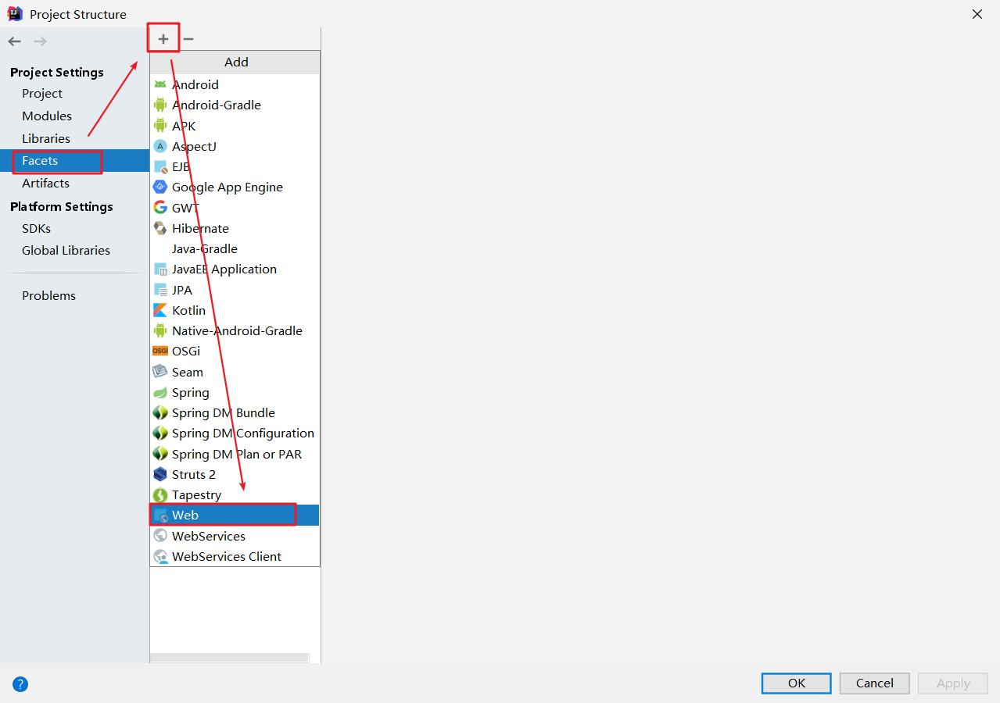

双击`ssm-empty-web`模块：

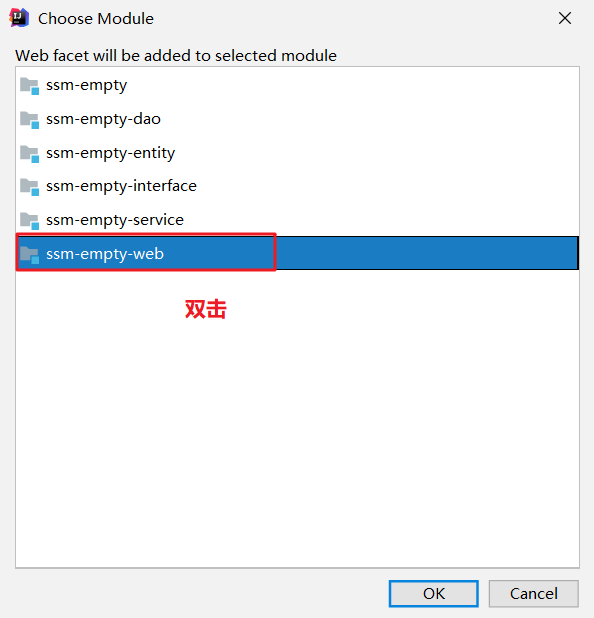

设置web资源的根路径，将跟路径设置为刚刚创建的webapp目录：

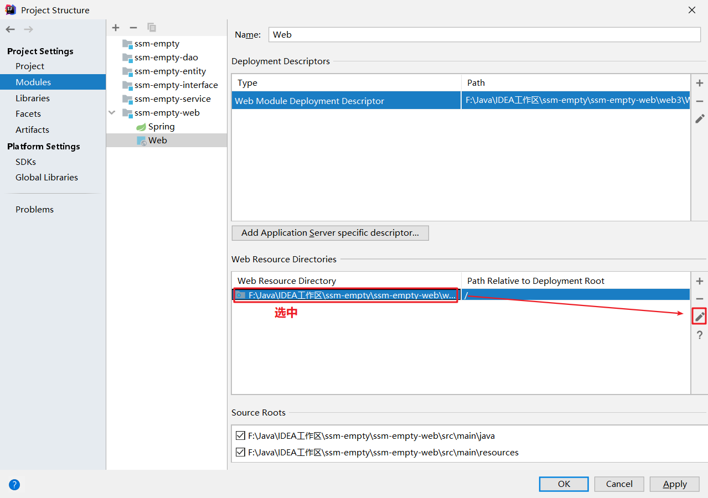

设置web.xml文件，先删除原先的定义，然后新增web.xml路径指定在`webapp`目录下，然后点击apply完成即可。

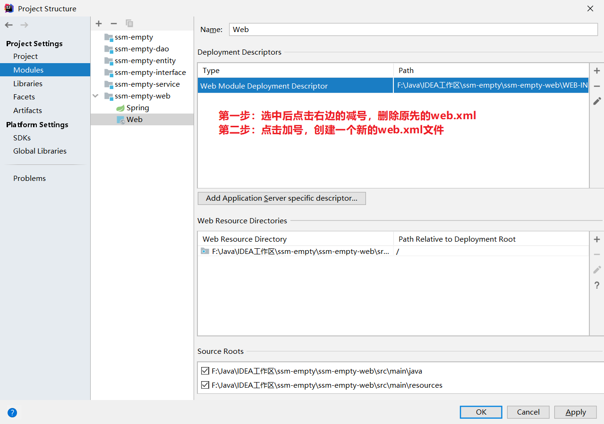

### 3.2 创建spring配置文件

在resources目录下创建一个spring文件夹，专门用于存放Spring的配置文件。在spring文件夹下创建`applicationContext-service.xml`文件：

```xml
<?xml version="1.0" encoding="UTF-8"?>
<beans xmlns="http://www.springframework.org/schema/beans"
       xmlns:context="http://www.springframework.org/schema/context"
       xmlns:xsi="http://www.w3.org/2001/XMLSchema-instance"
       xsi:schemaLocation="http://www.springframework.org/schema/beans http://www.springframework.org/schema/beans/spring-beans-4.2.xsd
	http://www.springframework.org/schema/context http://www.springframework.org/schema/context/spring-context-4.2.xsd">

    <context:component-scan base-package="cn.tjd"></context:component-scan>
</beans>
```

### 3.2 在web.xml中配置spring启动的监听器

```xml
<?xml version="1.0" encoding="UTF-8"?>
<web-app xmlns="http://xmlns.jcp.org/xml/ns/javaee"
         xmlns:xsi="http://www.w3.org/2001/XMLSchema-instance"
         xsi:schemaLocation="http://xmlns.jcp.org/xml/ns/javaee http://xmlns.jcp.org/xml/ns/javaee/web-app_4_0.xsd"
         version="4.0">
        <!-- 配置Spring的监听器 -->
    <context-param>
        <param-name>contextConfigLocation</param-name>
        <param-value>classpath:spring/applicationContext*.xml</param-value>
    </context-param>
    <listener>
        <listener-class>org.springframework.web.context.ContextLoaderListener</listener-class>
    </listener>
</web-app>
```

## 四. 配置SpringMVC

### 4.1 在web模块中的spring文件夹下创建springmvc.xml文件

```xml
<?xml version="1.0" encoding="UTF-8"?>
<beans xmlns="http://www.springframework.org/schema/beans"
       xmlns:xsi="http://www.w3.org/2001/XMLSchema-instance" xmlns:p="http://www.springframework.org/schema/p"
       xmlns:context="http://www.springframework.org/schema/context"
       xmlns:mvc="http://www.springframework.org/schema/mvc"
       xsi:schemaLocation="http://www.springframework.org/schema/beans http://www.springframework.org/schema/beans/spring-beans-4.2.xsd
        http://www.springframework.org/schema/mvc http://www.springframework.org/schema/mvc/spring-mvc-4.2.xsd
        http://www.springframework.org/schema/context http://www.springframework.org/schema/context/spring-context-4.2.xsd">

    <context:component-scan base-package="cn.tjd.controller" />

    <!-- 开启注解驱动 -->
    <mvc:annotation-driven />

    <!-- 配置映射适配器 -->
    <bean
            class="org.springframework.web.servlet.view.InternalResourceViewResolver">
        <property name="prefix" value="/WEB-INF/jsp/" />
        <property name="suffix" value=".jsp" />
    </bean>

    <!-- 配置资源映射 -->
    <mvc:resources location="/css/" mapping="/css/**"></mvc:resources>
    <mvc:resources location="/js/" mapping="/js/**"></mvc:resources>

    <!-- 定义文件上传解析器 -->
    <bean id="multipartResolver"
          class="org.springframework.web.multipart.commons.CommonsMultipartResolver">
        <!-- 设定默认编码 -->
        <property name="defaultEncoding" value="UTF-8"></property>
        <!-- 设定文件上传的最大值5MB，5*1024*1024 -->
        <property name="maxUploadSize" value="5242880"></property>
    </bean>
</beans>

```

### 4.2 在web.xml中配置前端控制器

```xml
<!-- springmvc的前端控制器 -->
<servlet>
    <servlet-name>ssm-empty-web</servlet-name>
    <servlet-class>org.springframework.web.servlet.DispatcherServlet</servlet-class>
    <!-- contextConfigLocation不是必须的， 如果不配置contextConfigLocation， springmvc的配置文件默认在：WEB-INF/servlet的name+"-servlet.xml" -->
    <init-param>
        <param-name>contextConfigLocation</param-name>
        <param-value>classpath:spring/springmvc.xml</param-value>
    </init-param>
    <load-on-startup>1</load-on-startup>
</servlet>
<servlet-mapping>
    <servlet-name>ssm-empty-web</servlet-name>
    <url-pattern>/</url-pattern>
</servlet-mapping>
```

### 4.3 测试SpringMVC

编写测试接口：

```java
package cn.tjd.controller;

import org.springframework.web.bind.annotation.RequestMapping;
import org.springframework.web.bind.annotation.RestController;

/**
 * @Auther: TJD
 * @Date: 2020-07-04
 * @DESCRIPTION:
 **/
@RestController
public class TestController {

    @RequestMapping("/test")
    public String test(){
        return "Hello World";
    }
}
```

配置项目到Web容器中：

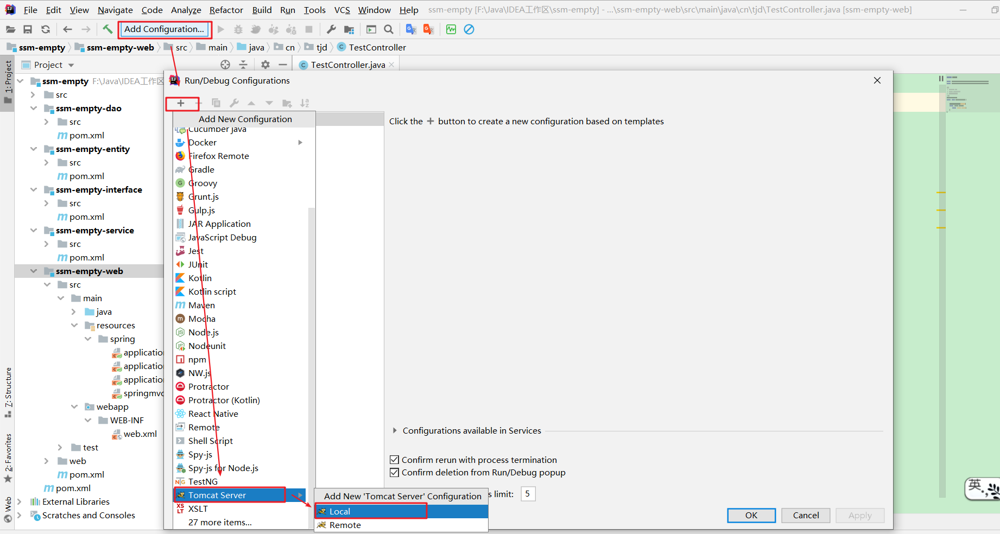

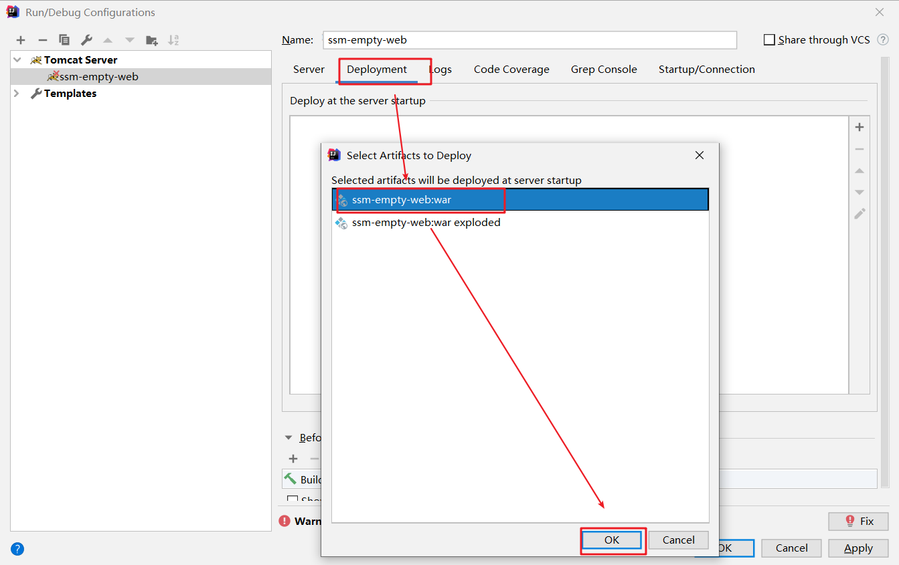

修改项目访问的根路径：

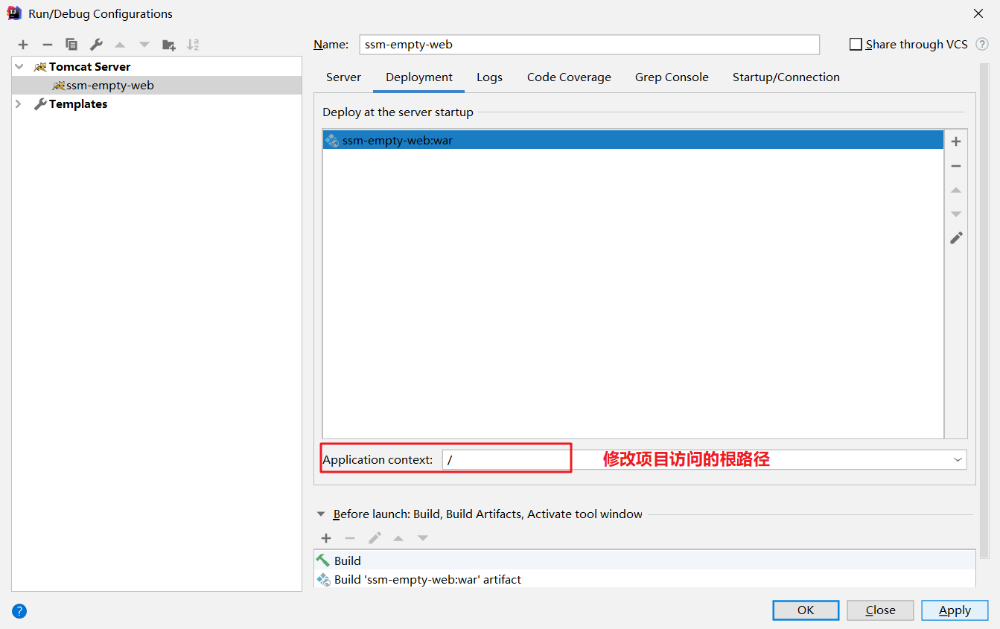

启动项目，并测试如果成功进行下一步。

## 五. 配置MyBatis

### 5.1 创建MyBatis核心配置文件

在`web`模块中的`resources`目录下创建一个`mybatis`目录，然后创建一个`SqlConfig.xml`文件：

```xml
<?xml version="1.0" encoding="UTF-8"?>
<!DOCTYPE configuration
		PUBLIC "-//mybatis.org//DTD Config 3.0//EN"
		"http://mybatis.org/dtd/mybatis-3-config.dtd">
<configuration>

</configuration>
```


**实际上在大多数情况下，MyBatis核心配置文件可以省略**，因为MyBatis核心配置文件中的配置项大多都可以在整合Spring时由Spring的配置替代。只有在需要配置Mybatis插件等特殊情况下才需要MyBatis核心配置文件的参与。

### 5.2 创建`db.properties`文件

在web模块中的resources目录下创建`config/db.properties`文件：

```properties
jdbc.driver=com.mysql.jdbc.Driver
jdbc.url=jdbc:mysql://localhost:3306/tjdblog
jdbc.username=root
jdbc.password=980613
```

### 5.3 配置`application-dao.xml`文件

在web模块中`resouces/spring`目录下创建`application-dao.xml`文件：

```xml
<?xml version="1.0" encoding="UTF-8"?>
<beans xmlns="http://www.springframework.org/schema/beans"
       xmlns:context="http://www.springframework.org/schema/context" xmlns:p="http://www.springframework.org/schema/p"
       xmlns:aop="http://www.springframework.org/schema/aop" xmlns:tx="http://www.springframework.org/schema/tx"
       xmlns:xsi="http://www.w3.org/2001/XMLSchema-instance"
       xsi:schemaLocation="http://www.springframework.org/schema/beans http://www.springframework.org/schema/beans/spring-beans-4.2.xsd
	http://www.springframework.org/schema/context http://www.springframework.org/schema/context/spring-context-4.2.xsd
	http://www.springframework.org/schema/aop http://www.springframework.org/schema/aop/spring-aop-4.2.xsd http://www.springframework.org/schema/tx http://www.springframework.org/schema/tx/spring-tx-4.2.xsd
	http://www.springframework.org/schema/util http://www.springframework.org/schema/util/spring-util-4.2.xsd">

    <!-- 数据库连接池 -->
    <!-- 加载配置文件 -->
    <context:property-placeholder location="classpath:config/db.properties" />
    <!-- 数据库连接池 -->
    <bean id="dataSource" class="com.alibaba.druid.pool.DruidDataSource"
          destroy-method="close">
        <property name="url" value="${jdbc.url}" />
        <property name="username" value="${jdbc.username}" />
        <property name="password" value="${jdbc.password}" />
        <property name="driverClassName" value="${jdbc.driver}" />
        <property name="maxActive" value="10" />
        <property name="minIdle" value="5" />
    </bean>
    <!-- 让spring管理sqlsessionfactory 使用mybatis和spring整合包中的 -->
    <bean id="sqlSessionFactory" class="org.mybatis.spring.SqlSessionFactoryBean">
        <!-- 数据库连接池 -->
        <property name="dataSource" ref="dataSource" />
        <!-- 加载mybatis的全局配置文件 -->
        <property name="configLocation" value="classpath:mybatis/SqlConfig.xml" />
        <!--配置类别名-->
        <property name="typeAliasesPackage" value="cn.tjd.entity"></property>
        <!--配置Mapper映射文件的位置-->
        <property name="mapperLocations" value="classpath:mapper/*.xml"></property>
    </bean>	

    <!-- 配置包扫描器 -->
    <bean class="org.mybatis.spring.mapper.MapperScannerConfigurer">
        <property name="basePackage" value="cn.tjd.mapper" />
    </bean>
</beans>
```

### 5.4 配置`application-transaction.xml`文件

在web模块中`resouces/spring`目录下创建`application-transaction.xml`文件：

```xml
<?xml version="1.0" encoding="UTF-8"?>
<beans xmlns="http://www.springframework.org/schema/beans"
       xmlns:tx="http://www.springframework.org/schema/tx"
       xmlns:xsi="http://www.w3.org/2001/XMLSchema-instance"
       xsi:schemaLocation="http://www.springframework.org/schema/beans http://www.springframework.org/schema/beans/spring-beans-4.2.xsd
	  http://www.springframework.org/schema/tx http://www.springframework.org/schema/tx/spring-tx-4.2.xsd">

    <!-- 事务管理器 -->
    <bean id="transactionManager"
          class="org.springframework.jdbc.datasource.DataSourceTransactionManager">
        <!-- 数据源 -->
        <property name="dataSource" ref="dataSource" />
    </bean>

    <!--开启注解配置事务-->
    <tx:annotation-driven transaction-manager="transactionManager"/>
</beans>
```

### 5.5 MyBatis测试

在entity模块中添加Student实体:

```java
package cn.tjd.entity;

/**
 * @Auther: TJD
 * @Date: 2020-07-04
 * @DESCRIPTION:
 **/
public class User {
    private String username;
    private String password;

    public String getUsername() {
        return username;
    }

    public void setUsername(String username) {
        this.username = username;
    }

    public String getPassword() {
        return password;
    }

    public void setPassword(String password) {
        this.password = password;
    }
}
```

在`dao`模块中添加`UserMapper`接口和映射文件：

```java
package cn.tjd.mapper;

import cn.tjd.entity.User;

/**
 * @Auther: TJD
 * @Date: 2020-07-04
 * @DESCRIPTION:
 **/
public interface UserMapper {
    User listAllUser();
}
```

```xml
<?xml version="1.0" encoding="UTF-8" ?>
<!DOCTYPE mapper PUBLIC "-//mybatis.org//DTD Mapper 3.0//EN" "http://mybatis.org/dtd/mybatis-3-mapper.dtd" >
<mapper namespace="cn.tjd.mapper.UserMapper">

    <select id="listAllUser" resultType="cn.tjd.entity.User">
        select username,password from student
    </select>
</mapper>
```

在web模块中编写一个接口：

```java
@Autowired
private UserMapper userMapper;

@RequestMapping("/test2")
@ResponseBody
public List<User> test2(){
    List<User> users = userMapper.listAllUser();
    return users;
}
```

