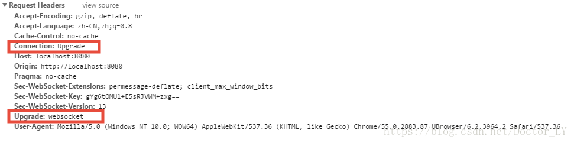
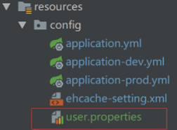
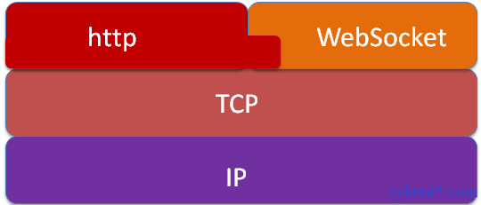
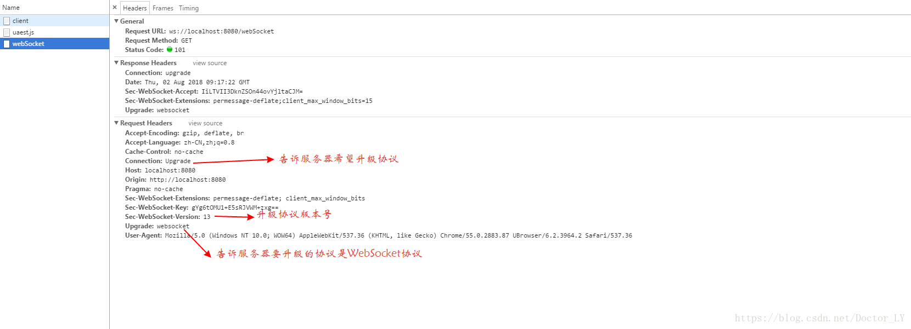
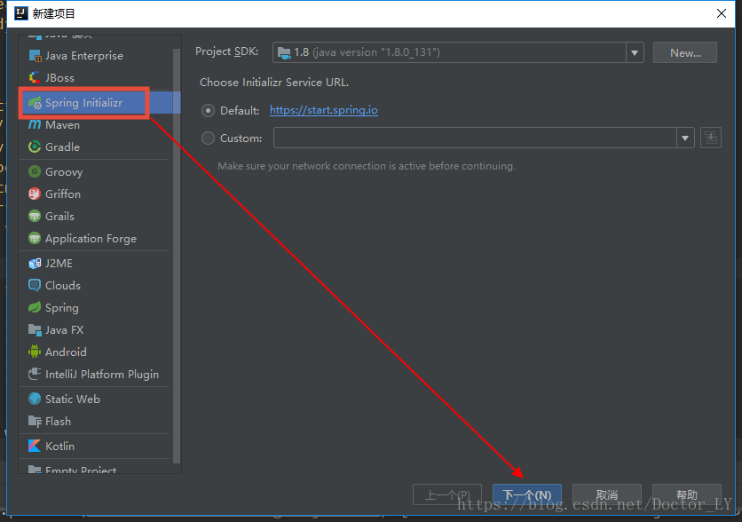
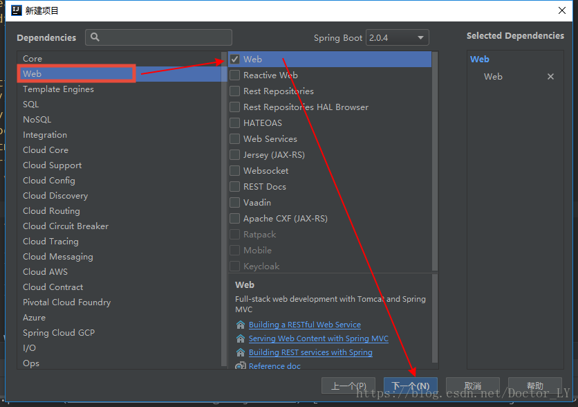
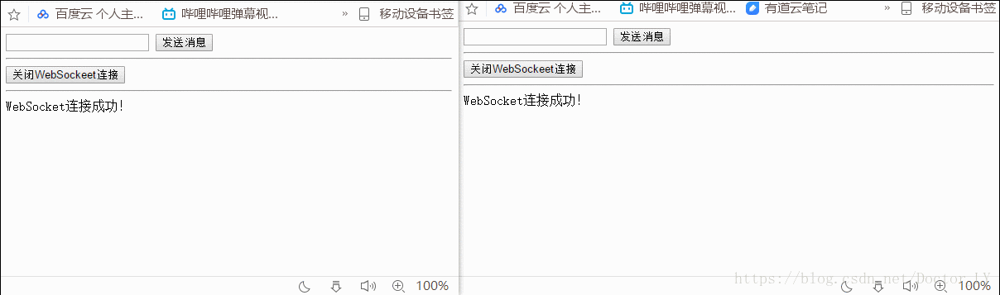

# SpringBoot整合WebSocket

## 一. HTTP的升级特性

所谓的升级就是通过HTTP网络通讯协议升级到另一种网络通讯协议。比如：WebSocket网络通讯协议

所有的HTTP客户端（不仅是浏览器）都可以在请求中加上：

Connection:Upgrade   (表示客户端希望升级)

Upgrade:websocket    (必须指定一个或多个协议列表，这些列表都必须兼容HTTP协议。例如：IRC或者RTA)


如果服务器接受升级请求，那么将返回状态码 101 Switching Protocols :



并在响应的Upgrade头中使用单个值：请求协议列表中服务器支持的第一个协议：


HTTP升级的最重要的特性是：最终我们可以使用任意的协议，**在升级握手完成之后，它就不再使用HTTP连接，得到上面的响应后，HTTP连接将消失，取而代之的是使用了相同的下层TCP连接的WebSocket连接**



## 二. 使用HTTP升级的WebSocket协议

WebSocket连接首先将使用非正常的HTTP协议请求以特定的模式访问一个URL。

URL模式ws和wss分别对应于HTTP的http和https。

除了Connection:Upgrade头之外，还有Upgrade:websocket头存在，将告诉服务器把连接升级为WebSocket协议

在握手完成之后，文本和二进制消息将可以同时在两个方向上进行，而不需要关闭和重建连接。

此时，这实时上与客户端和服务器的通信方式并没有区别--它们在连接上有着对等的能力，并且只是简单的节点：



## 三. WebSocket协议的优点

1. 因为连接在端口80（ws）或者443（wss）上创建，与HTTP使用的端口相同，几乎所有的防火墙都不会阻塞WebSocket连接。

2. 因为使用HTTP进行握手，所以该协议可以自然地集成到网络浏览器和HTTP服务器中。
3. WebSocket连接关闭时将发送一个特殊的关闭消息，其中可以包含原因代码和用于解释连接被关闭原因的文本。
4. WebSocket协议可以安全地支持跨域连接，避免了Ajax和XMLHttpRequest上的限制。
5. HTTP规范要求浏览器将并发连接数限制为每个主机名两个连接，但是在握手完成之后该限制就不再存在，因为此时的连接已经不再是HTTP连接了。


## 四. SpringBoot集成WebSocket





 引入WebSocket的依赖：

```xml
<dependency>
     <groupId>org.springframework.boot</groupId>
     <artifactId>spring-boot-starter-websocket</artifactId>
</dependency>
```

在static目录下，新建index.html文件：

```html
<!DOCTYPE html>
<html lang="en">
<head>
    <meta charset="UTF-8">
    <title>WebSocket</title>
</head>
<body>
    <input id="text" type="text"/>
    <button οnclick="send()">发送消息</button>
    <hr/>
<button οnclick="closeWebSocket()">关闭WebSockeet连接</button>
<hr/>
<div id="message"></div>
</body>
</html>
<script type="text/javascript">
    var  webSocket=null;
 
    //判断当前浏览器是否支持WebSocket
    if ('WebSocket' in window){
        webSocket=new WebSocket('ws://localhost:8080/webSocket');
    } else{
        alert("当前浏览器不支持WebSocket");
    }
 
    //连接发生错误的回调方法
    webSocket.οnerrοr=function () {
        setMessageInnerHTML("WebSocket连接发生错误！");
    }
 
    webSocket.onopen=function () {
        setMessageInnerHTML("WebSocket连接成功！")
    }
 
    webSocket.onmessage=function (event) {
        setMessageInnerHTML(event.data);
    }
 
    webSocket.onclose=function () {
        setMessageInnerHTML("WebSocket连接关闭");
    }
 
    window.οnbefοreunlοad=function () {
        closeWebSocket();
    }
 
    function closeWebSocket() {
        webSocket.close();
    }
 
    function send() {
        var message=document.getElementById('text').value;
        webSocket.send(message);
    }
 
    //将消息显示在网页上
    function setMessageInnerHTML(innerHTML) {
        document.getElementById('message').innerHTML+=innerHTML+'<br/>';
    }
</script>
```

 SpringBoot整合WebSocket最重要的一步是要配置WebSocket（新建config.WebSocket类）：

```java
package com.example.websocket.config;
 
import org.springframework.context.annotation.Bean;
import org.springframework.stereotype.Component;
import org.springframework.web.socket.server.standard.ServerEndpointExporter;
 
@Component
public class WebSocketConfig {
    @Bean
    public ServerEndpointExporter serverEndpointExporter(){
        return new ServerEndpointExporter();
    }
}
```

新建WebSocket类：

```java
package com.tjd.websocketdemo.controller;

import org.springframework.stereotype.Component;

import javax.websocket.OnClose;
import javax.websocket.OnMessage;
import javax.websocket.OnOpen;
import javax.websocket.Session;
import javax.websocket.server.ServerEndpoint;
import java.util.concurrent.CopyOnWriteArraySet;

/**
 * @Auther: 田金东
 * @Date: 11/29/0029
 **/

@Component
@ServerEndpoint("/webSocket")
public class WebSocket {

    private Session session;

    private static CopyOnWriteArraySet<WebSocket> webSockets = new CopyOnWriteArraySet<>();

    @OnOpen
    public void onOpen(Session session) {
        this.session = session;
        webSockets.add(this);
        System.out.println("有新的连接，总数" + webSockets.size());
    }

    @OnClose
    public void onClose() {
        webSockets.remove(this);
        System.out.println("有新的断开，总数" + webSockets.size());
    }

    @OnMessage
    public void onMessage(String message) {
        System.out.println(message);
        send(message);
    }

    public void send(String message) {
        for (WebSocket webSocket : webSockets) {
            try {
                webSocket.session.getBasicRemote().sendText(message);
            } catch (Exception e) {
                e.printStackTrace();
            }
        }
    }

}
```

利用SpringBoot启动类启动项目即可。

