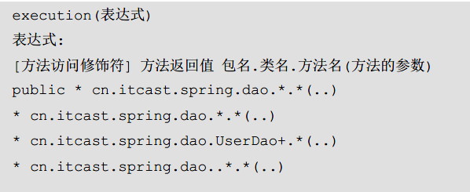
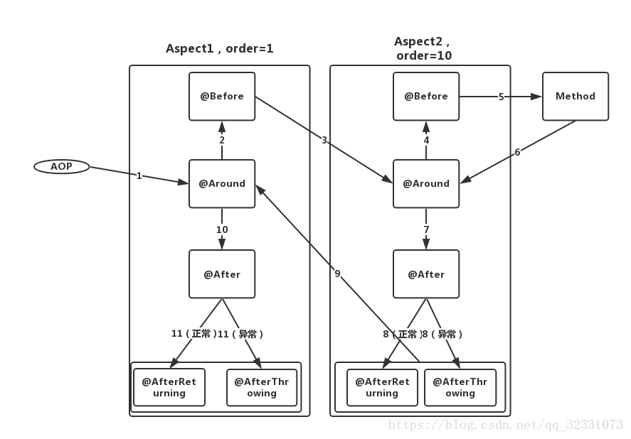
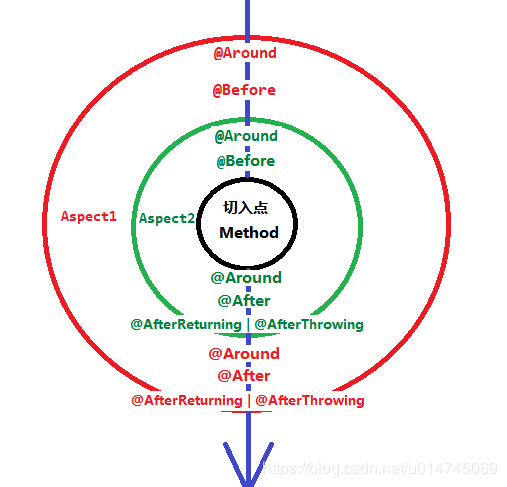

# SpringBoot项目中AOP的配置

## 一. 通知的分类

- 前置通知（Before）：在切入点执行之前执行
- 正常返回通知（AfterReturning）：只有切入点正常返回时才执行
- 异常返回通知（AfterThrowing）：只有切入点抛出异常返回时才执行
- 返回通知（After）：不管是正常返回还是异常返回都执行
- 环绕通知（Around）：环绕通知

## 二. SpringBoot配置

### 第一步：给项目加入AOP依赖

```xml
<!--引入AOP依赖-->
<dependency>
    <groupId>org.springframework.boot</groupId>
    <artifactId>spring-boot-starter-aop</artifactId>
</dependency>
```

注意：在完成了引入AOP依赖包后，不需要去做其他配置。AOP的默认配置属性中，spring.aop.auto属性默认是开启的，也就是说只要引入了AOP依赖后，默认已经增加了@EnableAspectJAutoProxy，不需要在程序主类中增加@EnableAspectJAutoProxy来启用。

### 第二步：准备目标对象（被加强）

```java
package com.example.demo.aop;
 
import org.springframework.web.bind.annotation.PathVariable;
import org.springframework.web.bind.annotation.RequestMapping;
import org.springframework.web.bind.annotation.RestController;
 
/**
* @desc: 核心业务模块
* @author: CSH
**/
@RestController
public class AopController {
 
    @GetMapping("/test")
    public void test(){
        System.out.println("Hello World!");
    }
 
}
```

### 第三步：定义通知类

定义切面类：在类上添加@Aspect 和@Component 注解即可将一个类定义为切面类。

@Aspect 注解 使之成为切面类

@Component 注解 把切面类加入到IOC容器中

```java
package cn.tjd.springparametercheck.aspect;

import org.aspectj.lang.ProceedingJoinPoint;
import org.aspectj.lang.annotation.*;
import org.springframework.stereotype.Component;

/**
 * @Auther: TJD
 * @Date: 2020-03-28
 * @DESCRIPTION:
 **/
@Aspect
@Component
public class CheckParameterAspect {
    /**
     * 定义切入点，切入点为com.example.demo.aop.AopController中的所有函数
     *通过@Pointcut注解声明频繁使用的切点表达式
     */
    @Pointcut("execution(public * cn.tjd.springparametercheck.controller.*.*(..)))")
    public void CheckParameterAspect(){

    }

    /**
     * @description  在连接点执行之前执行的通知
     */
    @Before("CheckParameterAspect()")
    public void doBefore(){
        System.out.println("前置通知");
    }

    /**
     * @description  在连接点执行完成后执行，不管正常执行完成，还是抛出异常，都会执行返回通知中的内容；
     */
    @After("CheckParameterAspect()")
    public void doAfter(){
        System.out.println("最终通知");
    }

    /**
     * @description  在在连接点正常执行完成后执行，如果连接点抛出异常，则不会执行；
     */
    @AfterReturning("CheckParameterAspect()")
    public void doAfterReturning(){
        System.out.println("正常返回通知");
    }

    /**
     * @description  在连接点抛出异常后执行；
     */
    @AfterThrowing("CheckParameterAspect()")
    public void doAfterThrowing(){
        System.out.println("异常返回通知");
    }

    /**
     * 环绕通知围绕在连接点前后，比如一个方法调用的前后。这种通知是最强大的通知，能在方法调用前后自定义一些操作。
     * @param joinPoint
     * @return
     * @throws Throwable
     */
    @Around("CheckParameterAspect()")
    public Object around(ProceedingJoinPoint joinPoint) throws Throwable {
        System.out.println("环绕通知前部分");
        Object proceed = joinPoint.proceed();
        System.out.println("环绕通知后部分");
        return proceed;
    }
}

```

其中，切入点表达式规则如下：[详解切入点表达式](https://www.cnblogs.com/zhangxufeng/p/9160869.html)



## 三. 各类型通知执行的先后顺序

> 参考至：<https://blog.csdn.net/wangan_0601/article/details/88399558

在实际开发中，有时候我们会针对同一个切入点进行多种Aspect包装，比如，可以有一个Aspect管理对一个方法进行日志打印的通知，而另一个Aspect管理对这个方法的一些校验工作。因此，涉及到两类问题：

1. 同一个切入点不同通知的执行顺序
2. 同一个切入点不同切面的执行顺序

我们在前面的“环绕通知实现”结果中看到，@Around是先于@Before执行的，这就是其中一个问题的引出，即同一个切入点不同通知的执行顺序。来看下面这张图：



 可以看到Aspect1 和Aspect2两个切面类中所有通知类型的执行顺序，Method是具体的切入点，order代表优先级，它根据一个int值来判断优先级的高低，数字越小，优先级越高！所以，不同的切面，实际上是环绕于切入点的同心圆：



### 4.1 如何改变切面的优先级

使用@Order注解可以指定切面的优先级。

@Order注解可以使用在类或方法上，但是，直接作用于方法上是无法奏效的，目前的使用方法都是通过标记在切面类上，来实现两个切面的优先级。

@Order注解接收一个int类型的参数，这个参数可以是任意整型数值，**数值小的，优先级高**。

```java
/*
* 可以使用@Order 注解指定切面的优先级，值越小优先级越高
* */
@Order(2)
@Component
@Aspect
public class LoggingAspect {
    ......
}
```

