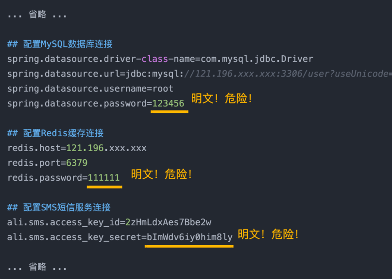
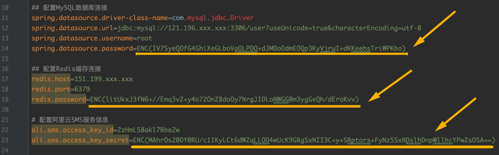
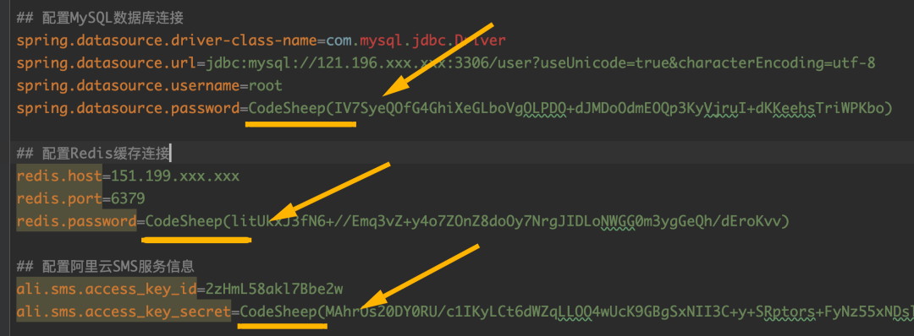

# SpringBoot项目配置文件加密

> 本文转载至：[数据库密码配置项都不加密？心也太大了！](https://mp.weixin.qq.com/s?__biz=MzU4ODI1MjA3NQ==&mid=2247485657&idx=1&sn=90c133b9a72a24ee4fd1c26daada4526&chksm=fddede1dcaa9570b21743ba8bb6e7664b6e7cbe19e22428e3b0c39d510f4d39e8c6e97979452&mpshare=1&scene=23&srcid=042680maeFlY2JH1k61gHzrZ&sharer_sharetime=1587869141428&sharer_shareid=e81601a95b901aeca142bbe3b957819a#rd)

## 先看一份典型的配置文件

```properties
... 省略 ...

## 配置MySQL数据库连接
spring.datasource.driver-class-name=com.mysql.jdbc.Driver
spring.datasource.url=jdbc:mysql://121.196.xxx.xxx:3306/user?useUnicode=true&characterEncoding=utf-8
spring.datasource.username=root
spring.datasource.password=123456

## 配置Redis缓存连接
redis.host=121.196.xxx.xxx
redis.port=6379
redis.password=111111

## 配置SMS短信服务连接
ali.sms.access_key_id=2zHmLdxAes7Bbe2w
ali.sms.access_key_secret=bImWdv6iy0him8ly

... 省略 ...
```

这是节选自某个典型的Spring Boot项目的`application.properties`配置文件。

**嘘...** 偷偷告诉我，是不是很多小伙伴也都是这么写的？

这乍一看没啥问题，很多人会觉得理所当然。包括我自己也看到过很多的项目（包括很多开源项目）是这么写的。

但仔细一琢磨，发现：



**是的！** 很多项目的配置文件里，包括数据库密码、缓存密码、亦或是一些第三方服务的Key都是直接配在里面，没有做任何加密处理！

**有人会说这个配置文件反正是我自己的，有啥风险？**

这个嘛，之前倒是看到过一个例子，一个程序员把自己公司的项目代码上传到了自己的GitHub仓库里了，结果配置文件忘了处理，导致公司数据库泄露，关键问题是，这个公司还是个酒店管理公司，因此后果可想而知了...

换个角度想，假如当时那个项目的配置文件里，所有重要信息都经过了加密，那这一幕大概率就不会发生了。所以，即使是项目的配置文件，重要的信息也得加密！

## 哪些信息要加密呢？

一般来说，项目配置文件里，所有涉及信息安全的配置项（或字段）都应该做处理，典型的比如：

- 用到的数据库、缓存的密码
- 用到的中间件、消息队列的密码
- 用到的各种第三方服务的Access_Key
- 其他第三方服务的通信信息
- ......等等

总而言之，关键字段都应该保护起来，最起码不能用明文直接写在配置文件里！

## 如何加密配置项呢？

方法非常简单，几个步骤即可完成，先来演示一个最简版本：

**1、首先建立一个基础的Spring Boot工程**

这就不再赘述了

**2、引入jasypt-spring-boot加密组件**

通过`jasypt-spring-boot`这个开箱即用的加密组件来引入`Jasypt`这个强大的加密库

```xml
<dependency>
    <groupId>com.github.ulisesbocchio</groupId>
    <artifactId>jasypt-spring-boot-starter</artifactId>
    <version>3.0.2</version>
</dependency>
```

**3、配置加密密钥**

在Spring Boot的项目配置文件`application.properties`里新增如下配置：

可以理解为`jasypt`会使用这个自定义加密密钥，对配置文件里的重要项进行加密。

**4、加密测试**

为了便于测试，我们直接扩展Spring Boot项目的启动类，项目启动时执行加密测试代码，直接看效果

```java
@SpringBootApplication
public class SpringBootConfigEncryptApplication implements CommandLineRunner {

    @Autowired
    private ApplicationContext appCtx;

    @Autowired
    private StringEncryptor codeSheepEncryptorBean;

    public static void main(String[] args) {
        SpringApplication.run(SpringBootConfigEncryptApplication.class, args);
    }

    @Override
    public void run(String... args) throws Exception {

        Environment environment = appCtx.getBean(Environment.class);

        // 首先获取配置文件里的原始明文信息
        String mysqlOriginPswd = environment.getProperty("spring.datasource.password");
        String redisOriginPswd = environment.getProperty("redis.password");
        String aliSmsOriginAk = environment.getProperty("ali.sms.access_key_secret");

        // 加密
        String mysqlEncryptedPswd = encrypt( mysqlOriginPswd );
        String redisEncryptedPswd = encrypt( redisOriginPswd );
        String aliSmsEncryptedAk = encrypt( aliSmsOriginAk );

        // 打印加密前后的结果对比
        System.out.println( "MySQL原始明文密码为：" + mysqlOriginPswd );
        System.out.println( "Redis原始明文密码为：" + redisOriginPswd );
        System.out.println( "阿里云SMS原始AccessKey密码为：" + aliSmsOriginAk );
        System.out.println( "====================================" );
        System.out.println( "MySQL原始明文密码加密后的结果为：" + mysqlEncryptedPswd );
        System.out.println( "Redis原始明文密码加密后的结果为：" + redisEncryptedPswd );
        System.out.println( "阿里云SMS原始AccessKey密码加密后的结果为：" + aliSmsEncryptedAk );
    }

    private String encrypt( String originPassord ) {
        String encryptStr = codeSheepEncryptorBean.encrypt( originPassord );
        return encryptStr;
    }

    private String decrypt( String encryptedPassword ) {
        String decryptStr = codeSheepEncryptorBean.decrypt( encryptedPassword );
        return decryptStr;
    }
}
```

运行项目，控制台打印：

```shell
MySQL原始明文密码为：123456
Redis原始明文密码为：111111
阿里云SMS原始AccessKey密码为：bImWdv13da894mly
====================================
MySQL原始明文密码加密后的结果为：IV7SyeQOfG4GhiXeGLboVgOLPDO+dJMDoOdmEOQp3KyVjruI+dKKeehsTriWPKbo
Redis原始明文密码加密后的结果为：litUkxJ3fN6+//Emq3vZ+y4o7ZOnZ8doOy7NrgJIDLoNWGG0m3ygGeQh/dEroKvv
阿里云SMS原始AccessKey密码加密后的结果为：MAhrOs20DY0RU/c1IKyLCt6dWZqLLOO4wUcK9GBgSxNII3C+y+SRptors+FyNz55xNDslhDnpWllhcYPwZsO5A==
```

**5、修改配置文件，替换待加密配置项**

我们拿到上一步得到的加密结果，将配置文件中的原始明文密码替换成上一步对应的结果即可，就像这样：



所以强烈建议配置文件里的所有重要信息都这样处理！

**6、查看密码解密结果**

```java
@SpringBootApplication
public class SpringBootConfigEncryptApplication implements CommandLineRunner {

    @Autowired
    private ApplicationContext appCtx;

    @Autowired
    private StringEncryptor codeSheepEncryptorBean;

    public static void main(String[] args) {
        SpringApplication.run(SpringBootConfigEncryptApplication.class, args);
    }

    @Override
    public void run(String... args) throws Exception {

        Environment environment = appCtx.getBean(Environment.class);

        // 首先获取配置文件里的配置项
        String mysqlOriginPswd = environment.getProperty("spring.datasource.password");
        String redisOriginPswd = environment.getProperty("redis.password");
        String aliSmsOriginAk = environment.getProperty("ali.sms.access_key_secret");

        // 打印解密后的结果
        System.out.println( "MySQL原始明文密码为：" + mysqlOriginPswd );
        System.out.println( "Redis原始明文密码为：" + redisOriginPswd );
        System.out.println( "阿里云SMS原始AccessKey密码为：" + aliSmsOriginAk );
    }
}    
```

打印结果：

```java
MySQL原始明文密码为：123456
Redis原始明文密码为：111111
阿里云SMS原始AccessKey密码为：bImWdv13da894mly
```

很明显，在代码中使用时，`jasypt-spring-boot`组件会自动将`ENC()`语法包裹的配置项加密字段自动解密，数据得以还原。

## 小朋友，你是否有很多问号？

这时候我想肯定很多小伙伴表示疑惑，典型的比如：

**1、加密密钥必须放在ENC()中？为什么是ENC？**

**2、虽然说原始涉及信息安全的配置项被加密，但是自定义的加密密钥jasypt.encryptor.password=CodeSheep假如泄露了，别人不还是有几率可以解密的吗？**

针对这些问题，继续往下看。

## 自定义加密前后缀

如果不愿意使用`jasypt`默认提供的`ENC`来标记加密字段，完全可以换成自定义的前后缀标记，比如我想换成`CodeSheep()`来标记加密字段，此时只需要在配置文件里配置一下前后缀即可：

```properties
jasypt.encryptor.property.prefix=CodeSheep(
jasypt.encryptor.property.suffix=)
```

这时候加密字段就可以放在`CodeSheep()`标记的字段中：



## 让加密更安全

虽然经过上文的加密，涉及信息安全的配置项肯定会变得更安全，这个毋庸置疑！

但是假如配置文件里的自定义加密密钥`jasypt.encryptor.password=CodeSheep`泄露了，那我们的加密字段也还是有可能被别人解密，为此，有几项工作可以让加密变得更加安全。

**1、使用自定义加密器**

上文实验加密时，使用的是**默认的加密规则**，这一点会让当自定义加密密钥泄漏时可能变得不安全。为此我们可以自定义加密规则。

自定义加密规则非常简单，只需要提供**自定义的加密器配置类**即可，比如我这里自定义一个名为 `codeSheepEncryptorBean`类型的加密器：

```java
@Configuration
public class CodeSheepEncryptorCfg {

    @Bean( name = "codeSheepEncryptorBean" )
    public StringEncryptor codesheepStringEncryptor() {

        PooledPBEStringEncryptor encryptor = new PooledPBEStringEncryptor();

        SimpleStringPBEConfig config = new SimpleStringPBEConfig();
        config.setPassword("CodeSheep");
        config.setAlgorithm("PBEWITHHMACSHA512ANDAES_256");
        config.setKeyObtentionIterations("1000");
        config.setPoolSize("1");
        config.setProviderName("SunJCE");
        config.setSaltGeneratorClassName("org.jasypt.salt.RandomSaltGenerator");
        config.setIvGeneratorClassName("org.jasypt.iv.RandomIvGenerator");
        config.setStringOutputType("base64");
        encryptor.setConfig(config);

        return encryptor;
    }
}
```

**注意**这里`Bean`的名字`name`是需要显式指定的（默认的名字是`jasyptStringEncryptor`），如果像这里一样用的自定义名字，则还需要在Spring Boot的`application.properties`配置文件中来指定`bean`的名字，就像这样：

```properties
jasypt.encryptor.bean=codeSheepEncryptorBean
```

**2、加密密钥不要写在配置文件中**

如果觉得上面这种方式还是可能会导致加密密钥泄露的话（毕竟还是写在了配置文件中），那我们干脆可以直接将加密密钥从配置文件中拿掉，取而代之的有**三种方式**：

- **方式一**：直接作为程序启动时的**命令行参数**来带入

```shell
java -jar yourproject.jar --jasypt.encryptor.password=CodeSheep
```

- **方式二**：直接作为程序启动时的**应用环境变量**来带入

```shell
java -Djasypt.encryptor.password=CodeSheep -jar yourproject.jar
```

- **方式三**：甚至可以作为**系统环境变量**的方式来带入

比方说，我们提前设置好系统环境变量`JASYPT_ENCRYPTOR_PASSWORD = CodeSheep`，则直接在Spring Boot的项目配置文件中做如下配置即可：

```shell
jasypt.encryptor.password=${JASYPT_ENCRYPTOR_PASSWORD:}
```

这时候也会安全得多。

好了，说了这么多，如果你项目的配置文件中的重要信息没有加密的话，答应我，二话别说，赶快全部偷偷去改掉，快！速度！跑步前进！