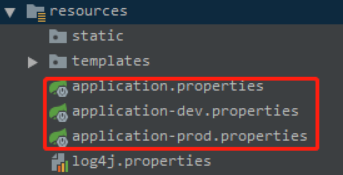

# SpringBoot配置文件读取

> 本文转载至：[springboot读取配置文件总结 - 奕锋博客 - 博客园 (cnblogs.com)](https://www.cnblogs.com/better-farther-world2099/articles/11582859.html)

## 一. 配置文件优先级加载机制

spring boot 启动会扫描以下位置的application.properties或者application.yml文件作为Spring boot的默认配置文件。

```
–file:./config/
–file:./
–classpath:/config/
–classpath:/
```

加载的优先级顺序是从上向下加载，并且所有的文件都会被加载，高优先级的内容会覆盖底优先级的内容，形成互补配置。

我们可以从ConfigFileApplicationListener这类便可看出，其中DEFAULT_SEARCH_LOCATIONS属性设置了加载的目录：

```java
private static final String DEFAULT_SEARCH_LOCATIONS = "classpath:/,classpath:/config/,file:./,file:./config/";
```

我们也可以通过配置spring.config.location来改变默认配置：

```shell
java -jar app.jar --spring.config.location=D:/application.properties
```

以下优先级从高到底加载顺序：

1. 命令行参数

2. 来自java:comp/env的JNDI属性

3. Java系统属性（System.getProperties()）
4. 操作系统环境变量
5. RandomValuePropertySource配置的random.*属性值
6. jar包外部的application-{profile}.properties或application.yml(带spring.profile)配置文件
7. jar包内部的application-{profile}.properties或application.yml(带spring.profile)配置文件
8. jar包外部的application.properties或application.yml(不带spring.profile)配置文件
9. jar包内部的application.properties或application.yml(不带spring.profile)配置文件（**Note:**由jar包外向jar包内进行寻找，优先加载带profile的，再加载不带profile的）
10. @Configuration注解类上的@PropertySource
11. 通过SpringApplication.setDefaultProperties指定的默认属性

## 二. properties配置优先级 > YAML配置优先级 

SpringBoot使用一个以application命名的配置文件作为默认的全局配置文件。支持properties后缀结尾的配置文件或者以yml/yaml后缀结尾的YAML的文件配置。
以设置应用端口为例

在同一目录下，properties配置优先级 > YAML配置优先级。所以我们在jar包启动时带上properties写法的配置可以覆盖配置。

## 三. @PropertySource和@ImportResource

通常情况下我们将配置配置在application开头的主配置文件中，这样随着项目的增大配置项的增多会使文件变得非常臃肿，其实SpringBoot早已考虑到了该问题，SpringBoot提供了`@PropertySource`和`@ImportResource`两个注解用于加载外部配置文件使

- @PropertySource通常用于属性加载配置文件，注意@PropertySource注解不支持加载yaml文件，支持properties文件。
- @ImportResource通常用于加载Spring的xml配置文件

### @PropertySource使用

装配properties配置文件

在sources/config下创建一个yaml文件命名为user.properties内容与上方user的配置一样


```java
@PropertySource(value = {"classpath:config/user.properties"})
@Component
@ConfigurationProperties(prefix = "user")
public class Login{
	private String username;
	private String password;
	...
}
```

**同时加载多个配置问题**

细心的你，会发现@PropertySource注解中属性value为一个数组，如果同时加载多个配置文件，并且不同配置文件中对同一个属性设置了不同的值，Spring会从左到右顺序加载，后加载的会覆盖先加载的属性值。

## 四. 一般配置文件方案参考

　　我在自己的springboot项目中使用了多个配置文件，application.properties是主配置文件，放一些项目通用的配置，application-dev.properties 放的是平常开发的一些配置，比如说数据库的连接地址、帐号密码等，

application-prod.properties 放的是生产环境的一些配置，比如说数据库的连接地址、帐号密码等，

当然也可以再多一个application-test.properties ，放一些测试环境需要用到的参数。



可以通过在application.properties 中设置spring.profiles.active=prod或者dev来使用application-dev.properties或者application-prod.properties文件，当然test文件也是同理。

