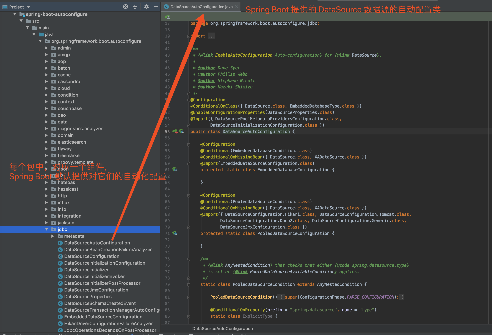
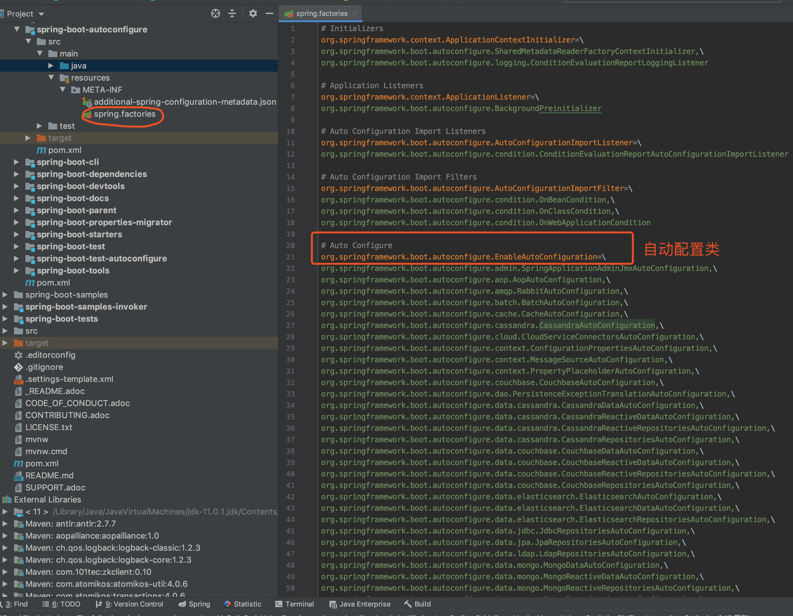
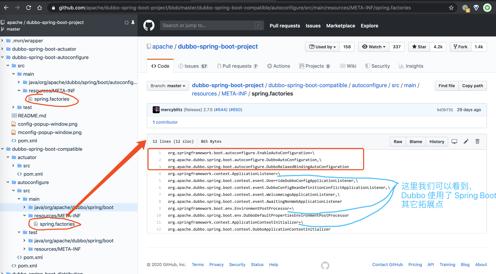
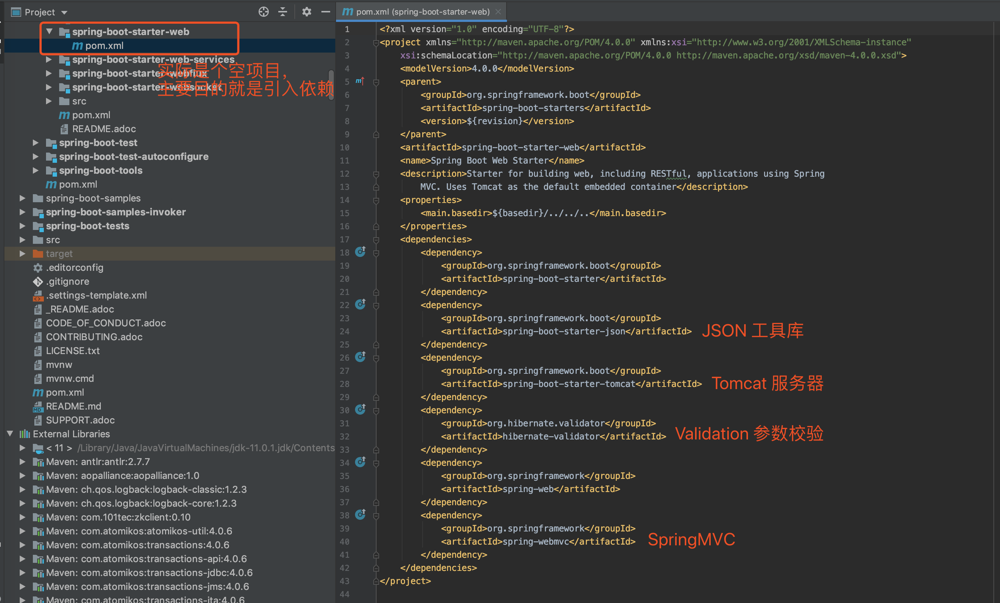
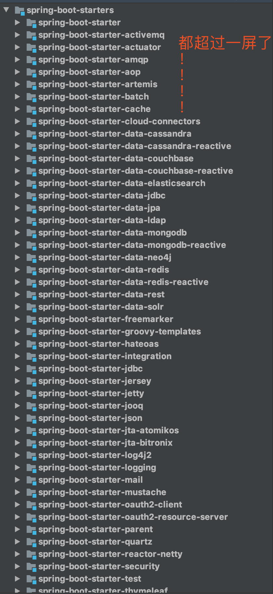

# SpringBoot自动配置基本原理

## 一. 概述

Spring Boot 自动配置，顾名思义，是希望能够自动配置，将我们从配置的苦海中解脱出来。那么既然要自动配置，它需要解三个问题：

- 满足什么样的**条件**？
- 创建**哪些** Bean？
- 创建的 Bean 的**属性**？

我们来举个示例，对照下这三个问题。在我们引入 [`spring-boot-starter-web`](https://mvnrepository.com/artifact/org.springframework.boot/spring-boot-starter-web) 依赖，会创建一个 8080 端口的内嵌 Tomcat，同时可以通过 `application.yaml` 配置文件中的 `server.port` 配置项自定义端口。那么这三个问题的答案如下：

- 满足什么样的**条件**？因为我们引入了 `spring-boot-starter-web` 依赖。
- 创建**哪些** Bean？创建了一个内嵌的 Tomcat Bean，并进行启动。
- 创建的 Bean 的**属性**？通过 `application.yaml` 配置文件的 `server.port` 配置项，定义 Tomcat Bean 的启动端口属性，并且默认值为 8080。

壮着胆子，我们来看看 Spring Boot 提供的 [EmbeddedWebServerFactoryCustomizerAutoConfiguration](https://github.com/spring-projects/spring-boot/blob/master/spring-boot-project/spring-boot-autoconfigure/src/main/java/org/springframework/boot/autoconfigure/web/embedded/EmbeddedWebServerFactoryCustomizerAutoConfiguration.java) 类，负责创建内嵌的 Tomcat、Jetty 等等 Web 服务器的配置类。代码如下：

```java
@Configuration // <1.1>
@ConditionalOnWebApplication // <2.1>
@EnableConfigurationProperties(ServerProperties.class) // <3.1>
public class  EmbeddedWebServerFactoryCustomizerAutoConfiguration {

	/**
	 * Nested configuration if Tomcat is being used.
	 */
	@Configuration // <1.2>
	@ConditionalOnClass({ Tomcat.class, UpgradeProtocol.class })
	public static class TomcatWebServerFactoryCustomizerConfiguration {

		@Bean
		public TomcatWebServerFactoryCustomizer tomcatWebServerFactoryCustomizer(
				Environment environment, ServerProperties serverProperties) {
			// <3.2>
			return new TomcatWebServerFactoryCustomizer(environment, serverProperties);
		}

	}

	/**
	 * Nested configuration if Jetty is being used.
	 */
	@Configuration // <1.3>
	@ConditionalOnClass({ Server.class, Loader.class, WebAppContext.class })
	public static class JettyWebServerFactoryCustomizerConfiguration {

		@Bean
		public JettyWebServerFactoryCustomizer jettyWebServerFactoryCustomizer(
				Environment environment, ServerProperties serverProperties) {
			 // <3.3>
			return new JettyWebServerFactoryCustomizer(environment, serverProperties);
		}

	}

	/**
	 * Nested configuration if Undertow is being used.
	 */
	// ... 省略 UndertowWebServerFactoryCustomizerConfiguration 代码

	/**
	 * Nested configuration if Netty is being used.
	 */
	// ... 省略 NettyWebServerFactoryCustomizerConfiguration 代码

}
```

在开始看代码之前，我们先来简单科普下 [Spring JavaConfig](https://docs.spring.io/spring-javaconfig/docs/1.0.0.M4/reference/html/) 的小知识。在 Spring3.0 开始，Spring 提供了 JavaConfig 的方式，允许我们使用 Java 代码的方式，进行 Spring Bean 的创建。示例代码如下：

```java
@Configuration
public class DemoConfiguration {

    @Bean
    public void object() {
        return new Obejct();
    }

}
```

- 通过在**类**上添加 [`@Configuration`](https://docs.spring.io/spring-javaconfig/docs/1.0.0.M4/reference/html/ch02.html#d0e270) 注解，声明这是一个 Spring 配置类。
- 通过在**方法**上添加 [`@Bean`](https://docs.spring.io/spring-javaconfig/docs/1.0.0.M4/reference/html/ch02s02.html) 注解，声明该方法创建一个 Spring Bean。

OK，现在我们在回过头看看 EmbeddedWebServerFactoryCustomizerAutoConfiguration 的代码，我们分成三块内容来讲，刚好解决我们上面说的三个问题：

- 配置类
- 条件注解
- 配置属性

### 1.1 配置类

`<1.1>` 处，在类上添加了 `@Configuration` 注解，声明这是一个**配置类**。因为它的目的是自动配置，所以类名以 AutoConfiguration 作为后缀。

`<1.2>`、`<1.3>` 处，分别是用于初始化 Tomcat、Jetty 相关 Bean 的配置类。

- TomcatWebServerFactoryCustomizerConfiguration 配置类，负责创建 [TomcatWebServerFactoryCustomizer](https://github.com/spring-projects/spring-boot/blob/master/spring-boot-project/spring-boot-autoconfigure/src/main/java/org/springframework/boot/autoconfigure/web/embedded/TomcatWebServerFactoryCustomizer.java) Bean，从而初始化内嵌的 Tomcat 并进行启动。
- JettyWebServerFactoryCustomizer 配置类，负责创建 [JettyWebServerFactoryCustomizer](https://github.com/spring-projects/spring-boot/blob/master/spring-boot-project/spring-boot-autoconfigure/src/main/java/org/springframework/boot/autoconfigure/web/embedded/JettyWebServerFactoryCustomizer.java) Bean，从而初始化内嵌的 Jetty 并进行启动。

**如此，我们可以得到结论一，通过 `@Configuration` 注解的配置类，可以解决“创建哪些 Bean”的问题。**

实际上，Spring Boot 的 [spring-boot-autoconfigure](https://github.com/spring-projects/spring-boot/tree/master/spring-boot-project/spring-boot-autoconfigure) 项目，提供了大量框架的自动配置类，稍后我们在[「2. 自动配置类」](https://www.iocoder.cn/Spring-Boot/autoconfigure/?vip#)小节详细展开。

### 1.2 条件注解

`<2>` 处，在类上添加了 [`@ConditionalOnWebApplication`](https://github.com/spring-projects/spring-boot/blob/master/spring-boot-project/spring-boot-autoconfigure/src/main/java/org/springframework/boot/autoconfigure/condition/ConditionalOnWebApplication.java) **条件注解**，表示当前配置类需要在当前项目是 Web 项目的条件下，才能生效。在 Spring Boot 项目中，会将项目类型分成 Web 项目（使用 SpringMVC 或者 WebFlux）和非 Web 项目。这样我们就很容易理解，为什么 EmbeddedWebServerFactoryCustomizerAutoConfiguration 配置类会要求在项目类型是 Web 项目，只有 Web 项目才有必要创建内嵌的 Web 服务器呀。

`<2.1>`、`<2.2>` 处，在类上添加了 [`@ConditionalOnClass`](https://github.com/spring-projects/spring-boot/blob/master/spring-boot-project/spring-boot-autoconfigure/src/main/java/org/springframework/boot/autoconfigure/condition/ConditionalOnClass.java) **条件注解**，表示当前配置类需要在当前项目有指定类的条件下，才能生效。

- TomcatWebServerFactoryCustomizerConfiguration 配置类，需要有 [`tomcat-embed-core`](https://mvnrepository.com/search?q=tomcat-embed-core) 依赖提供的 Tomcat、UpgradeProtocol 依赖类，才能创建内嵌的 Tomcat 服务器。
- JettyWebServerFactoryCustomizer 配置类，需要有 [`jetty-server`](https://mvnrepository.com/artifact/org.eclipse.jetty/jetty-server) 依赖提供的 Server、Loader、WebAppContext 类，才能创建内嵌的 Jetty 服务器。

**如此，我们可以得到结论二，通过条件注解，可以解决“满足什么样的条件？”的问题。**

### 1.3 配置属性

`<3.1>` 处，使用 [`@EnableConfigurationProperties`](https://github.com/spring-projects/spring-boot/blob/master/spring-boot-project/spring-boot/src/main/java/org/springframework/boot/context/properties/EnableConfigurationProperties.java) 注解，让 [ServerProperties](https://github.com/spring-projects/spring-boot/blob/master/spring-boot-project/spring-boot-autoconfigure/src/main/java/org/springframework/boot/autoconfigure/web/ServerProperties.java) **配置属性类**生效。在 Spring Boot 定义了 [`@ConfigurationProperties`](https://github.com/spring-projects/spring-boot/blob/master/spring-boot-project/spring-boot/src/main/java/org/springframework/boot/context/properties/ConfigurationProperties.java) 注解，用于声明配置属性类，将指定前缀的配置项批量注入到该类中。例如 ServerProperties 代码如下：

```java
@ConfigurationProperties(prefix = "server", ignoreUnknownFields = true)
public class ServerProperties
		implements EmbeddedServletContainerCustomizer, EnvironmentAware, Ordered {

	/**
	 * Server HTTP port.
	 */
	private Integer port;

	/**
	 * Context path of the application.
	 */
	private String contextPath;
	
	// ... 省略其它属性
	
}
```

- 通过 `@ConfigurationProperties` 注解，声明将 `server` 前缀的配置项，设置到 ServerProperties 配置属性类中。

`<3.2>`、`<3.3>` 处，在创建 TomcatWebServerFactoryCustomizer 和 JettyWebServerFactoryCustomizer 对象时，都会将 ServerProperties 传入其中，作为后续创建的 Web 服务器的配置。也就是说，我们通过修改在配置文件的配置项，就可以自定义 Web 服务器的配置。

**如此，我们可以得到结论三，通过配置属性，可以解决“创建的 Bean 的属性？”的问题。**

## 二. 自动配置类

在 Spring Boot 的 [spring-boot-autoconfigure](https://github.com/spring-projects/spring-boot/tree/master/spring-boot-project/spring-boot-autoconfigure) 项目，提供了大量框架的自动配置，如下图所示：



在我们通过 [`SpringApplication#run(Class primarySource, String... args)`](https://github.com/spring-projects/spring-boot/blob/master/spring-boot-project/spring-boot/src/main/java/org/springframework/boot/SpringApplication.java#L1218-L1227) 方法，启动 Spring Boot 应用的时候，有个非常重要的组件 [SpringFactoriesLoader](https://github.com/spring-projects/spring-framework/blob/master/spring-core/src/main/java/org/springframework/core/io/support/SpringFactoriesLoader.java) 类，会读取 `META-INF` 目录下的 `spring.factories` 文件，获得**每个框架定义的需要自动配置的配置类**。

我们以 [spring-boot-autoconfigure](https://github.com/spring-projects/spring-boot/tree/master/spring-boot-project/spring-boot-autoconfigure) 项目的 [Spring Boot `spring.factories`](https://github.com/spring-projects/spring-boot/blob/master/spring-boot-project/spring-boot-autoconfigure/src/main/resources/META-INF/spring.factories) 文件来举个例子，如下图所示：



如此，原先 `@Configuration` 注解的配置类，就**升级**成类自动配置类。这样，Spring Boot 在获取到需要自动配置的配置类后，就可以自动创建相应的 Bean，完成自动配置的功能。

> 旁白君：这里其实还有一个非常有意思的话题，作为拓展知识，胖友可以后续去看看。实际上，我们可以把 `spring.factories` 理解成 Spring Boot 自己的 SPI 机制。感兴趣的胖友，可以看看如下的文章：
>
> - [《Spring Boot 的 SPI 机制》](http://www.iocoder.cn/Fight/SPI-mechanism-in-Spring-Boot/?self)
> - [《Java 的 SPI 机制》](http://www.iocoder.cn/Fight/xuma/spi/?self)
> - [《Dubbo 的 SPI 机制》](http://dubbo.apache.org/zh-cn/docs/dev/SPI.html)
>
> 实际上，自动配置只是 Spring Boot 基于 `spring.factories` 的一个拓展点 EnableAutoConfiguration。我们从上图中，还可以看到如下的拓展点：
>
> - ApplicationContextInitializer
> - ApplicationListener
> - AutoConfigurationImportListener
> - AutoConfigurationImportFilter
> - FailureAnalyzer
> - TemplateAvailabilityProvider
>
> `SpringFactoriesLoader`详细原理请参考：[SpringBoot的SPI机制](./_21SpringBoot的SPI机制.md)

因为 spring-boot-autoconfigure 项目提供的是它选择的主流框架的自动配置，所以其它框架需要自己实现。例如说，Dubbo 通过 [dubbo-spring-boot-project](https://github.com/apache/dubbo-spring-boot-project) 项目，提供 Dubbo 的自动配置。如下图所示：



## 三. 条件注解

条件注解并不是 Spring Boot 所独有，而是在 Spring3.1 版本时，为了满足不同环境注册不同的 Bean ，引入了 [`@Profile`](https://github.com/spring-projects/spring-framework/blob/master/spring-context/src/main/java/org/springframework/context/annotation/Profile.java) 注解。示例代码如下：

```java
@Configuration
public class DataSourceConfiguration {

    @Bean
    @Profile("DEV")
    public DataSource devDataSource() {
        // ... 单机 MySQL
    }

    @Bean
    @Profile("PROD")
    public DataSource prodDataSource() {
        // ... 集群 MySQL
    }
    
}
```

- 在测试环境下，我们注册单机 MySQL 的 DataSource Bean。
- 在生产环境下，我们注册集群 MySQL 的 DataSource Bean。

在 Spring4 版本时，提供了 [`@Conditional`](https://github.com/spring-projects/spring-framework/blob/master/spring-context/src/main/java/org/springframework/context/annotation/Conditional.java) 注解，用于声明在配置类或者创建 Bean 的方法上，表示需要满足指定条件才能生效。示例代码如下：

```java
@Configuration
public class TestConfiguration {

    @Bean
    @Conditional(XXXCondition.class)
    public Object xxxObject() {
        return new Object();
    }
    
}
```

- 其中，XXXCondition 需要我们自己实现 [Condition](https://github.com/spring-projects/spring-framework/blob/master/spring-context/src/main/java/org/springframework/context/annotation/Condition.java) 接口，提供具体的条件实现。

显然，Spring4 提交的 `@Conditional` 注解非常不方便，需要我们自己去拓展。因此，Spring Boot 进一步增强，提供了常用的条件注解：

- `@ConditionalOnBean`：当容器里有指定 Bean 的条件下
- `@ConditionalOnMissingBean`：当容器里没有指定 Bean 的情况下
- `@ConditionalOnSingleCandidate`：当指定 Bean 在容器中只有一个，或者虽然有多个但是指定首选 Bean
- `@ConditionalOnClass`：当类路径下有指定类的条件下
- `@ConditionalOnMissingClass`：当类路径下没有指定类的条件下
- `@ConditionalOnProperty`：指定的属性是否有指定的值
- `@ConditionalOnResource`：类路径是否有指定的值
- `@ConditionalOnExpression`：基于 SpEL 表达式作为判断条件
- `@ConditionalOnJava`：基于 Java 版本作为判断条件
- `@ConditionalOnJndi`：在 JNDI 存在的条件下差在指定的位置
- `@ConditionalOnNotWebApplication`：当前项目不是 Web 项目的条件下
- `@ConditionalOnWebApplication`：当前项目是 Web项 目的条件下

> 条件注解原理参考：[SpringBoot自动配置之条件注解](./_22SpringBoot自动配置之条件注解.md)

## 四. 配置属性

Spring Boot 约定读取 `application.yaml`、`application.properties` 等配置文件，从而实现创建 Bean 的自定义属性配置，甚至可以搭配 `@ConditionalOnProperty` 注解来取消 Bean 的创建。

咳咳咳，貌似这个小节没有太多可以分享的内容，更多胖友可以阅读[《芋道 Spring Boot 配置文件入门》](http://www.iocoder.cn/Spring-Boot/config-file/?self)文章。

## 五. 内置starter

们在使用 Spring Boot 时，并不会直接引入 [`spring-boot-autoconfigure`](https://mvnrepository.com/artifact/org.springframework.boot/spring-boot-autoconfigure) 依赖，而是使用 Spring Boot 内置提供的 Starter 依赖。例如说，我们想要使用 SpringMVC 时，引入的是 [`spring-boot-starter-web`](https://mvnrepository.com/artifact/org.springframework.boot/spring-boot-starter-web) 依赖。这是为什么呢？

因为 Spring Boot 提供的自动配置类，基本都有 `@ConditionalOnClass` 条件注解，判断我们项目中存在指定的类，才会创建对应的 Bean。而拥有指定类的前提，一般是需要我们引入对应框架的依赖。

因此，在我们引入 `spring-boot-starter-web` 依赖时，它会帮我们自动引入相关依赖，从而保证自动配置类能够生效，创建对应的 Bean。如下图所示：



Spring Boot 内置了非常多的 Starter，方便我们引入不同框架，并实现自动配置。如下图所示：



> 本文转载至：[芋道 Spring Boot 自动配置原理 | 芋道源码 —— 纯源码解析博客 (iocoder.cn)](https://www.iocoder.cn/Spring-Boot/autoconfigure/?vip)
