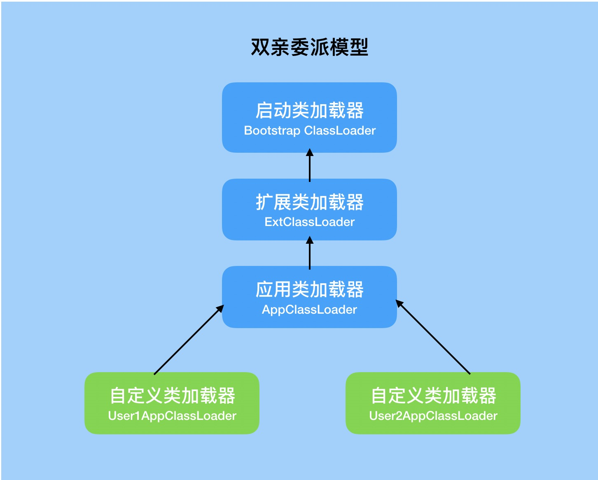
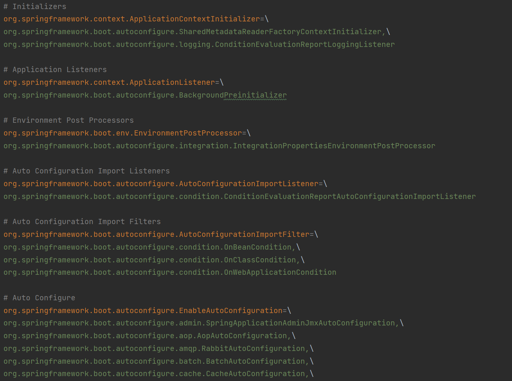
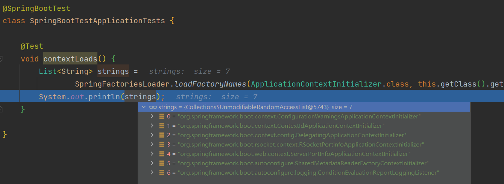

# Spring SPI机制

## 一. 从类加载说起

Java中的类加载器负载加载来自文件系统、网络或者其他来源的类文件。jvm的类加载器默认使用的是双亲委派模式。三种默认的类加载器Bootstrap ClassLoader、Extension ClassLoader和System ClassLoader（Application ClassLoader）每一个中类加载器都确定了从哪一些位置加载文件。于此同时我们也可以通过继承 `java.lang.classloader` 实现自己的类加载器。

> Bootstrap ClassLoader：负责加载JDK自带的rt.jar包中的类文件，是所有类加载的父类
>
> Extension ClassLoader：负责加载java的扩展类库从jre/lib/ect目录或者java.ext.dirs系统属性指定的目录下加载类，是System ClassLoader的父类加载器 
>
> System ClassLoader：负责从classpath环境变量中加载类文件

0998886

### 1.1 双亲委派

当一个类加载器收到类加载任务时，会先交给自己的父加载器去完成，因此最终加载任务都会传递到最顶层的BootstrapClassLoader，只有当父加载器无法完成加载任务时，才会尝试自己来加载。

根据双亲委派模式，在加载类文件的时候，子类加载器首先将加载请求委托给它的父加载器，父加载器会检测自己是否已经加载过类，如果已经加载则加载过程结束，如果没有加载的话则请求继续向上传递直Bootstrap ClassLoader。如果请求向上委托过程中，如果始终没有检测到该类已经加载，则Bootstrap ClassLoader开始尝试从其对应路劲中加载该类文件，如果失败则由子类加载器继续尝试加载，直至发起加载请求的子加载器为止。

采用双亲委派模式可以保证类型加载的安全性，不管是哪个加载器加载这个类，最终都是委托给顶层的BootstrapClassLoader来加载的，只有父类无法加载自己猜尝试加载，这样就可以保证任何的类加载器最终得到的都是同样一个Object对象。

```java
protected Class<?> loadClass(String name, boolean resolve) {
    synchronized (getClassLoadingLock(name)) {
    // 首先，检查该类是否已经被加载，如果从JVM缓存中找到该类，则直接返回
    Class<?> c = findLoadedClass(name);
    if (c == null) {
        try {
            // 遵循双亲委派的模型，首先会通过递归从父加载器开始找，
            // 直到父类加载器是BootstrapClassLoader为止
            if (parent != null) {
                c = parent.loadClass(name, false);
            } else {
                c = findBootstrapClassOrNull(name);
            }
        } catch (ClassNotFoundException e) {}
        if (c == null) {
            // 如果还找不到，尝试通过findClass方法去寻找
            // findClass是留给开发者自己实现的，也就是说
            // 自定义类加载器时，重写此方法即可
           c = findClass(name);
        }
    }
    if (resolve) {
        resolveClass(c);
    }
    return c;
    }
}
```

### 1.2 双亲委派模型的缺陷

在双亲委派模型中，子类加载器可以使用父类加载器已经加载的类，而父类加载器无法使用子类加载器已经加载的。这就导致了双亲委派模型并不能解决所有的类加载器问题。

案例：Java 提供了很多服务提供者接口(Service Provider Interface，SPI)，允许第三方为这些接口提供实现。常见的 SPI 有 JDBC、JNDI、JAXP 等，这些SPI的接口由核心类库提供，却由第三方实现，这样就存在一个问题：SPI 的接口是 Java 核心库的一部分，是由BootstrapClassLoader加载的；SPI实现的Java类一般是由AppClassLoader来加载的。BootstrapClassLoader是无法找到 SPI 的实现类的，因为它只加载Java的核心库。它也不能代理给AppClassLoader，因为它是最顶层的类加载器。也就是说，双亲委派模型并不能解决这个问题

### 1.3 使用线程上下文类加载器(ContextClassLoader)加载

如果不做任何的设置，Java应用的线程的上下文类加载器默认就是AppClassLoader。在核心类库使用SPI接口时，传递的类加载器使用线程上下文类加载器，就可以成功的加载到SPI实现的类。线程上下文类加载器在很多SPI的实现中都会用到。

通常我们可以通过Thread.currentThread().getClassLoader()和Thread.currentThread().getContextClassLoader()获取线程上下文类加载器。

### 1.4 使用类加载器加载资源文件，比如jar包

类加载器除了加载class外，还有一个非常重要功能，就是加载资源，它可以从jar包中读取任何资源文件，比如，ClassLoader.getResources(String name)方法就是用于读取jar包中的资源文件

```java
//获取资源的方法
public Enumeration<URL> getResources(String name) throws IOException {
    Enumeration<URL>[] tmp = (Enumeration<URL>[]) new Enumeration<?>[2];
    if (parent != null) {
        tmp[0] = parent.getResources(name);
    } else {
        tmp[0] = getBootstrapResources(name);
    }
    tmp[1] = findResources(name);
    return new CompoundEnumeration<>(tmp);
}
```

它的逻辑其实跟类加载的逻辑是一样的，首先判断父类加载器是否为空，不为空则委托父类加载器执行资源查找任务，直到BootstrapClassLoader，最后才轮到自己查找。而不同的类加载器负责扫描不同路径下的jar包，就如同加载class一样，最后会扫描所有的jar包，找到符合条件的资源文件。

```java
// 使用线程上下文类加载器加载资源
public static void main(String[] args) throws Exception{
    // Array.class的完整路径
    String name = "java/sql/Array.class";
    Enumeration<URL> urls = Thread.currentThread().getContextClassLoader().getResources(name);
    while (urls.hasMoreElements()) {
        URL url = urls.nextElement();
        System.out.println(url.toString());
    }
}
```

## 二. Spring中的SPI机制

### 2.1 Spring中SPI的使用

在Spring中提供了SPI机制，我们只需要在 `META-INF/spring.factories` 中配置接口实现类名，即可通过服务发现机制，在运行时加载接口的实现类：

```properties
org.springframework.boot.autoconfigure.EnableAutoConfiguration=\
org.springframework.boot.autoconfigure.admin.SpringApplicationAdminJmxAutoConfiguration
```

在 `spring-boot-autoconfigure` 模块下，SpringBoot默认就配置了很多接口的服务实现：



配置好 `spring.factories` 文件后，我们就可以通过 SpringFactoriesLoader 动态加载接口实现类了，代码如下：

```java
List<String> strings = SpringFactoriesLoader.loadFactoryNames(ApplicationContextInitializer.class, this.getClass().getClassLoader());
System.out.println(strings);
```

我们在引入 `spring-boot-starter-web` 模块时，应用环境就配置了6个 `ApplicationContextInitializer`接口实现类：



### 2.2 SpringFactoriesLoader API

`org.springframework.core.io.support.SpringFactoriesLoader`就是Spring框架中的“ServiceLoader”，该类提供了下列功能：

- 类静态成员常量 `final String FACTORIES_RESOURCE_LOCATION = "META-INF/spring.factories"`
  此常量定义了该工具类要从每个jar包中提取的工厂类定义属性文件的相对路径。

- 类静态方法 `<T> List<T> loadFactories(Class<T> factoryClass, ClassLoader classLoader)`
  此方法会读取classpath上所有的jar包中的所有 `META-INF/spring.factories` 属性文件，找出其中定义的匹配类型 factoryClass 的工厂类，然后创建每个工厂类的对象/实例，并返回这些工厂类对象/实例的列表。

- 类静态方法 `List<String> loadFactoryNames(Class<?> factoryClass, ClassLoader classLoader)`
  此方法会读取classpath上所有的jar包中的所有 `META-INF/spring.factories` 属性文件，找出其中定义的匹配类型 factoryClass 的工厂类，然后并返回这些工厂类的名字列表，注意是包含包名的全限定名。

### 2.3 SpringFactoriesLoader 源码

本源码基于 spring-framework 5.3.10 版本分析：

```java
/**
 * General purpose factory loading mechanism for internal use within the framework.
 * 用于框架内部使用的通用工厂加载机制。
 *
 * <p>{@code SpringFactoriesLoader} {@linkplain #loadFactories loads} and instantiates
 * factories of a given type from {@value #FACTORIES_RESOURCE_LOCATION} files which
 * may be present in multiple JAR files in the classpath. The {@code spring.factories}
 * file must be in {@link Properties} format, where the key is the fully qualified
 * name of the interface or abstract class, and the value is a comma-separated list of
 * implementation class names. For example:
 *
 * SpringFactoriesLoader#loadFactories设计用于加载和实例化指定类型的工厂，这些工厂类型的定义
 * 来自classpath中多个JAR包内常量FACTORIES_RESOURCE_LOCATION所指定的那些spring.factories文件。
 * spring.factories文件的格式必须是{@link Properties}格式，每条属性的key必须是接口或者抽象类的全限定名，
 * 而属性值value是一个逗号分割的实现类的名称。
 *
 * <pre class="code">example.MyService=example.MyServiceImpl1,example.MyServiceImpl2</pre>
 *
 * where {@code example.MyService} is the name of the interface, and {@code MyServiceImpl1}
 * and {@code MyServiceImpl2} are two implementations.
 *
 * @author Arjen Poutsma
 * @author Juergen Hoeller
 * @author Sam Brannen
 * @since 3.2
 */
public final class SpringFactoriesLoader {

	/**
	 * The location to look for factories.
	 * <p>Can be present in multiple JAR files.
	 *
	 * 在classpath中的多个JAR中要扫描的工厂配置文件的在本JAR包中的路径。
	 * 实际上，Springboot的每个 autoconfigure包都包含一个这样的文件。
	 */
	public static final String FACTORIES_RESOURCE_LOCATION = "META-INF/spring.factories";


	private static final Log logger = LogFactory.getLog(SpringFactoriesLoader.class);

	/**
	 * 缓存，在 loadFactoryNames 首次被调用时，所有jar包中的 META-INF/spring.factories
	 * 文件内容都会被加载，然后缓存在 cache 中， 注意 cache Map 的 key 是 loadFactoryNames
	 * 调用时的参数 classLoader, 而 value 是另外一个 Map，其 key 是工厂类的名称,
	 * 也就是每个 META-INF/spring.factories 属性文件中属性名部分
	 */
	static final Map<ClassLoader, Map<String, List<String>>> cache = new ConcurrentReferenceHashMap<>();


	private SpringFactoriesLoader() {
	}


	/**
	 * Load and instantiate the factory implementations of the given type from
	 * {@value #FACTORIES_RESOURCE_LOCATION}, using the given class loader.
	 * <p>The returned factories are sorted through {@link AnnotationAwareOrderComparator}.
	 * <p>If a custom instantiation strategy is required, use {@link #loadFactoryNames}
	 * to obtain all registered factory names.
	 * <p>As of Spring Framework 5.3, if duplicate implementation class names are
	 * discovered for a given factory type, only one instance of the duplicated
	 * implementation type will be instantiated.
	 * @param factoryType the interface or abstract class representing the factory
	 * @param classLoader the ClassLoader to use for loading (can be {@code null} to use the default)
	 * @throws IllegalArgumentException if any factory implementation class cannot
	 * be loaded or if an error occurs while instantiating any factory
	 * @see #loadFactoryNames
	 */
	public static <T> List<T> loadFactories(Class<T> factoryType, @Nullable ClassLoader classLoader) {
		Assert.notNull(factoryType, "'factoryType' must not be null");
		ClassLoader classLoaderToUse = classLoader;
		if (classLoaderToUse == null) {
			classLoaderToUse = SpringFactoriesLoader.class.getClassLoader();
		}
		// 加载类型为factoryClass的工厂的名称，其实是一个个的全限定类名，使用指定的classloader：
		List<String> factoryImplementationNames = loadFactoryNames(factoryType, classLoaderToUse);
		if (logger.isTraceEnabled()) {
			logger.trace("Loaded [" + factoryType.getName() + "] names: " + factoryImplementationNames);
		}
		List<T> result = new ArrayList<>(factoryImplementationNames.size());
		// 实例化所加载的每个工厂类
		for (String factoryImplementationName : factoryImplementationNames) {
			result.add(instantiateFactory(factoryImplementationName, factoryType, classLoaderToUse));
		}
		// 排序
		AnnotationAwareOrderComparator.sort(result);
		return result;
	}

	/**
	 * Load the fully qualified class names of factory implementations of the
	 * given type from {@value #FACTORIES_RESOURCE_LOCATION}, using the given
	 * class loader.
	 * <p>As of Spring Framework 5.3, if a particular implementation class name
	 * is discovered more than once for the given factory type, duplicates will
	 * be ignored.
	 * @param factoryType the interface or abstract class representing the factory
	 * @param classLoader the ClassLoader to use for loading resources; can be
	 * {@code null} to use the default
	 * @throws IllegalArgumentException if an error occurs while loading factory names
	 * @see #loadFactories
	 */
	public static List<String> loadFactoryNames(Class<?> factoryType, @Nullable ClassLoader classLoader) {
		ClassLoader classLoaderToUse = classLoader;
		if (classLoaderToUse == null) {
			classLoaderToUse = SpringFactoriesLoader.class.getClassLoader();
		}
		String factoryTypeName = factoryType.getName();
		// 1. 使用指定的classloader扫描classpath上所有的JAR包中的文件META-INF/spring.factories，加载其中的多值
		// 工厂属性定义，使用多值Map的形式返回，
		// 2. 返回多值Map中key为factoryClassName的工厂名称列表，如果没有相应的entry，返回空列表而不是返回null
		return loadSpringFactories(classLoaderToUse).getOrDefault(factoryTypeName, Collections.emptyList());
	}

	/**
	 * 使用指定的classloader扫描classpath上所有的JAR包中的文件META-INF/spring.factories，加载其中的多值
	 * 工厂属性定义，使用多值Map的形式返回
	 **/
	private static Map<String, List<String>> loadSpringFactories(ClassLoader classLoader) {
		Map<String, List<String>> result = cache.get(classLoader);
		if (result != null) {
			return result;
		}

		result = new HashMap<>();
		try {
			// 扫描classpath上所有JAR中的文件META-INF/spring.factories
			Enumeration<URL> urls = classLoader.getResources(FACTORIES_RESOURCE_LOCATION);
			while (urls.hasMoreElements()) {
				// 找到的每个META-INF/spring.factories文件都是一个Properties文件，将其内容
				// 加载到一个 Properties 对象然后处理其中的每个属性
				URL url = urls.nextElement();
				// url 对应某个 META-INF/spring.factories 配置文件资源
				UrlResource resource = new UrlResource(url);
				// properties 来自 url 对应某个 META-INF/spring.factories 配置文件资源
				Properties properties = PropertiesLoaderUtils.loadProperties(resource);
				for (Map.Entry<?, ?> entry : properties.entrySet()) {
					// 获取工厂类名称（接口或者抽象类的全限定名）
					String factoryTypeName = ((String) entry.getKey()).trim();
					// 将逗号分割的属性值逐个取出，然后放到多值Map结果result中去。
					String[] factoryImplementationNames =
							StringUtils.commaDelimitedListToStringArray((String) entry.getValue());
					for (String factoryImplementationName : factoryImplementationNames) {
						// 放到 result 中 :
						// key 使用 factoryClassName
						// value 可能有多值, 使用 factoryName
						result.computeIfAbsent(factoryTypeName, key -> new ArrayList<>())
								.add(factoryImplementationName.trim());
					}
				}
			}

			// Replace all lists with unmodifiable lists containing unique elements
			result.replaceAll((factoryType, implementations) -> implementations.stream().distinct()
					.collect(Collectors.collectingAndThen(Collectors.toList(), Collections::unmodifiableList)));
			// 放到缓存中，key 使用 classLoader
			cache.put(classLoader, result);
		}
		catch (IOException ex) {
			throw new IllegalArgumentException("Unable to load factories from location [" +
					FACTORIES_RESOURCE_LOCATION + "]", ex);
		}
		return result;
	}

	/**
	 * @param factoryImplementationName 工厂实现类全限定名称
	 * @param factoryType 工厂所属接口/抽象类全限定名称
	 * @param classLoader 所要使用的类加载器
	 **/
	@SuppressWarnings("unchecked")
	private static <T> T instantiateFactory(String factoryImplementationName, Class<T> factoryType, ClassLoader classLoader) {
		try {
			Class<?> factoryImplementationClass = ClassUtils.forName(factoryImplementationName, classLoader);
			if (!factoryType.isAssignableFrom(factoryImplementationClass)) {
				throw new IllegalArgumentException(
						"Class [" + factoryImplementationName + "] is not assignable to factory type [" + factoryType.getName() + "]");
			}
			return (T) ReflectionUtils.accessibleConstructor(factoryImplementationClass).newInstance();
		}
		catch (Throwable ex) {
			throw new IllegalArgumentException(
				"Unable to instantiate factory class [" + factoryImplementationName + "] for factory type [" + factoryType.getName() + "]",
				ex);
		}
	}

}
```

### 2.4 SpringFactoriesLoader 的应用

Spring Boot提供的一些JAR包，里面会带有文件META-INF/spring.factories。Spring Boot应用启动的时候，根据启动阶段不同的需求，框架就会调用SpringFactoriesLoader加载相应的工厂配置信息。

比如SpringBoot应用使用了注解@EnableAutoConfiguration时，就会触发对SpringFactoriesLoader.loadFactoryNames()的调用。

除此之外，SpringBoot还会对外提供其它的扩展点，下面列举了部分常见的扩展点

```java
// SpringApplication.initialize 
// => SpringApplication.getSpringFactoriesInstances()
SpringFactoriesLoader.loadFactoryNames(org.springframework.context.ApplicationContextInitializer)

// SpringApplication.initialize 
// => SpringApplication.getSpringFactoriesInstances()
SpringFactoriesLoader.loadFactoryNames(org.springframework.context.ApplicationListenr)

// SpringApplication.run 
// => getRunListeners 
// => SpringApplication.getSpringFactoriesInstances()
SpringFactoriesLoader.loadFactoryNames(org.springframework.boot.SpringApplicationRunListener)

// SpringApplication.run 
// => prepareEnvironment 
// => SpringApplication.getSpringFactoriesInstances()
// => ConfigFileApplicationListener.onApplicationEnvironmentPreparedEvent() //事件处理
// => loadPostProcessors()
SpringFactoriesLoader.loadFactoryNames(org.springframework.boot.env.EnvironmentPostProcessor)
```

我们就以 `ApplicationContextInitializer` 为例，分析一下在SpringBoot中 `ApplicationContextInitializer` 扩展点的加载时机。

SpringBoot启动是直接使用 `main` 方法启动，程序入口一目了然，对源码阅读比较友好，下面是一个SpringBoot应用标准的启动代码：

```java
SpringApplication.run(SpringBootTestApplication.class, args);
```

我们从 `run` 方法入手：

```java
public static ConfigurableApplicationContext run(Class<?> primarySource, String... args) {
    // <1> 调用重载run方法
	return run(new Class<?>[] { primarySource }, args);
}

public static ConfigurableApplicationContext run(Class<?>[] primarySources, String[] args) {
    // <2> 创建，并初始化SpringApplication实例，并调用run方法，启动容器
	return new SpringApplication(primarySources).run(args);
}
```

首先是连续两个重载的静态run方法，静态run方法内部会调用构造方法实例化SpringApplication对象，再调用一个成员方法run()来正式启动。

```java
public SpringApplication(ResourceLoader resourceLoader, Class<?>... primarySources) {
	this.resourceLoader = resourceLoader;
	Assert.notNull(primarySources, "PrimarySources must not be null");
	this.primarySources = new LinkedHashSet<>(Arrays.asList(primarySources));
	this.webApplicationType = WebApplicationType.deduceFromClasspath();
	this.bootstrapRegistryInitializers = new ArrayList<>(
			getSpringFactoriesInstances(BootstrapRegistryInitializer.class));
    // <3> 通过SPI机制，加载classpath环境中配置的ApplicationContextInitializer实现类，并实例化
	setInitializers((Collection) getSpringFactoriesInstances(ApplicationContextInitializer.class));
    // <4> 通过SPI机制，加载classpath环境中配置的ApplicationListener实现类，并实例化
	setListeners((Collection) getSpringFactoriesInstances(ApplicationListener.class));
	this.mainApplicationClass = deduceMainApplicationClass();
}
```

在调用构造器实例化SpringApplication时，会通过SPI机制，加载classpath环境中配置的ApplicationContextInitializer实现类，并实例化：

```java
private <T> Collection<T> getSpringFactoriesInstances(Class<T> type) {
	return getSpringFactoriesInstances(type, new Class<?>[] {});
}

private <T> Collection<T> getSpringFactoriesInstances(Class<T> type, Class<?>[] parameterTypes, Object... args) {
	// 获取当前线程的classLoader
	ClassLoader classLoader = getClassLoader();
	// Use names and ensure unique to protect against duplicates
	// <1> 加载指定类型对应的，在 `META-INF/spring.factories` 里的类名的数组
	Set<String> names = new LinkedHashSet<>(SpringFactoriesLoader.loadFactoryNames(type, classLoader));
	// <2> 创建对象
	List<T> instances = createSpringFactoriesInstances(type, parameterTypes, classLoader, args, names);
	// <3> 排序对象
	AnnotationAwareOrderComparator.sort(instances);
	return instances;
}
```


> 本文参考至：
>
> - [springboot-starter中的SPI 机制 - 掘金 (juejin.cn)](https://juejin.cn/post/6844903890173837326)
> - [Springboot 内部工具类 SpringFactoriesLoader 源码解析_安迪源文的博客-CSDN博客](https://blog.csdn.net/andy_zhang2007/article/details/84025989)
