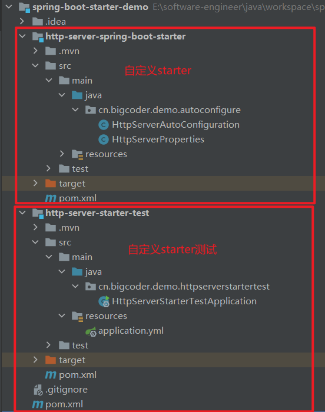

# 自定义SpringBoot starter

在一些场景下，我们需要自己实现自定义 Starter 来达到自动配置的目的。例如说：

- 三方框架并没有提供 Starter，比如说 [Swagger](https://github.com/swagger-api)、[XXL-JOB](https://github.com/xuxueli/xxl-job) 等。
- Spring Boot 内置的 Starter 无法满足自己的需求，比如说 [`spring-boot-starter-jdbc`](https://mvnrepository.com/artifact/org.springframework.boot/spring-boot-starter-jdbc) 不提供多数据源的配置。
- 随着项目越来越大，想要提供适合自己团队的 Starter 来方便配置项目，比如说永辉彩食鲜 [csx-bsf-all](https://gitee.com/yhcsx/csx-bsf-all) 项目。

下面，我们一起来实现一个自定义 Starter，实现一个 Java 内置 [HttpServer](https://docs.oracle.com/javase/8/docs/jre/api/net/httpserver/spec/com/sun/net/httpserver/HttpServer.html) 服务器的自动化配置。最终项目如下图所示：



在开始示例之前，我们要了解下 Spring Boot Starter 的**命名规则**，显得我们更加专业（装逼）。命名规则如下：

| 场景                         | 命名规则                     | 示例                                                         |
| :--------------------------- | :--------------------------- | :----------------------------------------------------------- |
| **Spring Boot 内置** Starter | `spring-boot-starter-{框架}` | `spring-boot-starter-web`                                    |
| 框架 **自定义** Starter      | `{框架}-spring-boot-starter` | [`mybatis-spring-boot-starter`](https://mvnrepository.com/artifact/org.mybatis.spring.boot/mybatis-spring-boot-starter) |

## 一. 自定义starter

创建 [http-server-spring-boot-starter](https://github.com/bigcoder84/spring-boot-starter-demo) 项目，实现一个 Java 内置 HttpServer 服务器的自动化配置。考虑到示例比较简单，我们就不像 Spring Boot 拆分成 `spring-boot-autoconfigure` 和 `spring-boot-starter-{框架}` 两个项目。

### 1.1 引入依赖

```xml
<?xml version="1.0" encoding="UTF-8"?>
<project xmlns="http://maven.apache.org/POM/4.0.0"
         xmlns:xsi="http://www.w3.org/2001/XMLSchema-instance"
         xsi:schemaLocation="http://maven.apache.org/POM/4.0.0 http://maven.apache.org/xsd/maven-4.0.0.xsd">
    <modelVersion>4.0.0</modelVersion>
    <groupId>cn.bigcoder.demo.starter</groupId>
    <artifactId>http-server-spring-boot-starter</artifactId>
    <version>0.0.1</version>
    <name>http-server-spring-boot-starter</name>
    <description>http-server-spring-boot-starter</description>
    <properties>
        <java.version>1.8</java.version>
    </properties>
    <dependencies>
        <dependency>
            <groupId>org.springframework.boot</groupId>
            <artifactId>spring-boot-starter</artifactId>
            <version>2.2.2.RELEASE</version>
        </dependency>

    </dependencies>
</project>
```

### 1.2 配置属性类

在 `cn.bigcoder.demo.autoconfigure` 包下，创建 [HttpServerProperties](https://github.com/bigcoder84/spring-boot-starter-demo/blob/master/http-server-spring-boot-starter/src/main/java/cn/bigcoder/demo/autoconfigure/HttpServerProperties.java) 配置属性类，读取 `bigcoder.server` 前缀的配置项。代码如下：

```java
package cn.bigcoder.demo.autoconfigure;

import org.springframework.boot.context.properties.ConfigurationProperties;

@ConfigurationProperties(prefix = "bigcoder.server")
public class HttpServerProperties {
    /**
     * 默认端口
     */
    private static final Integer DEFAULT_PORT = 8000;

    /**
     * 端口
     */
    private Integer port = DEFAULT_PORT;

    public static Integer getDefaultPort() {
        return DEFAULT_PORT;
    }

    public Integer getPort() {
        return port;
    }

    public HttpServerProperties setPort(Integer port) {
        this.port = port;
        return this;
    }

}
```

### 1.3 自动配置类

在 `cn.bigcoder.demo.autoconfigure` 包下，创建 [HttpServerAutoConfiguration](https://github.com/bigcoder84/spring-boot-starter-demo/blob/master/http-server-spring-boot-starter/src/main/java/cn/bigcoder/demo/autoconfigure/HttpServerAutoConfiguration.java) 自动配置类，，在项目中存在 `com.sun.net.httpserver.HttpServer` 类时，创建 HttpServer Bean，并启动该服务器。代码如下：

```java
package cn.bigcoder.demo.autoconfigure;

import com.sun.net.httpserver.HttpServer;
import org.slf4j.Logger;
import org.slf4j.LoggerFactory;
import org.springframework.boot.autoconfigure.condition.ConditionalOnClass;
import org.springframework.boot.context.properties.EnableConfigurationProperties;
import org.springframework.context.annotation.Bean;
import org.springframework.context.annotation.Configuration;

import java.io.IOException;
import java.net.InetSocketAddress;

@Configuration // 声明配置类
@EnableConfigurationProperties(HttpServerProperties.class) // 使 YunaiServerProperties 配置属性类生效
public class HttpServerAutoConfiguration {
    private Logger logger = LoggerFactory.getLogger(HttpServerAutoConfiguration.class);

    @Bean // 声明创建 Bean
    @ConditionalOnClass(HttpServer.class) // 需要项目中存在 com.sun.net.httpserver.HttpServer 类。该类为 JDK 自带，所以一定成立。
    public HttpServer httpServer(HttpServerProperties serverProperties) throws IOException {
        // 创建 HttpServer 对象，并启动
        HttpServer server = HttpServer.create(new InetSocketAddress(serverProperties.getPort()), 0);
        server.start();
        logger.info("[httpServer][启动服务器成功，端口为:{}]", serverProperties.getPort());
        // 返回
        return server;
    }

}
```

在 `resources` 目录下创建，创建 `META-INF` 目录，然后在该目录下创建 [`spring.factories`](https://github.com/bigcoder84/spring-boot-starter-demo/blob/master/http-server-spring-boot-starter/src/main/resources/META-INF/spring.factories) 文件，注册自动化配置类：

```properties
org.springframework.boot.autoconfigure.EnableAutoConfiguration=\
cn.bigcoder.demo.autoconfigure.HttpServerAutoConfiguration
```

至此，我们已经完成了一个自定义的 Starter。下面，我们在 [http-server-starter-test](https://github.com/bigcoder84/spring-boot-starter-demo/tree/master/http-server-starter-test) 中引入，然后进行测试。

## 二. 测试

创建 [http-server-starter-test](https://github.com/bigcoder84/spring-boot-starter-demo/tree/master/http-server-starter-test) 项目，引入我们自定义 Starter。

### 2.1 引入依赖

在 [pom.xml](https://github.com/bigcoder84/spring-boot-starter-demo/blob/master/http-server-starter-test/pom.xml) 文件中，引入相关依赖。

```xml
<?xml version="1.0" encoding="UTF-8"?>
<project xmlns="http://maven.apache.org/POM/4.0.0" xmlns:xsi="http://www.w3.org/2001/XMLSchema-instance"
         xsi:schemaLocation="http://maven.apache.org/POM/4.0.0 https://maven.apache.org/xsd/maven-4.0.0.xsd">
    <modelVersion>4.0.0</modelVersion>
    <parent>
        <groupId>org.springframework.boot</groupId>
        <artifactId>spring-boot-starter-parent</artifactId>
        <version>2.6.8</version>
        <relativePath/> <!-- lookup parent from repository -->
    </parent>
    <groupId>cn.bigcoder.demo</groupId>
    <artifactId>http-server-starter-test</artifactId>
    <version>0.0.1-SNAPSHOT</version>
    <name>http-server-starter-test</name>
    <description>http-server-starter-test</description>
    <properties>
        <java.version>1.8</java.version>
    </properties>
    <dependencies>
        <dependency>
            <groupId>org.springframework.boot</groupId>
            <artifactId>spring-boot-starter</artifactId>
        </dependency>

        <dependency>
            <groupId>org.springframework.boot</groupId>
            <artifactId>spring-boot-starter-test</artifactId>
            <scope>test</scope>
        </dependency>

        <dependency>
            <groupId>cn.bigcoder.demo.starter</groupId>
            <artifactId>http-server-spring-boot-starter</artifactId>
            <version>0.0.1</version>
        </dependency>
    </dependencies>

    <build>
        <plugins>
            <plugin>
                <groupId>org.springframework.boot</groupId>
                <artifactId>spring-boot-maven-plugin</artifactId>
            </plugin>
        </plugins>
    </build>

</project>
```

### 2.2 配置端口号

```yaml
bigcoder:
  server:
    port: 8888 # 自定义 HttpServer 端口
```

### 2.3 编写启动类启动

```java
package cn.bigcoder.demo.httpserverstartertest;

import org.springframework.boot.SpringApplication;
import org.springframework.boot.autoconfigure.SpringBootApplication;

@SpringBootApplication
public class HttpServerStarterTestApplication {

    public static void main(String[] args) {
        SpringApplication.run(HttpServerStarterTestApplication.class, args);
    }

}
```

日志打印如下：

```txt
  .   ____          _            __ _ _
 /\\ / ___'_ __ _ _(_)_ __  __ _ \ \ \ \
( ( )\___ | '_ | '_| | '_ \/ _` | \ \ \ \
 \\/  ___)| |_)| | | | | || (_| |  ) ) ) )
  '  |____| .__|_| |_|_| |_\__, | / / / /
 =========|_|==============|___/=/_/_/_/
 :: Spring Boot ::                (v2.6.8)

2022-05-28 10:23:23.348  INFO 23964 --- [           main] c.b.d.h.HttpServerStarterTestApplication : Starting HttpServerStarterTestApplication using Java 1.8.0_261 on TJD-HONOR with PID 23964 (E:\software-engineer\java\workspace\spring-boot-starter-demo\http-server-starter-test\target\classes started by JindongTian in E:\software-engineer\java\workspace\spring-boot-starter-demo)
2022-05-28 10:23:23.351  INFO 23964 --- [           main] c.b.d.h.HttpServerStarterTestApplication : No active profile set, falling back to 1 default profile: "default"
2022-05-28 10:23:23.766  INFO 23964 --- [           main] c.b.d.a.HttpServerAutoConfiguration      : [httpServer][启动服务器成功，端口为:8888]
2022-05-28 10:23:23.835  INFO 23964 --- [           main] c.b.d.h.HttpServerStarterTestApplication : Started HttpServerStarterTestApplication in 0.878 seconds (JVM running for 1.95)
```