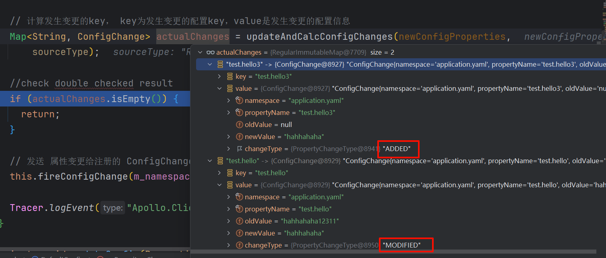

# SpringBoot集成Apollo源码分析

> 本文基于 apollo-client 2.1.0 版本源码进行分析

Apollo 是携程开源的配置中心，能够集中化管理应用不同环境、不同集群的配置，配置修改后能够实时推送到应用端，并且具备规范的权限、流程治理等特性。

Apollo支持4个维度管理Key-Value格式的配置：

1. application (应用)
2. environment (环境)
3. cluster (集群)
4. namespace (命名空间)

同时，Apollo基于开源模式开发，开源地址：https://github.com/ctripcorp/apollo

## 一. SpringBoot集成Apollo

### 1.1 引入Apollo客户端依赖

```xml
<dependency>
    <groupId>com.ctrip.framework.apollo</groupId>
    <artifactId>apollo-client</artifactId>
    <version>2.1.0</version>
</dependency>
```

### 1.2 配置apollo

```yaml
#Apollo 配置
app:
  id: apollo-test                            #应用ID
apollo:
  meta: http://10.10.10.12:8080            #DEV环境配置中心地址
  autoUpdateInjectedSpringProperties: true   #是否开启 Spring 参数自动更新
  bootstrap:
    enabled: true                            #是否开启 Apollo
    namespaces: application.yaml                 #设置 Namespace
    eagerLoad:
      enabled: true                         #将 Apollo 加载提到初始化日志系统之前
```

- `app.id`：AppId是应用的身份信息，是配置中心获取配置的一个重要信息。

  

- `apollo.bootstrap.enabled`：在应用启动阶段，向Spring容器注入被托管的 `application.properties` 文件的配置信息。

- `apollo.bootstrap.eagerLoad.enabled`：将 Apollo 配置加载提到初始化日志系统之前。将Apollo配置加载提到初始化日志系统之前从1.2.0版本开始，如果希望把日志相关的配置（如 `1ogging.level.root=info` 或 `1ogback-spring.xml` 中的参数）也放在Apollo管理，来使Apollo的加载顺序放到日志系统加载之前，不过这会导致Apollo的启动过程无法通过日志的方式输出（因为执行Apollo加载的时的日志输出便没有任何内容）。

### 1.3 启动项目

启动项目后，我们更改 apollo 中的配置，SpringBoot中的配置会自动更新：

```txt
 [Apollo-Config-1] c.f.a.s.p.AutoUpdateConfigChangeListener : Auto update apollo changed value successfully, new value: hahhahaha12311, key: test.hello, beanName: mongoController, field: cn.bigcoder.mongo.mongodemo.web.MongoController.hello
```

## 二. SpringBoot如何在启动时加载Apollo配置


### 2.1 ApolloApplicationContextInitializer

`spring.factories` 文件 是 SpringBoot 中实现 SPI 机制的重要组成，在这个文件中可以定义SpringBoot各种扩展点的实现类。Apollo 客户端 与 SpringBoot 的集成就借助了这个机制，`apollo-client` 包中的 `META-INF/spring.factories` 文件配置如下：

```properties
org.springframework.boot.autoconfigure.EnableAutoConfiguration=\
com.ctrip.framework.apollo.spring.boot.ApolloAutoConfiguration
org.springframework.context.ApplicationContextInitializer=\
com.ctrip.framework.apollo.spring.boot.ApolloApplicationContextInitializer
org.springframework.boot.env.EnvironmentPostProcessor=\
com.ctrip.framework.apollo.spring.boot.ApolloApplicationContextInitializer
```

`ApolloApplicationContextInitializer` 实现了 `ApplicationContextInitializer` 和 `EnvironmentPostProcessor` 两个扩展点，使得 `apollo-client` 能在Spring容器启动前从Apollo Server中加载配置。

- `EnvironmentPostProcessor`：当我们想在Bean中使用配置属性时，那么我们的配置属性必须在Bean实例化之前就放入到Spring到Environment中。即我们的接口需要在 application context refreshed 之前进行调用，而 `EnvironmentPostProcessor` 正好可以实现这个功能。
- `ApplicationContextInitializer`：是Spring框架原有的概念，这个类的主要目的就是在 `ConfigurableApplicationContext` 类型（或者子类型）的 `ApplicationContext` 做refresh之前，允许我们对 `ConfigurableApplicationContext` 的实例做进一步的设置或者处理。

两者虽都实现在 Application Context 做 refresh 之前加载配置，但是 `EnvironmentPostProcessor` 的扩展点相比 `ApplicationContextInitializer` 更加靠前，使得  Apollo 配置加载能够提到初始化日志系统之前。

`ApolloApplicationContextInitializer.postProcessEnvironment` 扩展点：

```java
// com.ctrip.framework.apollo.spring.boot.ApolloApplicationContextInitializer#postProcessEnvironment  
/**
   *
   * 为了早在Spring加载日志系统阶段之前就加载Apollo配置，这个EnvironmentPostProcessor可以在ConfigFileApplicationListener成功之后调用。
   * 处理顺序是这样的: 加载Bootstrap属性和应用程序属性----->加载Apollo配置属性---->初始化日志系
   *
   * @param configurableEnvironment
   * @param springApplication
   */
  @Override
  public void postProcessEnvironment(ConfigurableEnvironment configurableEnvironment, SpringApplication springApplication) {

    // should always initialize system properties like app.id in the first place
    initializeSystemProperty(configurableEnvironment);

    // 获取 apollo.bootstrap.eagerLoad.enabled 配置
    Boolean eagerLoadEnabled = configurableEnvironment.getProperty(PropertySourcesConstants.APOLLO_BOOTSTRAP_EAGER_LOAD_ENABLED, Boolean.class, false);

    // 如果你不想在日志系统初始化之前进行阿波罗加载，就不应该触发EnvironmentPostProcessor
    if (!eagerLoadEnabled) {
      // 如果未开启提前加载，则 postProcessEnvironment 扩展点直接返回，不加载配置
      return;
    }

    // 是否开启了 apollo.bootstrap.enabled 参数，只有开启了才会在Spring启动阶段加载配置
    Boolean bootstrapEnabled = configurableEnvironment.getProperty(PropertySourcesConstants.APOLLO_BOOTSTRAP_ENABLED, Boolean.class, false);

    if (bootstrapEnabled) {
      DeferredLogger.enable();
      // 初始化Apollo配置，内部会加载Apollo Server配置
      initialize(configurableEnvironment);
    }

  }
```

`ApolloApplicationContextInitializer.initialize` 扩展点：

```java
//com.ctrip.framework.apollo.spring.boot.ApolloApplicationContextInitializer#initialize(org.springframework.context.ConfigurableApplicationContext)
  @Override
  public void initialize(ConfigurableApplicationContext context) {
    ConfigurableEnvironment environment = context.getEnvironment();

    // 判断是否配置了 apollo.bootstrap.enabled=true
    if (!environment.getProperty(PropertySourcesConstants.APOLLO_BOOTSTRAP_ENABLED, Boolean.class, false)) {
      logger.debug("Apollo bootstrap config is not enabled for context {}, see property: ${{}}", context, PropertySourcesConstants.APOLLO_BOOTSTRAP_ENABLED);
      return;
    }
    logger.debug("Apollo bootstrap config is enabled for context {}", context);

    // 初始化Apollo配置，内部会加载Apollo Server配置
    initialize(environment);
  }
```

两个扩展点最终都会调用 `ApolloApplicationContextInitializer#initialize(ConfigurableEnvironment environment)` 方法初始化 apollo client，并加载远端配置：

```java
//com.ctrip.framework.apollo.spring.boot.ApolloApplicationContextInitializer#initialize(org.springframework.core.env.ConfigurableEnvironment) 
 /**
   * 初始化Apollo配置
   *
   * @param environment
   */
  protected void initialize(ConfigurableEnvironment environment) {
    final ConfigUtil configUtil = ApolloInjector.getInstance(ConfigUtil.class);
    if (environment.getPropertySources().contains(PropertySourcesConstants.APOLLO_BOOTSTRAP_PROPERTY_SOURCE_NAME)) {
      // 已经初始化，重播日志系统初始化之前打印的日志
      DeferredLogger.replayTo();
      if (configUtil.isOverrideSystemProperties()) {
        // 确保ApolloBootstrapPropertySources仍然是第一个，如果不是会将其调整为第一个，这样从Apollo加载出来的配置拥有更高优先级
        PropertySourcesUtil.ensureBootstrapPropertyPrecedence(environment);
      }
      // 因为有两个不同的触发点，所以该方法首先检查 Spring 的 Environment 环境中是否已经有了 key 为 ApolloBootstrapPropertySources 的目标属性，有的话就不必往下处理，直接 return
      return;
    }

    // 获取配置的命名空间参数
    String namespaces = environment.getProperty(PropertySourcesConstants.APOLLO_BOOTSTRAP_NAMESPACES, ConfigConsts.NAMESPACE_APPLICATION);
    logger.debug("Apollo bootstrap namespaces: {}", namespaces);
    // 使用","切分命名参数
    List<String> namespaceList = NAMESPACE_SPLITTER.splitToList(namespaces);

    CompositePropertySource composite;
    if (configUtil.isPropertyNamesCacheEnabled()) {
      composite = new CachedCompositePropertySource(PropertySourcesConstants.APOLLO_BOOTSTRAP_PROPERTY_SOURCE_NAME);
    } else {
      composite = new CompositePropertySource(PropertySourcesConstants.APOLLO_BOOTSTRAP_PROPERTY_SOURCE_NAME);
    }
    for (String namespace : namespaceList) {
      // 从远端拉去命名空间对应的配置
      Config config = ConfigService.getConfig(namespace);
      // 调用ConfigPropertySourceFactory#getConfigPropertySource() 缓存从远端拉取的配置，并将其包装为 PropertySource，
      // 最终将所有拉取到的远端配置聚合到一个以 ApolloBootstrapPropertySources 为 key 的属性源包装类 CompositePropertySource 的内部
      composite.addPropertySource(configPropertySourceFactory.getConfigPropertySource(namespace, config));
    }
    if (!configUtil.isOverrideSystemProperties()) {
      if (environment.getPropertySources().contains(StandardEnvironment.SYSTEM_ENVIRONMENT_PROPERTY_SOURCE_NAME)) {
        environment.getPropertySources().addAfter(StandardEnvironment.SYSTEM_ENVIRONMENT_PROPERTY_SOURCE_NAME, composite);
        return;
      }
    }
    // 将 CompositePropertySource 属性源包装类添加到 Spring 的 Environment 环境中，注意是插入在属性源列表的头部，
    // 因为取属性的时候其实是遍历这个属性源列表来查找，找到即返回，所以出现同名属性时，前面的优先级更高
    environment.getPropertySources().addFirst(composite);
  }
```

流程如下：

1. 因为有两个不同的触发点，所以该方法首先检查 Spring 的 Environment 环境中是否已经有了 key 为 `ApolloBootstrapPropertySources` 的目标属性，有的话就不必往下处理，直接 return。

2. 从 Environment 环境中获取 `apollo.bootstrap.namespaces` 属性配置的启动命名空间字符串，如果没有的话就取默认的 application 命名空间。

3. 按逗号分割处理配置的启动命名空间字符串，然后调用 `ConfigService#getConfig()` 依次拉取各个命名空间的远端配置，下节详细分析这部分

4. 创建 `CompositePropertySource` 复合属性源，因为 apollo-client 启动时可以加载多个命名空间的配置，每个命名空间对应一个 `PropertySource`，而多个 `PropertySource` 就会被封装在 `CompositePropertySource` 对象中，若需要获取apollo中配置的属性时，就会遍历多个命名空间所对应的 `PropertySource`，找到对应属性后就会直接返回，这也意味着，先加载的 `namespace` 中的配置具有更高优先级：

   ```java
   public class CompositePropertySource extends EnumerablePropertySource<Object> {
   
   	private final Set<PropertySource<?>> propertySources = new LinkedHashSet<>();
   
   	@Override
   	@Nullable
   	public Object getProperty(String name) {
   		for (PropertySource<?> propertySource : this.propertySources) {
   			Object candidate = propertySource.getProperty(name);
   			if (candidate != null) {
   				return candidate;
   			}
   		}
   		return null;
   	}
   }
   ```

5. 调用 `ConfigPropertySourceFactory#getConfigPropertySource()` 缓存从远端拉取的配置，并将其包装为 `PropertySource`，最终将所有拉取到的远端配置聚合到一个以 `ApolloBootstrapPropertySources` 为 key 的属性源包装类 `CompositePropertySource` 的内部。

   ```java
     public ConfigPropertySource getConfigPropertySource(String name, Config source) {
       // 将 Apollo 的 Config 配置封装为继承自 Spring 内置的 EnumerablePropertySource 类的 ConfigPropertySource 对象
       ConfigPropertySource configPropertySource = new ConfigPropertySource(name, source);
   
       // 将新生成的 ConfigPropertySource 对象缓存到内部列表，以备后续为每个配置实例添加配置变化监听器使用
       configPropertySources.add(configPropertySource);
   
       return configPropertySource;
     }
   ```

6. 将 `CompositePropertySource` 属性源包装类添加到 Spring 的 Environment 环境中，注意是插入在属性源列表的头部，因为取属性的时候其实是遍历这个属性源列表来查找，找到即返回，所以出现同名属性时，前面的优先级更高。这样在当本地配置文件和Apollo中配置了同名参数时会使得Apollo中的优先级更高。

### 2.2 从远端加载配置

在 `ApolloApplicationContextInitializer.initialize` 中会调用 `ConfigService.getConfig()` 加载远端命名空间配置。getConfig方法处理流程如下:

```java
// com.ctrip.framework.apollo.ConfigService#getConfig
 /**
   * 获取名称空间的配置实例
   *
   * @param namespace the namespace of the config
   * @return config instance
   */
  public static Config getConfig(String namespace) {
    // s_instance.getManager() 实际通过 ApolloInjector 去获取 ConfigManager实例, ApolloInjector 其实采用了 Java 中的 ServiceLoader 机制，此处不作讨论，读者有兴趣可自行搜索
    return s_instance.getManager().getConfig(namespace);
  }

  private ConfigManager getManager() {
    if (m_configManager == null) {
      synchronized (this) {
        if (m_configManager == null) {
          m_configManager = ApolloInjector.getInstance(ConfigManager.class);
        }
      }
    }

    return m_configManager;
  }
```

1. `s_instance.getManager()` 实际通过 `ApolloInjector` 去获取 `ConfigManager` 实例，`ApolloInjector` 其实采用了 Java 中的 `ServiceLoader` 机制，此处不作讨论，读者有兴趣可自行搜索
2. `ConfigManager` 其实只有一个实现类，此处最终将调用到 `DefaultConfigManager#getConfig()` 方法。

`DefaultConfigManager#getConfig()` 方法处理逻辑较为清晰，重点如下：

```java
  @Override
  public Config getConfig(String namespace) {
    // 首先从缓存中获取配置，缓存中没有则从远程拉取，注意此处在 synchronized 代码块内部也判了一次空，采用了双重检查锁机制
    Config config = m_configs.get(namespace);

    if (config == null) {
      synchronized (this) {
        config = m_configs.get(namespace);
        // 加锁后再次判断
        if (config == null) {
          // 远程拉取配置首先需要通过 ConfigFactoryManager#getFactory() 方法获取 ConfigFactory 实例
          ConfigFactory factory = m_factoryManager.getFactory(namespace);
          // 再通过 ConfigFactory#create() 去实际地进行拉取操作。此处 Factory 的创建也使用了 ServiceLoader 机制，暂不讨论，可知最后实际调用到 DefaultConfigFactory#create()
          config = factory.create(namespace);
          // 将从远端拉取到的配置缓存
          m_configs.put(namespace, config);
        }
      }
    }
```

1. 首先从缓存中获取配置，缓存中没有则从远程拉取，注意此处在 synchronized 代码块内部也判了一次空，采用了双重检查锁机制。
2. 远程拉取配置首先需要通过 `ConfigFactoryManager#getFactory()` 方法获取 `ConfigFactory` 实例，这里实际上获取的是`DefaultConfigFactory`，再通过 `DefaultConfigFactory#create()` 去获取 Apollo Server 中的配置。

在 `DefaultConfigFactory#create()` 中会根据加载namespace类型，创建对应的 `ConfigRepository`：

```java
 //com.ctrip.framework.apollo.spi.DefaultConfigFactory#create 
 @Override
  public Config create(String namespace) {
    // 确定本地配置缓存文件的格式。对于格式不是属性的命名空间，必须提供文件扩展名，例如application.yaml
    ConfigFileFormat format = determineFileFormat(namespace);

    ConfigRepository configRepository = null;

    if (ConfigFileFormat.isPropertiesCompatible(format) &&
        format != ConfigFileFormat.Properties) {
      // 如果是YML类型的配置
      configRepository = createPropertiesCompatibleFileConfigRepository(namespace, format);
    } else {
      // 如果是 Properties 类型的配置
      configRepository = createConfigRepository(namespace);
    }

    logger.debug("Created a configuration repository of type [{}] for namespace [{}]",
        configRepository.getClass().getName(), namespace);

    // 创建 DefaultConfig对象，并将当前 DefaultConfig 对象 对象注册进 configRepository 更新通知列表，这样configRepository中的配置发生变更时，就会通知 DefaultConfig
    return this.createRepositoryConfig(namespace, configRepository);
  }
```

我们就以 `properties` 配置类型为例，会调用 `DefaultConfigFactory.createConfigRepository` 创建 `ConfigRepository`：

```java
  // com.ctrip.framework.apollo.spi.DefaultConfigFactory#createConfigRepository
  ConfigRepository createConfigRepository(String namespace) {
    if (m_configUtil.isPropertyFileCacheEnabled()) {
      // 默认是开启缓存机制的
      return createLocalConfigRepository(namespace);
    }
    return createRemoteConfigRepository(namespace);
  }
```

### 2.3 Apollo ConfigRepository 分层设计

Apollo ConfigRepository 适用于加载配置的接口，默认有两种实现：


- LocalFileConfigRepository：从本地文件中加载配置。
- RemoteConfigRepository：从远端Apollo Server加载配置。

在调用 `DefaultConfigFactory#createConfigRepository` 创建 `ConfigRepository` 时默认会创建多级对象，创建时的顺序为：`RemoteConfigRepository` --> `LocalFileConfigRepository` --> `DefaultConfig`

其中 `DefaultConfig` 持有 `LocalFileConfigRepository`，`LocalFileConfigRepository` 持有 `RemoteConfigRepository`。

`DefaultConfig` 监听 `LocalFileConfigRepository` 变化，`LocalFileConfigRepository` 监听 `RemoteConfigRepository` 变化。


创建流程如下：

```java
  ConfigRepository createConfigRepository(String namespace) {
    if (m_configUtil.isPropertyFileCacheEnabled()) {
      // 默认是开启缓存机制的
      return createLocalConfigRepository(namespace);
    }
    return createRemoteConfigRepository(namespace);
  }

  LocalFileConfigRepository createLocalConfigRepository(String namespace) {
    if (m_configUtil.isInLocalMode()) {
      logger.warn(
          "==== Apollo is in local mode! Won't pull configs from remote server for namespace {} ! ====",
          namespace);
      return new LocalFileConfigRepository(namespace);
    }
    // 创建 RemoteConfigRepository 和 LocalFileConfigRepository，并将 LocalFileConfigRepository 注册进 RemoteConfigRepository的变更通知列表中
    return new LocalFileConfigRepository(namespace, createRemoteConfigRepository(namespace));
  }

  RemoteConfigRepository createRemoteConfigRepository(String namespace) {
    return new RemoteConfigRepository(namespace);
  }
```

Apollo 通过多层 ConfigRepository 设计实现如下配置加载机制，既保证了配置的实时性，又保证了Apollo Server出现故障时对接入的服务影响最小：

1. 客户端和服务端保持了一个长连接（通过Http Long Polling实现），从而能第一时间获得配置更新的推送（RemoteConfigRepository）
2. 客户端还会定时从Apollo配置中心服务端拉取应用的最新配置。

   - 这是一个fallback机制，为了防止推送机制失效导致配置不更新。客户端定时拉取会上报本地版本，所以一般情况下，对于定时拉取的操作，服务端都会返回304 - Not Modified
   - 定时频率默认为每5分钟拉取一次，客户端也可以通过在运行时指定System Property：apollo.refreshInterval来覆盖，单位为分钟

3. 客户端会把从服务端获取到的配置在本地文件系统缓存一份在遇到服务不可用，或网络不通的时候，依然能从本地恢复配置（LocalFileConfigRepository）
4. 客户端从Apollo配置中心服务端获取到应用的最新配置后，会保存在内存中（DefaultConfig）

#### 2.4.1 RemoteConfigRepository

`RemoteConfigRepository` 实现 `AbstractConfigRepository` 抽象类，远程配置Repository。实现从Apollo Server拉取配置，并缓存在内存中。定时 + 实时刷新缓存：

***

**构造方法**：

```java
public class RemoteConfigRepository extends AbstractConfigRepository {
  private static final Logger logger = DeferredLoggerFactory.getLogger(RemoteConfigRepository.class);
  private static final Joiner STRING_JOINER = Joiner.on(ConfigConsts.CLUSTER_NAMESPACE_SEPARATOR);
  private static final Joiner.MapJoiner MAP_JOINER = Joiner.on("&").withKeyValueSeparator("=");
  private static final Escaper pathEscaper = UrlEscapers.urlPathSegmentEscaper();
  private static final Escaper queryParamEscaper = UrlEscapers.urlFormParameterEscaper();

  private final ConfigServiceLocator m_serviceLocator;
  private final HttpClient m_httpClient;
  private final ConfigUtil m_configUtil;
  /**
   * 远程配置长轮询服务
   */
  private final RemoteConfigLongPollService remoteConfigLongPollService;
  /**
   * 指向ApolloConfig的AtomicReference,拉取的远端配置缓存
   */
  private volatile AtomicReference<ApolloConfig> m_configCache;
  private final String m_namespace;
  private final static ScheduledExecutorService m_executorService;
  private final AtomicReference<ServiceDTO> m_longPollServiceDto;
  private final AtomicReference<ApolloNotificationMessages> m_remoteMessages;
  /**
   * 加载配置的RateLimiter
   */
  private final RateLimiter m_loadConfigRateLimiter;
  /**
   * 是否强制拉取缓存的标记
   * 若为true,则多一轮从Config Service拉取配置
   * 为true的原因:RemoteConfigRepository知道Config Service有配置刷新
   */
  private final AtomicBoolean m_configNeedForceRefresh;
  /**
   * 失败定时重试策略
   */
  private final SchedulePolicy m_loadConfigFailSchedulePolicy;
  private static final Gson GSON = new Gson();

  static {
    m_executorService = Executors.newScheduledThreadPool(1,
        ApolloThreadFactory.create("RemoteConfigRepository", true));
  }

  /**
   * Constructor.
   *
   * @param namespace the namespace
   */
  public RemoteConfigRepository(String namespace) {
    m_namespace = namespace;
    m_configCache = new AtomicReference<>();
    m_configUtil = ApolloInjector.getInstance(ConfigUtil.class);
    m_httpClient = ApolloInjector.getInstance(HttpClient.class);
    m_serviceLocator = ApolloInjector.getInstance(ConfigServiceLocator.class);
    remoteConfigLongPollService = ApolloInjector.getInstance(RemoteConfigLongPollService.class);
    m_longPollServiceDto = new AtomicReference<>();
    m_remoteMessages = new AtomicReference<>();
    m_loadConfigRateLimiter = RateLimiter.create(m_configUtil.getLoadConfigQPS());
    m_configNeedForceRefresh = new AtomicBoolean(true);
    m_loadConfigFailSchedulePolicy = new ExponentialSchedulePolicy(m_configUtil.getOnErrorRetryInterval(),
        m_configUtil.getOnErrorRetryInterval() * 8);
    // 尝试同步配置
    this.trySync();
    // 初始化定时刷新配置的任务
    this.schedulePeriodicRefresh();
    // 注册自己到RemoteConfigLongPollService中,实现配置更新的实时通知
    this.scheduleLongPollingRefresh();
  }
}
```

`RemoteConfigRepository` 构造方法中分别调用了 `trySync()` 尝试同步配置，`schedulePeriodicRefresh()` 初始化定时刷新配置的任务，`scheduleLongPollingRefresh()` 注册自己到 `RemoteConfigLongPollService` 中实现配置更新的实时通知。

***

**trySync()**:

```java
public abstract class AbstractConfigRepository implements ConfigRepository {

  protected boolean trySync() {
    try {
      // 调用实现类的sync方法
      sync();
      return true;
    } catch (Throwable ex) {
      Tracer.logEvent("ApolloConfigException", ExceptionUtil.getDetailMessage(ex));
      logger
          .warn("Sync config failed, will retry. Repository {}, reason: {}", this.getClass(), ExceptionUtil
              .getDetailMessage(ex));
    }
    return false;
  }
}
```

`RemoteConfigRepository` 构造方法中调用的 `trySync` 方法，最终会调用实现类的自己的 `sync` 方法：

```java
  // com.ctrip.framework.apollo.internals.RemoteConfigRepository#sync
  @Override
  protected synchronized void sync() {
    Transaction transaction = Tracer.newTransaction("Apollo.ConfigService", "syncRemoteConfig");

    try {
      // 缓存的 Apollo服务端配置
      ApolloConfig previous = m_configCache.get();
      // 从Apollo Server加载配置
      ApolloConfig current = loadApolloConfig();

      //reference equals means HTTP 304
      if (previous != current) {
        logger.debug("Remote Config refreshed!");
        // 若不相等,说明更新了,设置到缓存中
        m_configCache.set(current);
        // 发布配置变更事件，实际上是回调 LocalFileConfigRepository.onRepositoryChange
        this.fireRepositoryChange(m_namespace, this.getConfig());
      }

      if (current != null) {
        Tracer.logEvent(String.format("Apollo.Client.Configs.%s", current.getNamespaceName()),
            current.getReleaseKey());
      }

      transaction.setStatus(Transaction.SUCCESS);
    } catch (Throwable ex) {
      transaction.setStatus(ex);
      throw ex;
    } finally {
      transaction.complete();
    }
  }
```

1. 调用 `loadApolloConfig()` 方法加载远端配置信息。

   ```java
     // com.ctrip.framework.apollo.internals.RemoteConfigRepository#loadApolloConfig
     private ApolloConfig loadApolloConfig() {
       // 限流
       if (!m_loadConfigRateLimiter.tryAcquire(5, TimeUnit.SECONDS)) {
         try {
           // 如果被限流则sleep 5s
           TimeUnit.SECONDS.sleep(5);
         } catch (InterruptedException e) {
         }
       }
       String appId = m_configUtil.getAppId();
       String cluster = m_configUtil.getCluster();
       String dataCenter = m_configUtil.getDataCenter();
       String secret = m_configUtil.getAccessKeySecret();
       Tracer.logEvent("Apollo.Client.ConfigMeta", STRING_JOINER.join(appId, cluster, m_namespace));
       //计算重试次数
       int maxRetries = m_configNeedForceRefresh.get() ? 2 : 1;
       long onErrorSleepTime = 0; // 0 means no sleep
       Throwable exception = null;
   
       //获得所有的Apollo Server的地址
       List<ServiceDTO> configServices = getConfigServices();
       String url = null;
       //循环读取配置重试次数直到成功 每一次都会循环所有的ServiceDTO数组
       retryLoopLabel:
       for (int i = 0; i < maxRetries; i++) {
         List<ServiceDTO> randomConfigServices = Lists.newLinkedList(configServices);
         // 随机所有的Config Service 的地址
         Collections.shuffle(randomConfigServices);
         // 优先访问通知配置变更的Config Service的地址 并且获取到时,需要置空,避免重复优先访问
         if (m_longPollServiceDto.get() != null) {
           randomConfigServices.add(0, m_longPollServiceDto.getAndSet(null));
         }
   
         //循环所有的Apollo Server的地址
         for (ServiceDTO configService : randomConfigServices) {
           if (onErrorSleepTime > 0) {
             logger.warn(
                 "Load config failed, will retry in {} {}. appId: {}, cluster: {}, namespaces: {}",
                 onErrorSleepTime, m_configUtil.getOnErrorRetryIntervalTimeUnit(), appId, cluster, m_namespace);
   
             try {
               m_configUtil.getOnErrorRetryIntervalTimeUnit().sleep(onErrorSleepTime);
             } catch (InterruptedException e) {
               //ignore
             }
           }
   
           // 组装查询配置的地址
           url = assembleQueryConfigUrl(configService.getHomepageUrl(), appId, cluster, m_namespace,
                   dataCenter, m_remoteMessages.get(), m_configCache.get());
   
           logger.debug("Loading config from {}", url);
   
           //创建HttpRequest对象
           HttpRequest request = new HttpRequest(url);
           if (!StringUtils.isBlank(secret)) {
             Map<String, String> headers = Signature.buildHttpHeaders(url, appId, secret);
             request.setHeaders(headers);
           }
   
           Transaction transaction = Tracer.newTransaction("Apollo.ConfigService", "queryConfig");
           transaction.addData("Url", url);
           try {
             // 发起请求,返回HttpResponse对象
             HttpResponse<ApolloConfig> response = m_httpClient.doGet(request, ApolloConfig.class);
             // 设置是否强制拉取缓存的标记为false
             m_configNeedForceRefresh.set(false);
             // 标记成功
             m_loadConfigFailSchedulePolicy.success();
   
             transaction.addData("StatusCode", response.getStatusCode());
             transaction.setStatus(Transaction.SUCCESS);
   
             if (response.getStatusCode() == 304) {
               logger.debug("Config server responds with 304 HTTP status code.");
               // 无新的配置, 直接返回缓存的 ApolloConfig 对象
               return m_configCache.get();
             }
   
             // 有新的配置,进行返回新的ApolloConfig对象
             ApolloConfig result = response.getBody();
   
             logger.debug("Loaded config for {}: {}", m_namespace, result);
   
             return result;
           } catch (ApolloConfigStatusCodeException ex) {
             ApolloConfigStatusCodeException statusCodeException = ex;
             //config not found
             if (ex.getStatusCode() == 404) {
               String message = String.format(
                   "Could not find config for namespace - appId: %s, cluster: %s, namespace: %s, " +
                       "please check whether the configs are released in Apollo!",
                   appId, cluster, m_namespace);
               statusCodeException = new ApolloConfigStatusCodeException(ex.getStatusCode(),
                   message);
             }
             Tracer.logEvent("ApolloConfigException", ExceptionUtil.getDetailMessage(statusCodeException));
             transaction.setStatus(statusCodeException);
             exception = statusCodeException;
             if(ex.getStatusCode() == 404) {
               break retryLoopLabel;
             }
           } catch (Throwable ex) {
             Tracer.logEvent("ApolloConfigException", ExceptionUtil.getDetailMessage(ex));
             transaction.setStatus(ex);
             exception = ex;
           } finally {
             transaction.complete();
           }
   
           // if force refresh, do normal sleep, if normal config load, do exponential sleep
           onErrorSleepTime = m_configNeedForceRefresh.get() ? m_configUtil.getOnErrorRetryInterval() :
               m_loadConfigFailSchedulePolicy.fail();
         }
   
       }
       String message = String.format(
           "Load Apollo Config failed - appId: %s, cluster: %s, namespace: %s, url: %s",
           appId, cluster, m_namespace, url);
       throw new ApolloConfigException(message, exception);
     }
   ```

2. 如果配置发生变更，回调 `LocalFileConfigRepository.onRepositoryChange`方法，从而将最新配置同步到 `LocalFileConfigRepository`。而 `LocalFileConfigRepository` 在更新完本地文件缓存配置后，同样会回调 `DefaultConfig.onRepositoryChange` 同步内存缓存，具体源码我们在后文分析。


***

**schedulePeriodicRefresh**：

```java
  // com.ctrip.framework.apollo.internals.RemoteConfigRepository#schedulePeriodicRefresh
  private void schedulePeriodicRefresh() {
    logger.debug("Schedule periodic refresh with interval: {} {}",
        m_configUtil.getRefreshInterval(), m_configUtil.getRefreshIntervalTimeUnit());
    m_executorService.scheduleAtFixedRate(
        new Runnable() {
          @Override
          public void run() {
            Tracer.logEvent("Apollo.ConfigService", String.format("periodicRefresh: %s", m_namespace));
            logger.debug("refresh config for namespace: {}", m_namespace);
            // 同步配置
            trySync();
            Tracer.logEvent("Apollo.Client.Version", Apollo.VERSION);
          }
          // 默认每5分钟同步一次配置
        }, m_configUtil.getRefreshInterval(), m_configUtil.getRefreshInterval(),
        m_configUtil.getRefreshIntervalTimeUnit());
  }
```

***

**scheduleLongPollingRefresh()**：

```java
  // com.ctrip.framework.apollo.internals.RemoteConfigRepository#scheduleLongPollingRefresh
  private void scheduleLongPollingRefresh() {
    //将自己注册到RemoteConfigLongPollService中,实现配置更新的实时通知
    //当RemoteConfigLongPollService长轮询到该RemoteConfigRepository的Namespace下的配置更新时,会回调onLongPollNotified()方法
    remoteConfigLongPollService.submit(m_namespace, this);
  }

  // com.ctrip.framework.apollo.internals.RemoteConfigRepository#onLongPollNotified
  public void onLongPollNotified(ServiceDTO longPollNotifiedServiceDto, ApolloNotificationMessages remoteMessages) {
    //设置长轮询到配置更新的Config Service 下次同步配置时,优先读取该服务
    m_longPollServiceDto.set(longPollNotifiedServiceDto);
    m_remoteMessages.set(remoteMessages);
    // 提交同步任务
    m_executorService.submit(new Runnable() {
      @Override
      public void run() {
        // 设置是否强制拉取缓存的标记为true
        m_configNeedForceRefresh.set(true);
        //尝试同步配置
        trySync();
      }
    });
  }  
```

#### 2.4.2 RemoteConfigLongPollService

`RemoteConfigLongPollService` 远程配置长轮询服务。负责长轮询 Apollo Server 的配置变更通知 `/notifications/v2` 接口。当有新的通知时，触发 `RemoteConfigRepository.onLongPollNotified`，立即轮询 Apollo Server 的配置读取`/configs/{appId}/{clusterName}/{namespace:.+}`接口。

**构造方法**：

```java
public class RemoteConfigLongPollService {
  private static final Logger logger = LoggerFactory.getLogger(RemoteConfigLongPollService.class);
  private static final Joiner STRING_JOINER = Joiner.on(ConfigConsts.CLUSTER_NAMESPACE_SEPARATOR);
  private static final Joiner.MapJoiner MAP_JOINER = Joiner.on("&").withKeyValueSeparator("=");
  private static final Escaper queryParamEscaper = UrlEscapers.urlFormParameterEscaper();
  private static final long INIT_NOTIFICATION_ID = ConfigConsts.NOTIFICATION_ID_PLACEHOLDER;
  //90 seconds, should be longer than server side's long polling timeout, which is now 60 seconds
  private static final int LONG_POLLING_READ_TIMEOUT = 90 * 1000;
  /**
   * 长轮询ExecutorService
   */
  private final ExecutorService m_longPollingService;
  /**
   * 是否停止长轮询的标识
   */
  private final AtomicBoolean m_longPollingStopped;
  /**
   * 失败定时重试策略
   */
  private SchedulePolicy m_longPollFailSchedulePolicyInSecond;
  /**
   * 长轮询的RateLimiter
   */
  private RateLimiter m_longPollRateLimiter;
  /**
   * 是否长轮询已经开始的标识
   */
  private final AtomicBoolean m_longPollStarted;
  /**
   * 长轮询的Namespace Multimap缓存
   * key:namespace的名字
   * value：RemoteConfigRepository集合
   */
  private final Multimap<String, RemoteConfigRepository> m_longPollNamespaces;
  /**
   * 通知编号Map缓存
   * key:namespace的名字
   * value:最新的通知编号
   */
  private final ConcurrentMap<String, Long> m_notifications;
  /**
   * 通知消息Map缓存
   * key:namespace的名字
   * value:ApolloNotificationMessages 对象
   */
  private final Map<String, ApolloNotificationMessages> m_remoteNotificationMessages;//namespaceName -> watchedKey -> notificationId
  private Type m_responseType;
  private static final Gson GSON = new Gson();
  private ConfigUtil m_configUtil;
  private HttpClient m_httpClient;
  private ConfigServiceLocator m_serviceLocator;
  private final ConfigServiceLoadBalancerClient configServiceLoadBalancerClient = ServiceBootstrap.loadPrimary(
      ConfigServiceLoadBalancerClient.class);

  /**
   * Constructor.
   */
  public RemoteConfigLongPollService() {
    m_longPollFailSchedulePolicyInSecond = new ExponentialSchedulePolicy(1, 120); //in second
    m_longPollingStopped = new AtomicBoolean(false);
    m_longPollingService = Executors.newSingleThreadExecutor(
        ApolloThreadFactory.create("RemoteConfigLongPollService", true));
    m_longPollStarted = new AtomicBoolean(false);
    m_longPollNamespaces =
        Multimaps.synchronizedSetMultimap(HashMultimap.<String, RemoteConfigRepository>create());
    m_notifications = Maps.newConcurrentMap();
    m_remoteNotificationMessages = Maps.newConcurrentMap();
    m_responseType = new TypeToken<List<ApolloConfigNotification>>() {
    }.getType();
    m_configUtil = ApolloInjector.getInstance(ConfigUtil.class);
    m_httpClient = ApolloInjector.getInstance(HttpClient.class);
    m_serviceLocator = ApolloInjector.getInstance(ConfigServiceLocator.class);
    m_longPollRateLimiter = RateLimiter.create(m_configUtil.getLongPollQPS());
  }
}
```

**submit**：

```java
  // com.ctrip.framework.apollo.internals.RemoteConfigLongPollService#submit
  public boolean submit(String namespace, RemoteConfigRepository remoteConfigRepository) {
    // 将远程仓库缓存下来
    boolean added = m_longPollNamespaces.put(namespace, remoteConfigRepository);
    m_notifications.putIfAbsent(namespace, INIT_NOTIFICATION_ID);
    if (!m_longPollStarted.get()) {
      // 若未启动长轮询定时任务,进行启动
      startLongPolling();
    }
    return added;
  }
```

**startLongPolling**：

```java
  // com.ctrip.framework.apollo.internals.RemoteConfigLongPollService#startLongPolling
  private void startLongPolling() {
    // CAS设置 m_longPollStarted 为 true，代表长轮询已启动
    if (!m_longPollStarted.compareAndSet(false, true)) {
      //already started
      return;
    }
    try {
      final String appId = m_configUtil.getAppId();
      final String cluster = m_configUtil.getCluster();
      final String dataCenter = m_configUtil.getDataCenter();
      final String secret = m_configUtil.getAccessKeySecret();
      // 获得长轮询任务的初始化延迟时间,单位毫秒
      final long longPollingInitialDelayInMills = m_configUtil.getLongPollingInitialDelayInMills();
      // 提交长轮询任务 该任务会持续且循环执行
      m_longPollingService.submit(new Runnable() {
        @Override
        public void run() {
          if (longPollingInitialDelayInMills > 0) {
            try {
              logger.debug("Long polling will start in {} ms.", longPollingInitialDelayInMills);
              TimeUnit.MILLISECONDS.sleep(longPollingInitialDelayInMills);
            } catch (InterruptedException e) {
              //ignore
            }
          }
          // 执行长轮询
          doLongPollingRefresh(appId, cluster, dataCenter, secret);
        }
      });
    } catch (Throwable ex) {
      m_longPollStarted.set(false);
      ApolloConfigException exception =
          new ApolloConfigException("Schedule long polling refresh failed", ex);
      Tracer.logError(exception);
      logger.warn(ExceptionUtil.getDetailMessage(exception));
    }
  }

```

**doLongPollingRefresh**:

```java
  // com.ctrip.framework.apollo.internals.RemoteConfigLongPollService#doLongPollingRefresh
  private void doLongPollingRefresh(String appId, String cluster, String dataCenter, String secret) {
    ServiceDTO lastServiceDto = null;
    // 循环执行,直到停止或线程中断
    while (!m_longPollingStopped.get() && !Thread.currentThread().isInterrupted()) {
      if (!m_longPollRateLimiter.tryAcquire(5, TimeUnit.SECONDS)) {
        //wait at most 5 seconds
        try {
          // 若被限流，则等待5s
          TimeUnit.SECONDS.sleep(5);
        } catch (InterruptedException e) {
        }
      }
      Transaction transaction = Tracer.newTransaction("Apollo.ConfigService", "pollNotification");
      String url = null;
      try {
        // 获得Apollo Server的地址
        if (lastServiceDto == null) {
          lastServiceDto = this.resolveConfigService();
        }

        // 组装长轮询通知变更的地址
        url =
            assembleLongPollRefreshUrl(lastServiceDto.getHomepageUrl(), appId, cluster, dataCenter,
                m_notifications);

        logger.debug("Long polling from {}", url);

        // 创建HttpRequest对象,并设置超时时间
        HttpRequest request = new HttpRequest(url);
        request.setReadTimeout(LONG_POLLING_READ_TIMEOUT);
        if (!StringUtils.isBlank(secret)) {
          Map<String, String> headers = Signature.buildHttpHeaders(url, appId, secret);
          request.setHeaders(headers);
        }

        transaction.addData("Url", url);

        // 发起请求,返回HttpResponse对象
        final HttpResponse<List<ApolloConfigNotification>> response =
            m_httpClient.doGet(request, m_responseType);

        logger.debug("Long polling response: {}, url: {}", response.getStatusCode(), url);
        // 有新的通知,刷新本地的缓存
        if (response.getStatusCode() == 200 && response.getBody() != null) {
          updateNotifications(response.getBody());
          updateRemoteNotifications(response.getBody());
          transaction.addData("Result", response.getBody().toString());
          // 通知对应的RemoteConfigRepository们
          notify(lastServiceDto, response.getBody());
        }

        //try to load balance
        // 无新的通知,重置连接的Config Service的地址,下次请求不同的Config Service,实现负载均衡
        if (response.getStatusCode() == 304 && ThreadLocalRandom.current().nextBoolean()) {
          lastServiceDto = null;
        }

        // 标记成功
        m_longPollFailSchedulePolicyInSecond.success();
        transaction.addData("StatusCode", response.getStatusCode());
        transaction.setStatus(Transaction.SUCCESS);
      } catch (Throwable ex) {
        lastServiceDto = null;
        Tracer.logEvent("ApolloConfigException", ExceptionUtil.getDetailMessage(ex));
        transaction.setStatus(ex);
        long sleepTimeInSecond = m_longPollFailSchedulePolicyInSecond.fail();
        logger.warn(
            "Long polling failed, will retry in {} seconds. appId: {}, cluster: {}, namespaces: {}, long polling url: {}, reason: {}",
            sleepTimeInSecond, appId, cluster, assembleNamespaces(), url, ExceptionUtil.getDetailMessage(ex));
        try {
          TimeUnit.SECONDS.sleep(sleepTimeInSecond);
        } catch (InterruptedException ie) {
          //ignore
        }
      } finally {
        transaction.complete();
      }
    }
  }
```

**notify**：

```java
  private void notify(ServiceDTO lastServiceDto, List<ApolloConfigNotification> notifications) {
    if (notifications == null || notifications.isEmpty()) {
      return;
    }
    for (ApolloConfigNotification notification : notifications) {
      String namespaceName = notification.getNamespaceName();
      // 创建新的RemoteConfigRepository数组，避免并发问题
      List<RemoteConfigRepository> toBeNotified =
          Lists.newArrayList(m_longPollNamespaces.get(namespaceName));
      // 获得远程的ApolloNotificationMessages对象并克隆
      ApolloNotificationMessages originalMessages = m_remoteNotificationMessages.get(namespaceName);
      ApolloNotificationMessages remoteMessages = originalMessages == null ? null : originalMessages.clone();
      //since .properties are filtered out by default, so we need to check if there is any listener for it
      toBeNotified.addAll(m_longPollNamespaces
          .get(String.format("%s.%s", namespaceName, ConfigFileFormat.Properties.getValue())));
      // 循环RemoteConfigRepository进行通知
      for (RemoteConfigRepository remoteConfigRepository : toBeNotified) {
        try {
          // 回调 RemoteConfigRepository.onLongPollNotified 方法，让其重新拉取最新的配置
          remoteConfigRepository.onLongPollNotified(lastServiceDto, remoteMessages);
        } catch (Throwable ex) {
          Tracer.logError(ex);
        }
      }
    }
  }
```

至此 `RemoteConfigRepository` 从远端拉取配置的整个流程就已经分析完毕，Spring启动流程创建 `RemoteConfigRepository` 对象时会尝试第一次拉取namespace对应的配置，拉取完后会创建定时拉取任务和长轮询任务，长轮询任务调用 `RemoteConfigLongPollService#startLongPolling` 来实现，若服务端配置发生变更，则会回调 `RemoteConfigRepository#onLongPollNotified` 方法，在这个方法中会调用 `RemoteConfigRepository#sync` 方法重新拉取对应 namespace 的远端配置。

#### 2.4.3 LocalFileConfigRepository

前文我们提到当服务端配置发生变更后，`RemoteConfigRepository` 会收到配置变更通知并调用 `sync` 方法同步配置，若配置发生变更，则会继续回调 `LocalFileConfigRepository#onRepositoryChange`：

```java
// LocalFileConfigRepository.onRepositoryChange
  @Override
  public void onRepositoryChange(String namespace, Properties newProperties) {
    if (newProperties.equals(m_fileProperties)) {
      return;
    }
    Properties newFileProperties = propertiesFactory.getPropertiesInstance();
    newFileProperties.putAll(newProperties);
    // 将最新配置写入本地文件
    updateFileProperties(newFileProperties, m_upstream.getSourceType());
    // 回调 DefaultConfig.onRepositoryChange 方法
    this.fireRepositoryChange(namespace, newProperties);
  }
```

#### 2.4.4 DefaultConfig

当 `LocalFileConfigRepository` 收到 `RemoteConfigRepository` 的配置变更通知并更新本地配置文件后，会继续回调 `DefaultConfig#onRepositoryChange`：

```java
 // com.ctrip.framework.apollo.internals.DefaultConfig#onRepositoryChange

  @Override
  public synchronized void onRepositoryChange(String namespace, Properties newProperties) {
    // 如果属性配置未发生变更，则直接退出
    if (newProperties.equals(m_configProperties.get())) {
      return;
    }
    // 获取配置源类型，默认情况下 这里是 LocalFileConfigRepository
    ConfigSourceType sourceType = m_configRepository.getSourceType();
    Properties newConfigProperties = propertiesFactory.getPropertiesInstance();
    newConfigProperties.putAll(newProperties);

    // 更新配置缓存，并计算实际发生变更的key， key为发生变更的配置key，value是发生变更的配置信息
    Map<String, ConfigChange> actualChanges = updateAndCalcConfigChanges(newConfigProperties,
        sourceType);

    //check double checked result
    if (actualChanges.isEmpty()) {
      // 如果未发生属性变更，则直接退出
      return;
    }

    // 发送 属性变更给注册的 ConfigChangeListener
    this.fireConfigChange(m_namespace, actualChanges);

    Tracer.logEvent("Apollo.Client.ConfigChanges", m_namespace);
  }
```

整体流程：

1. 更新配置缓存，并计算实际发生变更的key，key为发生变更的配置key，value是发生变更的配置信息：

   例如我们变更 `test.hello` 配置以及新增一个 `test.hello3` 配置：

   

2. 发送属性变更通知，注意在这里就不像 `Resporsitory` 层发送的是整个仓库的变更事件，而发送的是某一个属性变更的事件。Repository配置变更事件监听是实现 `RepositoryChangeListener`，属性变更事件监听是实现 `ConfigChangeListener`

## 三. Apollo如何实现Spring Bean配置属性的实时更新

在 SpringBoot 中使用 Apollo 客户端一般都需要启用 `@EnableApolloConfig` 注解：

```java
@Retention(RetentionPolicy.RUNTIME)
@Target(ElementType.TYPE)
@Documented
@Import(ApolloConfigRegistrar.class)
public @interface EnableApolloConfig {
  /**
   * Apollo namespaces to inject configuration into Spring Property Sources.
   */
  String[] value() default {ConfigConsts.NAMESPACE_APPLICATION};

  /**
   * The order of the apollo config, default is {@link Ordered#LOWEST_PRECEDENCE}, which is Integer.MAX_VALUE.
   * If there are properties with the same name in different apollo configs, the apollo config with smaller order wins.
   * @return
   */
  int order() default Ordered.LOWEST_PRECEDENCE;
}
```

`@EnableApolloConfig` 通过 `@Import` 注解注入了 `ApolloConfigRegistrar` 类，该类是Apollo组件注入的入口：

```java
public class ApolloConfigRegistrar implements ImportBeanDefinitionRegistrar, EnvironmentAware {

  private final ApolloConfigRegistrarHelper helper = ServiceBootstrap.loadPrimary(ApolloConfigRegistrarHelper.class);

  @Override
  public void registerBeanDefinitions(AnnotationMetadata importingClassMetadata, BeanDefinitionRegistry registry) {
    helper.registerBeanDefinitions(importingClassMetadata, registry);
  }

  @Override
  public void setEnvironment(Environment environment) {
    this.helper.setEnvironment(environment);
  }

}
```

该类实现了两个扩展点：

- EnvironmentAware：凡注册到Spring容器内的bean，实现了EnvironmentAware接口重写setEnvironment方法后，在工程启动时可以获得application.properties的配置文件配置的属性值。
- ImportBeanDefinitionRegistrar：该扩展点作用是通过自定义的方式直接向容器中注册bean。实现ImportBeanDefinitionRegistrar接口，在重写的registerBeanDefinitions方法中定义的Bean，就和使用xml中定义Bean效果是一样的。ImportBeanDefinitionRegistrar是Spring框架提供的一种机制，允许通过api代码向容器批量注册BeanDefinition。它实现了BeanFactoryPostProcessor接口，可以在所有bean定义加载到容器之后，bean实例化之前，对bean定义进行修改。使用ImportBeanDefinitionRegistrar，我们可以向容器中批量导入bean，而不需要在配置文件中逐个配置。

`ApolloConfigRegistrar#setEnvironment` 将 `Environment` 暂存下来；`ApolloConfigRegistrar#registerBeanDefinitions` 中调用 `ApolloConfigRegistrarHelper.registerBeanDefinitions` 注册了一系列Spring扩展点实例至Ioc容器：

```java
  // com.ctrip.framework.apollo.spring.spi.DefaultApolloConfigRegistrarHelper#registerBeanDefinitions
  @Override
  public void registerBeanDefinitions(AnnotationMetadata importingClassMetadata, BeanDefinitionRegistry registry) {
    AnnotationAttributes attributes = AnnotationAttributes
        .fromMap(importingClassMetadata.getAnnotationAttributes(EnableApolloConfig.class.getName()));
    final String[] namespaces = attributes.getStringArray("value");
    final int order = attributes.getNumber("order");
    final String[] resolvedNamespaces = this.resolveNamespaces(namespaces);
    PropertySourcesProcessor.addNamespaces(Lists.newArrayList(resolvedNamespaces), order);

    Map<String, Object> propertySourcesPlaceholderPropertyValues = new HashMap<>();
    // to make sure the default PropertySourcesPlaceholderConfigurer's priority is higher than PropertyPlaceholderConfigurer
    propertySourcesPlaceholderPropertyValues.put("order", 0);

    // PropertySourcesPlaceholderConfigurer是 SpringBoot 框架自身的占位符处理配置，占位符的处理主要是将 ${apollo.value} 这样的字符串解析出 关键字 apollo.value，再使用这个 key 通过 PropertySourcesPropertyResolver 从 PropertySource 中找到对应的属性值替换掉占位符
    BeanRegistrationUtil.registerBeanDefinitionIfNotExists(registry, PropertySourcesPlaceholderConfigurer.class,
            propertySourcesPlaceholderPropertyValues);
    BeanRegistrationUtil.registerBeanDefinitionIfNotExists(registry, AutoUpdateConfigChangeListener.class);
    // 用于拉取 @EnableApolloConfig 配置的 namespace 的远程配置
    BeanRegistrationUtil.registerBeanDefinitionIfNotExists(registry, PropertySourcesProcessor.class);
    // 用于处理 Apollo 的专用注解
    BeanRegistrationUtil.registerBeanDefinitionIfNotExists(registry, ApolloAnnotationProcessor.class);
    // 用于处理 @Value 注解标注的类成员变量和对象方法
    BeanRegistrationUtil.registerBeanDefinitionIfNotExists(registry, SpringValueProcessor.class);
    // 用于处理 XML 文件中的占位符
    BeanRegistrationUtil.registerBeanDefinitionIfNotExists(registry, SpringValueDefinitionProcessor.class);
  }
```

`PropertySourcesProcessor` 是 Apollo 最关键的组件之一，并且其实例化优先级也是最高的，`PropertySourcesProcessor#postProcessBeanFactory()` 会在该类实例化的时候被回调，该方法的处理如下：

```java
  // com.ctrip.framework.apollo.spring.config.PropertySourcesProcessor#postProcessBeanFactory

  @Override
  public void postProcessBeanFactory(ConfigurableListableBeanFactory beanFactory) throws BeansException {
    this.configUtil = ApolloInjector.getInstance(ConfigUtil.class);
    // 调用 PropertySourcesProcessor#initializePropertySources() 拉取远程 namespace 配置
    initializePropertySources();
    // 调用 PropertySourcesProcessor#initializeAutoUpdatePropertiesFeature() 给所有缓存在本地的 Config 配置添加监听器
    initializeAutoUpdatePropertiesFeature(beanFactory);
  }
```

1. 调用 `PropertySourcesProcessor#initializePropertySources()` 拉取远程 namespace 配置：

2. 调用 `PropertySourcesProcessor#initializeAutoUpdatePropertiesFeature()` 给所有缓存在本地的 Config 配置添加监听器

   ```java
    // com.ctrip.framework.apollo.spring.config.PropertySourcesProcessor#initializeAutoUpdatePropertiesFeature 
    private void initializeAutoUpdatePropertiesFeature(ConfigurableListableBeanFactory beanFactory) {
       if (!AUTO_UPDATE_INITIALIZED_BEAN_FACTORIES.add(beanFactory)) {
         return;
       }
       
       // 当收到配置变更回调后，会发送 ApolloConfigChangeEvent 事件
       ConfigChangeListener configChangeEventPublisher = changeEvent ->
           applicationEventPublisher.publishEvent(new ApolloConfigChangeEvent(changeEvent));
   
       List<ConfigPropertySource> configPropertySources = configPropertySourceFactory.getAllConfigPropertySources();
       for (ConfigPropertySource configPropertySource : configPropertySources) {
         // 将配置变更监听器注册进 DefaultConfig中
         configPropertySource.addChangeListener(configChangeEventPublisher);
       }
     }
   ```

   `ConfigPropertySource#addChangeListener()` 方法如下，在上文中分析过 `ConfigPropertySource` 包装类，我们知道这里的 `this.source.addChangeListener(listener)` 实际调用的是 `DefaultConfig#addChangeListener()` 方法。在上文中我们了解`DefaultConfig` 收到来自 `LocalFileConfigRepository` 配置变更后，会计算出具体的属性变更信息，并回调`ConfigChangeListener#onChange` 方法，而在这里的定义中，`onChange` 方法会发送一个 `ApolloConfigChangeEvent` 类型的Spring事件：

   ```java
   ConfigChangeListener configChangeEventPublisher = changeEvent ->
           applicationEventPublisher.publishEvent(new ApolloConfigChangeEvent(changeEvent));
   ```

在 `DefaultApolloConfigRegistrarHelper#registerBeanDefinitions` 会注册 `AutoUpdateConfigChangeListener` Bean进入Ioc容器，而该监听器就是用于监听 `ApolloConfigChangeEvent` 事件，当属性发生变更调用 `AutoUpdateConfigChangeListener#onChange` 方法：

```java
 // com.ctrip.framework.apollo.spring.property.AutoUpdateConfigChangeListener#onChange
 @Override
  public void onChange(ConfigChangeEvent changeEvent) {
    Set<String> keys = changeEvent.changedKeys();
    if (CollectionUtils.isEmpty(keys)) {
      return;
    }
    for (String key : keys) {
      // 1. check whether the changed key is relevant
      Collection<SpringValue> targetValues = springValueRegistry.get(beanFactory, key);
      if (targetValues == null || targetValues.isEmpty()) {
        continue;
      }

      // 2. update the value
      for (SpringValue val : targetValues) {
        updateSpringValue(val);
      }
    }
  }
```

`onChange` 方法会调用 `updateSpringValue` 更新对应Bean的属性值：

```java
  // com.ctrip.framework.apollo.spring.property.AutoUpdateConfigChangeListener#updateSpringValue
  private void updateSpringValue(SpringValue springValue) {
    try {
      Object value = resolvePropertyValue(springValue);
      springValue.update(value);

      logger.info("Auto update apollo changed value successfully, new value: {}, {}", value,
          springValue);
    } catch (Throwable ex) {
      logger.error("Auto update apollo changed value failed, {}", springValue.toString(), ex);
    }
  }
```

1. 首先调用 `AutoUpdateConfigChangeListener#resolvePropertyValue()` 方法借助 SpringBoot 的组件将 @Value 中配置的占位符替换为 PropertySource 中的对应 key 的属性值，此处涉及到 Spring 创建 Bean 对象时的属性注入机制，比较复杂，暂不作深入分析。
2. 调用 `SpringValue#update()`方法实际完成属性值的更新。

`SpringValue#update()`方法其实就是使用反射机制运行时修改 Bean 对象中的成员变量，至此自动更新完成：

```java
 // com.ctrip.framework.apollo.spring.property.SpringValue#update 
 public void update(Object newVal) throws IllegalAccessException, InvocationTargetException {
    if (isField()) {
      injectField(newVal);
    } else {
      injectMethod(newVal);
    }
  }

  private void injectField(Object newVal) throws IllegalAccessException {
    Object bean = beanRef.get();
    if (bean == null) {
      return;
    }
    boolean accessible = field.isAccessible();
    field.setAccessible(true);
    field.set(bean, newVal);
    field.setAccessible(accessible);
  }
```

## 四. 总结

Apollo 启动时会在 `ApolloApplicationContextInitializer` 扩展点开始加载远端配置，而Apollo客户端获取配置采用多层设计 `DefaultConfig`->`LocalFileConfigRepository`->`RemoteConfigRepository`，最终由 `RemoteConfigRepository` 完成远端配置拉取

每一层的作用各不一样：

- `RemoteConfigRepository` 负责拉取远端配置并通知 `LocalFileConfigRepository` 更新配置。
- `LocalFileConfigRepository` 负责将远端配置缓存至本地文件，设计这一层主要是为了在Apollo Server 不可用时保证业务服务的可用性。当 `LocalFileConfigRepository` 配置发生变更时负责通知 `DefaultConfig` 更新配置。
- `DefaultConfig` 负责缓存Apollo配置信息在内存中，当 `DefaultConfig` 配置发生变更时，会回调 `AutoUpdateConfigChangeListener#onChange` 方法更新Java Bean 中的属性。

Apollo 客户端为了能够实时更新 Apollo Server 中的配置，使用下列手段来实现服务端配置变更的感知：

- 客户端和服务端保持了一个长连接（通过Http Long Polling实现），从而能第一时间获得配置更新的推送（`RemoteConfigRepository`）

- 客户端还会定时从Apollo配置中心服务端拉取应用的最新配置。

  - 这是一个fallback机制，为了防止推送机制失效导致配置不更新。客户端定时拉取会上报本地版本，所以一般情况下，对于定时拉取的操作，服务端都会返回304 - Not Modified

  - 定时频率默认为每5分钟拉取一次，客户端也可以通过在运行时指定 `System Property：apollo.refreshInterval` 来覆盖，单位为分钟


> 参考文章：
>
> [Apollo 客户端集成 SpringBoot 的源码分析(1)-启动时配置获取_spring 无法实例化apolloapplicationcontextinitializer的解决-CSDN博客](https://blog.csdn.net/weixin_45505313/article/details/117994726)
>
> [Apollo 客户端集成 SpringBoot 的源码分析(2)-配置属性的注入更新-CSDN博客](https://nathan.blog.csdn.net/article/details/118068175)
>
> [Spring Boot 启动生命周期分析，每个组件的执行时序，扩展点分析等【建议收藏】（持续更新，见到一个分析一个） - 掘金 (juejin.cn)](https://juejin.cn/post/6950163739026931749)
>
> [apollo client 自动更新深入解析 - 掘金 (juejin.cn)](https://juejin.cn/post/7087374731136991240#heading-6)
>
> [Apollo核心源码解析（二）：Apollo Client轮询配置（ConfigRepository与RemoteConfigLongPollService）、配置中心通用设计模型_apollo客户端和服务端保持长连接的源码-CSDN博客](https://blog.csdn.net/qq_40378034/article/details/114778207)
>
> [SpringBoot快速入门-ImportBeanDefinitionRegistrar详解 – 编程技术之美-IT之美 (itzhimei.com)](https://www.itzhimei.com/archives/2607.html)

