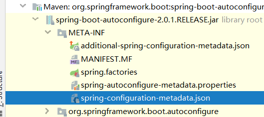
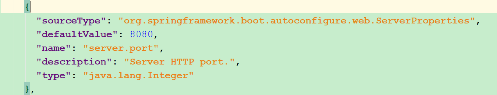

# SpringBoot原理分析

前面我们介绍了用Maven项目从零搭建SpringBoot（[SpringBoot入门](./_1SpringBoot入门.md)），相比于Spring项目的搭建，这种方式可以说非常简单了，但是官方提供了Spring Initializr功能，访问 https://start.spring.io/即可进入WEB页面，在WEB页面中可以让Spring Initializr帮我们构建SpringBoot项目，我们将构建好的文件解压后导入IDE工具即可，真正做到了零配置。IDEA工具集成了Spring Initializr功能，我们直接在IDEA中初始化项目即可。

新构建的项目目录结构如下：


- SpringbootstudyApplication.java：应用程序的启动引导类，也是主要的Spring配置类。
- application.properties：用于配置应用程序和SpringBoot的属性。
- SpringbootstudyApplicationTests.java：一个基本的集成测试类。
- pom.xml：项目对象模型（Project Object Model）

## 1. 起步依赖原理分析

通过Spring Initializr生成的项目的POM文件如下：

```xml
<?xml version="1.0" encoding="UTF-8"?>
<project>
    <modelVersion>4.0.0</modelVersion>
    <parent>
        <groupId>org.springframework.boot</groupId>
        <artifactId>spring-boot-starter-parent</artifactId>
        <version>2.0.1.RELEASE</version>
    </parent>
    <groupId>com.tjd.study.springboot</groupId>
    <artifactId>springbootstudy</artifactId>
    <version>0.0.1-SNAPSHOT</version>
    <name>springbootstudy</name>
    <description>Demo project for Spring Boot</description>

    <properties>
        <java.version>1.8</java.version>
    </properties>

    <dependencies>
        <dependency>
            <groupId>org.springframework.boot</groupId>
            <artifactId>spring-boot-starter-web</artifactId>
        </dependency>
        <dependency>
            <groupId>org.springframework.boot</groupId>
            <artifactId>spring-boot-starter-test</artifactId>
            <scope>test</scope>
        </dependency>
    </dependencies>

    <build>
        <plugins>
            <plugin>
                <groupId>org.springframework.boot</groupId>
                <artifactId>spring-boot-maven-plugin</artifactId>
            </plugin>
        </plugins>
    </build>

</project>

```

### 1.1 分析spring-boot-starter-parent

SpringBoot项目继承spring-boot-starter-parent项目，那么继承这个项目的目的到底是什么呢？按住Ctrl点击pom.xml中的spring-boot-starter-parent，跳转到了spring-boot-starter-parent的pom.xml，xml配置如下（只摘抄了部分重点配置）：

```xml
<parent>
  <groupId>org.springframework.boot</groupId>
  <artifactId>spring-boot-dependencies</artifactId>
  <version>2.0.1.RELEASE</version>
  <relativePath>../../spring-boot-dependencies</relativePath>
    
   <build>
        <resources>
            <resource>
                <filtering>true</filtering>
                <directory>${basedir}/src/main/resources</directory>
                <includes>
                    <include>**/application*.yml</include>
                    <include>**/application*.yaml</include>
                    <include>**/application*.properties</include>
                </includes>
            </resource>
            ...                                     
        </resources>
        ...
    </build>                          
</parent>
```

按住Ctrl点击pom.xml中的spring-boot-starter-dependencies，跳转到了spring-boot-starter-dependencies的pom.xml，xml配置如下（只摘抄了部分重点配置）：

```xml
<properties>
  	<activemq.version>5.15.3</activemq.version>
  	<antlr2.version>2.7.7</antlr2.version>
  	<appengine-sdk.version>1.9.63</appengine-sdk.version>
  	<artemis.version>2.4.0</artemis.version>
  	<aspectj.version>1.8.13</aspectj.version>
  	<assertj.version>3.9.1</assertj.version>
  	<atomikos.version>4.0.6</atomikos.version>
  	<bitronix.version>2.1.4</bitronix.version>
  	<build-helper-maven-plugin.version>3.0.0</build-helper-maven-plugin.version>
  	<byte-buddy.version>1.7.11</byte-buddy.version>
  	... ... ...
</properties>
<dependencyManagement>
  	<dependencies>
      	<dependency>
        	<groupId>org.springframework.boot</groupId>
        	<artifactId>spring-boot</artifactId>
        	<version>2.0.1.RELEASE</version>
      	</dependency>
      	<dependency>
        	<groupId>org.springframework.boot</groupId>
        	<artifactId>spring-boot-test</artifactId>
        	<version>2.0.1.RELEASE</version>
      	</dependency>
      	... ... ...
	</dependencies>
</dependencyManagement>
<build>
  	<pluginManagement>
    	<plugins>
      		<plugin>
        		<groupId>org.jetbrains.kotlin</groupId>
        		<artifactId>kotlin-maven-plugin</artifactId>
        		<version>${kotlin.version}</version>
      		</plugin>
      		<plugin>
        		<groupId>org.jooq</groupId>
        		<artifactId>jooq-codegen-maven</artifactId>
        		<version>${jooq.version}</version>
      		</plugin>
      		<plugin>
        		<groupId>org.springframework.boot</groupId>
        		<artifactId>spring-boot-maven-plugin</artifactId>
        		<version>2.0.1.RELEASE</version>
      		</plugin>
          	... ... ...
    	</plugins>
  	</pluginManagement>
</build>
```

从上面的spring-boot-starter-dependencies的pom.xml中我们可以发现，一部分坐标的版本、依赖管理、插件管理已经定义好，所以我们的**SpringBoot工程继承spring-boot-starter-parent后大部分依赖的版本以及插件行为已经锁定**。至此我们就不需要为项目的依赖版本和插件配置问题而担忧了。

### 1.2 分析spring-boot-starter-web

按住Ctrl点击pom.xml中的spring-boot-starter-web，跳转到了spring-boot-starter-web的pom.xml，xml配置如下（只摘抄了部分重点配置）：

```xml
<?xml version="1.0" encoding="UTF-8"?>
<project xsi:schemaLocation="http://maven.apache.org/POM/4.0.0 http://maven.apache.org/xsd/maven-4.0.0.xsd" xmlns="http://maven.apache.org/POM/4.0.0"
    xmlns:xsi="http://www.w3.org/2001/XMLSchema-instance">
  	<modelVersion>4.0.0</modelVersion>
  	<parent>
    	<groupId>org.springframework.boot</groupId>
    	<artifactId>spring-boot-starters</artifactId>
    	<version>2.0.1.RELEASE</version>
  	</parent>
  	<groupId>org.springframework.boot</groupId>
  	<artifactId>spring-boot-starter-web</artifactId>
  	<version>2.0.1.RELEASE</version>
  	<name>Spring Boot Web Starter</name>
  
  	<dependencies>
    	<dependency>
      		<groupId>org.springframework.boot</groupId>
      		<artifactId>spring-boot-starter</artifactId>
      		<version>2.0.1.RELEASE</version>
      		<scope>compile</scope>
    	</dependency>
    	<dependency>
      		<groupId>org.springframework.boot</groupId>
      		<artifactId>spring-boot-starter-json</artifactId>
      		<version>2.0.1.RELEASE</version>
      		<scope>compile</scope>
    	</dependency>
    	<dependency>
      		<groupId>org.springframework.boot</groupId>
      		<artifactId>spring-boot-starter-tomcat</artifactId>
      		<version>2.0.1.RELEASE</version>
      		<scope>compile</scope>
    	</dependency>
    	<dependency>
      		<groupId>org.hibernate.validator</groupId>
      		<artifactId>hibernate-validator</artifactId>
      		<version>6.0.9.Final</version>
      		<scope>compile</scope>
    	</dependency>
    	<dependency>
      		<groupId>org.springframework</groupId>
      		<artifactId>spring-web</artifactId>
      		<version>5.0.5.RELEASE</version>
      		<scope>compile</scope>
    	</dependency>
    	<dependency>
      		<groupId>org.springframework</groupId>
      		<artifactId>spring-webmvc</artifactId>
      		<version>5.0.5.RELEASE</version>
      		<scope>compile</scope>
    	</dependency>
  	</dependencies>
</project>

```

从上面的spring-boot-starter-web的pom.xml中我们可以发现，spring-boot-starter-web就是将web开发要使用的spring-web、spring-webmvc等坐标进行了“打包”，这样我们的工程只要引入spring-boot-starter-web起步依赖的坐标就可以进行web开发了，同样体现了依赖传递的作用。


## 2. 自动配置原理解析

按住Ctrl点击查看启动类MySpringBootApplication（上一篇文章的案例）上的注解@SpringBootApplication

```java
@SpringBootApplication
public class MySpringBootApplication {
    public static void main(String[] args) {
        SpringApplication.run(MySpringBootApplication.class);
    }
}
```

注解@SpringBootApplication的源码

```java
@Target(ElementType.TYPE)
@Retention(RetentionPolicy.RUNTIME)
@Documented
@Inherited
@SpringBootConfiguration
@EnableAutoConfiguration
@ComponentScan(excludeFilters = {
		@Filter(type = FilterType.CUSTOM, classes = TypeExcludeFilter.class),
		@Filter(type = FilterType.CUSTOM, classes = AutoConfigurationExcludeFilter.class) })
public @interface SpringBootApplication {

	/**
	 * Exclude specific auto-configuration classes such that they will never be applied.
	 * @return the classes to exclude
	 */
	@AliasFor(annotation = EnableAutoConfiguration.class)
	Class<?>[] exclude() default {};

	... ... ...

}
```

其中@SpringBootApplication将三个有用的注解组合在了一起：

- Spring的@Configuration：标明该类使用Spring基于Java的配置。虽然本书不会写太多配置，但我们会更倾向于使用基于Java而不是XML的配置。
- Spring的@ComponentScan：启用组件扫描，这样你写的Web控制器类和其他组件才能被自动发现并注册为Spring应用程序上下文里的Bean。由于ComponentScan中没有指定basepackageclass或basePackages属性，Spring则默认扫描标注类所在包及其子包，所以由`@SpringBootApplication`标注的`*Application`启动类通常放在项目顶层包中。
- Spring Boot 的 @EnableAutoConfiguration ：这个不起眼的小注解也可以称为@Abracadabra，就是这一行配置开启了Spring Boot自动配置的魔力，让你不用再写成篇的配置了。

按住Ctrl点击查看注解@EnableAutoConfiguration

```java
@Target(ElementType.TYPE)
@Retention(RetentionPolicy.RUNTIME)
@Documented
@Inherited
@AutoConfigurationPackage
@Import(AutoConfigurationImportSelector.class)
public @interface EnableAutoConfiguration {
	... ... ...
}

```

其中，@Import(AutoConfigurationImportSelector.class) 导入了AutoConfigurationImportSelector类

按住Ctrl点击查看AutoConfigurationImportSelector源码

```java
public String[] selectImports(AnnotationMetadata annotationMetadata) {
        ... ... ...
        //进入
        List<String> configurations = getCandidateConfigurations(annotationMetadata,
                                                                   attributes);
        configurations = removeDuplicates(configurations);
        Set<String> exclusions = getExclusions(annotationMetadata, attributes);
        checkExcludedClasses(configurations, exclusions);
        configurations.removeAll(exclusions);
        configurations = filter(configurations, autoConfigurationMetadata);
        fireAutoConfigurationImportEvents(configurations, exclusions);
        return StringUtils.toStringArray(configurations);
}


protected List<String> getCandidateConfigurations(AnnotationMetadata metadata,
			AnnotationAttributes attributes) {
		List<String> configurations = SpringFactoriesLoader.loadFactoryNames(
				getSpringFactoriesLoaderFactoryClass(), getBeanClassLoader());
		
		return configurations;
}


```

其中，SpringFactoriesLoader.loadFactoryNames 方法的作用就是从META-INF/spring.factories文件中读取指定类对应的类名称列表 


spring.factories 文件中有关自动配置的配置信息如下：

```
... ... ...

org.springframework.boot.autoconfigure.web.reactive.function.client.WebClientAutoConfiguration,\
org.springframework.boot.autoconfigure.web.servlet.DispatcherServletAutoConfiguration,\
org.springframework.boot.autoconfigure.web.servlet.ServletWebServerFactoryAutoConfiguration,\
org.springframework.boot.autoconfigure.web.servlet.error.ErrorMvcAutoConfiguration,\
org.springframework.boot.autoconfigure.web.servlet.HttpEncodingAutoConfiguration,\
org.springframework.boot.autoconfigure.web.servlet.MultipartAutoConfiguration,\

... ... ...

```

上面配置文件存在大量的以Configuration为结尾的类名称，这些类就是存有自动配置信息的类，而SpringApplication在获取这些类名后再加载

我们以ServletWebServerFactoryAutoConfiguration为例来分析源码：

```java
@Configuration
@AutoConfigureOrder(Ordered.HIGHEST_PRECEDENCE)
@ConditionalOnClass(ServletRequest.class)
@ConditionalOnWebApplication(type = Type.SERVLET)
@EnableConfigurationProperties(ServerProperties.class)//进入
@Import({ ServletWebServerFactoryAutoConfiguration.BeanPostProcessorsRegistrar.class,
		ServletWebServerFactoryConfiguration.EmbeddedTomcat.class,
		ServletWebServerFactoryConfiguration.EmbeddedJetty.class,
		ServletWebServerFactoryConfiguration.EmbeddedUndertow.class })
public class ServletWebServerFactoryAutoConfiguration {
	... ... ...
}


```

其中，

@EnableConfigurationProperties(ServerProperties.class) 代表加载ServerProperties服务器配置属性类

进入ServerProperties.class源码如下：

```java
@ConfigurationProperties(prefix = "server", ignoreUnknownFields = true)
public class ServerProperties {

	/**
	 * Server HTTP port.
	 */
	private Integer port;

	/**
	 * Network address to which the server should bind.
	 */
	private InetAddress address;
  
  	... ... ...
  
}
```

其中，

prefix = "server" 表示SpringBoot配置文件中的前缀，SpringBoot会将配置文件中以server开始的属性映射到该类的字段中。映射关系如下：


如果用户没有自定义配置，那么默认情况下加载的是`spring-configuration-metadata.json`文件中的内容：



