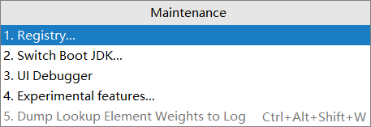
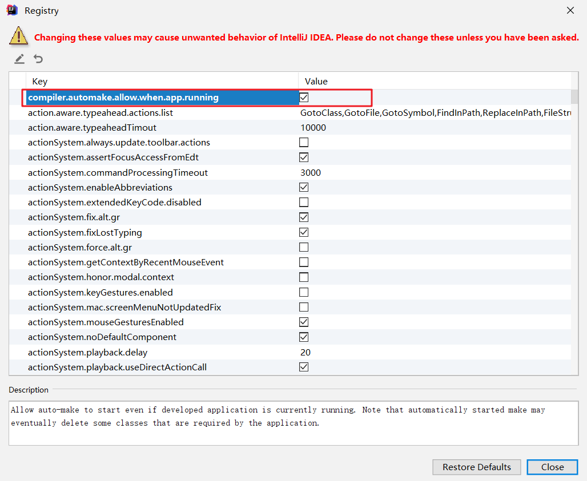

# SpringBoot热部署配置

### 第一步：在pom文件中引入spring-boot-devtools模块

```xml
<dependency>
    <groupId>org.springframework.boot</groupId>
    <artifactId>spring-boot-devtools</artifactId>
</dependency>
```


### 第二步：配置spring-boot-maven-plugin插件

```xml
<plugins>
    <plugin>
        <groupId>org.springframework.boot</groupId>
        <artifactId>spring-boot-maven-plugin</artifactId>
        <configuration>
            <!--如果没有该配置,devtools不会起作用-->
            <fork>true</fork>
        </configuration>
    </plugin>
</plugins>
```


配置完成后，我们修改源码或者配置文件项目会自动重启，但这种重启会比手动重启快很多。其深层原理是使用两个ClassLoader，一个ClassLoader加载那些不会改变的类（例如第三方jar包），另一个ClassLoader加载那些会改变的类，称为Restart ClassLoader。这样有代码更改的时候，原来Restart ClassLoader加载的类会被丢弃，而重新加载被更改的类，这样速度就会比手动重启更快。


## 可能出现的问题

有的小伙伴使用IDEA时配置热部署后仍然不能自动重启服务器，这可能是因为你的IDEA没有配置文件自动编译，如果不配置自动编译，在你按Ctrl+s时就不会重新编译源文件，项目则不会自动重启。

### 第一步：


如果不勾选该选项，我们也可以手动编译源文件（Ctrl+F9），如果只更改了一个项目，我们可以按Ctrl+Shift+F9，重新编译该类文件，即可触发重启服务。

### 第二步：按快捷键Ctrl+Shift+Alt+/，选择1.Registry...



### 第三步：勾选 compiler.automake.allow.when.app.running 即可

