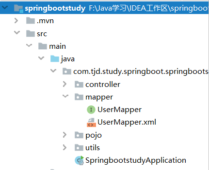

# SpringBoot和MyBatis整合

## 第一步：引入MyBatis起步依赖以及数据库驱动

```xml
<!--MyBatis启动依赖-->
<dependency>
    <groupId>org.mybatis.spring.boot</groupId>
    <artifactId>mybatis-spring-boot-starter</artifactId>
    <version>2.1.0</version>
</dependency>
<!--mysql数据库驱动-->
<dependency>
    <groupId>mysql</groupId>
    <artifactId>mysql-connector-java</artifactId>
</dependency>
```

## 第二步：配置基本数据源信息

```properties
# MyBatis
mybatis.mapper-locations=classpath:/com/tjd/study/springboot/springbootstudy/mapper/*.xml
mybatis.type-aliases-package=com.tjd.study.springboot.springbootstudy.pojo
#MySQL
spring.datasource.username=root
spring.datasource.password=980613
spring.datasource.url=jdbc:mysql://127.0.0.1:3306/test?useUnicode=true&characterEncoding=utf8

```

## 第三步：在启动类上增加@MapperScan扫描注解

```java
@SpringBootApplication
@MapperScan(basePackages = "com.tjd.study.springboot.springbootstudy.mapper")
public class SpringbootstudyApplication {
    public static void main(String[] args) {
        SpringApplication.run(SpringbootstudyApplication.class, args);
    }
}
```

## 第四步：新增Mapper接口及配置文件



```java
@Repository
public interface UserMapper {
    User getUserById(Long id);
}
```

```xml
<?xml version="1.0" encoding="utf-8" ?>
<!DOCTYPE mapper PUBLIC "-//mybatis.org//DTD Mapper 3.0//EN" "http://mybatis.org/dtd/mybatis-3-mapper.dtd" >
<mapper namespace="com.tjd.study.springboot.springbootstudy.mapper.UserMapper">
    <select id="getUserById" resultType="com.tjd.study.springboot.springbootstudy.pojo.User">
        select * from user where id=#{id}
    </select>
</mapper>
```

注：我们在启动内上面配置了@MapperScan注解，如果Mapper接口和映射配置文件在同一个路径中，我们就不需要在application.properties中配置`mybatis.mapper-locations`属性。