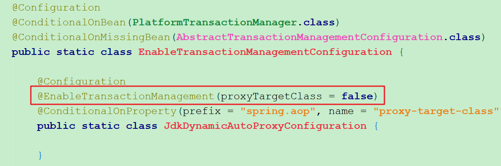

# SpringBoot事务配置

实际上在SpringBoot项目中不需要进行多与的事务配置，只需要在需要加事务的类或方法上加上@Transactional注解。但是有些资料说需要在启动类上加入@EnableTransactionManagement，才能通过@Transactional进行事务配置，其实这是错误说法。

实际上在`spring-boot-autoconfigure-2.0.1.RELEASE.jar`中的META-INF中的spring.factories，指明了会加载`org.springframework.boot.autoconfigure.transaction.TransactionAutoConfiguration`自动配置类，而在这个类中已经配置了@EnableTransactionManagement注解：

