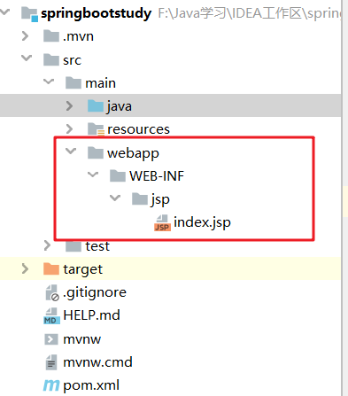

# SpringBoot整合JSP

一般来说springboot不建议直接使用jsp页面，但不排除有些公司的项目依然使用jsp做前端界面。

springboot内置的tomcat并没有集成对jsp的支持，也没有对EL表达式的支持，因此要使用jsp应该先把相关的依赖集成进来。

## 第一步：引入JSP依赖

```xml
<!--JavaServer Pages Standard Tag Library，JSP标准标签库-->
<dependency>
    <groupId>javax.servlet</groupId>
    <artifactId>jstl</artifactId>
</dependency>

<!--内置tocat对Jsp支持的依赖，用于编译Jsp-->
<dependency>
    <groupId>org.apache.tomcat.embed</groupId>
    <artifactId>tomcat-embed-jasper</artifactId>
</dependency>
```

## 第二步：创建jsp目录



## 第三步：配置视图解析器

在application.properties中配置如下属性：

```properties
spring.mvc.view.prefix=/WEB-INF/jsp/
spring.mvc.view.suffix=.jsp
```

