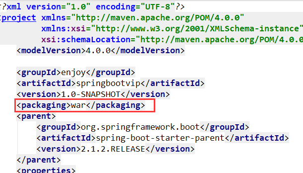

# SpringBoot项目的WAR部署方式

如果并不希望使用内置的tomcat，希望部署到其他tomcat服务器，那么就需要使用war包部署了。

## 第一步：修改pom文件，打包方式改成war



## 第二步：修改在pom文件，剔除内置tomcat的支持，否则会和外面的tomcat冲突

```xml
 <dependency>
    <groupId>org.springframework.boot</groupId>
    <artifactId>spring-boot-starter-tomcat</artifactId>
    <!--打包的时候可以不用包进去，别的设施会提供。事实上该依赖理论上可以参与编译，测试，运行等周期。
        相当于compile，但是打包阶段做了exclude操作-->
    <scope>provided</scope>
</dependency>

```


## 第三步：修改启动类

修改启动类，使其继承org.springframework.boot.web.servlet.support.SpringBootServletInitializer，并重写configure方法：

```java
@SpringBootApplication
@MapperScan("cn.enjoy.dao")
public class App  extends SpringBootServletInitializer  {

    public static void main(String[] args) throws Exception {
        SpringApplication.run(App.class, args);
    }

    @Override
    protected SpringApplicationBuilder configure(SpringApplicationBuilder builder) {
        return builder.sources(App.class);
    }

}
```


## 第四步：执行打包命令

```shell
$ mvn clean package
```

