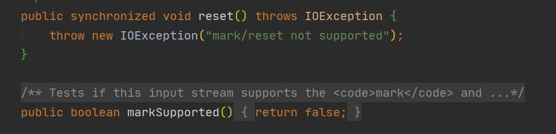
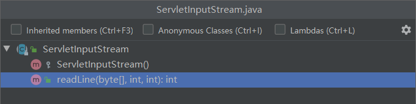
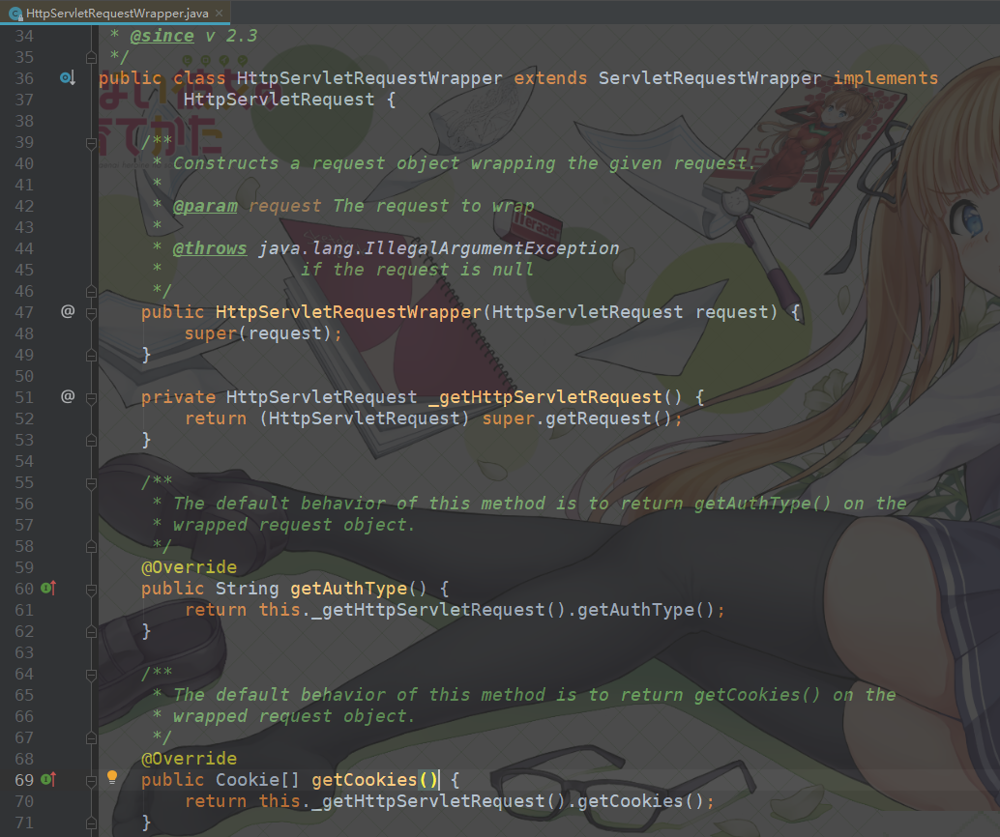

# 解决ServletInputStream输入流只能使用一次的问题

最近内部系统需要将请求记录接入ELK日志平台，方便消费这些数据从而更好的进行风险控制。而常用的传参方式有`Query`、`Form Data`、`Json Body`三种方式，`Query`、`Form Data`可以直接通过`request.getParam`API获取到请求参数，而`Json Body`只能通过`getInputStream`获取到输入流再获取具体内容。

但问题在于request的输入流只能读取一次不能重复读取，所以我们在过滤器或拦截器里读取了request的输入流之后，请求走到controller层时就会报错。

## 一. HttpServletRequest的输入流只能读取一次的原因

我们先来看看为什么HttpServletRequest的输入流只能读一次，当我们调用`getInputStream()`方法获取输入流时得到的是一个`InputStream`对象，而实际类型是`ServletInputStream`，它继承于`InputStream`。

`InputStream`的`read()`方法内部有一个`postion`，标志当前流被读取到的位置，每读取一次，该标志就会移动一次，如果读到最后，`read()`会返回-1，表示已经读取完了。如果想要重新读取则需要调用`reset()`方法，position就会移动到上次调用mark的位置，mark默认是0，所以就能从头再读了。调用`reset()`方法的前提是已经重写了`reset()`方法，当然能否reset也是有条件的，它取决于`markSupported()`方法是否返回true。

`InputStream`默认不实现`reset()`，并且`markSupported()`默认也是返回false，这一点查看其源码便知：



我们再来看看`ServletInputStream`，可以看到该类没有重写`mark()`，`reset()`以及`markSupported()`方法：



综上，`InputStream`默认不实现reset的相关方法，而`ServletInputStream`也没有重写reset的相关方法，这样就无法重复读取流，这就是我们从request对象中获取的输入流就只能读取一次的原因。

## 二. 使用`HttpServletRequestWrapper` + `Filter`解决输入流不能重复读取问题

既然`ServletInputStream`不支持重新读写，那么为什么不把流读出来后用容器存储起来，后面就可以多次利用了。那么问题就来了，要如何存储这个流呢？

所幸`JavaEE`提供了一个 `HttpServletRequestWrapper`类，从类名也可以知道它是一个HTTP请求包装器，其基于装饰者模式实现了`HttpServletRequest`界面，部分源码如下：



从上图中的部分源码可以看到，该类并没有真正去实现`HttpServletRequest`的方法，而只是在方法内又去调用`HttpServletRequest`的方法，所以我们可以通过继承该类并实现想要重新定义的方法以达到包装原生`HttpServletRequest`对象的目的。

首先我们要定义一个容器，将输入流里面的数据存储到这个容器里，这个容器可以是数组或集合。然后我们重写`getInputStream`方法，每次都从这个容器里读数据，这样我们的输入流就可以读取任意次了。

```java
import org.apache.commons.io.IOUtils;

import javax.servlet.ReadListener;
import javax.servlet.ServletInputStream;
import javax.servlet.ServletRequest;
import javax.servlet.http.HttpServletRequest;
import javax.servlet.http.HttpServletRequestWrapper;
import java.io.*;
import java.nio.charset.StandardCharsets;

public class RequestWrapper extends HttpServletRequestWrapper {
    private byte[] body;

    public RequestWrapper(HttpServletRequest request) throws IOException {
        super(request);
        copyBodyBytes(request);
    }

    public String copyBodyBytes(){
        return new String(body, StandardCharsets.UTF_8);
    }

    /**
     * 复制请求Body
     *
     * @param request
     * @return
     */
    private void copyBodyBytes(final ServletRequest request) {
        try (InputStream inputStream = cloneInputStream(request.getInputStream())) {
            body = IOUtils.toByteArray(inputStream);
        } catch (IOException e) {
            e.printStackTrace();
        }
    }

    /**
     * Description: 复制输入流</br>
     *
     * @param inputStream
     * @return</br>
     */
    public InputStream cloneInputStream(ServletInputStream inputStream) {
        InputStream byteArrayInputStream = null;
        try {
            byteArrayInputStream = IOUtils.toBufferedInputStream(inputStream);
        } catch (IOException e) {
            e.printStackTrace();
        }
        return byteArrayInputStream;
    }

    @Override
    public BufferedReader getReader() throws IOException {
        return new BufferedReader(new InputStreamReader(getInputStream()));
    }

    @Override
    public ServletInputStream getInputStream() throws IOException {

        final ByteArrayInputStream bais = new ByteArrayInputStream(body);

        return new ServletInputStream() {

            @Override
            public int read() throws IOException {
                return bais.read();
            }

            @Override
            public boolean isFinished() {
                return false;
            }

            @Override
            public boolean isReady() {
                return false;
            }

            @Override
            public void setReadListener(ReadListener readListener) {

            }
        };
    }
}
```

除了要写一个包装器外，我们还需要在过滤器里将原生的`HttpServletRequest`对象替换成我们的`RequestWrapper`对象，代码如下：

```java
import javax.servlet.*;
import javax.servlet.http.HttpServletRequest;
import java.io.IOException;

public class RequestBodyFilter implements Filter {

    private static final String JSON_TYPE = "application/json";

    @Override
    public void init(FilterConfig filterConfig) throws ServletException {
    }

    public void doFilter(ServletRequest request, ServletResponse response, FilterChain chain) throws IOException, ServletException {
        ServletRequest requestWrapper = null;
       
        if (request instanceof HttpServletRequest) {
            String contentType = ((HttpServletRequest) request).getHeader("Content-Type");
            //只有在contentType为application/json时才进行包装，因为使用x-www-form-urlencoded传参，拦截器中可以直接通过request.getParameter获取参数，如果对`x-www-form-urlencoded`类型的请求也进行包装就会出现`request.getParameter`获取不到参数的情况，这也导致form表单传参失效
            if (contentType != null && contentType.contains(JSON_TYPE)) {
                requestWrapper = new RequestWrapper((HttpServletRequest) request);
            }
        }
        if (requestWrapper == null) {
            chain.doFilter(request, response);
        } else {
            chain.doFilter(requestWrapper, response);
        }
    }

    @Override
    public void destroy() {
    }
}
```

在`web.xml`中配置Filter：

```xml
<filter>
	<filter-name>request-body-filter</filter-name>
	<filter-class>cn.bigcoder.RequestBodyFilter</filter-class>
</filter>
<filter-mapping>
	<filter-name>request-body-filter</filter-name>
	<url-pattern>/*</url-pattern>
</filter-mapping>
```

## 三. 编写LogInterceptor记录日志

这样我们就可以在拦截器中愉快的获取body数据了：

```java
import org.springframework.beans.factory.annotation.Autowired;
import org.springframework.web.servlet.HandlerInterceptor;
import org.springframework.web.servlet.ModelAndView;

import javax.servlet.http.HttpServletRequest;
import javax.servlet.http.HttpServletResponse;
import java.io.IOException;
import java.io.InputStream;
import java.net.URLDecoder;
import java.util.Date;
import java.util.List;
import java.util.Map;

import com.google.common.base.Joiner;
import com.google.common.collect.Lists;
import org.apache.commons.io.IOUtils;

public class LogInterceptor implements HandlerInterceptor {

    private static final String JSON_TYPE = "application/json";
    private static final String UTF_8 = "UTF-8";

    @Override
    public void afterCompletion(HttpServletRequest arg0, HttpServletResponse arg1, Object arg2, Exception arg3) {
    }

    @Override
    public void postHandle(HttpServletRequest arg0, HttpServletResponse arg1, Object arg2, ModelAndView arg3) {
    }

    @Override
    public boolean preHandle(HttpServletRequest request, HttpServletResponse response, Object handler) throws Exception {
        request.setCharacterEncoding(UTF_8);
        // 请求url
        String uri = request.getRequestURI(); 
        // query传参和form表单传参
        String params = buildRequestParams(request);
        String contentType = request.getHeader("Content-Type");
        String body = null;
        if (contentType != null && (contentType.contains(JSON_TYPE))) {
            // 在这里获取了，controller层就获取不到了
            // 需要在servlet filter 中做处理
            try (InputStream is = request.getInputStream()) {
                body = IOUtils.toString(is, UTF_8);
            } catch (IOException e) {
                e.printStackTrace();
            }
        }
		// 记录日志.......
        
        return false;
    }

    private String buildRequestParams(HttpServletRequest request) {
        Map<String, String[]> params = request.getParameterMap();
        List<String> paramsList = Lists.newArrayList();
        for (String key : params.keySet()) {
            String[] values = params.get(key);
            for (String value : values) {
                paramsList.add(key + "=" + value);
            }
        }
        return Joiner.on("&").join(paramsList);
    }
}

```

