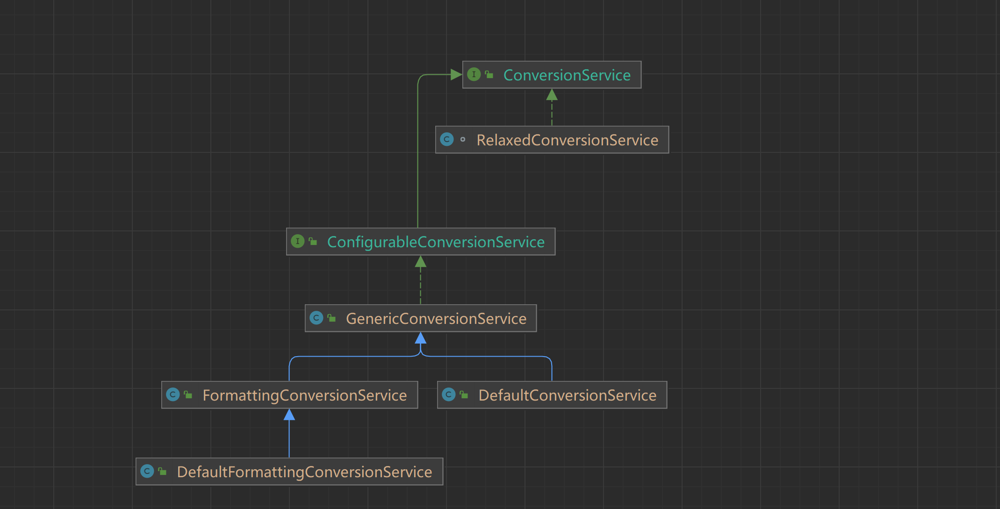

# SpringMVC中类型转换器Converter＜S,T＞详解

ConversionService是Spring类型转换体系的核心接口，可以利用conversionServiceFactoryBean在Spring工厂容器中定义一个conversionService。

Spring将自动识别出ConversionService，并在bean属性配置及SpringMVC处理方法入参绑定等场合使用它进行数据转换。



**SpringMVC上下文中内建了很多转换器，可以完成大多数Java类型的转换工作。**

## 一. 常见转换器接口

Spring定义了三种类型的转换器接口，实现任意一个接口都可以作为自定义转换器注册到ConversionServiceFactoryBean中。需要特别注意的是，这里的Convert接口与HttpMessageConverter接口截然不同，后者是用于从HTTP请求和响应转换为HTTP请求和响应的策略接口。

### 1.1 `Convert<S,T>`

将S类型对象转换为T类型对象，该接口的实现是线程安全的、可以共享的。

```java
@FunctionalInterface
public interface Converter<S, T> {
	//返回T对象
    @Nullable
    T convert(S var1);
}
```

**默认内置了如下转换器**

```java
ObjectToStringConverter (org.springframework.core.convert.support)
LocalDateTimeToLocalTimeConverter in JodaTimeConverters (org.springframework.format.datetime.joda)
StringToCharsetConverter (org.springframework.core.convert.support)
StringToPropertiesConverter (org.springframework.core.convert.support)
ConversionServiceConverter in ConvertingComparator (org.springframework.core.convert.converter)
CalendarToLocalDateTimeConverter in DateTimeConverters (org.springframework.format.datetime.standard)
OffsetDateTimeToLocalTimeConverter in DateTimeConverters (org.springframework.format.datetime.standard)
StringToCharacterConverter (org.springframework.core.convert.support)
ZonedDateTimeToLocalDateTimeConverter in DateTimeConverters (org.springframework.format.datetime.standard)
ZonedDateTimeToInstantConverter in DateTimeConverters (org.springframework.format.datetime.standard)
LongToDateConverter in DateFormatterRegistrar (org.springframework.format.datetime)
NumberToNumber in NumberToNumberConverterFactory (org.springframework.core.convert.support)
ZonedDateTimeToLocalDateConverter in DateTimeConverters (org.springframework.format.datetime.standard)
DateToLongConverter in DateFormatterRegistrar (org.springframework.format.datetime)
StringToTimeZoneConverter (org.springframework.core.convert.support)
DateTimeToLocalDateConverter in JodaTimeConverters (org.springframework.format.datetime.joda)
ZoneIdToTimeZoneConverter (org.springframework.core.convert.support)
OffsetDateTimeToInstantConverter in DateTimeConverters (org.springframework.format.datetime.standard)
LocalDateTimeToLocalDateConverter in DateTimeConverters (org.springframework.format.datetime.standard)
StringToBooleanConverter (org.springframework.core.convert.support)
InstantToLongConverter in DateTimeConverters (org.springframework.format.datetime.standard)
CalendarToLocalDateConverter in DateTimeConverters (org.springframework.format.datetime.standard)
PropertiesToStringConverter (org.springframework.core.convert.support)
DateTimeToDateMidnightConverter in JodaTimeConverters (org.springframework.format.datetime.joda)
OffsetDateTimeToLocalDateTimeConverter in DateTimeConverters (org.springframework.format.datetime.standard)
CalendarToReadableInstantConverter in JodaTimeConverters (org.springframework.format.datetime.joda)
EnumToStringConverter (org.springframework.core.convert.support)
NumberToCharacterConverter (org.springframework.core.convert.support)
IntegerToEnum in IntegerToEnumConverterFactory (org.springframework.core.convert.support)
LocalDateTimeToLocalDateConverter in JodaTimeConverters (org.springframework.format.datetime.joda)
StringToUUIDConverter (org.springframework.core.convert.support)
DateTimeToInstantConverter in JodaTimeConverters (org.springframework.format.datetime.joda)
LongToReadableInstantConverter in JodaTimeConverters (org.springframework.format.datetime.joda)
ZonedDateTimeToLocalTimeConverter in DateTimeConverters (org.springframework.format.datetime.standard)
OffsetDateTimeToLocalDateConverter in DateTimeConverters (org.springframework.format.datetime.standard)
StringToCurrencyConverter (org.springframework.core.convert.support)
CalendarToInstantConverter in DateTimeConverters (org.springframework.format.datetime.standard)
StringToLocaleConverter (org.springframework.core.convert.support)
DateTimeToMutableDateTimeConverter in JodaTimeConverters (org.springframework.format.datetime.joda)
DateTimeToDateConverter in JodaTimeConverters (org.springframework.format.datetime.joda)
ZonedDateTimeToOffsetDateTimeConverter in DateTimeConverters (org.springframework.format.datetime.standard)
StringToNumber in StringToNumberConverterFactory (org.springframework.core.convert.support)
DeserializingConverter (org.springframework.core.serializer.support)
LongToCalendarConverter in DateFormatterRegistrar (org.springframework.format.datetime)
DateToCalendarConverter in DateFormatterRegistrar (org.springframework.format.datetime)
DateTimeToLongConverter in JodaTimeConverters (org.springframework.format.datetime.joda)
DateTimeToLocalTimeConverter in JodaTimeConverters (org.springframework.format.datetime.joda)
LongToInstantConverter in DateTimeConverters (org.springframework.format.datetime.standard)
CharacterToNumber in CharacterToNumberFactory (org.springframework.core.convert.support)
CalendarToLongConverter in DateFormatterRegistrar (org.springframework.format.datetime)
EnumToIntegerConverter (org.springframework.core.convert.support)
ZonedDateTimeToCalendarConverter (org.springframework.core.convert.support)
OffsetDateTimeToZonedDateTimeConverter in DateTimeConverters (org.springframework.format.datetime.standard)
CalendarToLocalTimeConverter in DateTimeConverters (org.springframework.format.datetime.standard)
CalendarToOffsetDateTimeConverter in DateTimeConverters (org.springframework.format.datetime.standard)
StringToEnum in StringToEnumConverterFactory (org.springframework.core.convert.support)
SerializingConverter (org.springframework.core.serializer.support)
DateTimeToLocalDateTimeConverter in JodaTimeConverters (org.springframework.format.datetime.joda)
DateTimeToCalendarConverter in JodaTimeConverters (org.springframework.format.datetime.joda)
CalendarToDateConverter in DateFormatterRegistrar (org.springframework.format.datetime)
DateToReadableInstantConverter in JodaTimeConverters (org.springframework.format.datetime.joda)
CalendarToZonedDateTimeConverter in DateTimeConverters (org.springframework.format.datetime.standard)
LocalDateTimeToLocalTimeConverter in DateTimeConverters (org.springframework.format.datetime.standard)
```

### 1.2 **ConverterFactory**

将相同系列多个`"同质" Converter`封装在一起。如果希望将一种类型的对象转换为另一种类型及其子类的对象（例如将String转换为`Number及Number的子类（Integer、Long、Double等`）对象）。

```java
public interface ConverterFactory<S, R> {
	 //获取转换器，该转换器可以将S转换为目标T类型(T  extends R)
	<T extends R> Converter<S, T> getConverter(Class<T> targetType);
}
```

**其是典型的工厂模式，子类具体工厂(都是final不可继承)负责生产对应的Convert：**

- CharacterToNumberFactory：static final class CharacterToNumber，Character–Number；
- StringToEnumConverterFactory ：static class StringToEnum，String–Enum；
- IntegerToEnumConverterFactory：static class IntegerToEnum，Integer–Enum；
- NumberToNumberConverterFactory：static final class NumberToNumber，Number–Number；
- StringToNumberConverterFactory：static final class StringToNumber，String–Number；

### 1.3 **GenericConverter**

用于在两个或多个类型之间转换的通用转换器接口。这是最灵活的转换器SPI接口，也是最复杂的。

它的灵活性在于，GenericConverter 可能支持在多个源/目标类型对之间进行转换。此外，GenericConverter 实现在类型转换过程中可以访问源/目标。这允许解析可用于影响转换逻辑的源和目标字段元数据，如注解和泛型信息。

当更简单的 Converter或ConverterFactory接口足够时，通常不应使用此接口。

会根据源类对象及目标类对象所在的宿主类中的上下文信息进行类型转换。
```java
public interface GenericConverter {

	 //返回此转换器可以转换的源类型和目标类型。每一个实体都是一个可以转换的 source-to-target类型对
	@Nullable
	Set<ConvertiblePair> getConvertibleTypes();

	 //将源对象转换为TypeDescriptor 描述的类型，返回转换后的对象
	@Nullable
	Object convert(@Nullable Object source, TypeDescriptor sourceType, TypeDescriptor targetType);


	/**
	 * Holder for a source-to-target class pair.
	 */
	final class ConvertiblePair {

		private final Class<?> sourceType;

		private final Class<?> targetType;
	//...
	}
}

```

## 二. 自定义转换器实现参数类型转换

### 2.1 应用场景

有些时候，接口前端传入枚举值ID，后端接收的时候使用枚举类接收：

```java
@RequestMapping("/hello")
public String hello(BusinessType type){
    return "hello";
}
```

枚举类定义如下：

```java
public interface IEnum<T extends Serializable> {
    T getValue();
}

public enum BusinessType implements IEnum<Integer> {
    CREATE(1, "创建"),
    UPDATE(2, "更新"),
    QUERY(3, "查询")
    ;
    private Integer value;
    private String desc;
    
    public Integer getValue() {
        return value;
    }
}
```

请求 `http://localhost:8080/hello?type=1` 期望将type参数自动转为 BusinessType.CREATE 枚举。

### 2.2 自定义Convert

```java
public class IEnumConverterFactory implements ConverterFactory<String, IEnum> {
    private static final Map<Class, Converter> CONVERTERS = Maps.newHashMap();

    @Override
    public <T extends IEnum> Converter<String, T> getConverter(Class<T> aClass) {
        Converter converter = CONVERTERS.get(aClass);
        if (converter == null) {
            converter = new StringValueToEnumConverter<>(aClass);
            CONVERTERS.put(aClass, converter);
        }
        return converter;
    }

    static class StringValueToEnumConverter<T extends IEnum> implements Converter<String, T> {
        private Map<String, T> enumMap = Maps.newHashMap();
        private Class<T> enumType;

        StringValueToEnumConverter(Class<T> enumType) {
            this.enumType = enumType;
            T[] enums = enumType.getEnumConstants();
            for (T e : enums) {
                enumMap.put(e.getValue().toString(), e);
                enumMap.put(((Enum) e).name(), e);
            }
        }

        @Override
        public T convert(String s) {
            T t = enumMap.get(s);
            if (t == null) {
                throw new RuntimeException("参数" + s + "无法转换成指定枚举值" + enumMap.keySet());
            }
            return t;
        }
    }
}
```

然后注册到Spring中：

```java
@Configuration
@EnableWebMvc
public class WebConfig implements WebMvcConfigurer {

    @Override
    public void addFormatters(FormatterRegistry registry) {
   		 registry.addConverterFactory(new IEnumConverterFactory());
        // ...
    }
}
```


> [Spring类型转换机制 - Xianuii - 博客园 (cnblogs.com)](https://www.cnblogs.com/Xianhuii/p/15805593.html)
>
> [SpringMVC中类型转换器Converter＜S,T＞详解_converter_流烟默的博客-CSDN博客](https://blog.csdn.net/J080624/article/details/60979996)

