# SpringMVC获取请求参数

## 方式一：接收默认支持的参数类型

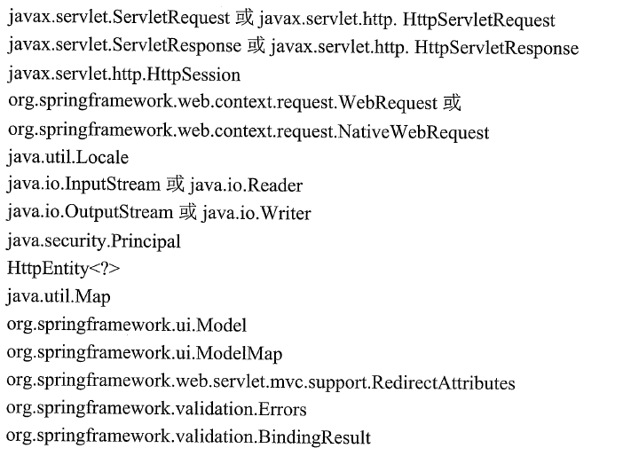

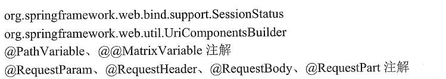

### 1. HttpServletRequest

### 2. HttpServletResponse

### 3. HttpSession

### 4. Model

除了ModelAndView以外，还可以使用Model来向页面传递数据，Model是一个接口，在参数里直接声明model即可。如果使用Model则可以不使用ModelAndView对象，Model对象可以向页面传递数据，View对象则可以使用String返回值替代。不管是Model还是ModelAndView，其本质都是使用Request对象向jsp传递数据。

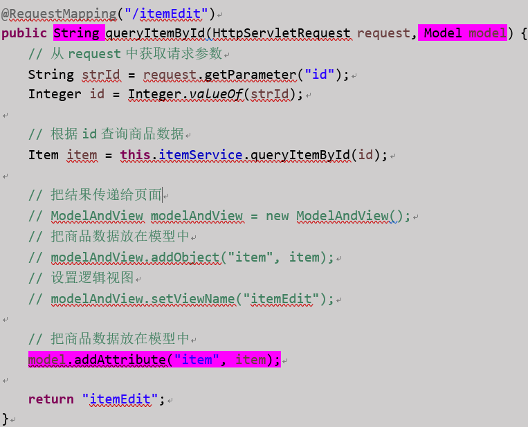

### 5. ModelMap

ModelMap是Model接口的实现类，也可以通过ModelMap向页面传递数据。使用Model和ModelMap的效果一样，如果直接使用Model，springmvc会实例化ModelMap。

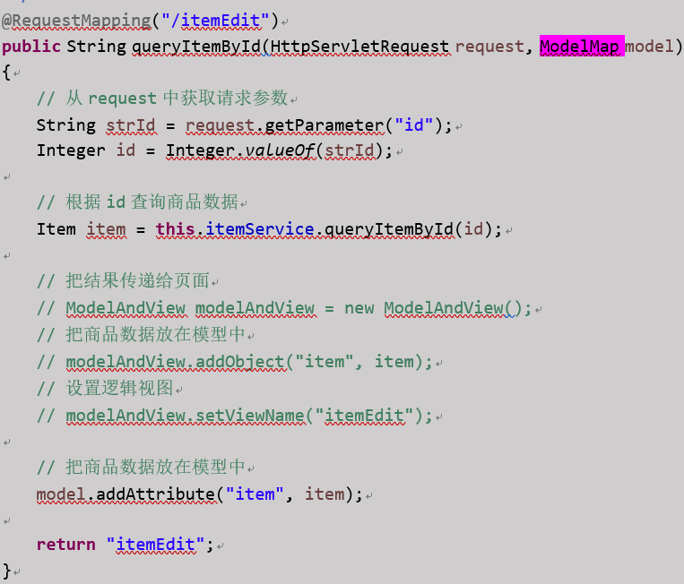


## 方式二：接收简单类型参数

1. Integer int  Integer[]  int[]
2. Float  float  Float[] float[]
3. Double  double  Double[] double[]
4. Boolean  boolean（对于布尔类型的参数，请求的参数值为true或false。或者1或0）
5. String  String[]

### 扩展一：SpringMVC只能接收简单类型。如果接收其他类型的参数会报错

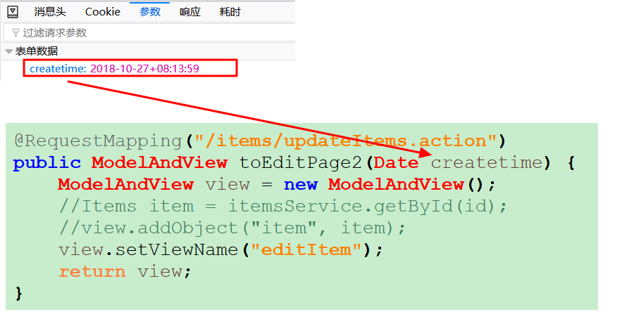

由于接收的是Date类型，框架会直接报错，并且根本不会进入URL对应的方法中。

### 扩展二：@RequestParam注解

@RequestParam常用于处理简单类型的绑定，该注解有如下属性：

- value属性：用于指定请求参数的名称。如value=“itemId”表示请求的参数区中的名字为itemId的参数的值将传入该注解所对应参数中。
- required属性：表示该属性是否必须，默认是true，表示请求中一定要有相应的参数，否则将报错（前端页面显示：TTP Status 400 - Required Integer parameter 'XXXX' is not present）。
- defaultValue：默认值，指定如果请求中没有同名参数时的默认值。


## 方式三：通过封装类型接收参数

当参数很多时通过上一中方法就不太方便，此时可以采用JavaBean接收参数；JavaBean中的属性值一定要与前端表单元素的name属性值一 一对应。

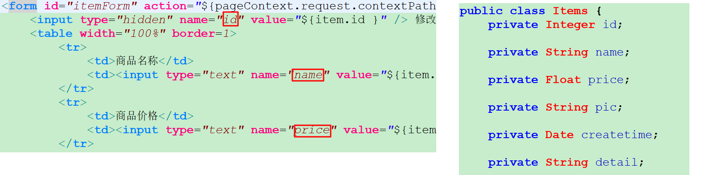

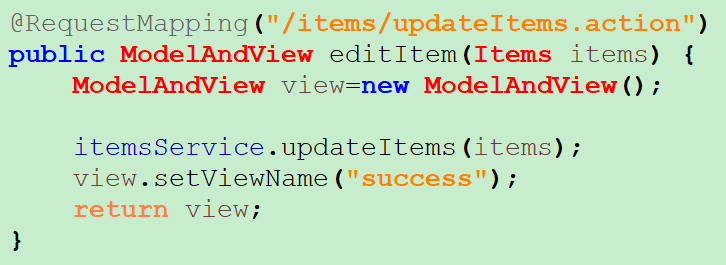

### 扩展

1. 封装类型中的属性也一定要是基本类型，例如：Items类中的createtime属性是Date类型，我们前端传入的参数一定不能包含createtime，不然会报错。

2. 如果封装类型中仍然包含封装类型，我们想用里面的对象接收参数，则在前端页面的name属性写成对象导航的形式即可

   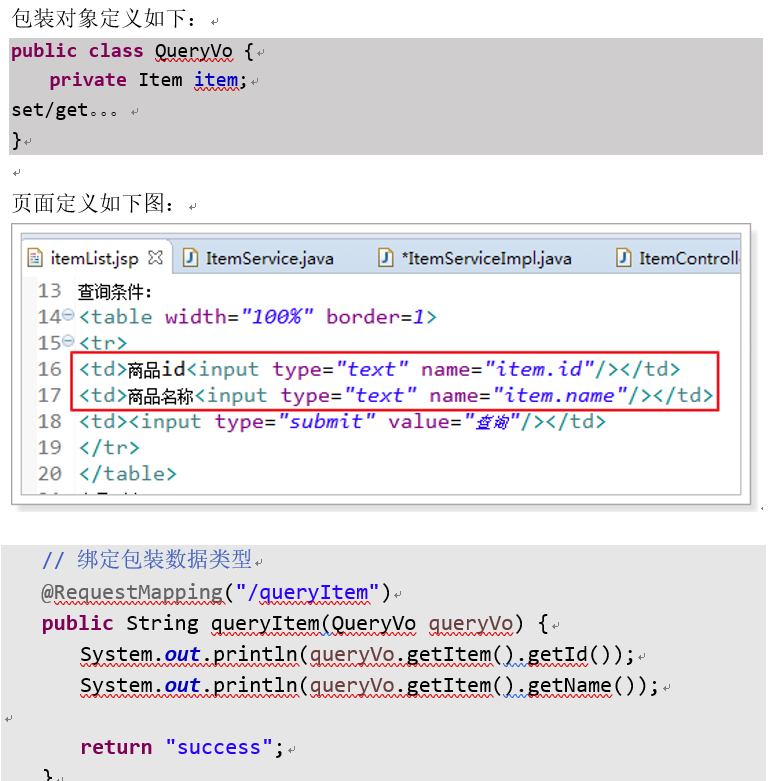


## 方式四：自定义参数类型转换

由于日期数据有很多种格式，springmvc没办法把字符串转换成日期类型。所以需要自定义参数绑定。

自定义参数类型转换原理：前端控制器接收到请求后，找到注解形式的处理器适配器，对RequestMapping标记的方法进行适配，并对方法中的形参进行参数绑定。可以在springmvc处理器适配器上自定义转换器Converter进行参数绑定。一般使用<mvc:annotation-driven/>注解驱动加载处理器适配器，可以在此标签上进行配置。配置转换器后，会将转换后的类型绑定到参数上面。

### 第一步：自定义转换器

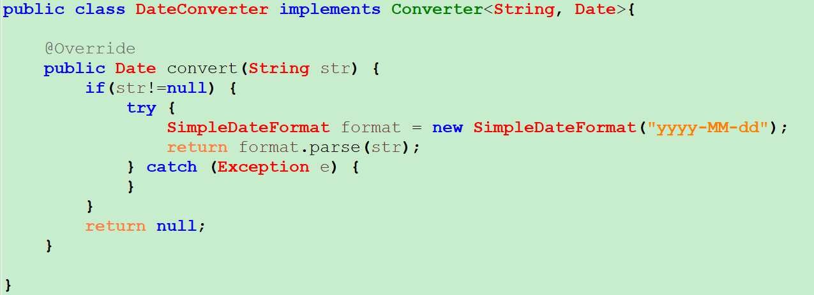

需要实现转换Converter接口（spring-core包中的）

### 第二步：配置converter（转换器）

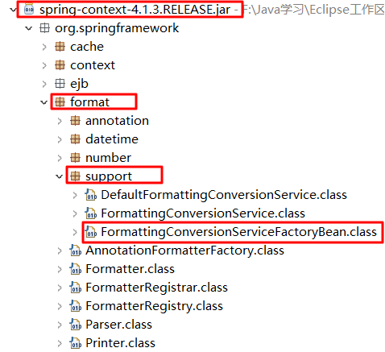

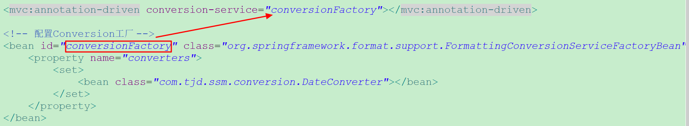

如果我们在框架搭建时，没有配置mvc注解驱动，而是通过手动配置处理器映射器与处理器适配器，那么我们应该采用此种方式配置转换器:

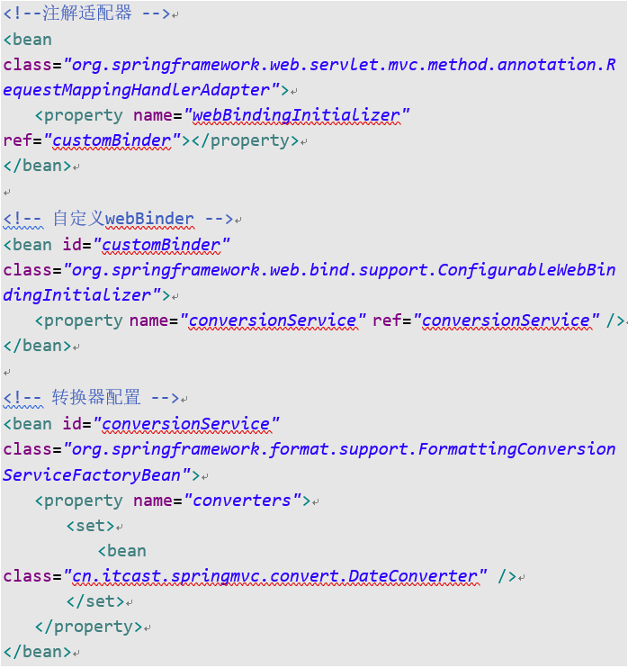


## 方式五：List集合封装多个对象，一次接收多批数据

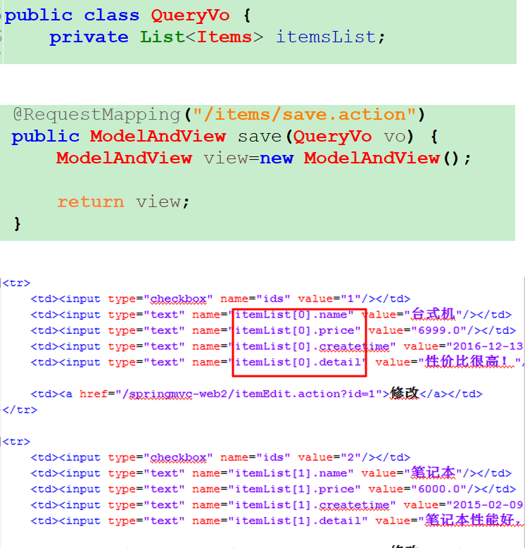

如果封装类中是domain对象数组，同样可以接收对象的数组形式（效果和上面一样）:

```java
public class QueryVo{
	private Items[] itemsList;
}
```

**`List<Items>`和 Items[] 只能先由一个类封装，然后由封装类接收参数，如果试图将它们直接放在方法上面接收参数则会报错。如果是基本类型的数组，直接放在方法参数上面是可以的**。基本类型的List不能作为方法参数。基本类型的数组以及基本类型List可以放在封装类型中。


## 方式六：从URL上获取参数

通常我们通过get提交请求参数时都是URL路径后加问号，然后连接参数列表。但这样做显得URL路径不够简洁，别人一看就知道问号后面的是请求参数，我们可以通过下列这种方式，将请求参数包含在URL路径当中。

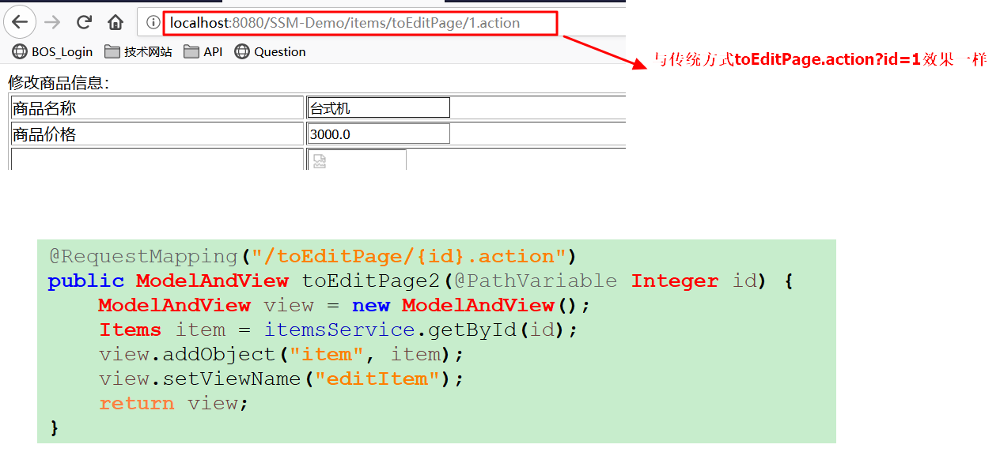

如果@PathVariable注解所对应的参数名，与URL路径中的大括号中写的名不相同，则需要通过@PathVariable("xxx")指定。


## 方式七：从Body中获取复杂对象

### 复杂对象数组：

```json
[
    {
        "colData": "a",
        "colDisplay": "a",
        "colName": "a",
        "colPref": "a"
    },
	{
        "colData": "a",
        "colDisplay": "a",
        "colName": "a",
        "colPref": "a"
    },
    {
        "colData": "a",
        "colDisplay": "a",
        "colName": "a",
        "colPref": "a"
    }
]
```

向这种复杂对象的数组可以由Body传输后接收：

```java
public Dto<Object> saveConditions(@RequestBody List<QueryCondition> conditions) {}
```

```java
public class QueryCondition {
    private String colName;
    private String colDisplay;
    private String colData;
    private String colPref;
    //省略Getter/Setter
}
```

如果单独创建一个对象不方便的话，用`List<Map>`接收也可以：

```java
public Dto<Object> saveConditions(@RequestBody List<Map<String,String>> conditions) {}
```

### 包含数组的复杂对象：

```json
{
    "id": "aaa",
    "conditions": [
        {
            "colData": "a",
            "colDisplay": "a",
            "colName": "a",
            "colPref": "a"
        },
        {
            "colData": "a",
            "colDisplay": "a",
            "colName": "a",
            "colPref": "a"
        },
        {
            "colData": "a",
            "colDisplay": "a",
            "colName": "a",
            "colPref": "a"
        }
    ]
}
```

类似于上面的结构，采用下面这种方式接收是**不行**的：

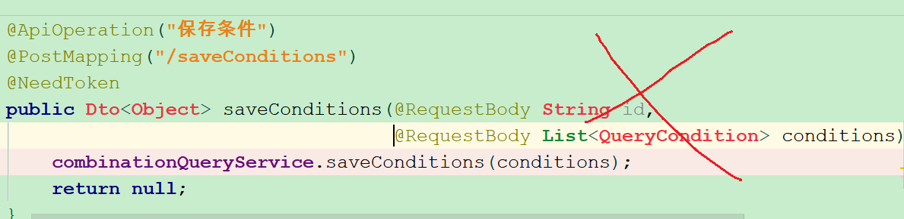

可以采用Map接收：

```java
public Dto<Object> saveConditions(@RequestBody Map<String,Object> obj) {}
```

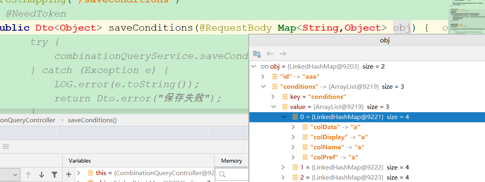

也可以采用封装类接收：

```java
public Dto<Object> saveConditions(@RequestBody QueryVo obj) {}
```

```java
public class QueryVo {
    private String id;
    private List<QueryCondition> conditions;
	//省略Getter/Setter
}
public class QueryCondition {
    private String colName;
    private String colDisplay;
    private String colData;
    private String colPref;
    //省略Getter/Setter
}
```

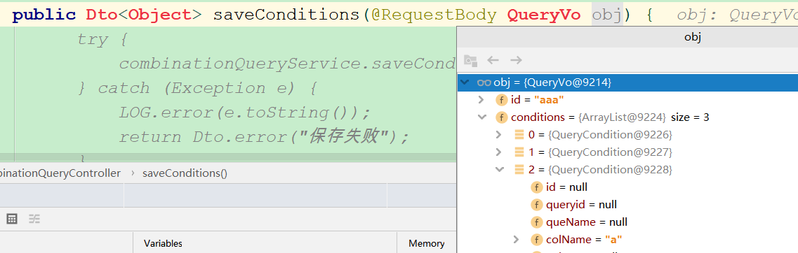


## 总结

方式二和方式三可以混合使用，如果封装类型中的属性和局部变量的名称相同，则两个都会同时接收参数。


方法的参数只能接收基本类型及其封装类型，以及基本类型和封装类型的数组（注意：是基本类型的数组）。如果想接收List（包括泛型为基本类型，和domain封装类）或者用户封装类（domain）的数组，必须由封装类封装`List<Domain>` 或 Domain[]，然后通过对象导航的方式插入数据。

