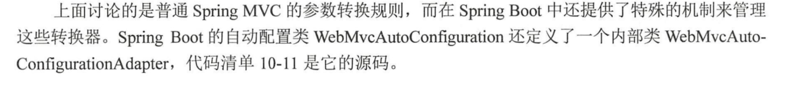
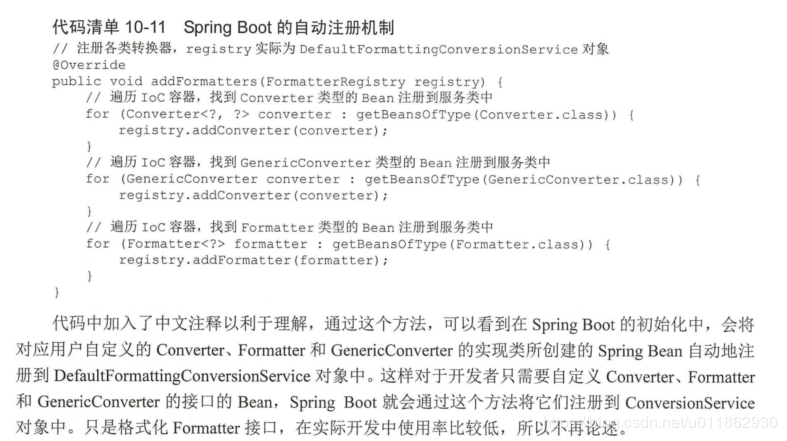

# SpringMVC中Date类型转换

在SpringBoot中Date类型转换很简单，只需要添加下面这个类:

```java
import org.springframework.core.convert.converter.Converter;
import org.springframework.stereotype.Component;

import java.text.DateFormat;
import java.text.SimpleDateFormat;
import java.util.ArrayList;
import java.util.Date;
import java.util.List;

/**
 * 全局handler前日期统一处理
 * @author zhanghang
 * @date 2018/1/11
 */
@Component
public class DateConverterConfig implements Converter<String, Date> {

    private static final List<String> formarts = new ArrayList<>(4);
    static{
        formarts.add("yyyy-MM");
        formarts.add("yyyy-MM-dd");
        formarts.add("yyyy-MM-dd hh:mm");
        formarts.add("yyyy-MM-dd hh:mm:ss");
    }

    @Override
    public Date convert(String source) {
        String value = source.trim();
        if ("".equals(value)) {
            return null;
        }
        if(source.matches("^\\d{4}-\\d{1,2}$")){
            return parseDate(source, formarts.get(0));
        }else if(source.matches("^\\d{4}-\\d{1,2}-\\d{1,2}$")){
            return parseDate(source, formarts.get(1));
        }else if(source.matches("^\\d{4}-\\d{1,2}-\\d{1,2} {1}\\d{1,2}:\\d{1,2}$")){
            return parseDate(source, formarts.get(2));
        }else if(source.matches("^\\d{4}-\\d{1,2}-\\d{1,2} {1}\\d{1,2}:\\d{1,2}:\\d{1,2}$")){
            return parseDate(source, formarts.get(3));
        }else {
            throw new IllegalArgumentException("Invalid boolean value '" + source + "'");
        }
    }

    /**
     * 格式化日期
     * @param dateStr String 字符型日期
     * @param format String 格式
     * @return Date 日期
     */
    public  Date parseDate(String dateStr, String format) {
        Date date=null;
        try {
            DateFormat dateFormat = new SimpleDateFormat(format);
            date = dateFormat.parse(dateStr);
        } catch (Exception e) {

        }
        return date;
    }

}
```


## 实现原理





 SpringBoot会把所有实现了convert，GenericConvert, Formatter接口类的类，自动注册到转换工厂


**参考文章**：https://blog.csdn.net/u011862930/article/details/88804620