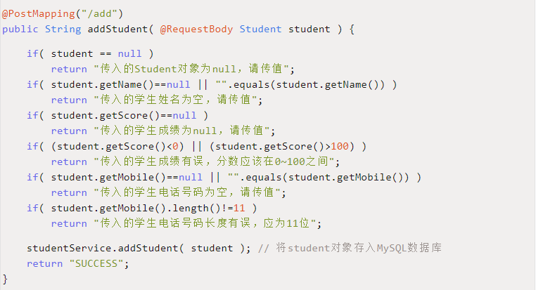
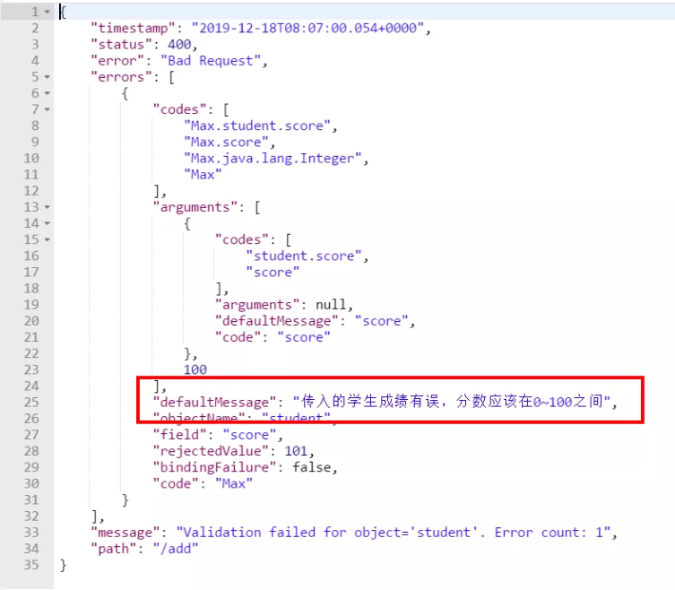
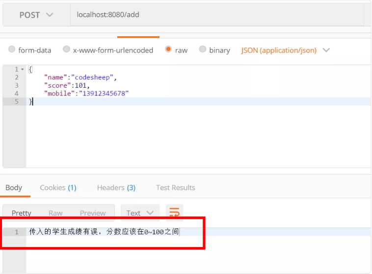

# 优雅的进行封装实体的参数校验

假如你现在在做一个成绩录入系统，你愉快地用**Spring Boot框架**写了一个后台接口，用于接收前台浏览器传过来的 `Student`对象，并插入后台数据库。

我们将传入的 `Student`对象定义为：

```java
public class Student {
    private String name;    // 姓名`
    private Integer score;  // 考试分数（满分100分）`
    private String mobile;  // 电话号码（11位）`
}
```

然后写一个**Post请求**的后台接口，来接收网页端传过来的 `Student`对象：

```java
@RestController
public class TestController {

    @Autowired
    private StudentService studentService;

    @PostMapping("/add")
    public String addStudent( @RequestBody Student student ) {
        studentService.addStudent( student ); // 将student对象存入数据库
        return "SUCCESS";
    }
}
```

此时我想你一定看出来了上面这段**代码的漏洞**，因为我们并没有对传入的 `Student`对象做任何**数据校验**，比如：

`Student`对象里三个字段的某一个忘传了，为 `null`怎么办？`Student`的 `score`分数，假如写错了，写成 `101`分怎么办？`Student`的 `mobile`11位手机号码，假如填错了，多写了一位怎么办？...等等

这些数据虽然在前端页面一般会做校验，但我们作为一个**严谨且良心**的后端开发工程师，我们肯定要对传入的每一项数据做**严格的校验**，所以我们应该怎么写？



写是写完了，就是感觉**手有点酸**，并且**心有点累**，这个 `Student`对象倒还好，毕竟内部仅3个字段，假如一个复杂的对象有30个字段怎么办？简直不敢想象！

## 优雅的解决方式

其实Spring框架很早版本开始，就通过**注解的方式**，来方便地为我们提供了各项交互**数据的校验**工作，比如上面的例子，我们只需要在传入的 `Student`实体类的字段中加入对应注解即可方便的解决问题：

```java
import javax.validation.constraints.NotBlank;
import javax.validation.constraints.NotNull;
import org.hibernate.validator.constraints.Length;

public class Student {
    @NotNull(message = "传入的姓名为null，请传值")
    @NotEmpty(message = "传入的姓名为空字符串，请传值")
    private String name;    // 姓名
    
    @NotNull(message = "传入的分数为null，请传值"
    @Min(value = 0,message = "传入的学生成绩有误，分数应该在0~100之间"
    @Max(value = 100,message = "传入的学生成绩有误，分数应该在0~100之间")`
    private Integer score;  // 分数
    
    @NotNull(message = "传入的电话为null，请传值")
    @NotEmpty(message = "传入的电话为空字符串，请传值")
    @Length(min = 11, max = 11, message = "传入的电话号码长度有误，必须为11位")
    private String mobile;  // 电话号
 }
```

当然，于此同时，我们还需要在对象入口处，加上注解 `@Valid`来开启对传入 `Student`对象的验证工作：

````java
import javax.validation.Valid;

@PostMapping("/add")
public String addStudent( @RequestBody  @Valid Student student ) {
    // 棒棒哒！原先各种繁杂的参数校验工作统统都省了！一行代码不用写
    studentService.addStudent( student ); // 将student对象存入MySQL数据库
    return "SUCCESS";`
}
```

这时候，如果某个字段传入错误，比如我传数据的时候，将学生的成绩误传为 `101`分，则接口返回结果便会提示出错误详情：



当然，关于这个事情的原理，既然用到了注解，无非用的也就是Java里的各种反射等知识来实现的，感兴趣的小伙伴可以借此机会研究一下！

###  **数据异常统一拦截** 

上面利用注解的方式做统一数据校验**感觉十分美好**，但唯一美中不足的就是返回的**结果太过繁杂**，不一定使我们需要的格式，我们需要做**统一处理**，比如：我只想将具体参数校验的错误提示信息给**抠出来**返回给前端即可。

为此，我们为项目配置**全局统一异常拦截器**来格式化所有数据校验的返回结果。

```java
@ControllerAdvice
@ResponseBody
public class GlobalExceptionInterceptor {
  	@ExceptionHandler(value = Exception.class)
  	public String exceptionHandler(HttpServletRequest request, Exception e) {
  	  	String failMsg = null;
  	  	if (e instanceof MethodArgumentNotValidException) {
  	  	  // 拿到参数校验具体异常信息提示
  	  	  failMsg = ((MethodArgumentNotValidException) e).getBindingResult().getFieldError().getDefaultMessage();`
  	  	}
  	  	return failMsg; // 直接吐回给前端
  	}
}
```

如上面代码所示，我们**全局统一拦截了**参数校验异常 `MethodArgumentNotValidException`，并仅仅只拿到对应异常的详细 `Message`信息吐给前端，此时返回给前端的数据就清楚得多：



转载至：<https://mp.weixin.qq.com/s?__biz=MzU4ODI1MjA3NQ==&mid=2247484955&idx=1&sn=29b0f228415abd8542d07c898e6398ba&chksm=fdded0dfcaa959c9d9fc9d04130409c392460561bdce53996261fe8973b81f4811a8ebe5c357&mpshare=1&scene=23&srcid=0105v2xiNT2WPbYdaft6oLSp&sharer_sharetime=1578226347394&sharer_shareid=e81601a95b901aeca142bbe3b957819a#rd>