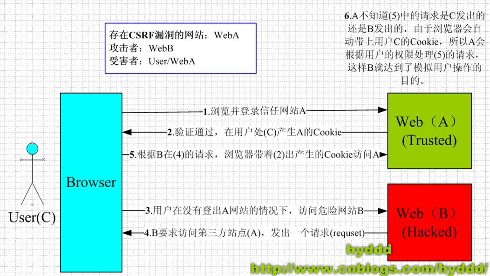
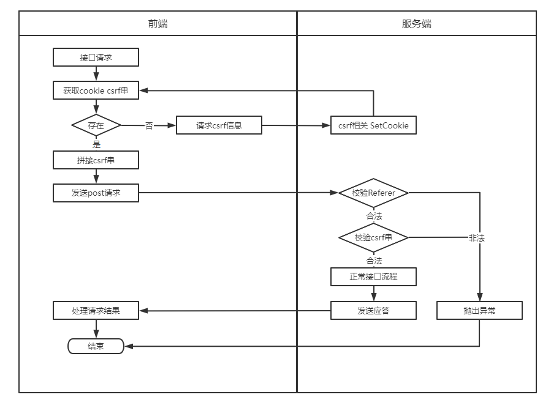

# CSRF攻击

> 本文转载至：[浅谈CSRF攻击方式 - hyddd - 博客园 (cnblogs.com)](https://www.cnblogs.com/hyddd/archive/2009/04/09/1432744.html)
>
> [CSRF攻击与防御（写得非常好）_认知 行动 坚持-CSDN博客_csrf](https://blog.csdn.net/stpeace/article/details/53512283)

## 一. CSRF是什么

CSRF（Cross-site request forgery），中文名称：跨站请求伪造，也被称为：one click attack/session riding，缩写为：CSRF/XSRF。

## 二. CSRF可以做什么？

你这可以这么理解CSRF攻击：攻击者盗用了你的身份，以你的名义发送恶意请求。CSRF能够做的事情包括：以你名义发送邮件，发消息，盗取你的账号，甚至于购买商品，虚拟货币转账......造成的问题包括：个人隐私泄露以及财产安全。

## 三. CSRF漏洞现状

CSRF这种攻击方式在2000年已经被国外的安全人员提出，但在国内，直到06年才开始被关注，08年，国内外的多个大型社区和交互网站分别爆出CSRF漏洞，如：NYTimes.com（纽约时报）、Metafilter（一个大型的BLOG网站），YouTube和百度HI......而现在，互联网上的许多站点仍对此毫无防备，以至于安全业界称CSRF为“沉睡的巨人”。

## 四. CSRF的原理

　　下图简单阐述了CSRF攻击的思想：



从上图可以看出，要完成一次CSRF攻击，受害者必须依次完成两个步骤：

1. 登录受信任网站A，并在本地生成Cookie。

2. 在不登出A的情况下，访问危险网站B。

看到这里，你也许会说：“如果我不满足以上两个条件中的一个，我就不会受到CSRF的攻击”。是的，确实如此，但你不能保证以下情况不会发生：

1. 你不能保证你登录了一个网站后，不再打开一个tab页面并访问另外的网站。

2. 你不能保证你关闭浏览器了后，你本地的Cookie立刻过期，你上次的会话已经结束。（事实上，关闭浏览器不能结束一个会话，但大多数人都会错误的认为关闭浏览器就等于退出登录/结束会话了......）

3. 上图中所谓的攻击网站，可能是一个存在其他漏洞的可信任的经常被人访问的网站。

## 五. 简单示例

### 5.1 示例1

银行网站A，它以GET请求来完成银行转账的操作，如：http://www.mybank.com/Transfer.php?toBankId=11&money=1000

危险网站B，它里面有一段HTML的代码如下：

```html

```

首先，你登录了银行网站A，然后访问危险网站B，噢，这时你会发现你的银行账户少了1000块......

为什么会这样呢？原因是银行网站A违反了HTTP规范，使用GET请求更新资源。在访问危险网站B的之前，你已经登录了银行网站A，而B中的以GET的方式请求第三方资源（这里的第三方就是指银行网站了，原本这是一个合法的请求，但这里被不法分子利用了），所以你的浏览器会带上你的银行网站A的Cookie发出Get请求，去获取资源“http://www.mybank.com/Transfer.php?toBankId=11&money=1000”，结果银行网站服务器收到请求后，认为这是一个更新资源操作（转账操作），所以就立刻进行转账操作......

### 5.2 示例2

为了杜绝上面的问题，银行决定改用POST请求完成转账操作。

银行网站A的WEB表单如下：

```html
<form action="Transfer.php" method="POST">
　　<p>ToBankId: <input type="text" name="toBankId" /></p>
　　<p>Money: <input type="text" name="money" /></p>
　　<p><input type="submit" value="Transfer" /></p>
</form>
```

后台处理页面Transfer.php如下：

```php
<?php
　　session_start();
　　if (isset($_REQUEST['toBankId'] &&　isset($_REQUEST['money']))
　　{
　　    buy_stocks($_REQUEST['toBankId'],　$_REQUEST['money']);
　　}
?>
```

危险网站B，仍然只是包含那句HTML代码：

```html

```

和示例1中的操作一样，你首先登录了银行网站A，然后访问危险网站B，结果.....和示例1一样，你再次没了1000块～T_T，这次事故的原因是：银行后台使用了`$_REQUEST`去获取请求的数据，而`$_REQUEST`既可以获取GET请求的数据，也可以获取POST请求的数据，这就造成了在后台处理程序无法区分这到底是GET请求的数据还是POST请求的数据。在PHP中，可以使用`$_GET`和`$_POST`分别获取GET请求和POST请求的数据。在JAVA中，用于获取请求数据request一样存在不能区分GET请求数据和POST数据的问题。

### 5.3 示例3

经过前面2个惨痛的教训，银行决定把获取请求数据的方法也改了，改用$_POST，只获取POST请求的数据，后台处理页面Transfer.php代码如下：

```php
<?php
　　session_start();
　　if (isset($_POST['toBankId'] &&　isset($_POST['money']))
　　{
　　    buy_stocks($_POST['toBankId'],　$_POST['money']);
　　}
?>
```

然而，危险网站B与时俱进，它改了一下代码：

```html
<html>
　　<head>
　　　　<script type="text/javascript">
　　　　　　function steal()
　　　　　　{
          　　　　 iframe = document.frames["steal"];
　　     　　      iframe.document.Submit("transfer");
　　　　　　}
　　　　</script>
　　</head>

　　<body onload="steal()">
　　　　<iframe name="steal" display="none">
　　　　　　<form method="POST" name="transfer"　action="http://www.myBank.com/Transfer.php">
　　　　　　　　<input type="hidden" name="toBankId" value="11">
　　　　　　　　<input type="hidden" name="money" value="1000">
　　　　　　</form>
　　　　</iframe>
　　</body>
</html>
```

如果用户仍是继续上面的操作，很不幸，结果将会是再次不见1000块......因为这里危险网站B暗地里发送了POST请求到银行!

总结一下上面3个例子，CSRF主要的攻击模式基本上是以上的3种，其中以第1,2种最为严重，因为触发条件很简单，一个就可以了，而第3种比较麻烦，需要使用JavaScript，所以使用的机会会比前面的少很多，但无论是哪种情况，只要触发了CSRF攻击，后果都有可能很严重。

理解上面的3种攻击模式，其实可以看出，**CSRF攻击是源于WEB的隐式身份验证机制！WEB的身份验证机制虽然可以保证一个请求是来自于某个用户的浏览器，但却无法保证该请求是用户批准发送的**！

## 六. CSRF真实案例

相比XSS，CSRF的名气似乎并不是那么大，很多人都认为CSRF“不那么有破坏性”。真的是这样吗？

接下来有请小明出场~~

这一天，小明同学百无聊赖地刷着Gmail邮件。大部分都是没营养的通知、验证码、聊天记录之类。但有一封邮件引起了小明的注意：

> 甩卖比特币，一个只要998！！

聪明的小明当然知道这种肯定是骗子，但还是抱着好奇的态度点了进去（请勿模仿）。果然，这只是一个什么都没有的空白页面，小明失望的关闭了页面。一切似乎什么都没有发生……

在这平静的外表之下，黑客的攻击已然得手。小明的Gmail中，被偷偷设置了一个过滤规则，这个规则使得所有的邮件都会被自动转发到hacker@hackermail.com。小明还在继续刷着邮件，殊不知他的邮件正在一封封地，如脱缰的野马一般地，持续不断地向着黑客的邮箱转发而去。

不久之后的一天，小明发现自己的域名已经被转让了。懵懂的小明以为是域名到期自己忘了续费，直到有一天，对方开出了 $650 的赎回价码，小明才开始觉得不太对劲。

小明仔细查了下域名的转让，对方是拥有自己的验证码的，而域名的验证码只存在于自己的邮箱里面。小明回想起那天奇怪的链接，打开后重新查看了“空白页”的源码：

```html
<form method="POST" action="https://mail.google.com/mail/h/ewt1jmuj4ddv/?v=prf" enctype="multipart/form-data"> 
    <input type="hidden" name="cf2_emc" value="true"/> 
    <input type="hidden" name="cf2_email" value="hacker@hakermail.com"/> 
    .....
    <input type="hidden" name="irf" value="on"/> 
    <input type="hidden" name="nvp_bu_cftb" value="Create Filter"/> 
</form> 
<script> 
    document.forms[0].submit();
</script>
```

> 这个页面只要打开，就会向Gmail发送一个post请求。请求中，执行了“Create Filter”命令，将所有的邮件，转发到“hacker@hackermail.com”。
>
> 小明由于刚刚就登陆了Gmail，所以这个请求发送时，携带着小明的登录凭证（Cookie），Gmail的后台接收到请求，验证了确实有小明的登录凭证，于是成功给小明配置了过滤器。
>
> 黑客可以查看小明的所有邮件，包括邮件里的域名验证码等隐私信息。拿到验证码之后，黑客就可以要求域名服务商把域名重置给自己。

小明很快打开Gmail，找到了那条过滤器，将其删除。然而，已经泄露的邮件，已经被转让的域名，再也无法挽回了……

以上就是小明的悲惨遭遇。而“点开一个黑客的链接，所有邮件都被窃取”这种事情并不是杜撰的，此事件原型是2007年Gmail的CSRF漏洞：

[https://www.davidairey.com/google-Gmail-security-hijack/](https://www.davidairey.com/google-gmail-security-hijack/)

当然，目前此漏洞已被Gmail修复，请使用Gmail的同学不要慌张。

## 六. CSRF的防御

### 6.1 验证 HTTP Referer 字段

根据 HTTP 协议，在 HTTP 头中有一个字段叫 Referer，它记录了该 HTTP 请求的来源地址。在通常情况下，访问一个安全受限页面的请求来自于同一个网站，比如需要访问 http://bank.example/withdraw?account=bob&amount=1000000&for=Mallory，用户必须先登陆 bank.example，然后通过点击页面上的按钮来触发转账事件。这时，该转帐请求的 Referer 值就会是转账按钮所在的页面的 URL，通常是以 bank.example 域名开头的地址。而如果黑客要对银行网站实施 CSRF 攻击，他只能在他自己的网站构造请求，当用户通过黑客的网站发送请求到银行时，该请求的 Referer 是指向黑客自己的网站。因此，要防御 CSRF 攻击，银行网站只需要对于每一个转账请求验证其 Referer 值，如果是以 bank.example 开头的域名，则说明该请求是来自银行网站自己的请求，是合法的。如果 Referer 是其他网站的话，则有可能是黑客的 CSRF 攻击，拒绝该请求。

这种方法的显而易见的好处就是简单易行，网站的普通开发人员不需要操心 CSRF 的漏洞，只需要在最后给所有安全敏感的请求统一增加一个拦截器来检查 Referer 的值就可以。特别是对于当前现有的系统，不需要改变当前系统的任何已有代码和逻辑，没有风险，非常便捷。

然而，这种方法并非万无一失。Referer 的值是由浏览器提供的，虽然 HTTP 协议上有明确的要求，但是每个浏览器对于 Referer 的具体实现可能有差别，并不能保证浏览器自身没有安全漏洞。使用验证 Referer 值的方法，就是把安全性都依赖于第三方（即浏览器）来保障，从理论上来讲，这样并不安全。事实上，对于某些浏览器，比如 IE6 或 FF2，目前已经有一些方法可以篡改 Referer 值。如果 bank.example 网站支持 IE6 浏览器，黑客完全可以把用户浏览器的 Referer 值设为以 bank.example 域名开头的地址，这样就可以通过验证，从而进行 CSRF 攻击。

即便是使用最新的浏览器，黑客无法篡改 Referer 值，这种方法仍然有问题。因为 Referer 值会记录下用户的访问来源，有些用户认为这样会侵犯到他们自己的隐私权，特别是有些组织担心 Referer 值会把组织内网中的某些信息泄露到外网中。因此，用户自己可以设置浏览器使其在发送请求时不再提供 Referer。当他们正常访问银行网站时，网站会因为请求没有 Referer 值而认为是 CSRF 攻击，拒绝合法用户的访问。

### 6.2 在请求地址中添加 token 并验证

 CSRF 攻击之所以能够成功，是因为黑客可以完全伪造用户的请求，该请求中所有的用户验证信息都是存在于 cookie 中，因此黑客可以在不知道这些验证信息的情况下直接利用用户自己的 cookie 来通过安全验证。要抵御 CSRF，关键在于在请求中放入黑客所不能伪造的信息，并且该信息不存在于 cookie 之中。可以在 HTTP 请求中以参数的形式加入一个随机产生的 token，并在服务器端建立一个拦截器来验证这个 token，如果请求中没有 token 或者 token 内容不正确，则认为可能是 CSRF 攻击而拒绝该请求。

这种方法要比检查 Referer 要安全一些，token 可以在用户登陆后产生并放于 session 之中，然后在每次请求时把 token 从 session 中拿出，与请求中的 token 进行比对，但这种方法的难点在于如何把 token 以参数的形式加入请求。对于 GET 请求，token 将附在请求地址之后，这样 URL 就变成 http://url?csrftoken=tokenvalue。 而对于 POST 请求来说，要在 form 的最后加上` <input type="hidden" name="csrftoken" value="tokenvalue"/>`，这样就把 token 以参数的形式加入请求了。但是，在一个网站中，可以接受请求的地方非常多，要对于每一个请求都加上 token 是很麻烦的，并且很容易漏掉，通常使用的方法就是在每次页面加载时，使用 javascript 遍历整个 dom 树，对于 dom 中所有的 a 和 form 标签后加入 token。这样可以解决大部分的请求，但是对于在页面加载之后动态生成的 html 代码，这种方法就没有作用，还需要程序员在编码时手动添加 token。

该方法还有一个缺点是难以保证 token 本身的安全。特别是在一些论坛之类支持用户自己发表内容的网站，黑客可以在上面发布自己个人网站的地址。由于系统也会在这个地址后面加上 token，黑客可以在自己的网站上得到这个 token，并马上就可以发动 CSRF 攻击。为了避免这一点，系统可以在添加 token 的时候增加一个判断，如果这个链接是链到自己本站的，就在后面添加 token，如果是通向外网则不加。不过，即使这个 csrftoken 不以参数的形式附加在请求之中，黑客的网站也同样可以通过 Referer 来得到这个 token 值以发动 CSRF 攻击。这也是一些用户喜欢手动关闭浏览器 Referer 功能的原因。


#### 分布式校验

在大型网站中，使用Session存储CSRF Token会带来很大的压力。访问单台服务器session是同一个。但是现在的大型网站中，我们的服务器通常不止一台，可能是几十台甚至几百台之多，甚至多个机房都可能在不同的省份，用户发起的HTTP请求通常要经过像Ngnix之类的负载均衡器之后，再路由到具体的服务器上，由于Session默认存储在单机服务器内存中，因此在分布式环境下同一个用户发送的多次HTTP请求可能会先后落到不同的服务器上，导致后面发起的HTTP请求无法拿到之前的HTTP请求存储在服务器中的Session数据，从而使得Session机制在分布式环境下失效，因此在分布式集群中CSRF Token需要存储在Redis之类的公共存储空间。

由于使用Session存储，读取和验证CSRF Token会引起比较大的复杂度和性能问题，目前很多网站采用Encrypted Token Pattern方式。这种方法的Token是一个计算出来的结果，而非随机生成的字符串。这样在校验时无需再去读取存储的Token，只用再次计算一次即可。

这种Token的值通常是使用UserID、时间戳和随机数，通过加密的方法生成。这样既可以保证分布式服务的Token一致，又能保证Token不容易被破解。

在token解密成功之后，服务器可以访问解析值，Token中包含的UserID和时间戳将会被拿来被验证有效性，将UserID与当前登录的UserID进行比较，并将时间戳与当前时间进行比较。

### 6.3 双重Cookie校验

在会话中存储CSRF Token比较繁琐，而且不能在通用的拦截上统一处理所有的接口。

那么另一种防御措施是使用双重提交Cookie。利用CSRF攻击不能获取到用户Cookie的特点，我们可以要求Ajax和表单请求携带一个Cookie中的值。

双重Cookie采用以下流程：

- 在用户访问网站页面时，向请求域名注入一个Cookie，内容为随机字符串（例如`csrfcookie=v8g9e4ksfhw`）。
- 在前端向后端发起请求时，取出Cookie，并添加到URL的参数中（接上例`POST https://www.a.com/comment?csrfcookie=v8g9e4ksfhw`）。
- 后端接口验证Cookie中的字段与URL参数中的字段是否一致，不一致则拒绝。

此方法相对于CSRF Token就简单了许多。可以直接通过前后端拦截的的方法自动化实现。后端校验也更加方便，只需进行请求中字段的对比，而不需要再进行查询和存储Token。

当然，此方法并没有大规模应用，其在大型网站上的安全性还是没有CSRF Token高，原因我们举例进行说明。

由于任何跨域都会导致前端无法获取Cookie中的字段（包括子域名之间），于是发生了如下情况：

- 如果用户访问的网站为`www.a.com`，而后端的api域名为`api.a.com`。那么在`www.a.com`下，前端拿不到`api.a.com`的Cookie，也就无法完成双重Cookie认证。
- 于是这个认证Cookie必须被种在`a.com`下，这样每个子域都可以访问。
- 任何一个子域都可以修改`a.com`下的Cookie。
- 某个子域名存在漏洞被XSS攻击（例如`upload.a.com`）。虽然这个子域下并没有什么值得窃取的信息。但攻击者修改了`a.com`下的Cookie。
- 攻击者可以直接使用自己配置的Cookie，对XSS中招的用户再向`www.a.com`下，发起CSRF攻击。

#### 总结：

**用双重Cookie防御CSRF的优点：**

- 无需使用Session，适用面更广，易于实施。
- Token储存于客户端中，不会给服务器带来压力。
- 相对于Token，实施成本更低，可以在前后端统一拦截校验，而不需要一个个接口和页面添加。

**缺点：**

- Cookie中增加了额外的字段。
- 如果有其他漏洞（例如XSS），攻击者可以注入Cookie，那么该防御方式失效。
- 难以做到子域名的隔离。
- 为了确保Cookie传输安全，采用这种防御方式的最好确保用整站HTTPS的方式，如果还没切HTTPS的使用这种方式也会有风险。



### 6.4 在 HTTP 头中自定义属性并验证

这种方法也是使用 token 并进行验证，和上一种方法不同的是，这里并不是把 token 以参数的形式置于 HTTP 请求之中，而是把它放到 HTTP 头中自定义的属性里。通过 XMLHttpRequest 这个类，可以一次性给所有该类请求加上 csrftoken 这个 HTTP 头属性，并把 token 值放入其中。这样解决了上种方法在请求中加入 token 的不便，同时，通过 XMLHttpRequest 请求的地址不会被记录到浏览器的地址栏，也不用担心 token 会透过 Referer 泄露到其他网站中去。


然而这种方法的局限性非常大。XMLHttpRequest 请求通常用于 Ajax 方法中对于页面局部的异步刷新，并非所有的请求都适合用这个类来发起，而且通过该类请求得到的页面不能被浏览器所记录下，从而进行前进，后退，刷新，收藏等操作，给用户带来不便。另外，对于没有进行 CSRF 防护的遗留系统来说，要采用这种方法来进行防护，要把所有请求都改为 XMLHttpRequest 请求，这样几乎是要重写整个网站，这代价无疑是不能接受的。

### 6.5 Samesite Cookie属性

防止CSRF攻击的办法已经有上面的预防措施。为了从源头上解决这个问题，Google起草了一份草案来改进HTTP协议，那就是为Set-Cookie响应头新增Samesite属性，它用来标明这个 Cookie是个“同站 Cookie”，同站Cookie只能作为第一方Cookie，不能作为第三方Cookie，Samesite 有两个属性值，分别是 Strict 和 Lax，下面分别讲解：

#### 6.5.1 Samesite=Strict

这种称为严格模式，表明这个 Cookie 在任何情况下都不可能作为第三方 Cookie，绝无例外。比如说 b.com 设置了如下 Cookie：

```html
Set-Cookie: foo=1; Samesite=Strict
Set-Cookie: bar=2; Samesite=Lax
Set-Cookie: baz=3
```

我们在 a.com 下发起对 b.com 的任意请求，foo 这个 Cookie 都不会被包含在 Cookie 请求头中，但 bar 会。举个实际的例子就是，假如淘宝网站用来识别用户登录与否的 Cookie 被设置成了 Samesite=Strict，那么用户从百度搜索页面甚至天猫页面的链接点击进入淘宝后，淘宝都不会是登录状态，因为淘宝的服务器不会接受到那个 Cookie，其它网站发起的对淘宝的任意请求都不会带上那个 Cookie。

#### 6.5.2 Samesite=Lax

这种称为宽松模式，比 Strict 放宽了点限制：假如这个请求是这种请求（改变了当前页面或者打开了新页面）且同时是个GET请求，则这个Cookie可以作为第三方Cookie。比如说 b.com设置了如下Cookie：

```html
Set-Cookie: foo=1; Samesite=Strict
Set-Cookie: bar=2; Samesite=Lax
Set-Cookie: baz=3
```

当用户从 a.com 点击链接进入 b.com 时，foo 这个 Cookie 不会被包含在 Cookie 请求头中，但 bar 和 baz 会，也就是说用户在不同网站之间通过链接跳转是不受影响了。但假如这个请求是从 a.com 发起的对 b.com 的异步请求，或者页面跳转是通过表单的 post 提交触发的，则bar也不会发送。

生成Token放到Cookie中并且设置Cookie的Samesite，Java代码如下：

```java
 private void addTokenCookieAndHeader(HttpServletRequest httpRequest, HttpServletResponse httpResponse) {
        //生成token
        String sToken = this.generateToken();
        //手动添加Cookie实现支持“Samesite=strict”
        //Cookie添加双重验证
        String CookieSpec = String.format("%s=%s; Path=%s; HttpOnly; Samesite=Strict", this.determineCookieName(httpRequest), sToken, httpRequest.getRequestURI());
        httpResponse.addHeader("Set-Cookie", CookieSpec);
        httpResponse.setHeader(CSRF_TOKEN_NAME, token);
    }
```

代码源自[OWASP Cross-Site_Request_Forgery #Implementation example](https://www.owasp.org/index.php/Cross-Site_Request_Forgery_(CSRF)_Prevention_Cheat_Sheet#Implementation_example)

#### 6.5.3 我们应该如何使用SamesiteCookie

如果SamesiteCookie被设置为Strict，浏览器在任何跨域请求中都不会携带Cookie，新标签重新打开也不携带，所以说CSRF攻击基本没有机会。

但是跳转子域名或者是新标签重新打开刚登陆的网站，之前的Cookie都不会存在。尤其是有登录的网站，那么我们新打开一个标签进入，或者跳转到子域名的网站，都需要重新登录。对于用户来讲，可能体验不会很好。

如果SamesiteCookie被设置为Lax，那么其他网站通过页面跳转过来的时候可以使用Cookie，可以保障外域连接打开页面时用户的登录状态。但相应的，其安全性也比较低。

另外一个问题是Samesite的兼容性不是很好，现阶段除了从新版Chrome和Firefox支持以外，Safari以及iOS Safari都还不支持，现阶段看来暂时还不能普及。

而且，SamesiteCookie目前有一个致命的缺陷：不支持子域。例如，种在topic.a.com下的Cookie，并不能使用a.com下种植的SamesiteCookie。这就导致了当我们网站有多个子域名时，不能使用SamesiteCookie在主域名存储用户登录信息。每个子域名都需要用户重新登录一次。

总之，SamesiteCookie是一个可能替代同源验证的方案，但目前还并不成熟，其应用场景有待观望。

> 本文参考至：[前端安全系列（二）：如何防止CSRF攻击？ - 美团技术团队 (meituan.com)](https://tech.meituan.com/2018/10/11/fe-security-csrf.html)