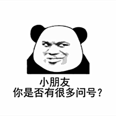
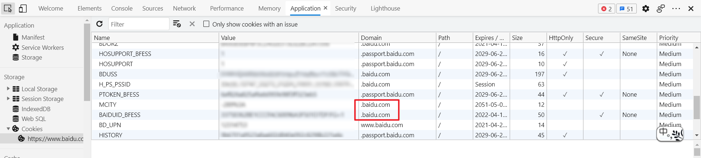
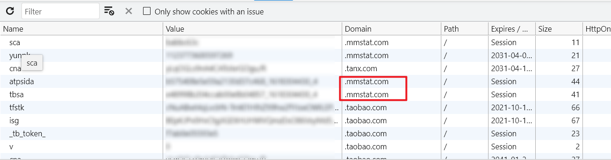
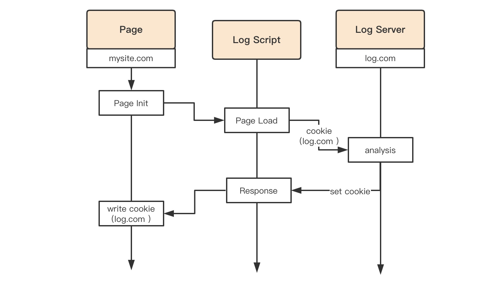
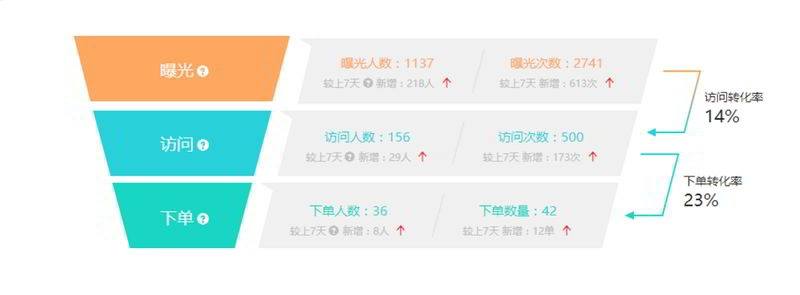

# 网络广告代理商是如何通过 cookie 收集用户信息的

不知道大家有没有这样的经历，我在某宝上搜索一个商品，然后再打开其它网站，它会非常“智能”的给我推荐同一商品。

这样的操作大多都是因为Cookie在搞鬼，在了解厂商这些骚操作前，我们先了解一下浏览器的同源策略。

## 一. 同源策略

由于浏览器默认的同源策略只能获取到“自己”的Cookie。

所谓的同源策略就是指A网页设置的 Cookie，B网页不能打开，除非这两个网页"同源"。所谓"同源"指的是"三个相同"

> - 协议相同
> - 域名相同
> - 端口相同

浏览器的同源策略会限制浏览器如下行为：

> （1） Cookie、LocalStorage 和 IndexDB 无法读取。
>
> （2） DOM 无法获得。
>
> （3） AJAX 请求不能发送。

严格意义上的同源策略需要协议、域名、端口都保持一致，但是Cookie的同源策略只需要保证域名一致就行，默认情况下你访问`https://zhidao.baidu.com`产生的Cookie只有在访问`zhidao.baidu.com`这个三级域名（严格意义上`.com .cn`这种域名才属于一级域名）上才能使用，只是因为默认将Cookie的Domain设置为当前访问的域名。

但是很多情况下三级子域名之间也需要实现Cookie共享，例如：

> https://zhidao.baidu.com 
>
> https://ditu.baidu.com

我们只需要在设置将Cookie的Domain设置为二级域名即可：

这样我们只要访问的是`baidu.com`下任意三级域名网站，都能够共享Cookie。

## 二. 广告策略

### 2.1 站内广告

有了Cookie这样一个宝贝，厂商们就只需要在Cookie中设置一个名为`xxxxxId`（或者是其它奇奇怪怪的名字）的一个Key，这个key后面跟着一段很长的值，你的所有浏览行为都会与该值绑定，哪怕你并未登录，厂商也能将你的用户喜好和你的设备（浏览器）绑定。由于Cookie能够设置过期时间，这样厂商就能在你下次访问时推荐相似的商品。

### 2.2 跨站广告

网站不能访问不同域名的 cookie。这一点是浏览器控制的。网站无法绕过这一点。所以，广告一般是通过 `<iframe>` 嵌入在正规的内容网站中，这样它通过自己的域名一样能使用 cookie 存取用户的浏览记录。

用户正在访问的的正规网站的域名为 A，广告商的域名为 B。那么即使用户浏览器地址栏显示为A，但实际上浏览器做了**两次请求**，一次给 A 为了显示正常内容，一次给 B 为了显示广告内容。这样的话 A 和 B 实际上都可以通过浏览器使用 cookies。区别在于，A 的 cookie 值只属于A，B 的 cookie 值只属于 B。下次用户在进入网站 C 里面如果还有 B 的`<iframe> `广告，那么 B 就可以通过之前在 A 网站上做的记录，给用户精准投放广告。至于 B是怎么知道用户在A上看过什么，那就是 A 和 B 之间的事了（就像某宝和某东在私底下有没什么PY交易，谁能知道呢）。

有可能 B 本身就是一个比较流行的网站，例如某宝和某东，它自己就可以记录用户习惯，然后再投到它的其他广告里。这就是为什么你在某宝进行了搜索，然后再新浪微博页面上居然能看到该搜索有关的广告。这就是因为新浪微博的页面上有一个`<iframe>` 显示了淘宝的广告。

举个实际的例子，我们在浏览百度、优酷、天猫等网站时，都能看到几个 `.mmstat.com` 这个域下的 `Cookie`

当你在百度、优酷、淘宝（阿里系）等进行一系列的操作时，`.mmstat.com` 已经悄悄的通过三方 `Cookie` 把你的个人信息运送到了他们那边。 `.mmstat.com` 应该就是阿里旗下的大数据营销平台阿里妈妈旗下的域名（只是个人猜测）。打开阿里妈妈首页，可以看到，其号称是更懂消费者的数据金矿，已经建立起5亿用户的身份识别体系。你的每一次搜索、每一次购买、都会让它变的更精准，下一次你就收到更精准的推荐。

三方 `Cookie` 只是众多获取你喜好信息的一种方式，只不过这种方式更便捷，成本更低。

## 三. 逐渐禁用的三方Cookie

苹果公司前不久对 `Safari` 浏览器进行一次重大更新，这次更新完全禁用了第三方 `Cookie`，这意味着，默认情况下，各大广告商或网站将无法对你的个人隐私进行追踪。而微软和 `Mozilla` 等也纷纷采取了措施禁用第三方 `Cookie`，但是由于这些浏览器市场份额较小，并没有给市场带来巨大的冲击。

我们将正在访问的站点的`Cookie`成为**第一方Cookie**，你如你正在访问的`baidu.com`，那么所有`baidu.com`的Cookie就称为第一方Cookie；而那些通过内嵌第三方代码，或者请求三方API产生的Cookie就称为第三方Cookie。

一旦浏览器完全禁用第三方Cookie，现阶段使用三方Cookie实现的技术方案都需要作出相应改变。

### 3.1 前端打点

大多数 `Web` 站点都会引用一些第三方 `SDK` 来进行前端异常或性能监控，这些 `SDK` 会通过一些接口将监控到的信息上传到他们的服务器。一般它们都需要标识每个用户来方便排查问题或者统计 `UV` 数据，所以当你一此请求这个站点的时候，它们可能会在你的站点上 `set` 一个 `Cookie`，后续所有的日志上报请求都会带上这个 `Cookie` 。

由于一般这些第三方 `SDK` 都是用于监控的通用服务，它们肯定会拥有自己独立的域名，比如 `log.com`，它在你的域名 `mysite.com` 下种下的 `Cookie` 就属于第三方 `Cookie`。

### 3.2 无法追踪转化率

当你查看一则广告时，该广告会在你的浏览器中放置一个 `Cookie`，表示你已经看到它。如果随后你进入转化阶段（购买、下载等），广告主们需要能追踪每一个他们投放到你网站上的转化率，这样他们才能计算投放的效果，从而作出优化策略，如果你无法再追踪广告转化率了，那么也很难再进行投放了。

当然，以上只是建立在你没有进行任何改变的基础上，距离全面禁用三方 `Cookie` 还有一年多的时间，这应该是一个足够的时间让你及时作出应对。

### 3.3 智能广告推荐消失

上文中依赖于三方Cookie的智能广告推荐将会消失。

**本文参考**：

- [浏览器的同源策略](https://www.ruanyifeng.com/blog/2016/04/same-origin-policy.html)

- [当浏览器全面禁用三方 Cookie - 知乎 (zhihu.com)](https://zhuanlan.zhihu.com/p/131256002)

- [网络广告代理商是如何通过 cookie 收集用户信息的](https://www.zhihu.com/question/20853596)